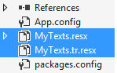
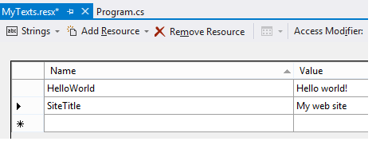

##  6.3 ABP表现层 - 本地化

### 6.3.1 程序语言

ABP框架为程序提供了一个灵活的本地化配置模块。首先需要的是声明支持哪些语言，模块预初始化如下：

``` csharp
    Configuration.Localization.Languages.Add(new LanguageInfo("en", "English", "famfamfam-flag-england", true));
    Configuration.Localization.Languages.Add(new LanguageInfo("tr", "Türkçe", "famfamfam-flag-tr"));
```

在服务器端，你需要使用IlocalizationManager。在客户端，你可以使用abp.localization javascript API从当前的语言列表中获取你需要的语言配置文件。
### 6.3.2 本地化源文件
本地化文本可存储在不同的地方，你也可以在同一个应用程序中使用多个来源。IlocalizationManager接口可实现本地化，然后注册到ABP的本地化配置文件。可通过xml和资源文件来配置。
#### 1. XML文件(XML files)
本地化配置文件可存储在XML文件。如下所示：

``` html
<?xml version="1.0" encoding="utf-8" ?>
<localizationDictionary culture="en">
  <texts>
    <text name="TaskSystem" value="Task System" />
    <text name="TaskList" value="Task List" />
    <text name="NewTask" value="New Task" />
    <text name="Xtasks" value="{0} tasks" />
    <text name="CompletedTasks" value="Completed tasks" />
    <text name="EmailWelcomeMessage">Hi,
Welcome to Simple Task System! This is a sample
email content.</text>
  </texts>
</localizationDictionary>
```

XML文件必须使用 **UTF-8** 编码，**culture="en"** 表示这个XML文件包含的是英文文本。对于文本节点：**name** 属性被用来识别一个文本，你可以用 **value** 属性或者 **inner text(内部文本)** (例如最后一个)来设置本地化文本的值。我们会对每种语言分别创建XML文件，如下所示：

[](images/5.2.1.png)

**SimpleTaskSystem** 是资源文件的名字，SimpleTaskSystem.xml是默认的本地化语言.
当某个文本被请求的时候，ABP会从当前的XML资源文件中去取得本地化文本(通过 Thread.CurrentThread.**CurrentUICulture** 来找到当前所使用的语言)。如果当前所使用的语言不存在，那么将会使用默认的XML的语言资源。

##### 为XML本地化资源注册

XML文件能够被存储在 **文件系统中** 或者能被嵌入进一个程序集中。

对于 **文件系统** 存储XML文件，我们可以向下面一样注册一个XML本地化资源：

``` csharp
Configuration.Localization.Sources.Add(
    new DictionaryBasedLocalizationSource(
        "SimpleTaskSystem",
        new XmlFileLocalizationDictionaryProvider(
            HttpContext.Current.Server.MapPath("~/Localization/SimpleTaskSystem")
            )
        )
    );
```

我们应该在模块的 **PreInitialize** 方法中来配置，详情请参照[模块系统](Abp/1.3ABP总体介绍-模块系统.md)。ABP会从给定的目录中找到所有的XML文件并且注册这些本地化资源。

对于 **嵌入式** XML文件，我们应该标记所有的XML文件为 **嵌入式资源(Embedded resource)** (选择XML文件，打开属性窗口(F4)并且更改生成操作为嵌入式资源)。然后你可以像下面一样注册本地化资源：

```csharp
Configuration.Localization.Sources.Add(
    new DictionaryBasedLocalizationSource(
        "SimpleTaskSystem",
        new XmlEmbeddedFileLocalizationDictionaryProvider(
            Assembly.GetExecutingAssembly(),
            "MyCompany.MyProject.Localization.Sources"
            )
        )
    );
```

**XmlEmbeddedFileLocalizationDictionaryProvider** 会获得一个包含XML文件的程序集(GetExecutingAssembly简单地指向当前的程序集)和XML文件的名称空间(程序集名称+xml文件的文件夹层次).

>注意：当给嵌入式XML文件添加语言后缀时，不要用 **"."** 例如："MySource.tr.xml", 而是应该用破折号 **"-"** 例如：**"MySource-tr.xml"**，因为在程序寻找资源文件的时候点号会导致资源文件找不到等异常。

#### 2. JSON文件

JSON文件可以被用来存储本地化资源文本，正如下面所展示的一个简单的JSON本地化示例：

```javascript
{
  "culture": "en",
  "texts": {
    "TaskSystem": "Task system",
    "Xtasks": "{0} tasks"
  }
}
```
JSON文件应使用 **UTF-8** 编码，**culture="en"** 表示这个JSON文件包含的是英文文本。我们会对每种语言分别创建JSON文件，如下所示：

[](images/json-localization-source-files.png)

这里的MySourceName是资源名称， MySourceName.json被定义为默认的资源语言。这类似于XML资源文件的定义。

##### 对JSON本地化资源的注册

JSON文件能够被存储在 **文件系统中** 或者能被嵌入进一个程序集中。

对于 **文件系统** 存储JSON文件，我们可以向下面一样注册一个JSON本地化资源：

``` csharp
Configuration.Localization.Sources.Add(
    new DictionaryBasedLocalizationSource(
        "MySourceName",
        new JsonFileLocalizationDictionaryProvider(
            HttpContext.Current.Server.MapPath("~/Localization/MySourceName")
            )
        )
    );
```

我们应该在模块的 **PreInitialize** 方法中来配置，详情请参照[模块系统](Abp/1.3ABP总体介绍-模块系统.md)。ABP会从给定的目录中找到所有的JSON文件并且注册这些本地化资源。

对于 **嵌入式** JSON文件，我们应该标记所有的JSON文件为 **嵌入式资源(Embedded resource)** (选择JSON文件，打开属性窗口(F4)并且更改生成操作为嵌入式资源)。然后你可以像下面一样注册本地化资源：

```csharp
Configuration.Localization.Sources.Add(
    new DictionaryBasedLocalizationSource(
        "MySourceName",
        new JsonEmbeddedFileLocalizationDictionaryProvider(
            Assembly.GetExecutingAssembly(),
            "MyCompany.MyProject.Localization.Sources"
            )
        )
    );
```

**JsonEmbeddedFileLocalizationDictionaryProvider** 会获得一个包含JSON文件的程序集(GetExecutingAssembly简单地指向当前的程序集)和JSON文件的名称空间(程序集名称+JSON文件的文件夹层次).

>注意：当给嵌入式JSON文件添加语言后缀时，不要用 **"."** 例如："MySource.tr.json", 而是应该用破折号 **"-"** 例如：**"MySource-tr.json"**，因为在程序寻找资源文件的时候点号会导致资源文件找不到等异常。

#### 3. 自定义资源(Custom source)
当然也可以将本地化配置存储在.net的资源文件中。我们可以为每种语言创建一个配置文件。如下：



MyTexts.resx包含了默认的语言配置文件，MyTexts.tr.resx包含了土耳其语言配置文件。当打开MyTexts.resx:



配置方法如下：

``` csharp
Configuration.Localization.Sources.Add(
    new ResourceFileLocalizationSource(
        "MySource",
        MyTexts.ResourceManager
        ));
```

这里设置的唯一名字是MySource，在模块初始化过程中，MyTexts.ResourceManager将被作为本地化文本导入到资源管理器中。一个默认的本地化文本配置文件可存储到数据库中，可以通过Ilocalization接口或者通过DictionaryBasedLocalizationSource类来简化实现。

### 6.3.3 获得一个本地化配置文件
在创建并注册到ABP本地化系统后，文件将更容易的被本地化。

#### 1. 服务端(In server side)

在服务端，你可以简单的LocalizationHelper.GetString调用源配置文件中的值。

``` csharp
var s1 = LocalizationHelper.GetString("SimpleTaskSystem", "NewTask");
```

确保不要有同名的配置文件，你可以先获取源配置文件，然后获取一个源文件中的一个值。

``` csharp
var source = LocalizationHelper.GetSource("SimpleTaskSystem");
var s1 = source.GetString("NewTask");
```

这将返回当前的语言配置文件。并重写GetString方法。

#### 2. MVC控制器(In MVC controllers)
通过MVC控制器或视图来本地化：

``` csharp
public class HomeController : SimpleTaskSystemControllerBase
{
    public ActionResult Index()
    {
        var helloWorldText = L("HelloWorld");
        return View();
    }
}
```

方法用于本地化字符串，前提是需要提供一个配置文件的名称。在SimpleTaskSystemControllerBase：

``` csharp
public abstract class SimpleTaskSystemControllerBase : AbpController
{
    protected SimpleTaskSystemControllerBase()
    {
        LocalizationSourceName = "SimpleTaskSystem";
    }
}
```

注意：它来自AbpController。因此，你能更容易的通过L方法获取本地化配置文件的值。
#### 3. 在MVC视图(In MVC views)
在视图中的L方法：

``` html
<div>
    <form id="NewTaskForm" role="form">
        <div class="form-group">
            <label for="TaskDescription">@L("TaskDescription")</label>
            <textarea id="TaskDescription" data-bind="value: task.description" class="form-control" rows="3" placeholder="@L("EnterDescriptionHere")" required></textarea>
        </div>
        <div class="form-group">
            <label for="TaskAssignedPerson">@L("AssignTo")</label>
            <select id="TaskAssignedPerson" data-bind="options: people, optionsText: 'name', optionsValue: 'id', value: task.assignedPersonId, optionsCaption: '@L("SelectPerson")'" class="form-control"></select>
        </div>
        <button data-bind="click: saveTask" type="submit" class="btn btn-primary">@L("CreateTheTask")</button>
    </form>
</div>
```

在实际应用中，你应当从基础类中派生你自己的视图:

``` csharp
public abstract class SimpleTaskSystemWebViewPageBase : SimpleTaskSystemWebViewPageBase<dynamic>
{

}

public abstract class SimpleTaskSystemWebViewPageBase<TModel> : AbpWebViewPage<TModel>
{
    protected SimpleTaskSystemWebViewPageBase()
    {
        LocalizationSourceName = "SimpleTaskSystem";
    }
}
```

还需要在web.config设置基础视图：

``` html
<pages pageBaseType="SimpleTaskSystem.Web.Views.SimpleTaskSystemWebViewPageBase">
```
#### 在JavaScript中
当你从一个ABP模版中建立你的解决方案时，所有从控制器和视图都已经准备:

``` html
<script src="/AbpScripts/GetScripts" type="text/javascript"></script>
```

ABP在客户端自动生成需要的JavaScript代码来获取本地化配置文件，在JavaScript中可以很容易地获取本地化配置文件：

``` JavaScript
var s1 = abp.localization.localize('NewTask', 'SimpleTaskSystem');
```

NewTask是一个配置文件中的某一行的名字，SimpleTaskSystem是一个配置文件的名字:

``` JavaScript
var source = abp.localization.getSource('SimpleTaskSystem');
var s1 = source('NewTask');
```

本地化方法也能够设置额外的方法参数：
``` csharp
abp.localization.localize('RoleDeleteWarningMessage', 'MySource', 'Admin');
//shortcut if source is got using getSource as shown above
source('RoleDeleteWarningMessage', 'Admin');
```

如果使用RoleDeleteWarningMessage = 'Role {0} will be deleted’，本地化文件中的文本将变成 'Role Admin will be deleted'.

### 6.3.4 总结
ABP为本地化提供了不同的源文件的能力，它也为服务器端和客户端提供了一个基础框架来使用相同的本地化配置文件。

Xml和资源文件有各自的优缺点，建议使用xml文件作为可重用的模块，因为xml更容易添加新语言模块的代码。此外，如果你使用xml，建议通过创建日期排序而不是通过文本名称来排序。当有人翻译为另外一种语言时，他可以更容易地看到哪些新添加的文本。

你也可以创建自己的本地化配置文件并集成到ABP中。


