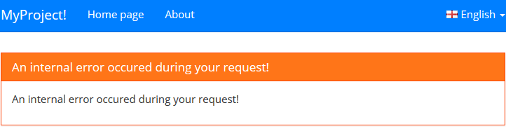
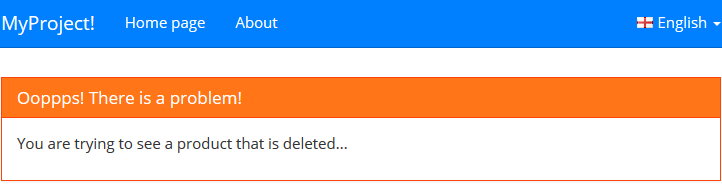
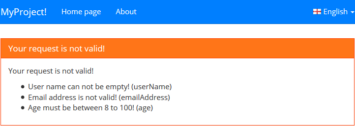

## 6.5 ABP表现层 - 异常处理

在 web 应用程序中，异常通常是在 MVC Controller actions 和 Web API Controller actions 中被处理的。当异常发生时，应用程序用户被以某种方式告知该错误和该错误产生的可选原因（就是列举出产生该异常的多种原因，产生错误的原因可能是列举出的一种也可能是多种。）

如果一个常规的HTTP请求产生错误，那么一个错误页面会展示。如果AJAX请求产生错误，服务器端会发送错误消息到客户端，然后客户端处理并显示该错误给用户。

在所有的Web请求中处理异常是一个单调乏味并且重复性的工作。然而在ABP中，你几乎不需为任何异常的指定明确的异常处理，ABP会自动的记录这些异常并且以适当的格式做出响应返回到客户端。也就是说，在客户端处理这些响应并且将错误详细显示给客户。

### 6.5.1 开启错误处理

为了开启错误处理，customErrors 必须设置如下：

```csharp
<customErrors mode="On" />
```

也可以设置 'RemoteOnly' 如果你不想在本地处理这些错误。

### 6.5.2 非Ajax请求

如果不是Ajax 请求，那么将会显示一个错误页面。

#### 1. 显示异常(Showing exceptions)

MVC Controller action抛出了一个异常，如下所示：

```csharp
public ActionResult Index()
{
    throw new Exception("A sample exception message...");
}
```

当然，这个异常能够被指定调用的action中的另外的方法抛出。ABP处理这个异常，记录异常信息并且显示'Error.cshtml' 视图。你能够自定义这个视图来显示该错误。example 错误视图（这个视图是ABP中缺省错误视图模板）。



ABP 隐藏了异常的详细信息，而是向用户展示了一个标准的（本地化的，友好化的）错误信息。除非你明确指定抛出一个UserFriendlyException 异常。

#### 2. 用户异常友好化（UserFriendlyException）

UserFriendlyException是一个特殊的异常类型，被用来直接的显示给用户。请看下面示例：

```csharp
public ActionResult Index()
{
    throw new UserFriendlyException("Ooppps! There is a problem!", "You are trying to see a product that is deleted...");
}
```

ABP记录这个异常并且不隐藏这次的异常信息：



所以，如果你想显示一个特殊的错误信息给用户，你只需要抛出一个UserFriendlyException（或者一个派生自该异常类的类型，也就是说继承这个异常类的子类）。

#### 3. 错误模型(Error model)

ABP传递一个ErrorViewModel 对象给Error视图：

```csharp
public class ErrorViewModel
{
    public AbpErrorInfo ErrorInfo { get; set; }
    public Exception Exception { get; set; }
}
```

ErrorInfo 包含了能够显示给客户的详细的异常信息。Exception 对象就是那个被抛出的异常。你能够核实异常并且附加自定义信息来显示，如果你想这样做的话。例如：我们能够核实该异常是否是一个AbpValidationException。



#### 6.5.3 AJAX请求

如果请求是一个AJAX请求，ABP会返回一个JSON对象到客户端。ASP.NET MVC Controllers 和 ASP.NET Web API Controllers 也是这么处理的。以JSON方式返回一个异常信息，请看下面示例：

```javascript
{
  "targetUrl": null,
  "result": null,
  "success": false,
  "error": {
    "message": "An internal error occured during your request!",
    "details": "..."
  },
  "unAuthorizedRequest": false
}
```

success: false 表示有一个错误发生。error对象提供了错误信息和错误的详细描述。

当你在客户端用ABP的基础设施来做一个AJAX请求时，它会用message API自动的处理这个JSON对象并且显示错误信息给用户。更多信息请参照AJAX API 和dynamic web api layer。

#### 6.5.4 异常事件

当ABP处理任何Web请求的异常时，它会触发AbpHandledExceptionData事件，当然你必须注册该事件，并且写相应的处理代码。详细信息请参照eventbus documentation。


