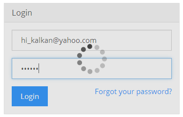

## 6.6 ABP表现层 - Javascript UI Block & Busy API

ABP提供了有用的API，使整个页面或者页面的某个部分被遮罩层覆盖实现阻塞或者繁忙指示(使用加载图标表示繁忙)。

### 6.6.4.1 UI Block API

这个API使用一个透明的遮罩层(透明度可调节)来遮住整个页面或者该页面的某个元素。因此用户不能够点击。当你保存表单或者加载某个区域时(某个层或者整个页面)，这是相当有用的。

如下所示：

```javascript
abp.ui.block(); //遮住整个页面
abp.ui.block($('#MyDivElement')); //遮罩某个元素，在这里可以使用jQuery选择器选择元素..
abp.ui.block('#MyDivElement'); //..或者直接指定元素
abp.ui.unblock(); //解除遮罩
abp.ui.unblock('#MyDivElement'); //对指定元素解除遮罩
```

UI Block API 默认是使用jQuery插件[block UI](http://malsup.com/jquery/block/)来实现的。为了能正常运行，你需要引用脚本文件，然后包含 **abp.blockUI.js** 文件作为适配器到你的页面中。

### 6.6.4.1 UI Busy API

该API被用来指示某些页面或者元素正在忙碌(加载)。例如：当你提交表单数据到服务器的时候，你可能想要遮罩这个表单并显示一个忙碌的指示器。

如下所示：

```javascript
abp.ui.setBusy('#MyLoginForm');
abp.ui.clearBusy('#MyLoginForm');
```



参数应该是一个jQuery选择器(如：#MyLoginForm)或者jQuery对象(如：$('#MyLoginForm'))。为了使整个页面都是在繁忙状态，你应该传递null或者body作为选择器。

setBusy函数能够传入一个promise(作为第二个参数)并且自动的清除busy，当该promise完成的时候。如下所示：

```javascript
abp.ui.setBusy(
    $('#MyLoginForm'), 
    abp.ajax({ ... })   
);
```

由于abp.ajax返回的是promise，所以我们能直接使用它作为参数。如果你想了解更多关于promise的资料，请查阅jQuery的[Deferred](http://api.jquery.com/category/deferred-object/)。setBusy对Q提供支持(以及angulars的$http服务)。

UI Busy API 使用[spin.js](http://fgnass.github.io/spin.js/)实现的。为使其正常运行，你应该引用该脚本文件，然后在你的页面中包含 **abp.spin.js** 作为适配器。


