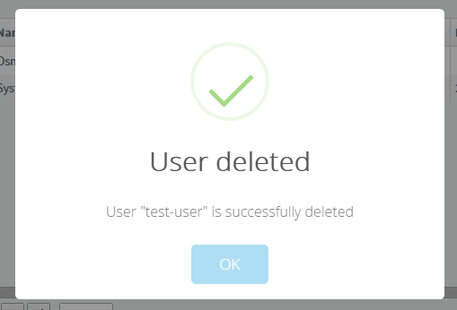
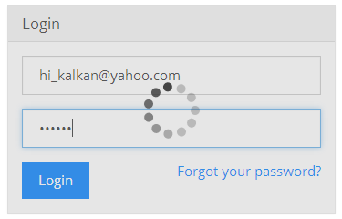

## 6.6 ABP表现层 - Javascript函数库

ASP.NET Boilerplate的js库提供了一些让javascript开发更方便的方法和对象,以下介绍一下库中的API列表。

### 6.6.1 Ajax

现代的应用经常会使用AJAX，尤其是单页应用，几乎是和服务器通信的唯一手段，执行AJAX通常会有以下步骤：

在客户端，你需要提供一个URL，选择一个和服务器通信的方法（GET,POST,PUT,DELETE）。在请求完成后执行回调函数，请求结果可更是成功或失败，失败时你需要给出提示，成功时你需要根据返回值执行操作。通常情况下，在请求开始时，你需要给出类似正在处理或者相关的繁忙等待信息（如页面遮盖），请求完成后恢复。

服务端接收到请求后，对请求参数进行验证，执行服务端代码，如果发生错误或者验证失败，应给出具体的原因，成功时返回客户端想要的数据。

ABP服务端支持标准的ajax的请求/输出。建议大家使用abp.jquery.js中提供的ajax请求方法，这个方法基于jquery的ajax方法，可以自动处理服务端的异常信息，当然，如果你对js很熟练的话，也可以根据自己的需要写ajax。

ASP.NET Boilerplate的ajax请求实例：

```javascript
//构建要传输的参数对象
var newPerson = {
    name: 'Dougles Adams',
    age: 42
};
//调用abp的ajax方法
abp.ajax({
    url: '/People/SavePerson',
    data: JSON.stringify(newPerson) //转换成json字符串
}).done(function(data) {
abp.notify.success('created new person with id = ' + data.personId);
});
```

你也可以使用jquery的ajax方法调用，但是需要设置一下默认请求参数，dataType 设置为 'json', type 设置为 'POST' and contentType 设置为 'application/json，在发送请求时需要将js对象转换成json字符串，和$.ajax一样，你也可以传递参数覆盖abp.ajax的默认参数abp.ajax返回一个promise类型，你可以链式编程写如下的方法：

```javascript
.done() //成功,
.fail() //失败，
.then() //回调嵌套。
```

下面的一个简单的例子展示ajax请求PeopleController的SavePerson方法，在.done()中可以获取到服务端创建记录成功后返回的记录id。

```csharp
public class PeopleController : AbpController
{
    [HttpPost]
    public JsonResult SavePerson(SavePersonModel person)
    {
        //TODO: save new person to database and return new person's id
//TODO: 创建一个新的person记录并返回此记录的id
        return Json(new {PersonId = 42});
    }
}
```

SavePersonModel 包含name,age等属性. SavePerson 上标记了 HttpPost 特性 abp.ajax默认以 POST 方式请求. 返回值被简化成了一个匿名对象。


### 6.6.2 AJAX 返回值(AJAX return messages)
我们直接返回了一个匿名对象, ABP 通过 MvcAjaxResponse 类型包装了返回值. 实际的返回值类型如下:

```javascript
{
  "success": true, //正确处理标志
  "result": {
    "personId": 42 //返回的数据
  },
  "error": null, //如果发生错误，result为null，此处为错误信息的对象，包含message和details两个属性
  "targetUrl": null, //可以提供一个url供客户端重定向，例如自动构建下一页的url
  "unAuthorizedRequest": false //是否通过了授权，如果返回true，客户端应重新登录
}
```

如果你继承了AbpController，Json方法返回的对象总会被这样包装，如果未发生错误，你在abp.ajax的done(function(result,data){})中，第一个参数result是{"personId": 42}对象，data是原始对象,WebApi中继承AbpApiController也是同样的机制。

### 6.6.3 错误处理(Handling errors)
返回值如下:

```javascript
{
  "targetUrl": null,
  "result": null,
  "success": false, //代表出现异常
  "error": {
    "message": "An internal error occured during your request!", //未捕捉到的异常，通常为系统异常，会自动记录日志，具体提示信息在配置文件配置，可以搜索一下，如果是业务抛出的UserFriendlyException异常，message为具体的错误信息
    "details": "..." //发生异常时默认会调用abp.message.error函数，你可以在abp.jquery.js修改，统一处理错误信息。
  },
  "unAuthorizedRequest": false
}
```

### 6.6.4 WrapResult 和 DontWrapResult 特性

你可以用 **WrapResult** 和 **DontWrapResult** 特性来控制某个Action或者某个Controller的所有Action的返回结果。

#### 1. ASP.NET MVC Controllers

如果返回的类型是 **JsonResult** (或者异步Action的Task<JsonResult>)ABP默认会将Action的返回内容进行包装。你可以改变这个，只要在Controller的Action上面使用特性：**WrapResult** 或者 **DontWrapResult**；示例如下：

```csharp
public class PeopleController : AbpController
{
    [HttpPost]
    [WrapResult(WrapOnSuccess = false, WrapOnError = false)]
    public JsonResult SavePerson(SavePersonModel person)
    {
        //TODO: save new person to database and return new person's id
        return Json(new {PersonId = 42});
    }
}
```

为了方便开发，我们可以使用特性 **[DontWrapResult]**，并且最终结果与上面所示相同。

#### 2. ASP.NET Web API Controllers

除了 **AjaxResponse** 的返回类型，ABP 默认是没有包装 Web API的Action的返回结果。如果需要你可以给Controller的Action添加特性：**WrapResult**。


### 6.6.5 动态WebAPI（Dynamic Web API Layer）

此处会根据Services动态生成WebAPI调用函数:

```javascript
//通常我们使用ajax会按照如下写法，做一个简单的封装来重用ajax，此处框架可以帮你生成简单的调用方法
var savePerson = function(person) {
    return abp.ajax({
        url: '/People/SavePerson',
        data: JSON.stringify(person)
    });
};
//调用时你需要构建参数
var newPerson = {
    name: 'Dougles Adams',
    age: 42
};
//直接调用方法，如何生成上面的调用方法可以参考源码中的Abp.Web.Api项目中/ WebApi/ Controllers/ Scripting/ jQuery下的实现
savePerson(newPerson).done(function(data) {
    abp.notify.success('created new person with id = ' + data.personId);
});
```

### 6.6.6 通知
通知会显示在右下角，稍后自动消失

```javascript
abp.notify.success('a message text', 'optional title');
abp.notify.info('a message text', 'optional title');
abp.notify.warn('a message text', 'optional title');
abp.notify.error('a message text', 'optional title');
```

通知API是依赖于toastr库，你需要在项目中引用toastr的js和css，然后引用ABP项目的abp.toastr.js，notify.success调用后的样子:


你可以运行样板项目，在浏览器的控制台测试这几种提示消息，另外，当ajax出现异常时，你可以修改abp.jquery.js的源文件，来调用abp.notify.error方法实现友好的提示信息。

如果你有其他的的通知插件也可以使用，引用相应的js库就可以了，提示消息的js是可选的。

### 6.6.7 消息

用于向用户显示对话框，展示消息或者得到用户的确认,ABP默认采用的sweetalert库实现的对话框信息，使用时你需要引用sweetalert的样式和js，并且引用abp.sweet-alert.js就可以使用下列API了:

```javascript
abp.message.info('some info message', 'some optional title');
abp.message.success('some success message', 'some optional title');
abp.message.warn('some warning message', 'some optional title');
abp.message.error('some error message', 'some optional title');
```

调用abp.message.success会展示如下的对话框:



Confirmation 确认对话框:

```javascript
abp.message.confirm(
    'User admin will be deleted.', //确认提示
    'Are you sure?',//确认提示（可选参数）
    function (isConfirmed) {
        if (isConfirmed) {
            //...delete user 点击确认后执行
        }
    }
);
```


默认ABP的js库中可能会引用到消息API，比如ajax调用失败会调用abp.message.error。

### 6.6.8 用户界面的繁忙提示
ABP提供了设置页面的某部分繁忙的API。

#### 1. UI Block API 

设置一个半透明层，阻止点击页面元素，可以覆盖局部或者整个页面，例子如下:

```javascript
abp.ui.block(); //覆盖整个页面
abp.ui.block($('#MyDivElement')); //覆盖指定元素，可以把jquery对象作为参数
abp.ui.block('#MyDivElement'); //或者直接使用选择器参数
abp.ui.unblock(); //整个页面解除覆盖
abp.ui.unblock('#MyDivElement'); //指定元素解除覆盖
```

UI Block API使用blockUI这个js库来实现效果的，如果使用这个api需要在页面引用blockUI的js库和abp.blockUI.js文件。

UI Busy API 指示页面繁忙的API，如ajax请求中:

```javascript
abp.ui.setBusy('#MyLoginForm');
abp.ui.clearBusy('#MyLoginForm');
```



第一个参数可以直接使用jquery选择器如’#id’或者使用jquery对象如$(‘#id’),如果传null或者‘body’则标记整个页面为繁忙状态，第二个参数可以接收一个promise，promise完成后会自动解除页面繁忙状态。

```javascript
abp.ui.setBusy(
    $('#MyLoginForm'), 
    abp.ajax({ ... })	//返回值是promise，如果需要了解promise的更多信息，可以参考jQuery的 Deferred 
);
```

UI Busy API 使用的是spin.js，你需要在页面中引用spin.js和abp.spin.js。

### 6.6.9 事件总线

在客户端事件总线用来触发注册过的全局事件。

#### 1. 简介

**Pub/Sub** 事件模型被广泛的用在客户端。ABP包含了一个简单的全局事件总线用来注册和触发事件。

#### 2. 注册事件

你可以使用 **abp.event.on** 来注册一个全局事件。示例如下：

```javascript
abp.event.on('itemAddedToBasket', function (item) {
    console.log(item.name + ' is added to basket!');
});
```

首先，参数：事件名称必须是唯一的。另一个参数是 **回调函数**，当指定的事件被触发后将调用该参数。

你可以使用 **abp.event.off** 方法来卸载已注册的事件。
注意：为了能够卸载指定的事件，应该提供相同的事件函数。
正如上面的示例所展示的，你应该将回调函数设置为一个变量，然后在 **on和off** 中使用它。

#### 3. 触发事件

**abp.event.trigger** 被用来触发全局事件。触发一个已注册的事件的代码如下：

```javascript
abp.event.trigger('itemAddedToBasket', {
    id: 42,
    name: 'Acme Light MousePad'
});
```

第一个参数是该事件的唯一名称。第二个是（可选的）事件参数。你可以添加任何数量的参数，并且在回调方法中获得它们。


### 6.6.10 Js日志接口

这个主要是对浏览器console.log('...') 进行的包装，可以支持所有浏览器，例子如下:

```javascript
abp.log.debug('...');
abp.log.info('...');
abp.log.warn('...');
abp.log.error('...');
abp.log.fatal('...');
```

你可以通过设置abp.log.level来控制日志输出，和服务端一样，如设置了abp.log.levels为INFO时就不会输出debug日志了，你也可以根据你的需要定制重新这些API。

### 6.6.11  Javascript公共方法

ABP提供了一些常用的公共方法。

#### 1. 创建命名空间别名(abp.utils.createNamespace)

通过创建命名空间让js方法分类更加明确，使用更加方便，下面是例子：

```javascript
//创建或者获取命名空间
abp.utils = abp.utils || {};
abp.utils.strings = abp.utils.strings || {};
abp.utils.strings.formatting = abp.utils.strings.formatting || {};
//在命名空间中增加一个方法
abp.utils.strings.formatting.format = function() { ... };
你可以向下面一样用
//创建命名空间别名
var formatting = abp.utils.createNamespace(abp, "utils.strings.formatting");
//在formatting命名空间下增加/修改一个方法
formatting.format = function() { ... };
```

别名简化了以前长长的名字，需要注意的是，第一个参数是必须存在的根命名空间。

##### 格式化字符串(abp.utils.formatString)

和C#的string.Format一样的用法

```csharp
var str = abp.utils.formatString('Hello {0}!', 'World'); //str = 'Hello World!'

var str = abp.utils.formatString('{0} number is {1}.', 'Secret', 42); //str = 'Secret number is 42'
```