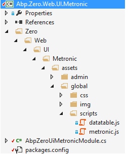

## 6.7 ABP表现层 - 嵌入资源文件

### 6.7.1 简介

在一个WEB应用程序中，有JavaScript、css、xml等客户需要使用的文件。一般添加到web项目中并作为分离的文件发布。有时候，我们需要将这些文件打包（类库、dll).ABP提供了ifrastructure使这种任务更容易完成。



我们要让这些文件在web应用程序中可用。上线，应当构建嵌入式资源文件。选择metronic.js，属性窗口（F4快捷方式）修改为资源文件


需要作为资源文件的都照此修改。

### 6.7.2 显示资源文件

ABP通过一行代码显示资源文件：

``` csharp
WebResourceHelper.ExposeEmbeddedResources("AbpZero/Metronic", Assembly.GetExecutingAssembly(), "Abp.Zero.Web.UI.Metronic");
```

代码一般放在模块初始化方法中。参数解释：
+ 第一个参数定义了文件的根文件夹。根名称空间匹配。
+ 第二个参数定义了集合包含文件。在这个例子中,通过集合包含这些代码。你也可以通过任何集合包含嵌入的资源。
+ 最后一个在集合中定义了文件的根名称空间。这是“默认名称空间”和“文件夹”。默认名称空间通常是组装的名字一样但可以改变组件的属性。在这里,默认名称空间是Abp(我改变它),所以Metronic文件夹的名称空间是“Abp.Zero.Web.UI.Metronic”。

### 6.7.3 使用嵌入的文件

使用嵌入文件很简单：

``` javascript
<script type="text/javascript" src="~/AbpZero/Metronic/assets/global/scripts/metronic.js"></script>
```
ABP能够理解这是一个嵌入文件，你也可以在Razor视图中使用ABP的HtmlHelper：

``` csharp
@Html.IncludeScript("~/AbpZero/Metronic/assets/global/scripts/metronic.js")
```

页面显示如下：

``` javascript
<script src="/AbpZero/Metronic/assets/global/scripts/metronic.js?v=635438748506909100" type="text/javascript"></script>
```
唯一需要注意的是 v=635438748506909100 参数，这可以防止浏览器运行错误的缓存脚本。这个值的变化只有当dll重建（实际上，这是最后写文件的时间），如果改变，浏览器不缓存。因此，建议使用包含脚本的方式。这同样使用于非嵌入式的物理文件，和包含css文件的方法。


>5.1 5.2 5.4 5.6 翻译 NoZero 5.3 菜刀 5.5 Carl