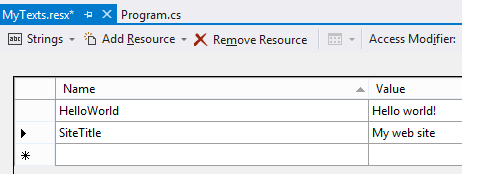
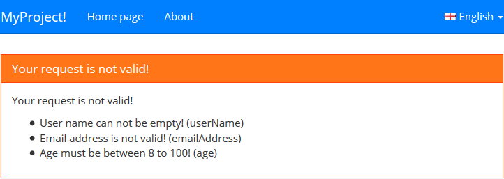

## 1.1 ABP总体介绍 - 入门介绍

**ABP是“ASP.NET Boilerplate Project (ASP.NET样板项目)”的简称。**

ASP.NET Boilerplate是一个用最佳实践和流行技术开发现代WEB应用程序的新起点，它旨在成为一个通用的WEB应用程序基础框架和项目模板。

ASP.NET Boilerplate 基于DDD的经典分层架构思想，实现了众多DDD的概念（但没有实现所有DDD的概念）。

* ABP的官方网站：[http://www.aspnetboilerplate.com](http://www.aspnetboilerplate.com)
* ABP在Github上的开源项目：[https://github.com/aspnetboilerplate](https://github.com/aspnetboilerplate)

ABP框架于2014年5月4日首次在Github开源，截止到2015年5月25日，总共进行了1271次代码提交，49次版本发布，现在的版本号是0.6.1.1。

### 1.1.1 ABP采用了以下技术

#### 服务器端：
* ASP.NET MVC 5、Web API 2、C# 5.0
* DDD领域驱动设计 （Entities、Repositories、Domain Services、Domain Events、Application Services、DTOs等）
* Castle windsor （依赖注入容器）
* Entity Framework 6 \ NHibernate，数据迁移
* Log4Net（日志记录）
* AutoMapper（实现Dto类与实体类的双向自动转换）

#### 客户端：
* Bootstrap 
* Less
* AngularJs
* jQuery
* Modernizr
* 其他JS库: jQuery.validate、jQuery.form、jQuery.blockUI、json2

### 1.1.2 ABP框架已实现了以下特性
* 多语言/本地化支持
* 多租户支持（每个租户的数据自动隔离，业务模块开发者不需要在保存和查询数时写相应代码）
* 软删除支持（继承相应的基类或实现相应接口，会自动实现软删除）
* 统一的异常处理（应用层几乎不需要处理自己写异常处理代码）
* 数据有效性验证（Asp.NET MVC只能做到Action方法的参数验证，ABP实现了Application层方法的参数有效性验证）
* 日志记录（自动记录程序异常）
* 模块化开发（每个模块有独立的EF DbContext，可单独指定数据库）
* Repository仓储模式（已实现了Entity Framework、NHibernate、MangoDB、内存数据库）
* Unit Of Work工作单元模式（为应用层和仓储层的方法自动实现数据库事务）
* EventBus实现领域事件(Domain Events)
* DLL嵌入资源管理
* 通过Application Services自动创建Web Api层（不需要写ApiController层了）
* 自动创建Javascript 的代理层来更方便使用Web Api
* 封装一些Javascript 函数，更方便地使用ajax、消息框、通知组件、忙状态的遮罩层

“Zero”的模块，实现了以下功能：

* 身份验证与授权管理（通过ASP.NET Identity实现的）
* 用户&角色管理
* 系统设置存取管理（系统级、租户级、用户级，作用范围自动管理）
* 审计日志（自动记录每一次接口的调用者和参数）

在其他项目中的很多优秀设计，在ABP项目中也已存在，而且可能实现得更好。ABP框架的代码，都通过xUnit进行了单元测试。作者一直在用ABP框架开发他们的实际项目，从Github和他官方论坛上的信息可以看到，有很多国外的开发者在将ABP用作生产项目的基础框架。如果需要直接使用ABP组件，可以通过Nuget安装（在VS的Nuget包管理界面搜索ABP）。

为了更好地将ABP适用于自己的项目，我对ABP的源码做了一些修改后使用的，没有直接使用ABP组件。

我希望更多国内的架构师能关注ABP这个项目，也许这其中有能帮助到你的地方，也许有你的参与，这个项目可以发展得更好。

今天只是作了一个大概介绍，希望有更多的朋友能去阅读源代码，然后参与讨论。

### 1.1.3 ABP适用的场景
中小规模WEB应用开发，可直接使用ABP框架。 较大型项目可以在ABP框架的源码基础上进行扩展，以实现分布式架构。

**注：处理高并发并不是ABP的强项。需要非常高并发的DDD框架，建议去研究netfocus的ENode。**
## 1.2 ABP总体介绍 - 层架构体系

### 1.2.1 前言

为了减少复杂性和提高代码的可重用性，采用分层架构是一种被广泛接受的技术。为了实现分层的体系结构，ABP遵循DDD（领域驱动设计）的原则，将工程分为四个层：

* **展现层(Presentation)**：向用户提供一个接口(UI)，使用应用层来和用户(UI)进行交互。

* **应用层(Application)**：应用层是表现层和领域层能够实现交互的中间者，协调业务对象去执行特定的应用任务

* **领域层(Domain)**：包括业务对象和业务规则，这是应用程序的核心层。

* **基础设施层(Infrastructure)**：提供通用技术来支持更高的层。例如基础设施层的仓储(Repository)可通过ORM来实现数据库交互，或者提供发送邮件的支持。

根据实际需要，可能会有额外添加的层。例如：

* **分布式服务层(Distributed Service)** ：用于公开应用程序接口供远程客户端调用。比如通过ASP.NET Web API或WCF来实现。

这些都是常见的以领域为中心的分层体系结构。不同的项目在实现上可能会有细微的差别。

### 1.2.2 ABP的体系结构

层次结构概览如下图所示：


一个简单的解决方案，大致包含5个项目：


一个层可以被实现为一个或者多个程序集。对于大项目的第三方依赖创建多个应用程序集这是一个好的选择(例如：这里的EntityFramework)。还有，在有限界上下文中，每个上下文都有它自己的分层。

### 1.2.3 领域层

领域层是实现所有业务规则的地方。

**实体（Entity）**：
实体代表业务领域的数据和操作，在实践中，通常用来映射成数据库表。

**仓储（Repository）**：
仓储是像集合一样的对象，用来在数据源(数据库)上检索和存储实体。在领域层定义仓储，但是不实现它们。它们在基础设施层被实现。

**领域服务（Domain service）**：
当处理的业务规则跨越两个(及以上)实体时，应该写在领域服务方法里面。

**领域事件（Domain Event）**：
领域事件被用来定义特定于领域的事件，并且触发使用它们。领域服务与实体(以及其他领域对象)一起实现了不属于单个实体的业务规则。

**工作单元（Unit of Work）**：
工作单元是一种设计模式被用来管理数据库连接和事务，以及跟踪实体更改，并将这些更改保存到数据存储中。它被定义在领域层中，但是在基础设施层实现它们。

### 1.2.4 应用层

应用层提供一些应用服务（Application Services）方法供展现层调用。一个应用服务方法接收一个DTO(数据传输对象)作为输入参数，使用这个输入参数执行特定的领域层操作，并根据需要可返回另一个DTO。在展现层到领域层之间，不应该接收或返回实体(Entity)对象，应该进行DTO映射。
一个应用服务方法通常被认为是一个工作单元（Unit of Work）。用户输入参数的验证工作也应该在应用层实现。ABP提供了一个基础架构让我们很容易地实现输入参数有效性验证。建议使用一种像AutoMapper这样的工具来进行实体与DTO之间的映射。

### 1.2.5 基础设施层

当在领域层中为定义了仓储接口，应该在基础设施层中实现这些接口。可以使用ORM工具，例如EntityFramework或NHibernate。ABP的基类已经提供了对这两种ORM工具的支持。数据库迁移也被用于这一层。

### 1.2.6 WEB与展现层
Web层使用ASP.NET MVC和Web API来实现。可分别用于多页面应用程序(MPA)和单页面应用程序(SPA)。

在SPA中，所有资源被一次加载到客户端浏览器中（或者先只加载核心资源，其他资源懒加载），然后通过AJAX调用服务端WebApi接口获取数据，再根据数据生成HTML代码。不会整个页面刷新。现在已经有很多SPA的JS框架，例如： AngularJs、 DurandalJs、BackboneJs、EmberJs。 ABP可以使用任何类似的前端框架，但是ABP提供了一些帮助类，让我们更方便地使用AngularJs和DurandalJs。

在经典的多页面应用（MPA）中，客户端向服务器端发出请求，服务器端代码（ASP.NET MVC控制器）从数据库获得数据，并且使用Razor视图生成HTML。这些被生成后的HTML页面被发送回客户端显示。每显示一个新的页面都会整页刷新。

SPA和MPA涉及到完全不同的体系结构，也有不同的应用场景。一个管理后台适合用SPA，博客就更适合用MPA，因为它更利于被搜索引擎抓取。

SignalR是一种从服务器到客户端发送推送通知的完美工具。它能给用户提供丰富的实时的体验。
已经有很多客户端的Javascript框架或库，JQuery是其中最流行的，并且它有成千上万免费的插件。使用Bootstrap可以让我们更轻松地完成写Html和CSS的工作。

ABP也实现了根据Web API接口自动创建 Javascript的代码函数，来简化JS对Web Api的调用。还有把服务器端的菜单、语言、设置等生成到JS端。（但是在我自己的项目中，我是把这些自动生成功能关闭的，因为必要性不是很大，而这些又会比较影响性能）。

ABP会自动处理服务器端返回的异常，并以友好的界面提示用户。

### 1.2.7 其它
ABP使用Castle Windsor为整个程序框架提供依赖注入的功能。使用Log4Net日志记录组件，提供给其他各层调用以进行日志记录。
## 1.3 ABP总体介绍 - 模块系统

### 1.3.1 ABP模块系统简介
ABP框架提供了创建和组装模块的基础，一个模块能够依赖于另一个模块。在通常情况下，一个程序集就可以看成是一个模块。在ABP框架中，一个模块通过一个类来定义，而这个类要继承自AbpModule。

模块系统当前专注于服务端而不是客户端。

>译者注：
如果学习过Orchard的朋友，应该知道module模块的强大了。模块的本质就是可重用性，你可以在任意的地方去调用，而且通过实现模块，你写的模块也可以给别人用。.net可以通过反射获取一个程序集中的类以及方法。

### 1.3.2 定义模块

Assembly程序集：Assembly是一个用来包含程序的名称，版本号，自我描述，文件关联关系和文件位置等信息的一个集合。最简单的理解就是：一个你自己写的类库生成的dll就可以看做是一个程序集，这个程序集可以包括很多类，类又包括很多方法等。

一个派生自 **AbpModule** 的类就是模块的定义。我们正在开发一个博客模块，该模块可以被使用在不同的应用程序中。最简单的模块定义示例如下：

```csharp	
public class MyBlogApplicationModule : AbpModule //定义
{
    public override void Initialize() //初始化
    {
        IocManager.RegisterAssemblyByConvention(Assembly.GetExecutingAssembly());
        //这行代码的写法基本上是不变的。它的作用是把当前程序集的特定类或接口注册到依赖注入容器中。
    }
}
```

如果需要的话，模块类负责类的依赖注入(通常可以像上面一样做)。我们能配置应用程序和其它模块，添加新的功能到应用程序等等。

### 1.3.3 方法的生命周期

在一个应用中，ABP框架调用了Module模块的一些指定的方法来进行启动和关闭模块的操作。我们可以重载这些方法来完成我们自己的任务。

ABP框架通过依赖关系的顺序来调用这些方法，假如：模块A依赖于模块B,那么模块B要在模块A之前初始化，模块启动的方法顺序如下：

1. PreInitialize-B
* PreInitialize-A
* Initialize-B
* Initialize-A
* PostInitialize-B
* PostInitialize-A

下面是具体方法的说明：

**PreInitialize**

预初始化：当应用启动后，第一次运行会先调用这个方法。在初始化(Initialize)方法调用之前，该方法通常是用来配置框架以及其它模块。

在依赖注入注册之前，你可以在这个方法中指定你需要注入的自定义启动类。例如：加入你创建了某个符合约定的注册类，你应该使用 **IocManager.AddConventionalRegisterer** 方法在这里注册它。

**Initialize**

初始化：在这个方法中一般是来进行依赖注入的注册，一般我们通过IocManager.RegisterAssemblyByConvention这个方法来实现。如果你想实现自定义的依赖注入，那么请参考依赖注入的相关文档。

**PostInitialize**

提交初始化：最后一个方法，这个方法用来解析依赖关系。

**Shutdown**

关闭：当应用关闭以后，这个方法被调用。

### 1.3.4 模块依赖
Abp框架会自动解析模块之间的依赖关系，但是我们还是建议你通过重载GetDependencies方法来明确的声明依赖关系。

```csharp
[DependsOn(typeof(MyBlogCoreModule))]//通过注解来定义依赖关系
public class MyBlogApplicationModule : AbpModule
{
    public override void Initialize()
    {
        IocManager.RegisterAssemblyByConvention(Assembly.GetExecutingAssembly());
    }
}
```

例如上面的代码，我们就声明了MyBlogApplicationModule和MyBlogCoreModule的依赖关系，MyBlogApplicationModule这个应用模块依赖于MyBlogCoreModule核心模块，并且，MyBlogCoreModule核心模块会在MyBlogApplicationModule模块之前进行初始化。

ABP可以从 **startup module** 递归的解析依赖关系，并按需初始化它们。最后初始化的模块是启动模块(startup module)。

### 1.3.5 插件模块

当模块从启动模块以及其依赖关系进行调查发现的时候，ABP也能够动态的加载其它指定模块。**AbpBootstrapper** 类定义了 **PlugInSources** 属性，我们能够是用该属性添加需要动态加载的模块。插件源可以是任何实现了 **IPlugInSource** 接口的类。**PlugInFolderSource** 类实现了该接口，它可以被用来加载指定文件夹下的程序集。

#### ASP.NET Core

ABP的ASP.NET Core模块也可以动态加载模块，你只需要在 **Startup** 类中使用已定义的扩展方法 **AddAbp**，如下所示：

```csharp
services.AddAbp<MyStartupModule>(options =>
{
    options.PlugInSources.Add(new FolderPlugInSource(@"C:\MyPlugIns"));
});
```

我们可以使用扩展方法 **AddFolder** 更方便的实现上述功能：

```csharp
services.AddAbp<MyStartupModule>(options =>
{
    options.PlugInSources.AddFolder(@"C:\MyPlugIns");
});
```

了解更多关于Startup类的信息，请查看 [ASP.NET 文档](6.8ASP.NET-Core.md)

#### ASP.NET MVC，Web API

对于经典的ASP.NET MVC应用，我们可以在 **global.asax** 重写 **Application_Start** 方法来添加插件文件夹，如下所示：

```csharp
public class MvcApplication : AbpWebApplication<MyStartupModule>
{
    protected override void Application_Start(object sender, EventArgs e)
    {
        AbpBootstrapper.PlugInSources.AddFolder(@"C:\MyPlugIns");
        //...
        base.Application_Start(sender, e);
    }
}
```

#### 插件中的控制器

如果你的模块包括了MVC或者Web API控制器，ASP.NET不能发现这些控制器。为了克服这个问题，你可以在 **global.asax** 中添加代码来实现，如下所示：

```csharp
using System.Web;
using Abp.PlugIns;
using Abp.Web;
using MyDemoApp.Web;

[assembly: PreApplicationStartMethod(typeof(PreStarter), "Start")]

namespace MyDemoApp.Web
{
    public class MvcApplication : AbpWebApplication<MyStartupModule>
    {
    }

    public static class PreStarter
    {
        public static void Start()
        {
            //...
            MvcApplication.AbpBootstrapper.PlugInSources.AddFolder(@"C:\MyPlugIns\");
            MvcApplication.AbpBootstrapper.PlugInSources.AddToBuildManager();
        }
    }
}
```

#### Additional Assemblies

对于IAssemblyFinder和ITypeFinder的默认实现(这两个接口的实现被ABP用来在应用程序中发现指定的类)仅仅只用来查找模块程序集以及在这些程序集中所使用的类型。我们可以在我们的模块中重写 **GetAdditionalAssemblies** 方法来包含附加程序集。


### 1.3.6 自定义的模块方法

我们自己定义的模块中可能有方法被其他依赖于当前模块的模块调用，下面的例子，假设模块2依赖于模块1，并且想在预初始化的时候调用模块1的方法。这样，就把模块1注入到了模块2，因此，模块2就能调用模块1的方法了。

>译者注：
ABP的模块系统与Orchard的模块有类似之处，但还是有比较大的差别。Orchard的框架修改了ASP.NET程序集的默认加载方式（模块的DLL没有放在Bin文件夹下，是放在WEB项目根文件夹下面的Modules文件夹下），实现了功能模块的热插拔，而ABP的模块程序集还是放在Bin文件夹下的，没有实现热插拔。

```csharp
public class MyModule1 : AbpModule
{
    public override void Initialize() //初始化模块
    {
        IocManager.RegisterAssemblyByConvention(Assembly.GetExecutingAssembly());//这里，进行依赖注入的注册。
    }

    public void MyModuleMethod1()
    {
        //这里写自定义的方法。
    }
}

[DependsOn(typeof(MyModule1))]
public class MyModule2 : AbpModule
{
	private readonly MyModule1 _myModule1;

	public MyModule2(MyModule1 myModule1)
	{
	    _myModule1 = myModule1;
	}

    public override void PreInitialize()
    {
        _myModule1.MyModuleMethod1(); //调用MyModuleMethod1的方法。
    }

	public override void Initialize()
	{
	        IocManager.RegisterAssemblyByConvention(Assembly.GetExecutingAssembly());
	 }
}
```

在这里，我们通过构造函数注入MyModule1到MyModule2，所以MyModule2能够调用MyModule1的自定义方法。当且仅当MyModule2依赖于MyModule1才是可能的。

### 1.3.7 模块配置

虽然自定义模块可以被用来配置模块，但是，作者建议使用[启动配置](1.4ABP总体介绍-启动配置.md)来定义和配置模块。

### 1.3.8 模块生命周期

所有的模块类都被自动的注册为单例模式。
## 1.4 ABP总体介绍 - 启动配置

在应用启动之前，abp框架提供了模块基本的配置和方法，大家参照下面这个例子就可以了。

>译者注：
在看这一节的内容之前，建议大家先下载module-zero这个例子代码，这个例子就是一个用户和角色的模块，并且使用的实例。配置在每一个应用中都可能会有，比如你有一个网站，你要获取网站的一些自定义基本参数，比如logo位置，网站名称，上传文件大小等等。模块化的配置方式和我们之前的做法肯定是不同的，大家要注意。之前无非就是一个方法getconfig从对应的表取数据，然后使用。

### 1.4.1 配置ABP

配置是通过在自己模块的PreInitialize方法中来实现的（对于module的PreInitialize方法，在上一篇中已经向大家做了简单的说明）代码示例如下：

```csharp
public class SimpleTaskSystemModule : AbpModule
{
    public override void PreInitialize()
    {
        //在你的应用中添加语言包，这个是英语和作者的土耳其语。
        Configuration.Localization.Languages.Add(new LanguageInfo("en", "English", "famfamfam-flag-england", true));
        Configuration.Localization.Languages.Add(new LanguageInfo("tr", "Türkçe", "famfamfam-flag-tr"));

        Configuration.Localization.Sources.Add(
            new XmlLocalizationSource(
                "SimpleTaskSystem",
                HttpContext.Current.Server.MapPath("~/Localization/SimpleTaskSystem")
                )
            );

        //配置导航和菜单
        Configuration.Navigation.Providers.Add<SimpleTaskSystemNavigationProvider>();
    }

    public override void Initialize()
    {
        IocManager.RegisterAssemblyByConvention(Assembly.GetExecutingAssembly());
    }
}
```

和orchard类似，abp框架一开始就被设计成模块化的，不同的模块可以通过abp框架来进行配置。举个例子吧，不同的模块都可以添加导航，通过导航添加菜单项到自己定义的主菜单，具体的细节大家可以参照：

+ [本地化](http://www.aspnetboilerplate.com/Pages/Documents/Localization)
+ [导航](http://www.aspnetboilerplate.com/Pages/Documents/Navigation)

#### 替换内置服务

**Configuration.ReplaceService** 方法可以被用来重写某个内置的服务。例如，你可以替换掉IAbpSession服务使用你自己扩展的服务。如下所示：

```csharp
Configuration.ReplaceService<IAbpSession, MySession>(DependencyLifeStyle.Transient);
```

**ReplaceService** 方法通过传递一个 **Action** 来实现替换，这样我们就可以使用自定义的扩展类型替换掉原来的类型(你也可以直接使用Castle Windsor直接调用更高级的API函数)。

同一个服务可以被替换多次(尤其是在不同的模块)。最后替换的类型才是最终的使用类型。

### 1.4.2 配置模块

和.net框架原生的启动配置相比较，abp有哪些不一样呢？abp框架的模块可以通过IAbpModuleConfigurations接口进行个性化的扩展，这样的话，模块配置更加简单、方便。

示例代码如下：

```csharp
...
using Abp.Web.Configuration;
...
public override void PreInitialize() 
{
    Configuration.Modules.AbpWebCommon().SendAllExceptionsToClients = true;
}
...
```

在上面这个例子中，我们通过配置AbpWebCommon模块，发送异常到客户端。当然了，不是每一个模块都需要这种配置，通常情况下我们需要，是当一个模块需要在多个不同的应用中重复使用，我们才进行这样的配置。

### 1.4.3 为一个模块创建配置

如下代码，假如我们有一个命名为MyModule的模块，并且这各模块有一些自己的配置。那么我们首先要创建一些类，这些类定义为属性（译者注：属性有自动的get和set访问器。），代表了不同的配置。
```csharp
public class MyModuleConfig
{
    public bool SampleConfig1 { get; set; }

    public string SampleConfig2 { get; set; }
}
```

接下来，我们通过依赖注入，注册这个类。IocManager.Register<MyModuleConfig>();

>译者注：
在IocManager中注册了一个类，换句话说，我们通过IocManager可以得到这个类MyModuleConfig的实例。至于IOC的原理这里就不在详细说了，总之，就是可以得到一个类的实例。

最后，我们通过创建一个扩展的方法IModuleConfigurations来得到配置的引用。如下代码：


>译者注：
模块配置是一个静态类，因为我们需要重复使用它。静态方法Mymodule返回的是一个配置接口，参数是ImoduleConfigurations接口。

现在，在其他模块中也可以配置我们自定义的这个MyModule模块了。
`Configuration.Modules.MyModule().SampleConfig1 = false;`
`Configuration.Modules.MyModule().SampleConfig2 = "test";`

在某种意义上，MyModule需要这些配置，通过注射MyModuleConfig我们就可以使用这些值。

```csharp
	public class MyService : ITransientDependency
	{
	    private readonly MyModuleConfig _configuration;
	
	    public MyService(MyModuleConfig configuration)
	    {
	        _configuration = configuration;
	    }
	
	    
	    public void DoIt()
	    {
	        if (_configuration.SampleConfig2 == "test")
	        {
	            //...
	        }
	    }
	}
```

这意味着，在abp框架的系统中，所有的模块都可以集中配置。

## 1.5 ABP总体介绍 - 多租户

### 1.5.1 什么是多租户

维基百科：“软件多租户是指一个软件架构的实例软件运行在一个服务器上，但存在多个租户。租户是一组共享一个公共的用户访问特定权限的软件实例。多租户架构,软件应用程序旨在提供每个租户专用的实例包括数据、配置、用户管理、租户个体功能和非功能属性。多租户与多实例架构,独立的软件实例代表不同的租户”操作多租户一般用来创建SaaS(软件即服务）应用程序（云计算），下面有一些案例：

### 1.5.2 多个部署多个数据库

这实际上并不是多租户，如果为每个客户（租户）配置一个单独的数据库和应用程序的一个实例，即在单个服务器中部署但提供给多个客户(租户)使用，我们需要确保应用程序的多个实例不会因为系统相同的配置环境而发生冲突。

这种已有的设计方式也不是真正为多租户服务的，它的好处是更容易的创建，但是存在一些安装、使用和维护的问题。

### 1.5.3 单个部署多个数据库

使用这种方式，我们可以在服务器上运行应用程序的一个实例。我们有一个主数据库用来存储租户的数据(例如：租户名称以及子域名)以及每个租户的单个数据库。一旦我们识别出当前租户(例如：从子域名或者用户登录的信息来判定)，那么我们可以切换到当前租户的数据库来执行操作。

以这种方式设计出来的应用程序，在某种程度上可以被看做多租户。但是大多数的应用仍然依赖于多租户。

我们应该为每个租户创建和维护它们自己单独的数据库，这包括数据迁移。如果我们有很多的客户以及与之相应的数据库，在更新应用程序的时候，那会花费太多的时间在数据库架构的迁移上。当然这样做，我们为租户分离出了数据库，我们可以为每个租户备份它们自己的数据库。如果租户需要的话，我们可以将租户的数据库迁移到更强大的服务器上。

### 1.5.4 单个部署单个数据库

这是真正的多租户构架，我们只在服务器上部署应用程序的单一实例且只有一个数据库。在各表中使用TenantId来隔离其它租户的信息。

这样的好处是易于安装和维护，但创建这样的一个应用程序比较困难。因为，需要防止租户读写其它租户的信息。在用户读取数据时候可以添加TenantId过滤器过滤数据，同样，系统会检测用户的写入操作。这是很繁琐的，而且也容易出错。ABP可以帮助我们自动数据过滤。

如果我们有很多租户并且数据量巨大，那么这种实现方式将会导致一些性能问题。我们可以使用表分区或者数据库的其它功能来克服这些问题。

### 1.5.5 单部署混合数据库

通常我们可能想存储租户到一个单独的数据库中，但是也可能想为租户创建分离的数据库。例如：我们可以为那些数据量巨大的租户创建单独的数据库，但是其它租户仍使用同一个数据库。

### 1.5.6 多部署-单/多/混合数据库

最后，为了达到更好的性能，高可用性以及伸缩性；我们可能想要部署我们的应用到多个服务器上。这些都是依赖于数据库的方式。

### 1.5.7 ABP中的多租户

ABP可以工作于所有上面所描述的场景。

#### 1. 开启多租户

默认多租户是被禁用的，我们需要在模块的 **PreInitialize** 方法中开启它，如下所示：

```csharp
Configuration.MultiTenancy.IsEnabled = true;
```

#### 2. Host VS 租户

首先，我们先定义两个多租户系统中的术语：

+ 租户：客户有它自己的用户,角色,权限,设置…并使用应用程序与其他租户完全隔离。多租户应用程序将有一个或多个租户。如果这是一个CRM应用程序,不同的租户也他们自己的帐户、联系人、产品和订单。所以,当我们说一个租户的用户,我们的意思是用户拥有的租户。

+ Host: Host是单例的（只有唯一一个Host).Host负责创建和管理租户。所以Host用户独立与租户且可以控制租户。

#### 3. Session

ABP定义IAbpSession接口来获取当前用户和租户id。这个接口中使用多租户当前租户的id。因此,它可以基于当前租户的id过滤数据。

这里有一些规则：

+ 如果两个用户id和TenantId是null，那么当前用户没有登录到系统中。所以，我们不知道这是一个主机用户或租户的用户。在这种情况下，用户不能访问授权的内容。

+ 用户id(如果不为空，TenantId为空的，然后我们可以知道当前用户是一个主机用户。

+ 用户id(如果不为空，TenantId也不为空，我们可以知道当前用户是一个租户的用户。

有关更多的Session内容可查看：[Session](2.2ABP公共结构-会话管理.md)

#### 4. 当前租户的断定

由于所有的租户用户都是使用了相同的应用程序，我们应该有一种方式来区分当前请求的租户。默认会话(ClaimsAbpSession)用给定的顺序实现了使用不同的方式来找到当前请求相关的租户：

+ **1.** 如果用户已经登录，那么从当前声明(claims)中取得租户ID，声明的唯一名字是：http://www.aspnetboilerplate.com/identity/claims/tenantId 并且该声明应该包含一个整型值。如果在声明中没有发现，那么该用户被假设为Host用户。

+ **2.** 如果用户没有登录，那么它会尝试从 **tenant resolve contributors(暂翻译为：租户解析参与者)** 中解析租户ID。这里有3种预定义的租户参与者，并按照给定的顺序运行(第一个解析成功的解析器获胜)：

    + **1. DomainTenantResolveContributer**：尝试从url中解析租户名，通常来说是域名或者子域名。在模块的预初始化(PreInitialize)中可以配置域名格式(例如：**Configuration.Modules.AbpWebCommon().MultiTenancy.DomainFormat = "{0}.mydomain.com";**)。如果域名的格式是 **"{0}.mydomain.com"**，并且当前请求的域名是：**acme**.mydomain.com，那么租户名被解析为 **acme**。那么下一步就是通过 **ITenantStore** 用给定的租户名来查找租户ID，如果租户被发现，那么该租户ID就是当前租户的ID。

    + **2. HttpHeaderTenantResolveContributer**：如果存在 **Abp.TenantId** 请求头(这个常量被定义在Abp.MultiTenancy.MultiTenancyConsts.TenantIdResolveKey)，那么尝试从该请求头中解析租户ID。

    + **3. HttpCookieTenantResolveContributer**：如果存在 **Abp.TenantId** 的cookie值(这个常量被定义在Abp.MultiTenancy.MultiTenancyConsts.TenantIdResolveKey)，那么就从该cookie中解析租户ID。

如果上述方式都没有解析得到租户ID，那么当前的请求会被考虑作为Host请求。租户解析器是可扩展的。你可以添加解析器到集合：**Configuration.MultiTenancy.Resolvers**，或者移除某个存在的解析器。

关于解析租户ID的最后一件事情是：为了性能优化，解析的租户ID被缓存在相同的请求中。所以，在同一个请求中解析仅被执行一次(当且仅当该用户没有登录)。

#### 5. Tenant Store

**DomainTenantResolveContributer** 使用 **ITenantStore** 通过租户名来查找租户ID。**NullTenantStore** 默认实现了 **ITenantStore** 接口，但是它不包含任何租户，对于查询仅仅返回null值。当你需要从数据源中查询时，你可以实现并替换它。在 **Module Zero** 的 **Tenant Manager** 中已经实现了该扩展。所以，如果你使用了module zero，那么你不需要关心tenant store。

#### 6. 数据过滤

当我们从数据库检索实体，我们必须添加一个TenantId过滤当前的租户实体。当你实现了接口：IMustHaveTenant或IMayHaveTenant中的一个时，ABP将自动完成数据过滤。

##### IMustHaveTenant Interface

这个接口通过TenantId属性来区分不同的租户的实体。示例：

``` csharp
public class Product : Entity, IMustHaveTenant
{
    public int TenantId { get; set; }
        
    public string Name { get; set; }
    
    //...其它属性
}
```

因此，ABP能发现这是一个与租户相关的实体，并自动隔离其它租户的实体。

##### IMayHaveTenant interface

我们可能需要在Host和租户之间共享实体类型。一个实体可能属于租户或Host,IMayHaveTenant接口还定义了TenantId(类似于IMustHaveTenant),但在这种情况下可以为空。示例如下：

```csharp
public class Role : Entity, IMayHaveTenant
{
    public int? TenantId { get; set; }
        
    public string RoleName { get; set; }
    
    //...其它属性
}
```

我们可以使用相同的角色类存储主机角色和租户的角色。在这种情况下，TenantId属性会告诉我们这是一个Host实体还是一个租户实体。**null** 值意味着这是一个 **Host实体** ，一个 **非空值** 意味着这被一个租户拥有，该租户的Id是 **TenantId** 。

##### 备注

IMayHaveTenant不像IMustHaveTenant一样常用。比如，一个Product类可以不实现IMayHaveTenant接口，因为Product和实际的应用功能相关，和管理租户不相干。因此，要小心使用IMayHaveTenant接口，因为它更难维护租户和租主共享的代码。

当你定义一个实体类型实现了 IMustHaveTenant 或者 IMayHaveTenant 接口的时候；那么在创建一个新实体的时候，你就需要设置 **TenantId** 的值，(ABP会尝试把当前AbpSession的TenantId的值设置给它，但是在某些情况下这是不可能的，尤其是实现了IMayHaveTenant接口的实体)。在大多数时候，这是唯一一个地方你需要处理TenantI的地方，但是在其它对租户数据过滤的时候，你不需要在写Linq的where条件语句的时候明确指出TenantId，因为它会自动的实现过滤。

##### 在Host和租户之间的切换

当在多租户应用数据库上工作的时候，我们应该知道当前的租。默认获取租户ID的方式是从 IAbpSession 上获取的。我们可以改变这个行为并且切换到其它租户的数据库上。例如：

```csharp
public class ProductService : ITransientDependency
{
    private readonly IRepository<Product> _productRepository;
    private readonly IUnitOfWorkManager _unitOfWorkManager;

    public ProductService(IRepository<Product> productRepository, IUnitOfWorkManager unitOfWorkManager)
    {
        _productRepository = productRepository;
        _unitOfWorkManager = unitOfWorkManager;
    }

    [UnitOfWork]
    public virtual List<Product> GetProducts(int tenantId)
    {
        using (_unitOfWorkManager.Current.SetTenantId(tenantId))
        {
            return _productRepository.GetAllList();
        }
    }
}
```

**SetTenantId** 方法确保我们得到的数据是指定租户的数据，这依赖于数据库架构：

+ 如果给定的租户有特定的数据库，那么切换到这个数据库并且从该数据库中取得产品数据

+ 如果给定的租户没有特定的数据库(例如：单数据库方式)，它会自动的添加TenantId条件到查询语句来过滤数据获取指定的租户的产品数据

如果我们没有使用SetTenantId方法，它会从Session中取得租户Id，如同之前所述。

这里有一些关于最佳实践的建议：

+ 使用 **SetTenantId(null)** 切换到Host

+ 如果没有特别的原因，你应该像上面示例所展示的一样，在using语句块中使用SetTenantId方法。因为它会在using语句块后且在 GetProducts 方法工作完成之前，自动的还原TenantId (也就是说using语句块运行完后，TenantId是从Session中获取的不会是来自于GetProducts的传入参数)

+ 如果需要你可以嵌套使用SetTenantId方法

+ 因为 **_unitOfWorkManager.Current** 仅在工作单元中有效，请确保你的代码是在工作单元中运行


## 1.6 ABP总体介绍 - 集成OWIN

### 1.6.1 简介

如果你在你的应用中使用了 **ASP.NET MVC 和 ASP.NET Web API**，那么你需要添加 **[Abp.Owin](https://www.nuget.org/packages/Abp.Owin)** 包到你的项目。

### 1.6.2 安装

添加 **[Abp.Owin](https://www.nuget.org/packages/Abp.Owin)** 包到你的主项目(一般来说是 **Web** 项目)。

```bash
Install-Package Abp.Owin
```

### 1.6.3 使用

在OWIN **Startup** 文件中调用 **UserApp()** 的扩展方法，如下所示：

```csharp
[assembly: OwinStartup(typeof(Startup))]
public class Startup
{
    public void Configuration(IAppBuilder app)
    {
        app.UseAbp();

        //其它配置...
    }
}
```

如果你只使用了OWIN(也就说是一个自宿主Web API项目)，你可以在ABP的启动模块的初始化方法中重写UseAbp。注意，这只有在ABP没有其它的初始化方式的时候才可以这么做。

## 2.1 ABP公共结构 - 依赖注入

如果你已经了解依赖注入的概念、构造函数和属性注入模式，你可以跳过这一节。

维基百科：“依赖注入是一种软件设计模式，指一个或多个依赖（或服务）被注入，或通过引用传递，传入一个依赖对象（或客户端）并成为客户状态的一部分。模式通过自身的行为分离了客户依赖的创建，这允许程序设计是松耦合的，同时遵循依赖倒置和单一职责原则。与服务定位器模式直接进行对比，它允许客户了解他们用来查找依赖的机制。”

如果不使用依赖注入技术，很难进行依赖管理、模块化开发和应用程序模块化。

### 2.1.1 传统方式的问题

在一个应用程序中，类之间相互依赖。假设我们有一个应用程序服务，使用仓储（repository）类插入实体到数据库。在这种情况下，应用程序服务类依赖于仓储（repository）类。看下例子：

```csharp
public class PersonAppService
{
    private IPersonRepository _personRepository;

    public PersonAppService()
    {
        _personRepository = new PersonRepository();            
    }

    public void CreatePerson(string name, int age)
    {
        var person = new Person { Name = name, Age = age };
        _personRepository.Insert(person);
    }
}
```

PersonAppService使用PersonRepository插入Person到数据库。这段代码的问题：

+ PersonAppService通过IPersonRepository调用CreatePerson方法，所以这方法依赖于IPersonRepository，代替了PersonRepository具体类。但PersonAppService（的构造函数）仍然依赖于PersonRepository。组件应该依赖于接口而不是实现。这就是所谓的依赖性倒置原则。

+ 如果PersonAppService亲自创建PersonPeository，这变得依赖到了一个特定的IPersonRepository接口实现，且不能使用另一个实现进行工作。因此，从实现分离接口变得无意义，硬依赖使得代码基于紧耦合和低重用。硬依赖（hard-dependency）使得代码紧密耦合和较低的可重用。

+ 我们可能需要在未来改变创建PersonRepository的方式。即，我们可能想让它创建为单例(单一共享实例而不是为每个使用创建一个对象)。或者我们可能想要创建多个类实现IPersonRepository并根据条件创建对象。在这种情况下，我们需要修改所有依赖于IPersonRepository的类。

+ 有了这样的依赖，很难(或不可能)对PersonAppService进行单元测试。

为了克服这些问题，可以使用工厂模式。因此，创建的仓储类是抽象的。看下面的代码：

```csharp
 public class PersonAppService
{
    private IPersonRepository _personRepository;

    public PersonAppService()
    {
        _personRepository = PersonRepositoryFactory.Create();            
    }

    public void CreatePerson(string name, int age)
    {
        var person = new Person { Name = name, Age = age };
        _personRepository.Insert(person);
    }
}
```

PersonRepositoryFactory是一个静态类，创建并返回一个IPersonRepository。这就是所谓的服务定位器模式。以上依赖问题得到解决，因为PersonAppService不需要创建一个IPersonRepository的实现的对象，这个对象取决于PersonRepositoryFactory的Create方法。但是，仍然存在一些问题：

+ 此时，PersonAppService取决于PersonRepositoryFactory。这是更容易接受，但仍有一个硬依赖（hard-dependency）。

+ 为每个库或每个依赖项乏味的写一个工厂类/方法。

+ 测试性依然不好，由于很难使得PersonAppService使用mock实现IPersonRepository。

### 2.1.2 解决方案

有一些最佳实践(模式)用于类依赖。

#### 1. 构造函数注入(Constructor injection)

重写上面的例子，如下所示:

```csharp
public class PersonAppService
{
    private IPersonRepository _personRepository;

    public PersonAppService(IPersonRepository personRepository)
    {
        _personRepository = personRepository;
    }

    public void CreatePerson(string name, int age)
    {
        var person = new Person { Name = name, Age = age };
        _personRepository.Insert(person);
    }
}
```

这被称为构造函数注入。现在，PersonAppService不知道哪些类实现IPersonRepository以及如何创建它。谁需要使用PersonAppService，首先创建一个IPersonRepository PersonAppService并将其传递给构造函数，如下所示：

```csharp
var repository = new PersonRepository();
var personService = new PersonAppService(repository);
personService.CreatePerson("Yunus Emre"， 19);
```

构造函数注入是一个完美的方法，使一个类独立创建依赖对象。但是，上面的代码有一些问题：

+ 创建一个PersonAppService变得困难。想想如果它有4个依赖，我们必须创建这四个依赖对象，并将它们传递到构造函数PersonAppService。

+ 从属类可能有其他依赖项(在这里，PersonRepository可能有依赖关系)。所以，我们必须创建PersonAppService的所有依赖项，所有依赖项的依赖关系等等. .如此，依赖关系使得我们创建一个对象变得过于复杂了。

幸运的是，依赖注入框架能够自动化管理依赖关系。

#### 2. 属性注入(Property injection)

采用构造函数的注入模式是一个完美的提供类的依赖关系的方式。通过这种方式，只有提供了依赖你才能创建类的实例。同时这也是一个强大的方式显式地声明，类需要什么样的依赖才能正确的工作。

但是，在有些情况下，该类依赖于另一个类，但也可以没有它。这通常是适用于横切关注点(如日志记录)。一个类可以没有工作日志，但它可以写日志如果你提供一个日志对象。在这种情况下，你可以定义依赖为公共属性，而不是让他们放在构造函数。想想，如果我们想在PersonAppService写日志。我们可以重写类如下:

```csharp
public class PersonAppService
{
    public ILogger Logger { get; set; }

    private IPersonRepository _personRepository;

    public PersonAppService(IPersonRepository personRepository)
    {
        _personRepository = personRepository;
        Logger = NullLogger.Instance;
    }

    public void CreatePerson(string name, int age)
    {
        Logger.Debug("Inserting a new person to database with name = " + name);
        var person = new Person { Name = name, Age = age };
        _personRepository.Insert(person);
        Logger.Debug("Successfully inserted!");
    }
}
```

NullLogger.Instance 是一个单例对象，实现了ILogger接口，但实际上什么都没做(不写日志。它实现了ILogger实例，且方法体为空)。现在，PersonAppService可以写日志了，如果你为PersonAppService实例设置了Logger，如下面:

```csharp
Var personService = new PersonAppService(new PersonRepository());
    personService.Logger = new Log4NetLogger();
    personService.CreatePerson("Yunus Emre", 19);
```

假设Log4NetLogger实现ILogger实例，使得我们可以使用Log4Net库写日志。因此，PersonAppService可以写日志。如果我们不设置Logger，PersonAppService就不写日志。因此，我们可以说PersonAppService ILogger实例是一个可选的依赖。

几乎所有的依赖注入框架都支持属性注入模式。

#### 3. 依赖注入框架

有许多依赖注入框架，都可以自动解决依赖关系。他们可以创建所有依赖项(递归地依赖和依赖关系)。所以你只需要依赖注入模式写类和类构造函数&属性，其他的交给DI框架处理！在良好的应用程序中，类甚至独立于DI框架。整个应用程序只会有几行代码或类，显示的与DI框架交互。

ABP的依赖注入基于 Castle Windsor框架。Castle Windsor最成熟的DI框架之一。还有很多这样的框架，如Unity，Ninject，StructureMap，Autofac等等。

在使用一个依赖注入框架时，首先注册你的接口/类到依赖注入框架中，然后你就可以resolve一个对象。在Castle Windsor，它是这样的：

``` csharp
var container = new WindsorContainer();

    container.Register(
            Component.For<IPersonRepository>().ImplementedBy<PersonRepository>().LifestyleTransient(),
            Component.For<IPersonAppService>().ImplementedBy<PersonAppService>().LifestyleTransient()
        );
    
    var personService = container.Resolve<IPersonAppService>();
    personService.CreatePerson("Yunus Emre", 19);
```

我们首先创建了WindsorContainer。然后注册PersonRepository 和 PersonAppService及它们的接口。然后我们要求容器创建一个IPersonAppService实例。它创建PersonAppService对象及其依赖项并返回。在这个简单的示例中，使用DI框架也许不是那么简洁，但想象下，在实际的企业应用程序中你会有很多类和依赖关系。当然，注册的依赖项只在程序启动的某个地方创建一次。

请注意，我们只是将对象声明为临时对象(transient)。这意味着每当我们创建这些类型的一个对象时，就会创建一个新的实例。在这里会有许多不同的生命周期(如：Singletion单例模式)。

#### 4. ABP依赖注入的基础结构

在编写应用程序时遵循最佳实践和一些约定，ABP几乎让依赖注入框架使用变得无形。

##### 注册(Registering)

在ABP中，有很多种不同的方法来注册你的类到依赖注入系统。大部分时间，常规方法就足够了。

##### 常规注册(Conventional registrations)

按照约定，ABP自动注册所有 Repositories， Domain Services， Application Services， MVC 控制器和Web API控制器。例如，你可能有一个IPersonAppService 接口和实现类PersonAppService：

```csharp
public interface IPersonAppService : IApplicationService
{
    //...
}

public class PersonAppService : IPersonAppService
{
    //...
}
```

ABP会自动注册它，因为它实现IApplicationService接口(它只是一个空的接口)。它会被注册为transient (每次使用都创建实例)。当你注入(使用构造函数注入)IPersonAppService接口成一个类，PersonAppService对象会被自动创建并传递给构造函数。

> 	注意：命名约定在这里非常重要。例如你可以将名字PersonAppService改为 MyPersonAppService或另一个包含“PersonAppService”后缀的名称，由于IPersonAppService包含这个后缀。但是你可以不遵循PeopleService命名你的服务类。如果你这样做，它将不会为IPersonAppService自动注册(它需要自注册（self-registration）到DI框架，而不是接口)，所以，如果你想要你应该手动注册它。

ABP按照约定注册程序集。所以，你应该告诉ABP按照约定注册你的程序集。这很容易:

```csharp
IocManager.RegisterAssemblyByConvention(Assembly.GetExecutingAssembly());
```

Assembly.GetExecutingAssembly()得到一个对包括此代码的程序集的引用。你可以通过RegisterAssemblyByConvention方法注册其他程序集。这同在你的模块初始化（AbpModule.Initialize()）时完成。请查看ABP的模块系统获得更多信息。

你可以通过实现 **IConventionalRegisterer** 接口和调用 **IocManager.AddConventionalRegisterer** 方法编写自己的约定注册类。你应该将它添加到模块的pre-initialize方法中。

##### 帮助接口(Helper interfaces)

你可以注册一个特定的类，不遵循传统的约定制度规则。ABP提供了 **ITransientDependency和ISingletonDependency** 接口的快速实现方法。例如：

```csharp
public interface IPersonManager
{
    //...
}

public class MyPersonManager : IPersonManager, ISingletonDependency
{
    //...
}
```

以这种方式，你可以很容易地注册MyPersonManager为transient。当需要注入IPersonManager时，MyPersonManager会被使用。注意，依赖被声明为单例。因此，创建的MyPersonManager同一个对象被传递给所有需要的类。只是在第一次使用时创建，那么应用程序的整生命周期使用的是同一实例。

##### 自定义/直接 注册(Custom/Direct registration)

如果之前描述的方法还是不足以应对你的情况，你可以使用 **IocManager或者Castle Windsor** 来注册你自己的类。

##### 使用IocManager

你可以使用 **IocManager** 来注册依赖关系(这通常是在模块的PreInitialize方法中实现)：

```csharp
IocManager.Register<IMyService, MyService>(DependencyLifeStyle.Transient);
```

##### 使用Castle Windsor API

你也可以使用 **IIocManager.IocContainer** 属性来访问Windsor容器并且注册依赖关系。如下所示：

```csharp
IocManager.IocContainer.Register(Classes.FromThisAssembly().BasedOn<IMySpecialInterface>().LifestylePerThread().WithServiceSelf());
```

更多信息，请阅读[Windsor文档](https://github.com/castleproject/Home/blob/master/README.md)。

> 这里没有删除之前实现IWindsorInstaller接口的翻译，因为我感觉这个非常有用。

也可以实现IWindsorInstaller接口进行注册。你可以在应用程序中创建一个实现IWindsorInstaller接口的类：

```csharp
public class MyInstaller : IWindsorInstaller
{
    public void Install(IWindsorContainer container, IConfigurationStore store)
    {
        container.Register(Classes.FromThisAssembly().BasedOn<IMySpecialInterface>().LifestylePerThread().WithServiceSelf());
    }
}
```

Abp自动发现和执行这个类。最后，你可以通过使用IIocManager.IocContainer属性得到WindsorContainer。

##### 解析（Resolving）

注册通知IOC(控制反转)容器关于你的类，它们的依赖项和生命周期。在你的应用程序需要使用IOC容器创建对象时，ASP.NET提供了一些方法解决依赖关系。

##### 构造函数 & 属性注入(Constructor & Property Injection)

作为最佳实践，应该使用构造函数和属性注入去获取类的依赖。例子：

```csharp
public class PersonAppService
{
    public ILogger Logger { get; set; }

    private IPersonRepository _personRepository;

    public PersonAppService(IPersonRepository personRepository)
    {
        _personRepository = personRepository;
        Logger = NullLogger.Instance;
    }

    public void CreatePerson(string name, int age)
    {
        Logger.Debug("Inserting a new person to database with name = " + name);
        var person = new Person { Name = name, Age = age };
        _personRepository.Insert(person);
        Logger.Debug("Successfully inserted!");
    }
}
```

IPersonRepository从构造函数注入，ILogger实例从公共属性注入。这样，你的代码不会体现依赖注入系统。这是使用DI系统最适当的方式。

##### IIocResolver，IIocManager以及IScopedIocResolver接口

有时可能需要直接创建所需的依赖项，而不是构造函数和属性注入。（应该尽可能避免这种情况）。Abp提供一些服务使得这样的注入很容易实现。例子：

```csharp
public class MySampleClass : ITransientDependency
{
    private readonly IIocResolver _iocResolver;

    public MySampleClass(IIocResolver iocResolver)
    {
        _iocResolver = iocResolver;
    }

    public void DoIt()
    {
        //解析, 使用并手动释放
        var personService1 = _iocResolver.Resolve<PersonAppService>();
        personService1.CreatePerson(new CreatePersonInput { Name = "Yunus", Surname = "Emre" });
        _iocResolver.Release(personService1);

        //解析并使用using语法糖来释放资源
        using (var personService2 = _iocResolver.ResolveAsDisposable<PersonAppService>())
        {
            personService2.Object.CreatePerson(new CreatePersonInput { Name = "Yunus", Surname = "Emre" });
        }
    }
}
```

MySampleClass是一个应用程序的示例类。IIcResolver通过构造函数注入，然后用它来创建和释放对象。有几个解决方法的重载可以根据需要使用。Release方法用于释放组件(对象)。如果你是手动创建一个对象，调用Release方法释放对象非常重要。否则，你的应用程序会有内存泄漏问题。为了保证对象被释放，尽可能使用ResolveAsDisposable(就像上面的例子所示)。它会在using代码块结束的时候自动调用Release方法。

IIocResolver(以及IIocManager)有个 **CreateScope** 的扩展方法(定义在Abp.Dependency命名空间)来安全的释放所有的解析后了依赖资源。如下所示：

```csharp
using (var scope = _iocResolver.CreateScope())
{
    var simpleObj1 = scope.Resolve<SimpleService1>();
    var simpleObj2 = scope.Resolve<SimpleService2>();
    //...
}
```

在using语句块的最后，所有解析后的依赖资源会自动的释放。也可以使用 **IScopedIocResolver** 接口来实现上述操作。你能注入该接口并解析依赖关系。当你使用的类被释放后，所有被解析的依赖资源也会被自动释放掉。但是，请小心使用它；例如：如果该类的生命周期很长(如单例模式)，并且需要解析很多对象，那么它们会一直停留在内存中，直到该类被释放掉。

如果你想直接使用IOC容器(Castle Windsor)来处理依赖关系项，可以通过构造函数注入 IIocManager并使用它IIocManager.IocContainer 属性。如果你是在一个静态上下文或不能注入IIocManager，还有最后一个方法，你可以使用单例对象IocManager.Instance，你可以在任何地方获取到，它无处不在。但是，在这种情况下你的代码将变得不容易测试。

### 3.1.3 其他

#### 1. IShouldInitialize 接口

有些类在第一次使用前需要初始化。IShouldInitialize有Initialize()方法。如果你实现它，那么你的Initialize()方法自动会被自动调用在创建对象之后(在使用之前)。当然，为了使用这个特性，你应该注入/创建此对象。

#### 2. ASP.NET MVC & ASP.NET Web API 集成

当然，我们必须调用依赖注入系统处理依赖关系图的根对象。在一个ASP.NET MVC应用程序，通常是一个控制器类。我们可以使用构造函数注入模式注入控制器。当一个请求来到我们的应用程序中，控制器和所有依赖项被IOC容器递归创建。所以，谁做了这些？这是被Abp扩展的ASP.NET MVC默认控制器工厂自动完成的。ASP.NET Web API 也是相似的。你不用关心对象的创建和释放。

#### 3. ASP.NET Core 集成

ASP.NET Core已经内置了依赖注入：[Microsoft.Extensions.DependencyInjection]( Microsoft.Extensions.DependencyInjection)。在ASP.NET Core中ABP使用[Castle.Windsor.MsDependencyInjection](https://www.nuget.org/packages/Castle.Windsor.MsDependencyInjection)实现了依赖注入。所以你不需要考虑它。

#### 4. 最后说明（Last notes）

Abp简化并自动使用依赖注入，只要你遵守规则和使用上面的结构。大多数时候这样就够了。但是如果不能满足你的需求，你可以直接使用Castle Windsor的所有能力来执行任何任务(如自定义注册，注入钩子，拦截器等等)。


## 2.2 ABP公共结构 - 会话管理

### 2.2.1 简介

如果一个应用程序需要登录，则它必须知道当前用户执行了什么操作。因此ASP.NET在展示层提供了一套自己的SESSION会话对象，而ABP则提供了一个可以在任何地方获取当前用户和租户的IAbpSession接口

> 注意：关于IAbpSession接口：需要获取会话信息则必须实现IAbpSession接口。虽然你可以用自己的方式去实现它（IAbpSession），但是它在module-zero项目中已经有了完整的实现。

IAbpSession也被集成且使用在ABP其他模块中，例如：[设置管理](2.5ABP公共结构-设置管理.md)，[权限认证](4.4ABP应用层-权限认证.md)。

### 2.2.2 注入会话

IAbpSession通常是以属性注入的方式存在于需要它的类中，不需要获取会话信息的类中则不需要它。如果我们使用属性注入方式，我们可以用NullAbpSession.Instance作为默认值来初始化它（IAbpSession），如下所示：

```csharp
public class MyClass : ITransientDependency
{
    public IAbpSession AbpSession { get; set; }

    public MyClass()
    {
        AbpSession = NullAbpSession.Instance;
    }

    public void MyMethod()
    {
        var currentUserId = AbpSession.UserId;
        //...
    }
}
```

由于授权是应用层的任务，因此我们应该在应用层和应用层的上一层使用IAbpSession（我们不在领域层使用IAbpSession是很正常的）。

ApplicationService, AbpController 和 AbpApiController 这3个基类已经注入了AbpSession属性，因此在Application Service的实例方法中，能直接使用AbpSession属性。

### 2.2.3 使用会话属性

AbpSession定义的一些关键属性：

+ **UserId：** 当前用户的标识ID，如果没有当前用户则为null。如果调用的代码是已授权，那么它不可能为空。

+ **TenantId：** 当前租户的标识ID，如果没有当前租户则为null(如果用户没有登录或者他是一个Host用户)。

+ **ImpersonatorUserId：** 模拟用户的标识ID，如果当前会话被其他用户模拟登录。如果不是一个模拟登录，那么该值为空。

+ **ImpersonatorTenantId：** 模拟用户租户的标识ID，如果当前会话被其他用户模拟登录。如果不是一个模拟登录，那么该值为空。

+ **MultiTenancySide：** 可能是Host或Tenant。

UserId和TenantId是可空类型。当然也提供了不为空时获取数据的 **GetUserId()** 和 **GetTenantId()** 方法 。当你确定有当前用户时，你可以使用GetUserId()方法。

如果当前用户为空，使用该方法则会抛出一个异常。GetTenantId()的使用方式和GetUserId()类似。

模拟属性不像其它通用属性一样用于[审计日志](4.6ABP应用层-审计日志.md)。

### 2.2.4 User Identifier

你可以使用 **ToUserIdentifier()** 扩展方法从IAbpSession创建一个UserIdentifier对象。因为UserIdentifier被大多数API使用，所以使用该方法可以很方便的为当前用户创建一个UserIdentifier。

## 2.3 ABP公共结构 - 缓存管理

### 2.3.1 简介

ABP给出了一个抽象缓存基类。并在内部使用了该抽象基类。使用 [MemoryCache](https://msdn.microsoft.com/en-us/library/system.runtime.caching.memorycache(v=vs.110).aspx?f=255&MSPPError=-2147217396) 来实现了该抽象基类。它能够被任何其它的缓存类来扩展。[Abp.RedisCache](https://www.nuget.org/packages/Abp.RedisCache) 包就扩展了该缓存基类。


### 2.3.2 ICacheMananger

ABP对外提供了一个缓存接口ICacheMananger。我们通过构造函数注入这个接口来获取缓存。示例如下：

```csharp
public class TestAppService : ApplicationService
{
    private readonly ICacheManager _cacheManager;

    public TestAppService(ICacheManager cacheManager)
    {
        _cacheManager = cacheManager;
    }

    public Item GetItem(int id)
    {
        //取得缓存
        return _cacheManager
                .GetCache("MyCache")
                .Get(id.ToString(), () => GetFromDatabase(id)) as Item;
    }

    public Item GetFromDatabase(int id)
    {
        //... 从数据库中检索数据
    }
}
```
在这个示例中，我们注入了 ICacheManager接口，并且获取了一个名称为MyCache的缓存。缓存的名字是大小写敏感的，那就是"MyCache"和"MYCACHE"取得的缓存内容是不同的。

>注意：GetCache方法
>千万不要在你的构造函数中使用GetCache方法。如果类不是一个单例对象那么该缓存可能会被dispose掉。

### 2.3.3 ICache

ICacheManager.GetCache方法返回了一个ICache对象。每一个缓存都是基于名称单例存在的。只有首次访问时才会被创建，以后你每次用相同的名称去获取的缓存都是相同的。所以我们可以在不同的类中使用相同的名称来共享相同的缓存。

在示例代码中，我们简单的使用了ICache.**Get** 方法，它有两个参数：

*  key :  要获取的缓存项的唯一标识符

*  factory：如果根据给定的key获取到的缓存项为空，那么factory将会创建一个标识符为key的缓存，并且返回该缓存

ICache接口还有其它方法，例如：**GetOrDefault，Set，Remove和Clear**。当然也有这些方法的异步(async)版本。

### 2.3.4 ITypedCache

**ICache** 接口用key(**字符串类型**)来获取缓存value(**object类型**)。**ITypedCache** 为ICahe提供了一个 **类型安全** 的包装；为了使类型安全转换(ICache到ITypedCache)，我们可以用扩展方法 **AsTyped**，而不需要写其它强制类型转换的代码，如下所示：

``` csharp
ITypedCache<int, Item> myCache = _cacheManager.GetCache("MyCache").AsTyped<int, Item>();
```


### 2.3.5 Configuration

缓存的过期时间默认是60分钟。它是变化的。如果你在60分钟内没有使用该缓存，该缓存会被自动的移除。如果你想改变所有的缓存或者指定的缓存来的默认过期时间，你可以这样做，实现如下：

```csharp
//对所有缓存的配置
Configuration.Caching.ConfigureAll(cache =>
{
    cache.DefaultSlidingExpireTime = TimeSpan.FromHours(2);
});

//对指定缓存的配置
Configuration.Caching.Configure("MyCache", cache =>
{
    cache.DefaultSlidingExpireTime = TimeSpan.FromHours(8);
});
```

这段代码你应该放在模块(module)的 **PreInitialize** 方法中。如上所示：MyCache将会在8小时后过期，而其他的缓存将在2小时后过期。

这些配置将会在首次创建缓存的时候生效。配置不仅仅局限于DefaultSlidingExpireTime，你可以利用ICache接口中的属性获取方法来自由的配置并且初始化它们。

### 2.3.6 Entity Caching

ABP的缓存系统是以通用为目的，它有一个 **EntityCache** 基类，如果你需要的话，这个基类可以帮助你缓存实体。使用这个基类，我们可以通过ID取得实体，并且我们通过ID来缓存实体，这样以后就不需要频繁的查询数据库去取得实体。假设我们有个Person实体，像下面一样：

```csharp
public class Person : Entity
{
    public string Name { get; set; }

    public int Age { get; set; }
}
```

并且，假设我们通过该实体的Id，需要频繁调用取得Person实体的Name。首先，我们应该创建一个类来存储 **cache items**：

```csharp
[AutoMapFrom(typeof(Person))]
public class PersonCacheItem
{
    public string Name { get; set; }
}
```

我们 **不应该直接存储实体到缓存中** 因为缓存的时候需要序列化缓存对象而实体可能不能被序列化(尤其是实体的导航属性)。这就是为什么我们定义了一个简单的像DTO的类来存储数据到缓存中。我们添加了 **AutoMapFrom** 特性，这是因为我们想使用 **AutoMapper** 来自动的转换 **Person** 实体为 **PersonCacheItem** 对象。如果我们不使用 AutoMapper，那么我们应该重写 **EntityCache** 类的 **MapToCacheItem** 方法手动转换/映射它。

然而这不是必须的，我们可能想定义一个接口为缓存类：

```csharp
public interface IPersonCache : IEntityCache<PersonCacheItem>
{

}
```

最后，我们可以创建缓存类来缓存Person实体：

```csharp
public class PersonCache : EntityCache<Person, PersonCacheItem>, IPersonCache, ITransientDependency
{
    public PersonCache(ICacheManager cacheManager, IRepository<Person> repository)
        : base(cacheManager, repository)
    {

    }
}
```

这样就OK了，我们的person缓存已经准备好可以使用了。缓存类可以使瞬时(如同这个例子)或者是单例。这不是说缓存数据是瞬态的。在你的应用程序中它一直是全局缓存并且是线程安全的。

现在，无论在什么地方我们需要取得Person的Name，我们可以通过Person的Id从缓存中取得它。如下所示：

```csharp
public class MyPersonService : ITransientDependency
{
    private readonly IPersonCache _personCache;

    public MyPersonService(IPersonCache personCache)
    {
        _personCache = personCache;
    }

    public string GetPersonNameById(int id)
    {
        return _personCache[id].Name; //alternative: _personCache.Get(id).Name;
    }
}
```

我们很容易的[注入](2.1ABP公共结构-依赖注入.md) **IPersonCache** 接口，通过该接口取得缓存项和Name属性。

#### 那么EntityCache是怎么工作的？

+ 在首次调用的时候我们通过仓储从数据库中取得实体。那么随后的调用都是从缓存中取得。

+ 如果实体被更新或者删除，它会自动的无效实体。因此，它会在下次调用的时候重新从数据库中检索数据。

+ 使用 **IObjectMapper** 接口来映射实体到缓存项。**IObjectMapper** 接口在 **AutoMapper** 中被实现。所以，如果你使用了自动映射，那么就需要 **AutoMapper模块**。你可以重写 **MapToCacheItem** 方法手动映射它到缓存项。

+ 使用缓存类的FullName作为缓存的Name，你可以通过传入的缓存名到基类的构造函数来改变它。

+ 它是线程安全的。

如果你有更复杂的缓存需求，那么你需要扩展 **EntityCache** 类或者创建你自己的解决方案。

#### Redis Cache 集成

默认Cache Mananger是使用 **in-memory** 来缓存。所以，这可能会成为一个问题，如果有多个并发的Web服务运行在同一个应用中。在这种情况下，你可能想要一个分布式/中央缓存服务器。那么，你可以使用Redis来作为你的缓存服务。

首先，你需要安装 [Abp.RedisCache](https://www.nuget.org/packages/Abp.RedisCache) nuget package 到你的项目中(你可以安装它到你的Web项目)。那么你需要为 **AbpRedisCacheModule** 添加 **DependsOn** 特性，并且在你模块的 **PreInitialize** 方法中调用 **UseRedis** 扩展方法，如下所示：

```csharp
//...其他名称空间的引用
using Abp.Runtime.Caching.Redis;

namespace MyProject.AbpZeroTemplate.Web
{
    [DependsOn(
        //...其他依赖模块
        typeof(AbpRedisCacheModule))]
    public class MyProjectWebModule : AbpModule
    {
        public override void PreInitialize()
        {
            //...其他配置
            
            Configuration.Caching.UseRedis();
        }
        
        //...其他代码
    }
}
```

Abp.RedisCache package 使用 **“localhost”** 作为默认的 **连接字符串**。你可以添加连接字符串到你的配置文件中来覆盖它。如：

```html
<add name="Abp.Redis.Cache" connectionString="localhost"/>
```

你也可以添加配置到appSettings来设置Redis数据库的Id。如：

```html
<add key="Abp.Redis.Cache.DatabaseId" value="2"/>
```

在同一个服务器上使用不同的数据库Id是非常有用的这可以创建不同的Key Spaces(隔离缓存)。

**UseRedis** 有一个重载方法，你可以通过这个方法来传入配置参数，这可以覆盖掉配置文件中的配置。

关于Redis的其他配置可以查看 [Redis文档](http://redis.io/documentation)。

当然译者也简单的对[StackExchange.Redis](https://github.com/carldai0106/StackExchange.Redis-Chinese-Doc)进行了翻译，吐槽一下这个文档的作者可能真的是一个真正的程序员，你懂的。

>注意：在ABP中使用Redis缓存你需要安装Redis服务并使其运行。

## 2.4 ABP公共结构 - 日志管理

### 2.4.1 服务器端

ABP使用Castle Windsor's logging facility日志记录工具，并且可以使用不同的日志类库，比如：Log4Net, NLog, Serilog... 等等。对于所有的日志类库，Castle提供了一个通用的接口来实现，我们可以很方便的处理各种特殊的日志库，而且当业务需要的时候，很容易替换日志组件。

>  	译者注：Castle是什么?Castle是针对.NET平台的一个开源项目，从数据访问框架ORM到IOC容器，再到WEB层的MVC框架、AOP，基本包括了整个开发过程中的所有东西。ASP.NET Boilerplate的ioc容器就是通过Castle实现的。

Log4Net是asp.net下面最流行的一个日志库组件， ASP.NET Boilerplate 模板也使用了Log4Net日志库组件，但是呢，我们这里仅仅通过一行关键代码就实现Log4Net 的依赖注入（具体说明在下面的配置文件），所以，如果你想替换成自己的日志组件，也很容易。

#### 1. 获取日志记录器(logger)

不管你选择哪一个日志库组件，通过代码来进行日志记录都是一样的。（这里吐槽， Castle's 通用 ILogger 接口实在太牛逼了）。

下面进入正题：(注:下面的代码是abp框架的Castle.Core源码分析以及实现)

首先呢，我们要先处理日志记录器对象logger， ASP.NET Boilerplate框架使用了dependency injection依赖注入技术,我们可以很方便的使用依赖注入生成日志记录器对象logger。

接下来我们看一下 ASP.NET Boilerplate是怎么实现日志记录功能的吧：

```csharp
//1: 导入日志的命名空间，Castle.Core.Logging
using Castle.Core.Logging; 

public class TaskAppService : ITaskAppService
{ 
   /*
   2:通过依赖注入获取日志记录器对象。
   这里先定义了一个ILogger类型的public属性Logger，这个对象就是我们用来记录日志的对象。在创建了TaskAppService对象（就是我们应用中定义的任务）以后，通过属性注入的方式来实现。
   */
   public ILogger Logger { get; set; }

   public TaskAppService()
   { 
      /*
      3: 如果没有日志记录器，将日志记录器返回一个空的实例，不写日志。这是依赖注入的最佳实现方式，
        如果你不定义这个空的日志记录器，当我们获取对象引用并且实例化的时候，就会产生异常。
        这么做，保证了对象不为空。所以，换句话说，不设置日志记录器，就不记录日志，返回一个null的对象。
        NullLogger对象实际上什么都木有，空的。这么做，才能保证我们定义的类在实例化时正常运作。
      */
      Logger = NullLogger.Instance;
   }
 
   public void CreateTask(CreateTaskInput input) 
   {
      //4: 写入日志
      Logger.Info("Creating a new task with description: " + input.Description);

      //TODO: save task to database... 
   } 
}
```

写入日志以后，我们可以查看日志文件，就像下面的格式：

```bash
INFO 2014-07-13 13:40:23,360 [8] SimpleTaskSystem.Tasks.TaskAppService - Creating a new task with description:Remember to drink milk before sleeping!
```

#### 2. 通过基类使用日志记录(Logger)

ABP提供了MVC Controllers、Web API Controllers和Application service classes的基类（自己定义的控制器和应用服务，都必须要继承ABP的基类，换句话说，当你自定义的Web API controllers、mvc controllers，Application service classes都继承了ABP框架对应的基类，你就可以直接使用日志记录器）。

```csharp
public class HomeController : SimpleTaskSystemControllerBase  
{ 
   public ActionResult Index() 
   { 
      Logger.Debug("A sample log message..."); 
      return View(); 
   } 
}
```

说明：SimpleTaskSystemControllerBase这个基类控制器是我们自己定义的基类控制器，他必须继承自 AbpController。

这样实现，日志记录器才能正常工作。当然了，你也可以实现自己的基类，这样的话你也可以不使用依赖注入了。

#### 3. 配置(Configuration)

如果你在官网上通过ASP.NET Boilerplate templates 来生成了你的工程，Log4Net的所有配置都自动生成了。

默认的配置格式如下：

+ Log level: 日志记录等级，有DEBUG, INFO, WARN, ERROR or FATAL5个。
+ Date and time: 日志记录时间。
+ Thread number: 每行日志写时候的线程号。
+ Logger name: 日志记录器的名字，通常情况就是类名称。
+ Log text: 你写入的日志内容。

配置文件：log4net.config 一般都在项目的web目录下面。

```xml
<?xml version="1.0" encoding="utf-8" ?>
<log4net>
  <appender name="RollingFileAppender" type="log4net.Appender.RollingFileAppender" >
    <file value="Logs/Logs.txt" />
    <appendToFile value="true" />
    <rollingStyle value="Size" />
    <maxSizeRollBackups value="10" />
    <maximumFileSize value="10000KB" />
    <staticLogFileName value="true" />
    <layout type="log4net.Layout.PatternLayout">
        <conversionPattern value="%-5level %date [%-5.5thread] %-40.40logger - %message%newline" />
    </layout>
  </appender>
  <root>
    <appender-ref ref="RollingFileAppender" />
    <level value="DEBUG" />
  </root>
  <logger name="NHibernate">
    <level value="WARN" />
  </logger>
</log4net>
```

Log4Net是一个非常强大和易用的日志库组件，你可以写各种日志，比如写到txt文件，写入到数据库等等。你能设置最小的日志等级，就像上面这个针对NHibernate的配置。不同的记录器写不同的日志，等等。

具体的用法大家可以参照：http://logging.apache.org/log4net/release/config-examples.html

最后，在工程的Global.asax 文件中，来定义Log4Net的配置文件：

```csharp
public class MvcApplication : AbpWebApplication
{
    protected override void Application_Start(object sender, EventArgs e)
    {
        IocManager.Instance.IocContainer.AddFacility<LoggingFacility>(f => f.UseLog4Net().WithConfig("log4net.config"));
        base.Application_Start(sender, e);
    }
}
```

几行代码就调用了Log4Net这个日志记录组件，工程中的Log4Net库是在 nuget package包中的，你也可以换成其他日志组件库，但是代码不用做任何改变。因为，我们的框架是通过依赖注入实现日志记录器的。

#### 4. Abp.Castle.Log4Net 包

ABP使用了 **Castle Logging Facility** 来记录日志，正如上面所述，它不直接的依赖 **log4net**。在这里我们有一个关于Castle Log4Net的集成问题，它不支持最新的log4net。我们创建了一个 [Abp.Castle.Log4Net](http://nuget.org/packages/Abp.Castle.Log4Net) 包来解决这个问题。添加这个包到你的项目后，我们应该在 **Application_Start** 里修改我们的代码，如下所示：

```csharp
public class MvcApplication : AbpWebApplication
{
    protected override void Application_Start(object sender, EventArgs e)
    {
        IocManager.Instance.IocContainer.AddFacility<LoggingFacility>(f => f.UseAbpLog4Net().WithConfig("log4net.config"));
        base.Application_Start(sender, e);
    }
}
```

唯一的不同点就是我们使用的是 **UseAbpLog4Net()** 方法(该方法定义在 Abp.Castle.Logging.Log4Net命名空间中) 来替换之前的 **UseLog4Net()** 方法。当我们使用Abp.Castle.Log4Net包时，我们将再也不需要使用 **Castle.Windsor-log4net 和 Castle.Core-log4net 包** 。

### 2.4.2 客户端

最后，更厉害的是，你还可以在客户端调用日志记录器。在客户端，ABP有对应的 javascript 日志API，这意味着你可以记录下来浏览器的日志，实现代码如下：

```javascript
abp.log.warn('a sample log message...'); 
```

注意：客户端javascript的api，这里要说明的是，你可以使用console.log在客户端输出日志，但是这个API 不一定支持所有的浏览器，还有可能导致你的脚本出现异常，你可以使用我们的api，我们的是安全的，你甚至可以重载或者扩展这些api。

+ abp.log.debug('...');
+ abp.log.info('...');
+ abp.log.warn('...');
+ abp.log.error('...');
+ abp.log.fatal('...');


## 2.5 ABP公共结构 - 设置管理

### 2.5.1 简介

每个应用程序需要存储一些设置并在应用程序的某个地方使用这些设置。ABP框架提供强大的基础架构，我们可以在服务端或者客户端设置，来存储/获取应用程序、 租户和用户级别的配置。

设置通常是存储在数据库（或另一个来源）中，用名称-值（name-value）字符串对应的结构来表示。我们可以把非字符串值转换成字符串值来存储。

> 注意：关于ISettingStore接口:为了使用设置管理必须实现 ISettingStore 接口。你可以用自己的方式实现它，在module-zero项目中有完整的实现可以参考。

### 2.5.2 定义设置

使用设置之前必须要先定义。ABP框架是模块化设计，所以不同的模块可以有不同的设置。为了定义模块自己的设置，每个模块都应该创建继承自 **SettingProvider** 的派生类。设置提供程序示例如下所示：

```csharp
public class MySettingProvider : SettingProvider
{
    public override IEnumerable<SettingDefinition> GetSettingDefinitions(SettingDefinitionProviderContext context)
    {
        return new[]
                {
                    new SettingDefinition(
                        "SmtpServerAddress",
                        "127.0.0.1"
                        ),

                    new SettingDefinition(
                        "PassiveUsersCanNotLogin",
                        "true",
                        scopes: SettingScopes.Application | SettingScopes.Tenant
                        ),

                    new SettingDefinition(
                        "SiteColorPreference",
                        "red",
                        scopes: SettingScopes.User,
                        isVisibleToClients: true
                        )

                };
    }
}
```

GetSettingDefinitions 方法返回 SettingDefinition 对象。SettingDefinition 类的构造函数中有如下参数：

+ **Name** (必填):必须具有全系统唯一的名称。比较好的办法是定义字符串常量来设置Name。

+ **Default value**: 设置一个默认值。此值可以是null 或空字符串。

+ **Scopes**: 定义设置的范围 (见下文)。

+ **Display name**: 一个可本地化的字符串，用于以后在UI中显示设置的名称。

+ **Description**: 一个可本地化的字符串，用于以后在UI中显示设置的描述。

+ **Group**: 可用于设置组。这仅仅是UI使用，不用于设置管理。

+ **IsVisibleToClients**: 设置为 true 将使设置在客户端可用。

+ **isInherited**: 用于设置，如果该设置继承了tenant或者用户(参照设置范围章节)。

+ **customData**: 可以用来设置自定义数据对于该定义的设置。

在创建设置提供程序(SettingProvider)之后，我们应该在预初始化(PreIntialize)方法中注册我们的模块:

```csharp
Configuration.Settings.Providers.Add<MySettingProvider>();
```

设置提供程序会自动注册依赖注入。所以，设置提供程序可以注入任何依赖项 (如存储库) 来生成设置定义的一些其它来源。

### 2.5.3 设置范围

有三个设置范围 (或级别) 在 SettingScopes 枚举中定义:

+ Application：应用程序范围设置用于用户/租户独立的设置。例如，我们可以定义一个名为"SmtpServerAddress"的设置，当发送电子邮件时，获取服务器的 IP 地址。如果此设置有一个单一的值 (不基于用户改变)，那么我们可以定义它为应用程序范围。

+ Tenant：如果应用程序是多租户的，我们可以定义特定于租户的设置。

+ User：我们可以使用的用户范围的设置来为每个用户存储/获取设置的值。

SettingScopes 枚举具有Flags属性，所以我们可以定义一个具有多个作用域的设置。

设置范围是分层的。例如，如果我们定义设置范围为"Application | Tenant | User"并尝试获取当前设置的值;

我们获取特定用户的值，如果它定义了 (重写) User;如果没有定义User，我们获取特定的租户值，如果它定义了 (重写) Tenant。如果也没有，我们获取应用的值，如果它定义了Application。如果还是没有，我们得到的默认值。

默认值可以是 null 或空字符串。如果可以，建议为设置提供一个默认值。

### 2.5.4 重写定义的设置

**context.Manager** 可以用来取得某个定义的设置并更改它的值。你可以使用这种方式来操控依赖模块的定义的设置。

### 2.5.5 获取设置值

定义设置后，我们可以在服务器和客户端获取到它的当前值。

#### 1. 服务器端(Server side)

**ISettingManager** 用于执行设置操作。我们可以在应用程序中任何地方注入和使用它。ISettingManager 定义了很多获取设置值方法。

最常用的方法是 **GetSettingValue** (或GetSettingValueAsync 为异步调用)。它将返回当前设置的基于默认值、 应用程序、 租户和用户设置范围的值(如设置范围之前的一段中所述)。例子:

```csharp
//Getting a boolean value (async call)
var value1 = await SettingManager.GetSettingValueAsync<bool>("PassiveUsersCanNotLogin");
//Getting a string value (sync call)
var value2 = SettingManager.GetSettingValue("SmtpServerAddress");
```

GetSettingValue 有泛型和异步版本，如上所示。也有方法来获取特定的租户或用户的设置值或所有设置值的列表。

由于ISettingManager使用广泛，一些特定的基类 (如 ApplicationService、 DomainService 和 AbpController) 有一个名为 SettingManager的属性。如果我们从这些类继承，就无需显式地注入它。

#### 2. 客户端(Client side)

如果定义设置时将 IsVisibleToClients 设置为 true，就可以在客户端使用 javascript得到它的当前值。abp.setting 命名空间定义所需的函数和对象。示例:

```javascript
var currentColor = abp.setting.get("SiteColorPreference");
```

也有 getInt 和 getBoolean 这样的方法。你可以使用 abp.setting.values 对象获取所有值。请注意，如果你在服务器端更改设置，客户端不会知道这种变化，除非刷新页面或者以某种方式重新加载页面或者通过代码手动更新。

### 3. 更改设置

ISettingManager定义了ChangeSettingForApplicationAsync，ChangeSettingForTenantAsync 和 ChangeSettingForUserAsync 方法（以及同步版本）来更改应用程序，租户和用户分别的设置。

### 4. 关于缓存

缓存在服务器端设置管理，所以，我们不应直接使用存储库或数据库更新语句改变设置的值。

>（2.1、2.2由半冷翻译，2.3由天道翻译，2.4由李伟翻译）

## 2.6 ABP公共结构 - 时间与时区设置

### 2.6.1 简介

虽然有些应用的需求是单时区，然而另一些是需要对不同的时区进行处理的。为了满足这样的需求以及对时间的处理。ABP提供了处理时间操作的通用基础设施。

### 2.6.2 Clock

**Clock** 这个类是主要用来处理 **DateTime** 的值。它具有以下静态属性和方法：

+ **Now** ：根据当前设置的提供器来获取当前时间

+ **Kind** ：取得当前提供器的 **DateTimeKind**

+ **SupportsMultipleTimezone** ：取得一个值用来判断该应用当前所使用的提供器是否支持多时区转换(只有ClockProviders.Utc才支持多时区之间的转换)

+ **Normalize** 对给定的时间使用当前提供器来进行转换

所以我们不应该使用 **DateTime.Now**，而是使用 **Clock.Now**，如下所示：

```csharp
DateTime now = Clock.Now;
```

ABP中内置了3种Provider，如下所示：

+ **ClockProviders.Unspecified** (UnspecifiedClockProvider)：这是默认的provider并且它的表现行为就像 **DateTime.Now**。

+ **ClockProviders.Utc** (UtcClockProvider): 它使用UTC时间，**Clock.Now** 等效于 **DateTime.UtcNow**。Normalize方法会将给定的时间转换为UTC时间并且设置它的Kind为 **DateTimeKind.Utc**。它支持多时区操作。

+ **ClockProviders.Local** (LocalClockProvider): 程序宿主的计算机时间。Normalize方法会将给定的时间转换为本地时间并且设置它的Kind为 **DateTimeKind.Local**。

为了支持多时区转换，你可以设置Clock.Provider为：
```csharp
Clock.Provider = ClockProviders.Utc;
```

对于上面的设置，我们通常是在应用程序主入口就设置好了。例如：main函数，web应用的Application_Start函数。

### 2.6.3 Client Side

我们可以在客户端脚本中使用 **abp.clock**， 当你在服务器端设置好 **Clock.Provider**，ABP 会自动的在客户端设置好 **abp.clockprovider**。ABP创建了一个脚本对象：**abp.timing.timeZoneInfo** 它包含了当前用户所设置的时区信息。这个信息包含了Windows和IANA时区的id和一些额外的windows时区信息，详细请查看源码 [TimingScriptManager](https://github.com/aspnetboilerplate/aspnetboilerplate/blob/dev/src/Abp.Web.Common/Web/Timing/TimingScriptManager.cs) 的GetUsersTimezoneScriptsAsync函数。使用这些信息可以将服务器的UTC时间转换为客户端需要显示的时间。

>注意：在客户端进行时间转换，首先你得设置你的应用默认为Utc，并且每个用户可以设置自己的时区，这个默认是使用SettingManager来设置的。然后你可以使用monent的timezone插件将服务器端时间转换为本地时间。首先全局设置：moment.tz.setDefault(abp.timing.timeZoneInfo.iana.timeZoneId); 然后你通过动态API，或者WebAPI取得JSON后，将JSON中的时间如此转换： moment(item.creationTime).format('LLL')，或者可以这样： abp.timing.convertToUserTimezone(dateTime).format(); 前提是你要使用abp.moment.js。作者的文档写的也不是很好，这是我开发过程中结合源码补充的。如果要为每个用户设置不同的时区，最好是将时区信息保存到用户表，登录的时候保存到Claim中。那么在MVC中转换的时候我们就可以用到 TimezoneHelper.ConvertFromUtc 。详细可以见提问：https://github.com/aspnetboilerplate/aspnetboilerplate/issues/1320。

如果使用用户表来保存每个用户的时区，最好是自定义一个AbpSession：
```csharp
    public interface ICustomAbpSession : IAbpSession
    {
        string TimezoneId { get; }

        string ImpersonatorTimezoneId { get; }
        
        string GetUsersTimezoneScript();
    }

    public class CustomAbpSession : ClaimsAbpSession, ICustomAbpSession
    {
        public CustomAbpSession(IMultiTenancyConfig multiTenancy) : base(multiTenancy)
        {

        }

        public virtual string TimezoneId
        {
            get
            {
                var timezoneIdClaim = PrincipalAccessor.Principal?.Claims.FirstOrDefault(c => c.Type == CustomAbpClaimTypes.TimezoneId);
                return string.IsNullOrEmpty(timezoneIdClaim?.Value) ? null : timezoneIdClaim.Value;
            }
        }

        public virtual string ImpersonatorTimezoneId
        {
            get
            {
                var impersonatorTimezoneIdClaim = PrincipalAccessor.Principal?.Claims.FirstOrDefault(c => c.Type == CustomAbpClaimTypes.ImpersonatorTimezoneId);
                return string.IsNullOrEmpty(impersonatorTimezoneIdClaim?.Value) ? null : impersonatorTimezoneIdClaim.Value;
            }
        }
        
        //使用这个代码来重置 TimingScriptManager.cs 的GetUsersTimezoneScriptsAsync函数取得的脚本。
        //当然需要在_Layout.cshtml 中调用这个方法，如果不想这样写，也可以继承ITimingScriptManager接口，重新实现它。
        public virtual string GetUsersTimezoneScript()
        {
            if (!Clock.SupportsMultipleTimezone)
                return string.Empty;

            var timezoneId = TimezoneId;
            var timezone = TimeZoneInfo.FindSystemTimeZoneById(timezoneId);          

            var timezoneInfo = " {" +
                                  "        windows: {" +
                                  "            timeZoneId: '" + timezoneId + "'," +
                                  "            baseUtcOffsetInMilliseconds: '" + timezone.BaseUtcOffset.TotalMilliseconds + "'," +
                                  "            currentUtcOffsetInMilliseconds: '" + timezone.GetUtcOffset(Clock.Now).TotalMilliseconds + "'," +
                                  "            isDaylightSavingTimeNow: '" + timezone.IsDaylightSavingTime(Clock.Now) + "'" +
                                  "        }," +
                                  "        iana: {" +
                                  "            timeZoneId:'" + TimezoneHelper.WindowsToIana(timezoneId) + "'" +
                                  "        }," +
                                  "    }";

            return " abp.timing.timeZoneInfo = " + timezoneInfo;
        }
    }
```

### 2.6.4 时区

ABP定义了一个 **Abp.Timing.TimeZone** 配置名，用来存储Host，Tenant和User所选择的时区。ABP假定设定的时区是一个有效的 **Windows timezone id**。ABP也定义了一个时区映射文件，将Windows时区转换为 **IANA** 时区，这是因为有些通用库所使用的是 IANA timezone id。为了支持多时区，必须使用 **UtcClockProvider**。如果使用 **UtcClockProvider**，那么所有的时间值将会以UTC时间进行存储，并且以UTC时间发送到客户端。那么在客户端我们能将UTC时间转换为客户所设置的时区。

>注意: 我遇到过这样的问题，在Windows Server 2012 如果系统的时区是协调世界时(Coordinated Universal Time)。并且默认用户时区是系统时区时，TimeZoneInfo.FindSystemTimeZoneById(timezoneId)，ABP中取得IANA时区会报异常。

### 2.6.5 Binders and Converters

+ ABP能自动normalize来自如MVC，WebAPI以及ASP.NET Core应用的时间，这是基于当前的ClockProvider的。

+ ABP能基于当前的ClockProvider自动normalize来自数据库的时间，当 **[EntityFramework](9.1ABP基础设施层-集成Entity Framework.md)** 以及 **[NHibernate](9.2ABP基础设施层-集成NHibernate.md)** 模块被使用的时候。

如果 **UtcClockProvider** 被使用，所有的时间都会作为UTC时间存储在数据库。并且所有来自客户端的时间都会被当做UTC时间来接收除非被明确的指定为其他时区。

## 2.7 ABP公共结构 - 对象之间的映射

### 2.7.1 简介

我们通常需要在近似的对象之间进行映射处理。这是一个重复且枯燥无味的工作，通常来说两个需要相互映射的对象之间有近似的或者相同的属性。思考一下这样一个案例：[应用服务](4.1ABP应用层-应用服务.md)的方法：

```csharp
public class UserAppService : ApplicationService
{
    private readonly IRepository<User> _userRepository;

    public UserAppService(IRepository<User> userRepository)
    {
        _userRepository = userRepository;
    }

    public void CreateUser(CreateUserInput input)
    {
        var user = new User
        {
            Name = input.Name,
            Surname = input.Surname,
            EmailAddress = input.EmailAddress,
            Password = input.Password
        };

        _userRepository.Insert(user);
    }
}
```

在这里，User是一个简单的[实体](3.1ABP领域层-实体.md)；CreateUserInput是一个简单的[DTO](4.2ABP应用层-数据传输对象.md)。从给定的输入对象，我们需要使用它来创建一个User实体。在真实的环境中User实体会有更多的属性，手动创建这个实体会变得枯燥无味且易出错。如果我们想要添加新的属性到User和CreateUserInput的时候，这会变得很复杂，我们应该改变这个映射代码，使映射更简单。

我们可以使用一个类库来实现自动映射。[AutoMapper](http://automapper.org/)是最好的处理对象到对象之间映射的类库之一。ABP中定义了 **IObjectMapper** 接口，抽象了映射功能。在[Abp.AutoMapper](https://www.nuget.org/packages/Abp.AutoMapper)包中，我们实现了该接口来使用AutoMapper。

### 2.7.2 IObjectMapper 接口

IObjectMapper简单的抽象出了对象到对象之间映射的方法。我们可以使用更简单的代码实现上面提到的映射功能：

```csharp
public class UserAppService : ApplicationService
{
    private readonly IRepository<User> _userRepository;
    private readonly IObjectMapper _objectMapper;

    public UserAppService(IRepository<User> userRepository, IObjectMapper objectMapper)
    {
        _userRepository = userRepository;
        _objectMapper = objectMapper;
    }

    public void CreateUser(CreateUserInput input)
    {
        var user = _objectMapper.Map<User>(input);
        _userRepository.Insert(user);
    }
}
```

Map 是一个简单的具有类型声明的泛型占位符的方法，可以将一个对象映射为另一个对象。Map方法的重载方法可以映射一个对象到一个 **已存在** 的对象。假设我们有了一个User实体，但是我们想通过DTO来更新用户实体的某些属性：

```csharp
public void UpdateUser(UpdateUserInput input)
{
    var user = _userRepository.Get(input.Id);
    _objectMapper.Map(input, user);
}
```

### 2.7.3 AutoMapper 集成

在[Abp.AutoMapper](https://www.nuget.org/packages/Abp.AutoMapper)包中，我们实现了IObjectMapper接口并提供了一些辅助功能。


#### 安装

首先，需要安装 **Abp.AutoMapper** 到你的项目中：

```bash
Install-Package Abp.AutoMapper
```

然后添加 **AbpAutoMapperModule** 作为依赖项到你定义的模块类中：

```csharp
[DependsOn(typeof(AbpAutoMapperModule))]
public class MyModule : AbpModule
{
    ...
}
```

这样你就可以在代码中安全的[注入](https://www.aspnetboilerplate.com/Pages/Documents/Dependency-Injection)和使用IObjectMapper接口了。如果有需要，你也可以使用AutoMapper自己的API。

#### 创建映射

在使用映射之前，AutoMapper默认需要定义类之间的映射关系。在使用的时候你可以查询它的[文档](http://automapper.org/)。但是使用ABP会使映射关系的创建更简单且模块化。

##### 自动映射特性

大多数时候你只想对类进行直接(按约定的方式)映射。在这种情况下，你可以使用 **AutoMap，AutoMapFrom 以及 AutoMapTo** 特性。例如：在上面的例子中，我们将 **CreateUserInput** 映射到 **User**，我们可以使用 **AutoMapTo** 特性来实现。如下所示：

```csharp
[AutoMapTo(typeof(User))]
public class CreateUserInput
{
    public string Name { get; set; }

    public string Surname { get; set; }

    public string EmailAddress { get; set; }

    public string Password { get; set; }
}
```

AutoMap特性可以在两个类型之间实现彼此之间的相互映射。但是在这个例子中，我们只需要将 **CreateUserInput 映射到 User**。所以我们可以使用 **AutoMapTo**。

##### 自定义映射

在某些情况下，简单的映射不能满足需求。例如：两个类中的属性名字可能稍微有些不同或者你想忽略某些属性的映射。在这种情况下，你可以直接使用 AutoMapper 的 API 来实现映射。Abp.AutoMapper 包中的定义的 API 使自定义映射更加模块化。

假设在映射的时候，我们想忽略Password属性，并使 EmailAddress 属性映射到 User 的Email 属性。我们可以像下面一样来实现映射关系：

```csharp
[DependsOn(typeof(AbpAutoMapperModule))]
public class MyModule : AbpModule
{
    public override void PreInitialize()
    {
        Configuration.Modules.AbpAutoMapper().Configurators.Add(config =>
        {
            config.CreateMap<CreateUserInput, User>()
                  .ForMember(u => u.Password, options => options.Ignore())
                  .ForMember(u => u.Email, options => options.MapFrom(input => input.EmailAddress));
        });
    }
}
```

AutoMapper拥有更多的选项和能力来做对象之间的映射。详情请查询[文档](http://automapper.org/)。

#### MapTo扩展方法

如上面所述，我们建议注入并使用IObjectMapper接口。这使我们的项目尽可能的不依赖AutoMapper。这也使单元测试更简单，因为在单元测试的时候我们可以替换掉映射依赖。

在 Abp.AutoMapper 中也有 MapTo 的扩展方法，我们可以不注入IObjectMapper接口，使用它将任意对象映射为其它对象。如下所示：

```csharp
public class UserAppService : ApplicationService
{
    private readonly IRepository<User> _userRepository;

    public UserAppService(IRepository<User> userRepository)
    {
        _userRepository = userRepository;
    }

    public void CreateUser(CreateUserInput input)
    {
        var user = input.MapTo<User>();
        _userRepository.Insert(user);
    }

    public void UpdateUser(UpdateUserInput input)
    {
        var user = _userRepository.Get(input.Id);
        input.MapTo(user);
    }
}
```

在 Abp.AutoMapper 的名称空间中定义了 MapTo 的扩展方法。首先你得在你的代码中导入该名称空间。

由于MapTo扩展方法是静态的，它使用的是AutoMapper的静态实例。对于应用程序代码这是简单且有效的，但是静态配置在单元测试的时候会有问题，因为在单元测试的时候，会在各个单元测试之间共享映射关系。

##### 单元测试

我们想隔离各个测试单元。为了实现该功能，我们应该使我们的项目遵循下面规则：

+ 1. 使用IObjectMapper接口，而不使用MapTo静态方法。
+ 2. 配置 Abp.AutoMapper 模块使用本地Mapper实例(在依赖注入时，注册为单例模式)而不是静态实例(Abp.AutoMapper 默认使用静态 Mapper.Instance实例，这样我们就可以使用MapTo扩展方法来实现对象之间的映射，如上面例子所示)。

```csharp
Configuration.Modules.AbpAutoMapper().UseStaticMapper = false;
```

#### 预定义映射

##### LocalizableString -> string

Abp.AutoMapper模块中定义了一个映射方法：将LocalizableString(或者ILocalizableString)对象转换为string对象。它使用[ ILocalizationManager](https://www.aspnetboilerplate.com/Pages/Documents/Localization)接口来实现转换。所以在处理任意类的映射时，可本地化属性被自动的本地化。

#### 注入IMapper

你可以直接使用AutoMapper的IMapper对象，而不是使用IObjectMapper接口。这样的话，在你的类中注入IMapper并使用它。Abp.AutoMapper包注册IMapper作为依赖注入单例。


## 3.1 ABP领域层 - 实体

实体是 DDD（领域驱动设计）的核心概念之一。Eric Evans 是这样描述的“很多对象不是通过它们的属性定义的，而是通过一连串的连续性事件和标识定义的”（引用领域驱动设计一书）。

>译者注：对象不是通过它们的属性来下根本性的定义，而应该是通过它的线性连续性和标识性定义的。所以，实体是具有唯一标识的ID且存储在数据库中。实体通常被映射成数据库中的一个表。
 
### 3.1.1 实体类 

在 ABP 中，实体继承自 Entity 类，请看下面示例： 

```csharp
public class Person : Entity 
{     
    public virtual string Name { get; set; } 
    public virtual DateTime CreationTime { get; set; } 
	public Task() 
    { 
        CreationTime = DateTime.Now; 
    } 
}
```

我们定义一个实体类Person，并且为它定义两个属性。父类Entity具有主键属性Id。所有继承Entity类的子类都将具有主键为Id的属性。

Id数据类型可以被更改。默认是 int类型。如果你想给 Id 定义其它类型，你应该像下面示例一样来指定 Id 的类型。 

```csharp
public class Person : Entity<long> 
{     
	public virtual string Name { get; set; } 
    public virtual DateTime CreationTime { get; set; } 
    public Task() 
    { 
        CreationTime = DateTime.Now; 
    } 
} 
```

你可以设置为 string，Guid 或者其它你想要的数据类型。 
实体类重写了 **equality**  (==) 操作符用来判断两个实体对象是否相等(主要是判断两个实体的 Id主键 是否相等)。
还定义了一个 IsTransient()方法来检测当前 Id 的值是否与指定的类型的缺省值相等。 

### 3.1.2 聚合根

在领域驱动设计中聚合是一种模式，聚合表示的是一组领域对象(包括实体和值对象)，可以被看作是一个单元。例如：订单和订单项，这都是单独的对象。但是，我们可以将订单(以及订单项)作为一个聚合来看待。

ABP不会强迫你使用聚合，你可以在你的应用中创建聚合以及聚合根。ABP定义了一个扩展自 **Entity** 的 **AggregateRoot** 类，用来创建聚合根实体。

#### 领域事件

聚合根定义了 [DomainEvents](http://www.aspnetboilerplate.com/Pages/Documents/EventBus-Domain-Events) 的集合用来产生领域事件。在当前的工作单元完成之前，这些事件被自动的触发。事实上，通过扩展 **IGeneratesDomainEvents** 接口，任何实体都能够产生领域事件。但是，通常(最佳实践)是在聚合根中产生领域事件。这就是为什么它被定义在聚合根中而不是实体中。
 
### 3.1.3 接口约定 
在多数应用程序中，实体一般都具有像 CreationTime 的属性，用来指示该实体是什么时候被创建的。APB 提供了一些有用的接口来实现这些类似的功能。

#### 1. 审计(Auditing)

实现 IHasCreationTime  接口。当该实体被插入到数据库时， ABP 会自动设置该属性的值为当前时间。 

```csharp
public interface IHasCreationTime 
{ 
    DateTime CreationTime { get; set; } 
} 
```

我们可以给Person 类实现 IHasCreationTime 接口：

```csharp 
public class Person : Entity<long>, IHasCreationTime 
{     
	public virtual string Name { get; set; } 
    public virtual DateTime CreationTime { get; set; } 
    public Task() 
    { 
        CreationTime = DateTime.Now; 
    } 
} 
```

ICreationAudited 扩展自 IHasCreationTime 并且该接口具有属性 CreatorUserId ： 

```csharp
public interface ICreationAudited : IHasCreationTime 
{     
	long? CreatorUserId { get; set; } 
} 
```

当保存一个新的实体时，ABP 会自动设置 CreatorUserId 的属性值为当前用户的 Id 。
你可以很容易的实现 ICreationAudited 接口，通过派生自实体类 CreationAuditedEntity。它有一个实现不同 Id主键 数据类型的泛型版本。

下面是一个为实现类似修改功能的接口：

```csharp
public interface IModificationAudited 
{ 
    DateTime? LastModificationTime { get; set; }     
    long? LastModifierUserId { get; set; } 
} 
```

当更新一个实体时，APB 会自动设置这些属性的值。你只需要在你的实体类里面实现这些属性。 
如果你想实现所有的审计属性，你可以直接扩展 IAudited 接口；示例如下： 

```csharp
public interface IAudited : ICreationAudited, IModificationAudited 
{ 
         
} 
```

作为一个快速开发方式，你可以直接派生自 AuditedEntity 类，不需要再去实现 IAudited 接口，AuditedEntity 类有一个实现不同 ID 数据类型的泛型版本(默认是 int)。

#### 2. 逻辑删除(Soft delete) 

逻辑删除是一个通用的模式，它标记一个实体已经被删除了，而不是实际从数据库中删除记录。
例如：你可能不想从数据库中硬删除一条用户记录，因为它被许多其它的表所关联。
为了实现软删除的目的我们可以实现该接口 ISoftDelete： 

```csharp
public interface ISoftDelete
{     
	bool IsDeleted { get; set; } 
} 
```

ABP 实现了开箱即用的软删除模式。当一个实现了软删除的实体正在被删除， ABP 会察觉到这个动作，并且阻止其真正删除，设置 IsDeleted 属性值为 true 并且更新数据库中的实体。也就是说，被软删除的记录不可以从数据库中检索出，ABP 会为我们自动过滤软删除的记录。（例如：Select 查询，这里指通过 ABP 查询，不是通过数据库中的查询分析器查询。） 

如果你用了软删除，你有可能也想实现这个功能，就是记录谁删除了这个实体。要实现该功能你可以实现 IDeletionAudited 接口，请看下面示例： 

```csharp
public interface IDeletionAudited : ISoftDelete 
{     
	long? DeleterUserId { get; set; } 
    DateTime? DeletionTime { get; set; } 
} 
```

正如你所看到的 IDeletionAudited 扩展自 ISoftDelete 接口。当一个实体被删除的时候 ABP 会自动的为这些属性设置值。
如果你想为实体类扩展所有的审计接口（例如：创建（creation），修改（modification）和删除（deletion）），你可以直接实现 IFullAudited 接口，因为该接口已经继承了这些接口。
请看下面示例：

```csharp
public interface IFullAudited : IAudited, IDeletionAudited 
{ 
         
} 
```

作为一个快速开发方式，你可以直接从 FullAuditedEntity 类派生你的实体类，因为该类已经实现了 IFullAudited 接口。 
 
+ 为了导航定义属性到你的User 实体，所有的审计接口和类都有一个泛型模板（例如： ICreationAudited\<TUser\>和FullAuditedEntity\<TPrimaryKey, TUser\>），这里的TUser指的进行创建，修改和删除的用户的实体类的类型，
详细请看源代码（Abp.Domain.Entities.Auditing 空间下的FullAuditedEntity\<TPrimaryKey, TUser\>类），TPrimaryKey 指的是Entity基类Id 类型，默认是int。 

+ 它们都有一个聚合根版本，就像：**AuditedAggregateRoot**
 
#### 3. 激活状态/闲置状态(Active/Passive) 

有些实体需要被标记为激活状态或者闲置状态。那么你可以为实体采取 active/passive 状态的方式来实现。
基于这个原因而创建的实体，你可以扩展IPassivable 接口来实现该功能。该接口定义了 IsActive 的属性。 

如果你首次创建的实体被标记为激活状态，你可以在构造函数设置 IsActive 属性值为 true。这不同于软删除（IsDeleted）。
如果实体被软删除，它不能从数据库中被检索到（ABP 已经过滤了软删除记录）。但是对于激活状态/闲置状态的实体，这完全取决于你怎样去获取这些被标记了的实体。 

### 3.1.4 实体更改事件

当实体是被插入，更新或者删除的时候，ABP会自动的触发相应的事件。因此，你可以注册这些事件并且执行任何你需要的逻辑。详细了解请参考[领域事件](3.1ABP领域层-实体.md)

### 3.1.4 IEntity 接口 
事实上 Entity 实现了 IEntity 接口（Entity\<TPrimaryKey\> 实现了 IEntity\<TPrimaryKey\>接口）。如果你不想从 Entity 类派生，你能直接的实现这些接口。
其他实体类也可以实现相应的接口。但是不建议你用这种方式。除非你有一个很好的理由不从 Entity 类派生。
## 3.2 ABP领域层 - 值对象

### 3.2.1 简介

用来描述领域的特殊方面、且没有标识符的一个对象，叫做值对象。

实体有自己的唯一标识，而值对象是没有标识的。如果两个实体的标识是不同的，那么它们是两个不同的实体，即使这两个实体的其它属性值是相同的。想象一下两个不同的人但是他们有相同的姓和名以及年龄。但是，他们的标识是不同的话，那么他们就是不同的两个人。但是，对于地址(这是一个典型的值对象)类，如果这两个地址拥有相同的国家，城市，街道号等等。那么它们就是同一个地址。

在DDD中，值对象是领域对象的另一种类型，它可以包含业务逻辑并且是领域中不可或缺的一部分。

### 3.2.2 DDD中重要概念

#### 实体entity：

拥有唯一标识符一类对象，
但对象不是通过它们的属性定义的，而是通过一连串的连续性事件和标识定义的。

#### 值对象-value Object

+ 1.对某个对象是什么不感兴趣，只关心它拥有的属性

+ 2.用来描述领域的特殊方面、且没有标识符的一个对象，叫做值对象

+ 3.能被简单的创建和丢弃，生命周期中不会被持久化

+ 4.值对象可以被共享，值对象应该不可变

#### 服务-service（比webservice更细粒度服务描述）

+ 1.领域中的一些动词，代表了领域中的一个重要的行为，却不属于任何对象

    + 1)服务执行的操作涉及一个领域概念，这个领域概念通常不属于一个实体或者值对象

    + 2)被执行的操作涉及到领域中的其他的对象

    + 3)操作是无状态的
    
+ 2.服务对象不再拥有内置的状态

+ 3.服务对象担当重要的协调功能

+ 4.开发通用语言时，领域中的主要概念被引入到语言中，语言中的名词很容易被映射成对象。

语言中对应那些名词的动词变成那些对象的行为。但是有些领域中的动作，它们是一些动词，看上去却不属于任何对象。它们代表了领域中的一个重要的行为，所以不能忽略它们或者简单的把它们合并到某个实体或者值对象中。给一个对象增加这样的行为会破坏这个对象，让它看上去拥有了本该属于它的功能。

#### 模块

+ 1.将相关领域模型提炼分类，分而治之

+ 2.将高关联度的模型分组到一个模块以提供尽可能大的内聚（以能完整完成任务为准）

+ 3.分层是水平划分

+ 4.模块是垂直划分(Domain内部)

 
### 3.2.3 值对象基类 

ABP有一个基类 **ValueObject\<T\>**，为了能够更方便的创建值对象，我们可以继承该基类。如：**Address** 值对象：

```csharp
public class Address : ValueObject<Address>
{
    public Guid CityId { get; private set; } //对城市实体的引用

    public string Street { get; private set; }

    public int Number { get; private set; }

    public Address(Guid cityId, string street, int number)
    {
        CityId = cityId;
        Street = street;
        Number = number;
    }
}
```

值对象基类对==操作符进行了重写(还有其他相关的操作符和方法)来比较两个值对象是否相等，如果所有的属性的值都是相同的，那么断定这两个值对象相等。所以，如下测试是通过的：

```csharp
var address1 = new Address(new Guid("21C67A65-ED5A-4512-AA29-66308FAAB5AF"), "Baris Manco Street", 42);
var address2 = new Address(new Guid("21C67A65-ED5A-4512-AA29-66308FAAB5AF"), "Baris Manco Street", 42);

Assert.Equal(address1, address2);
Assert.Equal(address1.GetHashCode(), address2.GetHashCode());
Assert.True(address1 == address2);
Assert.False(address1 != address2);
```

即使它们在内存中是不同的对象，但是在领域中它们是相同的。

### 3.2.4 最佳实践

这里有一些对值对象设计建议：

+ 值对象应该被设计为不可变的(如上面的Address值对象)

+ 构成一个值对象的属性应该形成一个概念上的整体。例如：CityId，街道和号码不应该是构成Person实体的一部分，应该分离出来作为Address值对象。这样也使Person实体更简单。

## 3.3 ABP领域层 - 仓储

仓储定义：“在领域层和数据映射层的中介,使用类似集合的接口来存取领域对象”(Martin Fowler)。

实际上，仓储被用于领域对象在数据库上的操作(实体Entity和值对象Value types)。一般来说,我们针对不同的实体(或聚合根Aggregate Root)会创建相对应的仓储。

### 3.3.1 IRepository接口

在ABP中,仓储类要实现IRepository接口。最好的方式是针对不同仓储对象定义各自不同的接口。

针对Person实体的仓储接口声明的示例如下所示:

```csharp
public interface IPersonRepository : IRepository<Person> { }
```

IPersonRepository继承自IRepository\<TEntity\>，用来定义Id的类型为int(Int32)的实体。如果你的实体Id数据类型不是int,你可以继承IRepository\<TEntity, TPrimaryKey\>接口，如下所示:

``` csharp
public interface IPersonRepository : IRepository<Person, long> { }
```

对于仓储类，IRepository定义了许多泛型的方法。比如: Select,Insert,Update,Delete方法(CRUD操作)。在大多数的时候,这些方法已足已应付一般实体的需要。如果这些方对于实体来说已足够,我们便不需要再去创建这个实体所需的仓储接口/类。在Implementation章节有更多细节。

#### 1. 查询(Query)

IRepository定义了从数据库中检索实体的常用方法。

##### 取得单一实体(Getting single entity)

```csharp
TEntity Get(TPrimaryKey id);

Task<TEntity> GetAsync(TPrimaryKey id);

TEntity Single(Expression<Func<TEntity, bool>> predicate);

TEntity FirstOrDefault(TPrimaryKey id);

Task<TEntity> FirstOrDefaultAsync(TPrimaryKey id);

TEntity FirstOrDefault(Expression<Func<TEntity, bool>> predicate);

Task<TEntity> FirstOrDefaultAsync(Expression<Func<TEntity, bool>> predicate);

TEntity Load(TPrimaryKey id);
```

Get方法被用于根据主键值(Id)取得对应的实体。当数据库中根据主键值找不到相符合的实体时,它会抛出异常。Single方法类似Get方法,但是它的输入参数是一个表达式而不是主键值(Id)。因此,我们可以写Lambda表达式来取得实体。示例如下:

```charp
var person = _personRepository.Get(42);

var person = _personRepository.Single(p => o.Name == "Halil ibrahim Kalkan");
```

注意,Single方法会在给出的条件找不到实体或符合的实体超过一个以上时,都会抛出异常。

FirstOrDefault也一样,但是当没有符合Lambda表达式或Id的实体时,会返回null(取代抛出异常)。当有超过一个以上的实体符合条件,它只会返回第一个实体。

Load并不会从数据库中检索实体,但它会创建延迟执行所需的代理对象。如果你只使用Id属性,实际上并不会检索实体,它只有在你存取想要查询实体的某个属性时才会从数据库中查询实体。当有性能需求的时候,这个方法可以用来替代Get方法。Load方法在NHibernate与ABP的整合中也有实现。如果ORM提供者(Provider)没有实现这个方法,Load方法运行的会和Get方法一样。

ABP有些方法具有异步(Async)版本，可以应用在异步开发模型上(见Async方法相关章节)。

##### 取得实体列表(Getting list of entities)

```csharp
List<TEntity> GetAllList();

Task<List<TEntity>> GetAllListAsync();

List<TEntity> GetAllList(Expression<Func<TEntity, bool>> predicate);

Task<List<TEntity>> GetAllListAsync(Expression<Func<TEntity, bool>> predicate);

IQueryable<TEntity> GetAll();
```

GetAllList被用于从数据库中检索所有实体。重载并且提供过滤实体的功能,如下:

```csharp
var allPeople = _personRespository.GetAllList();

var somePeople = _personRepository.GetAllList(person => person.IsActive && person.Age > 42);
```

GetAll返回IQueryable\<T\>类型的对象。因此我们可以在调用完这个方法之后进行Linq操作。示例:

```csharp
var query = from person in _personRepository.GetAll()
where person.IsActive
orderby person.Name
select person;

var  people = query.ToList();

List<Person> personList2 = _personRepository.GetAll().Where(p => p.Name.Contains("H")).OrderBy(p => p.Name).Skip(40).Take(20).ToList();

```

如果调用GetAll方法,那么几乎所有查询都可以使用Linq完成。甚至可以用它来编写Join表达式。

> 说明：关于IQueryable\<T\> 当你调用GetAll这个方法在Repository对象以外的地方,必定会开启数据库连接。这是因为IQueryable\<T\>允许延迟执行。它会直到你调用ToList方法或在forEach循环上(或是一些存取已查询的对象方法)使用IQueryable\<T\>时,才会实际执行数据库的查询。因此,当你调用ToList方法时,数据库连接必需是启用状态。我们可以使用ABP所提供的UnitOfWork特性在调用的方法上来实现。注意,Application Service方法预设都已经是UnitOfWork。因此,使用了GetAll方法就不需要如同Application Service的方法上添加UnitOfWork特性。

有些方法拥有异步版本,可应用在异步开发模型(见关于async方法章节)。

##### 自定义返回值(Custom return value)

ABP也有一个额外的方法来实现IQueryable\<T\>的延迟加载效果,而不需要在调用的方法上添加UnitOfWork这个属性卷标。

```csharp
T Query<T>(Func<IQueryable<Tentity>,T> queryMethod);
```

查询方法接受Lambda(或一个方法)来接收IQueryable\<T\>并且返回任何对象类型。示例如下:

```csharp
var people = _personRepository.Query(q => q.Where(p => p.Name.Contains("H")).OrderBy(p => p.Name).ToList());
```

因为是采用Lambda(或方法)在仓储对象的方法中执行,它会在数据库连接开启之后才被执行。你可以返回实体集合,或一个实体,或一个具部份字段(注: 非Select *)或其它执行查询后的查询结果集。

#### 2. 新增(insert)

IRepository接口定义了简单的方法来提供新增一个实体到数据库:

```csharp
TEntity Insert(TEntity entity);

Task<TEntity> InsertAsync(TEntity entity);

TPrimaryKey InsertAndGetId(TEntity entity);

Task<TPrimaryKey> InsertAndGetIdAsync(TEntity entity);

TEntity InsertOrUpdate(TEntity entity);

Task<TEntity> InsertOrUpdateAsync(TEntity entity);

TPrimaryKey InsertOrUpdateAndGetId(TEntity entity);

Task<TPrimaryKey> InsertOrUpdateAndGetIdAsync(TEntity entity);
```

新增方法会新增实体到数据库并且返回相同的已新增实体。InsertAndGetId方法返回新增实体的标识符(Id)。当我们采用自动递增标识符值且需要取得实体的新产生标识符值时非常好用。InsertOfUpdate会新增或更新实体,选择那一种是根据Id是否有值来决定。最后,InsertOrUpdatedAndGetId会在实体被新增或更新后返回Id值。

所有的方法都拥有异步版本可应用在异步开发模型(见关于异步方法章节)

#### 3. 更新(UPDATE)

IRepository定义一个方法来实现更新一个已存在于数据库中的实体。它更新实体并返回相同的实体对象。

```csharp
TEntity Update(TEntity entity);

Task<TEntity> UpdateAsync(TEntity entity);
```

#### 4. 删除(Delete)

IRepository定了一些方法来删除已存在数据库中实体。

```csharp
void Delete(TEntity entity);

Task DeleteAsync(TEntity entity);

void Delete(TPrimaryKey id);

Task DeleteAsync(TPrimaryKey id);

void Delete(Expression<Func<TEntity, bool>> predicate);

Task DeleteAsync(Expression<Func<TEntity, bool>> predicate);
```

第一个方法接受一个现存的实体,第二个方法接受现存实体的Id。

最后一个方法接受一个条件来删除符合条件的实体。要注意,所有符合predicate表达式的实体会先被检索而后删除。因此,使用上要很小心,这是有可能造成许多问题,假如果有太多实体符合条件。

所有的方法都拥有async版本来应用在异步开发模型(见关于异步方法章节)。

#### 5. 其它方法(others)

IRepository也提供一些方法来取得数据表中实体的数量。

```csharp
int Count();

Task<int> CountAsync();

int Count(Expression<Func<TEntity, bool>> predicate);

Task<int> CountAsync(Expression<Func<TEntity, bool>> predicate);

Long LongCount();

Task<long> LongCountAsync();
Long LongCount(Expression<Func<TEntity, bool>> predicate);

Task<long> LongCountAsync(Expression<TEntity, bool>> predicate);
```

所有的方法都拥有async版本被应用在异步开发模型(见关于异步方法章节)。

#### 6. 关于异步方法(About Async methods)

ABP支持异步开发模型。因此,仓储方法拥有Async版本。在这里有一个使用异步模型的application service方法的示例:

```csharp
public class PersonAppService : AbpWpfDemoAppServiceBase, IPersonAppService 
{
    private readonly IRepository<Person> _personRespository;
    public PersonAppService(IRepository<Person> personRepository) 
    {
        _personRepository = personRepository;
    }

    public async Task<GetPersonOutput> GetAllPeople() 
    {
        var people = await _personRepository.GetAllListAsync();
        return new GetPeopleOutput {
                    People = Mapper.Map<List<PersonDto>>(people);
                };
    }
}
```

GetAllPeople方法是异步的并且使用GetAllListAsync与await关键字。Async不是在每个ORM框架都有提供。上例是从EF所提供的异步能力。如果ORM框架没有提供Async的仓储方法那么它会以同步的方式操作。同样地,举例来说,InsertAsync操作起来和EF的新增是一样的,因为EF会直到单元作业(unit of work)完成之后才会写入新实体到数据库中(DbContext.SaveChanges)。

### 3.3.2 仓储的实现

ABP在设计上是采取不指定特定ORM框架或其它存取数据库技术的方式。只要实现IRepository接口,任何框架都可以使用。

仓储要使用NHibernate或EF来实现都很简单。见实现这些框架在ABP仓储对象上一文:

+ NHibernate

+ EntityFramework

当你使用NHibernate或EntityFramework,如果提供的方法已足够使用,你就不需要为你的实体创建仓储对象了。我们可以直接注入IRepository\<TEntity\>(或IRepository\<TEntity, TPrimaryKey\>)。下面的示例为application service使用仓储对象来新增实体到数据库:

```csharp
public class PersonAppService : IPersonAppService 
{
    private readonly IRepository<Person> _personRepository;

    public PersonAppService(IRepository<Person> personRepository) {
        _personRepository = personRepository;
    }

    public void CreatePerson(CreatePersonInput input) {
        person = new Person { Name = input.Name, EmailAddress = input.EmailAddress; };
        _personRepository.Insert(person);
    }
}
```

PersonAppService的建构子注入了IRepository\<Person\>并且使用其Insert方法。当你有需要为实体创建一个定制的仓储方法,那么你就应该创建一个仓储类给指定的实体。

### 3.3.3 管理数据库连接

数据库连接的开启和关闭，在仓储方法中,ABP会自动化的进行连接管理。

当仓储方法被调用后,数据库连接会自动开启且启动事务。当仓储方法执行结束并且返回以后,所有的实体变化都会被储存, 事务被提交并且数据库连接被关闭,一切都由ABP自动化的控制。如果仓储方法抛出任何类型的异常,事务会自动地回滚并且数据连接会被关闭。上述所有操作在实现了IRepository接口的仓储类所有公开的方法中都可以被调用。

如果仓储方法调用其它仓储方法(即便是不同仓储的方法),它们共享同一个连接和事务。连接会由仓储方法调用链最上层的那个仓储方法所管理。更多关于数据库管理,详见UnitOfWork文件。

### 3.3.4 仓储的生命周期

所有的仓储对象都是暂时性的。这就是说,它们是在有需要的时候才会被创建。ABP大量的使用依赖注入，当仓储类需要被注入的时候,新的类实体会由注入容器会自动地创建。见相依赖注入文件有更多信息。

### 3.3.5 仓储的最佳实践

+ 对于一个T类型的实体,是可以使用IRepository\<T\>。但别任何情况下都创建定制化的仓储,除非我们真的很需要。预定义仓储方法已经足够应付各种案例。

+ 假如你正创建定制的仓储(可以实现IRepository\<TEntity\>)

+ 仓储类应该是无状态的。这意味着, 你不该定义仓储等级的状态对象并且仓储方法的调用也不应该影响到其它调用。

+ 当仓储可以使用相依赖注入，尽可较少或是不相根据于其它服务。

## 3.4 ABP领域层 - 领域服务

### 3.4.1 简介

领域服务(或者服务，在DDD模式中)是被用来执行领域操作或者业务规则的。Eric Evans 在他的DDD书中这样说过：一个好的Service应该有以下三个特征：

>1. 与领域概念相关的操作不是Entity或Value Object 的一个自然部分；
>2. 接口是根据领域模型的其它元素定义的；
>3. 操作是无状态的。

领域服务和Application Services 是不同的，Application Services 返回的是DTO，而领域服务返回的是领域对象(实体或者值类型)。

领域服务可以被应用服务和其它的领域服务调用，但是不可以被表现层直接调用(表现层可以直接调用应用服务)。

### 3.4.2 IDomainService 和 DomainService 

ABP 定义了一个 IDomainService 接口，所有的领域服务都必须实现该接口(记住这是一个约定)，一旦实现了这个接口，那么领域服务就会通过Dependency Injection 自动的注册到系统中作为一个暂时对象(Transient)。

领域服务也可以继承自 DomainService 类(这是可选的)。
因此，它可以用一些继承而来的属性来做日志记录，本地化等等；即使你不继承该类，如果你需要这些属性也是可以被注入的。

### 3.4.3 实例

假设我们有一个任务管理系统，并且我们有这样的业务规则， 把任务分配到个人。

#### 1. 创建一个接口

首先，我们为这个服务定义一个接口(不是必须的，但是一个好的实践)：

```csharp
public interface ITaskManager : IDomainService
{
    void AssignTaskToPerson(Task task, Person person);
}
```

正如你所看到的，TaskMananger 用到了领域对象 ：Task 和 Person 。这里有一些领域服务的命名约定；例如：TaskMananger, TaskService 或者 TaskDomainService 等等。

#### 2. 实现服务

实现如下：

```csharp
public class TaskManager : DomainService, ITaskManager
{
    public const int MaxActiveTaskCountForAPerson = 3;

    private readonly ITaskRepository _taskRepository;

    public TaskManager(ITaskRepository taskRepository)
    {
        _taskRepository = taskRepository;
    }

    public void AssignTaskToPerson(Task task, Person person)
    {
        if (task.AssignedPersonId == person.Id)
        {
            return;
        }

        if (task.State != TaskState.Active)
        {
            throw new ApplicationException("Can not assign a task to a person when task is not active!");
        }

        if (HasPersonMaximumAssignedTask(person))
        {
            throw new UserFriendlyException(L("MaxPersonTaskLimitMessage", person.Name));
        }

        task.AssignedPersonId = person.Id;
    }

    private bool HasPersonMaximumAssignedTask(Person person)
    {
        var assignedTaskCount = _taskRepository.Count(t => t.State == TaskState.Active && t.AssignedPersonId == person.Id);
        return assignedTaskCount >= MaxActiveTaskCountForAPerson;
    }
}
```

我们有如下两个业务规则：

1.  分配给Person的任务状态应该是Active状态

2.  Person最多只能接受3个任务

你可能感到奇怪， 为啥我在做第一次检测的时候为什么我抛出了一个ApplicationException异常，第二次检测时抛出UserFriendlyException 异常。这个和领域服务没有半毛钱关系；我这样做仅仅是为了提供一个示例。这完全取决于你。我认为用户界面必须获取到任务状态和分配数量错误时的错误消息。并且我认为这是一个应用级的错误，我们可以不向用户展示这个难以理解的错误，我们应该向用户展示一个可读性好的错误消息。这仅仅是一个示例。

### 3.4.4 应用层调用领域服务

下面示例为我们展示了应用层是如何调用TaskMananger:

```csharp
public class TaskAppService : ApplicationService, ITaskAppService
{
    private readonly IRepository<Task, long> _taskRepository;
    private readonly IRepository<Person> _personRepository;
    private readonly ITaskManager _taskManager;

    public TaskAppService(IRepository<Task, long> taskRepository, IRepository<Person> personRepository , ITaskManager taskManager)
    {
        _taskRepository = taskRepository;
        _personRepository = personRepository;
        _taskManager = taskManager;
    }

    public void AssignTaskToPerson(AssignTaskToPersonInput input)
    {
        var task = _taskRepository.Get(input.TaskId);
        var person = _personRepository.Get(input.PersonId);

        _taskManager.AssignTaskToPerson(task, person);
    }
}
```

任务服务层用给定的DTO和仓储资源去检索相关的Task和Person，并且将检索到的结果传递给TaskMananger(领域服务)。

### 3.4.5 探讨

基于上面的示例，你可能有一些疑问。

#### 1. 为什么不只在应用层实现这些逻辑？

你可能会说为什么不在服务层来实现领域服务里面的业务逻辑。

我们可以简单的说因为这根本不是应用层的任务。因为它不是一个use-case(用例)，而是一个业务操作。我们可以用同样(分配任务给用户)的逻辑在不同的用例中。 我们可能会有另外的应用场景，以某种方式更新任务并且这个更新可能包含了分配任务给另外的人。所以，我们可以在这里用相同的领域逻辑。(说白了就是业务规则重用)还有就是，我们可以有2中不同的UI(手持设备应用和Web应用)可以共享相同的领域。

如果你的业务领域相对简单，那么你可以不考虑使用领域服务来实现这些逻辑。在DDD模式中这不是一个最佳实践，但ABP不会强迫你使用这种设计模式。

#### 2. 为什么一定要使用领域服务？

看如下示例：

```csharp
public void AssignTaskToPerson(AssignTaskToPersonInput input)
{
    var task = _taskRepository.Get(input.TaskId);

    task.AssignedPersonId = input.PersonId;
}
```

写这个应用的开发人员可能不知道这里是一个TaskMananger，并直接给任务的AssignedPersonId 分配了 PersonId。 那么，怎么阻止这个的发生呢？在DDD社区有很多关于应该采用那种设计模式的探讨。我们不会做深入的探讨。但是我们会用一个简单的方式来实现。

我们可以改变Task实体，如下所示：

```csharp
public class Task : Entity<long>
{
    public virtual int? AssignedPersonId { get; protected set; }

    //...other members and codes of Task entity

    public void AssignToPerson(Person person, ITaskPolicy taskPolicy)
    {
        taskPolicy.CheckIfCanAssignTaskToPerson(this, person);

        AssignedPersonId = person.Id;
    }
}
```

我们给属性AssignedPersonId 的set设置为protected。所以，这个属性不可以被外部类修改。添加一个AssignToPerson方法，该方法接受参数类型Person和ITaskPolicy。ITaskPolicy 接口有一个CheckIfCanAssignTaskToPerson 方法来验证任务是否能分配给Person，如果验证不通过将会抛出一个适当的异常。那么应用层的方法将会如下所示：

```csharp
public void AssignTaskToPerson(AssignTaskToPersonInput input)
{
    var task = _taskRepository.Get(input.TaskId);
    var person = _personRepository.Get(input.PersonId);

    task.AssignToPerson(person, _taskPolicy);
}
```

现在，没有第二种方式将任务分配给个人。我们应该总是使用AssignToPerson 并且不可以跳过该业务规则。

## 3.5 ABP领域层 - 工作单元

### 3.5.1 简介

连接和事务管理是使用数据库的应用程序最重要的概念之一。当你开启一个数据库连接，什么时候开始事务，如何释放连接；诸如此类的...。ABP默认使用 **工作单元** 来管理数据库连接和事务。

### 3.5.2 在ABP中管理连接和事务

当 **进入** 某个 **事务单元** 的时候，ABP 会 **打开** 数据库的连接，并开始 **事务** 操作(它可能不会立即打开，但是会在首次使用数据库的时候打开)。所以你可以安全在这个方法中使用连接。在该方法的最后，该事务会被 **提交**，且该连接会被 **释放**。如果该方法抛出任何异常，事务会 **回滚** 且连接会被释放。通过这种方式，工作单元方法是 **原子性的**。ABP会自动的执行这些操作。

如果工作单元方法调用其它工作单元的方法，它们使用相同的连接和事务。第一个进入的方法管理连接和事务，其它只是使用它。

#### 1. 约定的工作单元方法

下面这些方法默认是工作单元的：

+ 所有的 [MVC](6.1ABP表现层-Mvc控制器.md)，[Web API](5.1ABP分布式服务-ASP.NETWebApi.md) 以及 [ASP.NET Core MVC](6.8ASP.NET-Core.md) 控制器的Actions
+ 所有的 [Application Service](4.1ABP应用层-应用服务.md) 方法
+ 所有的 [Repository](4.1ABP应用层-应用服务.md) 方法

假设我们有个[Application Service](4.1ABP应用层-应用服务.md)方法，如下所示：

```csharp
public class PersonAppService : IPersonAppService
{
    private readonly IPersonRepository _personRepository;
    private readonly IStatisticsRepository _statisticsRepository;

    public PersonAppService(IPersonRepository personRepository, IStatisticsRepository statisticsRepository)
    {
        _personRepository = personRepository;
        _statisticsRepository = statisticsRepository;
    }

    public void CreatePerson(CreatePersonInput input)
    {
        var person = new Person { Name = input.Name, EmailAddress = input.EmailAddress };
        _personRepository.Insert(person);
        _statisticsRepository.IncrementPeopleCount();
    }
}
```

在CreatePerson方法中，我们使用 person 仓储新增一个 person，并且使用 statistics 仓储增加总 people 数量。这两个仓储 **共享** 同一个连接和事务。在这个例子中，因为这是一个应用服务的方法，所以工作单元是默认开启的。当进入到 CreationPerson 这个方法的时候，ABP会打开一个数据库连接，并且开启一个事务，若没有任何异常抛出，接着在该事务单元的末尾提交这个事务；若有异常被抛出，则会回滚这个事务。在这种机制下，所有数据库的操作在 CreatePerson 中，都是 **原子性的**(工作单元)。

#### 2. 控制工作单元

上面所定义的方法，工作单元会 **隐式的** 工作。在大多数情况下，对于web应用，你没必要手动的控制工作单元。如果你在某些地方想控制工作单元，你可以 **显式的** 使用它。这里有两种方法来使用它：

##### UnitOfWork特性

首先，首选的方式是使用 **UnitOfWork特性** 特性，例如：

```csharp
[UnitOfWork]
public void CreatePerson(CreatePersonInput input)
{
    var person = new Person { Name = input.Name, EmailAddress = input.EmailAddress };
    _personRepository.Insert(person);
    _statisticsRepository.IncrementPeopleCount();
}
```

因此，CreatePerson会以工作单元的形式来管理数据库连接和事务，两个仓储使用同一个工作单元。

> 注意：如果这是一个 Application Service 方法，那么不需要使用 **UnitOfWork** 特性。详细了解请查询下面的 **对于工作单元特性的限制**。

对于工作单元特性的某些选项，可以查阅 **工作单元详情章节**

##### IUnitOfWorkManager

第二种方式是使用 **IUnitOfWorkManager.Begin(...)** 方法，如下所示：

```csharp
public class MyService
{
    private readonly IUnitOfWorkManager _unitOfWorkManager;
    private readonly IPersonRepository _personRepository;
    private readonly IStatisticsRepository _statisticsRepository;

    public MyService(IUnitOfWorkManager unitOfWorkManager, IPersonRepository personRepository, IStatisticsRepository statisticsRepository)
    {
        _unitOfWorkManager = unitOfWorkManager;
        _personRepository = personRepository;
        _statisticsRepository = statisticsRepository;
    }

    public void CreatePerson(CreatePersonInput input)
    {
        var person = new Person { Name = input.Name, EmailAddress = input.EmailAddress };

        using (var unitOfWork = _unitOfWorkManager.Begin())
        {
            _personRepository.Insert(person);
            _statisticsRepository.IncrementPeopleCount();

            unitOfWork.Complete();
        }
    }
}
```

如上所示，你可以注入并且使用IUnitOfWorkManager(某些基类默认已经实现了 **UnitOfWorkManager** 的注入：MVC的控制器，Application Service，Domain Service 等等)。因此，你可以对工作单元创建更多的限制性作用域。以这种方式，你可以手动调用 **Complete** 方法。如果你不调用，事务会回滚并且所有更改都不会被保存。

ABP对begin方法有很多的重载，可以用来设置 **工作单元的选项**。如果没有其它更好的意图，那么最好是使用 **UnitOfWork** 特性，因为它更方便。

### 3.5.3 工作单元详情

#### 1. 禁用工作单元

你或许会想要禁用工作单元 **为那些约定的工作单元方法** (例如：应用服务的方法默认是工作单元的；ApplicationService 实现了 IApplicationService) 。要想做到这个，使用UnitOfWorkAttribute的 **IsDisabled** 属性。示例如下:

```csharp
[UnitOfWork(IsDisabled = true)]
public virtual void RemoveFriendship(RemoveFriendInput input) 
{
    _friendshipRepository.Delete(input.Id);
}
```

通常你不需要这么做，但在有些情况下，你或许会想要禁用工作单元：

+ 你可能想在限制性的作用域中使用UnitOfWork，我们可以使用 **UnitOfWork 特性中的 Scope 参数** 来设置，该参数类型是[ TransactionScopeOption](https://msdn.microsoft.com/en-us/library/system.transactions.transactionscopeoption(v=vs.110).aspx)。

注意，如果工作单元方法调用这个RemoveFriendship方法，这个方法是禁用且忽略的，并且它和调用它的方法使用同一个工作单元。因此，要谨慎的使用禁用功能。同样地，上述代码能很好的工作，因为仓储方法是默认为工作单元的。

#### 2. 非事务性工作单元

工作单元默认是事务性的(这是它的天性)。因此，ABP **启动/提交/回滚** 一个显式的数据库级事务。在有些特殊案例中，事务可能会导致一些问题，因为它可能会锁住数据库中的某些数据行或是数据表。在此这些情况下, 你或许会想要禁用数据库级事务。我们可以使用 **UnitOfWork** 特性来设置它构造函数中的 **isTransactional** 参数来配置一个非事务的操作。示例如下:

```csharp
[UnitOfWork(isTransactional: false)]
public GetTasksOutput GetTasks(GetTasksInput input)
{
    var tasks = _taskRepository.GetAllWithPeople(input.AssignedPersonId, input.State);
    return new GetTasksOutput
            {
                Tasks = Mapper.Map<List<TaskDto>>(tasks)
            };
}
```

我建议这样使用这个特性 **[UnitOfWork(isTransaction:false)]**。这样即明确而且可读性也更好。

> 注意，ORM框架(像NHibernate和EntityFramework)会使用单一命令来内部的保存更改。假设你在一个非事务性的工作单元中更新了少数实体数据。即使在这个情况下：用一个单一数据库命令在工作单元的末尾执行所有的更新。但是，如果在一个非事务的工作单元中你直接执行SQL查询，它会立即被执行且不会回滚。

这里有一个非事务性UoW的限制。如果你已经在事务性的工作单元作用域内，即使你设定 **isTransactional 为 false** 这个操作也会被忽略(在一个事务单元中，使用 TransactionScopeOption 来创建一个非事务的工作单元)。

应该谨慎的使用非事务性工作单元，因为在大多数的情况下，需要事务来维护事务的完整性。如果你的方法只是读取数据，不改变数据，那么当然可以采用非事务性的。

#### 3. 工作单元调用其它工作单元

工作单元是可嵌套的，如果某个工作单元的方法，调用其它工作单元的方法，它们共享相同的连接和事务。第一个方法管理连接，而其它则使用该连接。

#### 4. 工作单元作用域

你可以在其它事务中创建一个不同于该事务的隔离的事务，或者在该事务中创建一个非事务作用域。.NET 定义了 [ TransactionScopeOption](https://msdn.microsoft.com/en-us/library/system.transactions.transactionscopeoption(v=vs.110).aspx) 类来实现这样的做法。你可以设置工作单元的作用域选项来控制它。

#### 5. 自动保存更改

如果某个方法是工作单元的，ABP会在方法执行的末尾自动保存所有的更改，假设我们需要一个更新person名字的方法:

```csharp
[UnitOfWork]
public void UpdateName(UpdateNameInput input) 
{
    var person = _personRepository.Get(input.PersonId);
    person.Name = input.NewName;
}
```

这样，名字就被修改了！我们甚至没有调用_personRepository.Update方法。ORM框架会在工作单元内持续追踪实体所有的变化，且反映所有变化到数据库中。

>注意：我们可以不在方法上加上 **UnitOfWork** 特性，如果该方法是约定的工作单元方法。

#### 6. IRepository.GetAll() 方法

当你在仓储外调用GetAll方法方法时，数据库的连接必须是开启的，因为它返回IQueryable类型的对象。这是必须的，因为IQueryable对象是延迟执行的，它并不会马上执行数据库查询，直到你调用ToList()方法或在foreach循环中使用IQueryable(或以某种方式访问查询项时)。因此，当你调用ToList()方法，数据库连接必需是启用状态。

请看下面示例：

```csharp
[UnitOfWork]
public SearchPeopleOutput SearchPeople(SearchPeopleInput input) 
{
    //取得 IQueryable<Person>
    var query = _personRepository.GetAll();

    //若有选取,则添加一些过滤条件
    if(!string.IsNullOrEmpty(input.SearchedName)) {
       query = query.Where(person => person.Name.StartsWith(input.SearchedName));
    }

    if(input.IsActive.HasValue) {
       query = query.Where(person => person.IsActive == input.IsActive.Value);
    }

    //取得分页结果集
    var people = query.Skip(input.SkipCount).Take(input.MaxResultCount).ToList();

    return new SearchPeopleOutput { People = Mapper.Map<List<PersonDto>>(people) };
}
```

在这里，SearchPeople方法必需是工作单元，因为IQueryable的ToList()方法在方法体内调用，在执行IQueryable.ToList()方法的时候，数据库连接必须开启。

在大多数情况下，web应用需要你安全的使用GetAll方法，因为所有控制器的Action默认是工作单元的，因此在整个连接中，数据库连接必须是有效连接的。

#### 7. 对于工作单元特性的限制

你可以使用 **UnitOfWork** 特性 :

+ 凡是实现了这些接口(如：应用服务实现了服务接口, ApplicationService实现了IAppliationService)的类的方法是 ：**public 或者 public virtual**。

+ 所有的自注入类的 **public 或者 public virtual** (例如：**MVC 控制器或者 Web API 控制器**)。

+ 所有 **protected virtual** 方法。

建议使用 **virtual** 方法。你无法将工作单元应用在 **private方法上**。因为，ABP使用dynamic proxy来实现，而私有方法就无法使用继承的方法来实现。当你不使用依赖注入且自行实例化该类，那么UnitOfWork特性(以及任何代理)就无法正常运作。

### 3.5.5 选项

有一些选项可以用来改变工作单元的行为。

首先,我们可以在[启动配置](1.4ABP总体介绍-启动配置.md)中改变所有工作单元的默认值。这通常是用了[模块](1.3ABP总体介绍-模块系统.md)中的PreInitialize方法来实现。

```csharp
public class SimpleTaskSystemCoreModule : AbpModule 
{
    public override void PreInitialize() {
        Configuration.UnitOfWork.IsolationLevel = IsolationLevel.ReadCommitted;
        Configuration.UnitOfWork.Timeout = TimeSpan.FromMinutes(30);
    }

     //...其它模块方法
}
```

其次，我们可以覆写某个特定工作单元的默认值。例如：使用 **UnitOfWork**特性的构造函数或者 **IUnitOfWorkManager.Begin** 方法。

最后，你可以为ASP.NET MVC，Web API 以及 ASP.NET Core MVC 控制器使用启动配置来配置工作单元。

### 3.5.6 方法

工作单元是无缝工作且不可视的。但是，在有些特例下，你需要调用它的方法。

你可以在下面两个方式中选取一个来访问当前工作单元：

+ 如果你的类是派生自某些特定的基类(ApplicationService, DomainService, AbpController, AbpApiController 等等)，那么你可以直接使用 **CurrentUnitOfWork** 属性。
+ 你可以在任意类中注入 IUnitOfWorkManager 接口，并使用 **IUnitOfWorkManager.Current** 属性。

#### SaveChanges

在工作单元结束时ABP会保存所有的更改，而你不需要做任何事情。但是有些时候，你或许会想要在工作单元的执行过程中就保存更改。例如：使用[EntityFramerok](9.1ABP基础设施层-集成EntityFramework.md)保存一个新实体的时候取得一个这个[实体](3.1ABP领域层-实体.md)的ID。

你可以使用当前工作单元的 **SaveChanges 或者 SaveChangesAsync** 方法。

> 注意：如果当前工作单元是事务性的，并且有异常发生，所有在事务中的更改会回滚，甚至是保存的更改。

### 3.5.7 事件

工作单元具有 **Completed，Failed 以及 Disposed** 事件。你可以注册这些事件并且执行所需的操作。例如：当前工作单元成功执行完成，你可能想运行某些代码：

```csharp
public void CreateTask(CreateTaskInput input)
{
    var task = new Task { Description = input.Description };

    if (input.AssignedPersonId.HasValue)
    {
        task.AssignedPersonId = input.AssignedPersonId.Value;
        _unitOfWorkManager.Current.Completed += (sender, args) => { /* TODO: 发送邮件给已分配的人 */
        };
    }

    _taskRepository.Insert(task);
}
```

## 3.6 ABP领域层 - 领域事件

在C#中,一个类可以定义其专属的事件并且其它类可以注册该事件并监听，当事件被触发时可以获得事件通知。这对于对于桌面应用程序或独立的Windows Service来说非常有用。但是, 对于Web应用程序来说会有点问题,因为对象是根据请求(request)被创建并且它们的生命周期都很短暂。我们很难注册其它类别的事件。同样地,直接注册其它类别的事件也造成了类之间的耦合性。

在应用系统中，领域事件可以被用于解耦业务逻辑以及对领域的重要更改做出反应。

### 3.6.1 事件总线

事件总线为一个单体(singleton)的对象,它由所有其它类所共享,可通过它触发和处理事件。要使用这个事件总线,你需要引用它。你可以用两种方式来实现:

#### 1. 注入IEventBus事件接口

你可以使用依赖注入来获取对 **IEventBus** 的引用。这里使用的是属性注入的方式：

```csharp
public class TaskAppService : ApplicationService
{
    public IEventBus EventBus { get; set; }

    public TaskAppService()
    {
        EventBus = NullEventBus.Instance;
    }
}
```

对于事件总线，更适合的方式是属性注入而不是构造函数注入。因此，你的类可以没有事件总线也能够正常的工作。**NullEventBus** 实现了空对象模式。当你调用它的方法，它不会做任何事情。

#### 2. 获取默认实例

如果你不能注入它，你可以直接使用 **EventBus.Default**。它是全局事件总线并且可以以如下方式使用:

```csharp
EventBus.Default.Trigger(...); //触发事件
```

无论在什么地方，建议你尽可能的别直接使用EventBus.Default，因为那样使单元测试会很困难。

### 3.6.2 定义事件

触发事件之前，首先你应该定义该事件。事件是派生自 **EventData** 的类。假设我们想要触发一个事件，当某个任务完成的时候：

```csharp
public class TaskCompletedEventData : EventData
{
    public int TaskId { get; set; }
}
```

这个类包含了处理这个事件所需要包含的属性。**EventData** 定义了 **EventSource** (那个对象触发了该事件) 以及 **EventTime** (什么时候触发的) 属性。

#### 预定义事件

##### 处理异常

ABP定义AbpHandledExceptionData事件，并且在异常发生的时候自动地触发这个事件。这在你想要取得更多关于异常的信息时特别有用(即便ABP已自动地纪录所有的异常)。你可以注册这个事件来发出通知当某个异常发生的时候。

##### 实体变更

对于实体变更，ABP也定义了一下事件的泛型版本: **EntityCreatingEventData\<TEntity\>, EntityCreatedEventData\<TEntity\>, EntityUpdatingEventData\<TEntity\>, EntityUpdatedEventData\<TEntity\>, EntityDeletingEventData\<TEntity\> and EntityDeletedEventData\<TEntity\>**。还有，对于泛型事件：**EntityChangingEventData\<TEntity\> 和 EntityChangedEventData\<TEntity\>** 是在某个实体发生插入，更新或者删除的时候出发。

**ing** 事件是指(例如：EntityUpdating) 该类事件被触发是在保存实体更改到数据库之前。所以你可以在这些事件里面抛出某个异常来回滚工作单元来阻止当前的更改操作。**ed** 事件是指(例如：EntityUpdated) 该类事件被触发是在保存实体更改到数据库之后，这样就不可能有机会回滚工作单元。

实体更改事件被定义在 **Abp.Events.Bus.Entities** 命名空间，并且在某个实体被插入，更新或者删除的时候，ABP可以自动的触发它们。如果你有一个Person实体,可以注册 **EntityCreatedEventData\<Person\>** 事件来产生通知，当一个新的的Person实体被创建且插入到数据库的时候，ABP就会自动的触发该事件。这些事件也支持继承。如果Student类继承自Person类，并且你注册了 **EntityCreatedEventData\<Person\>** 事件,接着你将会在Person或Student实体被插入后后收到触发。

### 3.6.3 触发事件

触发事件的范例如下:

```csharp
public class TaskAppService : ApplicationService 
{
    public IEventBus EventBus { get; set; }
    public TaskAppService() {
       EventBus = NullEventBus.Instance;
    }

    public void CompleteTask(CompleteTaskInput input) {
       //TODO: 已完成数据库上的任务
       EventBus.Trigger(new TaskCompletedEventData { TaskId = 42 } );
    }
}
```

这里有一些触发方法的重载:

```csharp
 EventBus.Trigger<TaskcompletedEventData>(new TaskCompletedEventData { TaskId = 42});
 EventBus.Trigger(this, new TaskCompletedEventData { TaskId = 42 });
 EventBus.Trigger(typeof(TaskCompletedEventData), this, new TaskCompletedEventData { TaskId = 42});
```

其他触发事件的方式是我们可以使用聚合根类的领域事件集合，详细请参考文档：[实体](3.1ABP领域层-实体.md)。

### 3.6.4 事件处理

要进行事件的处理,你应该要实现IEventHandler\<T\>接口如下所示:

```csharp
public class ActivityWriter : IEventHandler<TaskCompletedEventData>, ITransientDependency {
    public void HandleEvent(TaskCompletedEventData eventData) {
       WriteActivity("A task is completed by id = " + eventData.TaskId);
    }
 }
```

EventBus已集成到依赖注入系统中。就如同我们在上例中实现ITransientDependency那样,当TaskCompleted事件触发,它会创建一个新的ActivityWriter类的实体并且调用它的HandleEvent方法,并接着释放它。详情请见依赖注入(DI)一文。

#### 1. 基础事件的处理(Handling base events)

EventBus支持事件的继承。举例来说,你可以创建TaskEventData以及两个继承类：TaskCompletedEventData和TaskCreatedEventData:

```csharp
public class TaskEventData : EventData {
    public Task Task { get; set; }
}

public class TaskCreatedEventData : TaskEventData {
    public User CreatorUser { get; set; }
}

public class TaskCompletedEventData : TaskEventData {
    public User CompletorUser { get; set; }
}
```

然而,你可以实现IEventHandler\<TaskEventData\>来处理这两个事件:

```csharp
 public class ActivityWriter : IEventHandler<TaskEventData>, ITransientDependency {
    public void HandleEvent(TaskEventData eventData) {
       if(eventData is TaskCreatedEventData) {
          ...
       }else{
          ...
       }
    }
 }
```

当然,你也可以实现IEventHandler\<EventData\>来处理所有的事件,如果你真的想要这样做的话(译者注:作者不太建议这种方式)。

#### 2. 处理多个事件(Handling multiple events)

在单个处理器(handler)中我们可以处理多个事件。此时,你应该针对不同事件实现IEventHandler\<T\>。范例如下:

``` csharp
 public class ActivityWriter :
      IEventHandler<TaskCompletedEventData>,
      IEventHandler<TaskCreatedEventData>,
      ITransientDependency
   {
      public void HandleEvent(TaskCompletedEventData eventData) {
         //TODO: 处理事件
      }
      public void HandleEvent(TaskCreatedEventData eventData) {
         //TODO: 处理事件
      }
   }
```

#### 3. 处理异常

事件总线触发所有异常处理器，即使抛出异常是这些中的某个或者某些。如果你仅想抛出这些异常中的某一个，那么你可以直接通过该触发器方法抛出异常。如果超过一个的处理器抛出异常，那么事件总线会对这些异常抛出一个单独的 **AggregateException**。

### 3.6.5 注册处理器

我们必需注册处理器(handler)到事件总线中来处理事件。

#### 1. 自动型Automatically

ABP扫描所有实现IEventHandler接口的类,并且自动注册它们到事件总线中。当事件发生, 它通过依赖注入(DI)来取得处理器(handler)的引用对象并且在事件处理完毕之后将其释放。这是比较建议的事件总线使用方式于ABP中。

#### 2. 手动型(Manually)

也可以通过手动注册事件的方式,但是会有些问题。在Web应用程序中,事件的注册应该要在应用程序启动的时候。当一个Web请求(request)抵达时进行事件的注册,并且反复这个行为。这可能会导致你的应用程序发生一些问题,因为注册的类可以被调用多次。同样需要注意的是,手动注册无法与依赖注入系统一起使用。

ABP提供了多个事件总线注册方法的重载(overload)。最简单的一个重载方法是等待委派(delegate)或Lambda。

```csharp
EventBus.Register<TaskCompletedEventData>(eventData =>
{
   WriteActivity("A task is completed by id = " + eventData.TaskId);
});
```

因此,事件:task completed会发生,而这个Lambda方法会被调用。第二个重载方法等待的是一个对象,该对象实现了IEventHandler\<T\>:

```csharp
Eventbus.Register<TaskCompletedEventData>(new ActivityWriter());
```

相同的例子,如果ActivityWriter因事件而被调用。这个方法也有一个非泛型的重载。另一个重载接受两个泛化的参数:

```csharp
EventBus.Register<TaskCompletedEventData, ActivityWriter>();
```

此时,事件总线创建一个新的ActivityWriter于每个事件。当它释放的时候,它会调用ActivityWriter.Dispose方法。

最后,你可以注册一个事件处理器工厂(event handler factory)来负责创建处理器。处理器工厂有两个方法: GetHandler和ReleaseHandler,范例如下:

```csharp
public class ActivityWriterFactory : IEventHandlerFactory {
    public IEventHandler GetHandler() {
       return new ActivityWriter();
    }
    public void ReleaseHandler(IEventHandler handler) {
       //TODO: 释放ActivityWriter实体(处理器)
    }
}
```

ABP也提供了特殊的工厂类,IocHandlerFactory,通过依赖注入系统，IocHandlerFactory可以用来创建或者释放(dispose)处理器。ABP可以自动化注册IocHandlerFactory。因此,如果你想要使用依赖注入系统,请直接使用自动化注册的方式。

### 3.6.6 取消注册事件

当你手动注册事件总线,你或许想要在之后取消注册。最简单的取消事件注册的方式即为registration.Dispose()。举例如下:

```csharp
//注册一个事件
Var registration = EventBus.Register<TaskCompletedEventData>(eventData => WriteActivity("A task is completed by id = " + eventData.TaskId));
//取消注册一个事件
registration.Dispose();
```

当然,取消注册可以在任何地方任何时候进行。保存(keep)好注册的对象并且在你想要取消注册的时候释放(dispose)掉它。所有注册方法的重载(overload)都会返回一个可释放(disposable)的对象来取消事件的注册。

事件总线也提供取消注册方法。使用范例:

```csharp
//创建一个处理器
var handler = new ActivityWriter();
//注册一个事件
EventBus.Register<TaskCompletedEventData>(handler);
//取消这个事件的注册
EventBus.Unregister<TaskCompletedEventData>(handler);
```

它也提供重载的方法给取消注册的委派和工厂。取消注册处理器对象必须与之前注册的对象是同一个。

最后,EventBus提供一个UnregisterAll\<T\>()方法来取消某个事件所有处理器的注册,而UnregisterAll()方法则是所有事件的所有处理器。

> （3.1由Carl翻译，3.2-3.5由台湾-小张翻译）

## 3.7 ABP领域层 - 数据过滤器

### 3.7.1 简介

在数据库开发中，我们一般会运用逻辑删除模式,即不直接从数据库删除数据,而是标记这笔数据为已删除。因此,如果实体被逻辑删除了,那么它就应该不会在应用程序中被检索到。要达到这种效果,我们需要在每次检索实体的查询语句上添加SQL的Where条件IsDeleted = false。这是个乏味的工作，但它是个容易被忘掉的事情。因此,我们应该要有个自动的机制来处理这些问题。

ABP提供数据过滤器(Data filters),它使用自动化的，基于规则的过滤查询。ABP已经有一些预定义的过滤器,当然也可以自行创建你专属的过滤器。

> 注意：只针对EntityFramework:ABP数据过滤器仅实现在EntityFramework。还无法在其它ORM工具中使用。见其它ORM章节于本文末端。

### 3.7.2 预定义过滤器

#### 1. 逻辑除接口(ISoftDelete)

逻辑删除过滤器(Soft-delete filter )会过滤从数据库查询出来的实体且是自动套用(从结果集中提取出来)。如果实体需要被逻辑删除,它需要实现ISoftDelete接口,该接口仅定义了一个IsDeleted属性。例:

```csharp
public class Person : Entity, ISoftDelete {
   public virtual string Name { get; set; }
   public virtual bool IsDeleted { get; set; }
}
```

Person实体实际上并没有从数据库中被删除,当删除此实体时,IsDeleted属性值会被设定为true。当你使用IRepository.Delete方法时,ABP会自动完成这些工作(你可以手动设定IsDeleted为true,但是Delete方法更加自然且是较建议的方式)。

当实现了ISoftDelete之后,当你已经从数据库中取得了People列表,已被删除的People实体并不会被检索到。在这里有一个示例类,该类使用了person仓储来取得所有的People实体:

```csharp
public class MyService {
   private readonly IRepository<Person> _personRepository;

   public MyService(IRepository<Person> personRepository) {
      _personRepository = personRepository;
   }

   public List<Person> GetPeople() {
      return _personRepository.GetAllList();
   }
}
```

GetPeople方法仅取得Person实体,该实体其IsDeleted = false(非删除状态)。所有的仓储方法以及导航属性都能够正常运作。我们可以添加一些其它的Where条件,Join...等等。它将会自动地添加IsDeleted=false条件到生成的SQL查询语句中。

>  注意：何时启用?
>  
>  ISoftDelete过滤器总是启用,除非你直接禁用它。

注意：如果你实现了IDeletionAudited接口(该接口继承自ISoftDelete)，那么删除时间以及删除该条记录的用户都会被ABP自动赋值，不需要手动赋值。

#### 2. 多租接口(IMustHaveTenant) 

如果你创建一个多租户的应用程序(储存所有租户的数据于单一一个数据库中),你肯定不会希望某个租户看到其它租户的资料。你可以实现IMustHaveTenant接口于此案例中,示例如下:

```csharp
public class Product : Entity, IMustHaveTenant
{
    public int TenantId { get; set; }

    public string Name { get; set; }
}
```

IMustHaveTenant定义了TenantId来区别不同的租户实体。ABP使用IAbpSession来取得当前TenantId并且自动地替当前租户进行过滤查询的处理。

> 注意：何时启用?
>
> IMustHaveTenant默认是启用的。
>
> 如果当前使用并没有登入到系统或是当前用户是一个管理级使用者(管理级使用者即为一个最高权限的使用者,它可以管理所有租户和租户的资料),ABP会自动地禁用IMustHaveTenant过滤器。因此,所有的租户的数据都可以被应用程序所检索。注意,这与安全性无关,你应该要对敏感数据进行验证授权处理。

#### 3. 多租接口(IMayHaveTenant)

如果一个实体类由多个租户(tenant)以及管理级使用者(host)所共享(这意味着该实体对象或许由租户(tenant)或是管理级使用者(host)所掌控),你可以使用IMayHaveTenant过滤接口。IMayHaveTenant接口定义了TenantId，但是它是可控类型(nullable)。

```csharp
public class Role : Entity, IMayHaveTenant
{
    public int? TenantId { get; set; }

    public string RoleName { get; set; }
}
```

当为null值,则代表这是一个管理级使用者(host)所掌控的实体,若为非null值,则代表这个实体是由租户(tenant)所掌控,而其Id值即为TenantId。ABP使用IAbpSession接口来取得当前TenantId。IMayHaveTenant过滤器没有像IMustHaveTenant通常使用。但是当作为管理级使用者(host)和租户(tenant)所需要的通用结构使用时,你或许会需要用到它。

> 何时启用?
> 
> IMayHaveTenant接口总是启用的,除非你直接禁用它。

### 3.7.3 禁用过滤器

可以在工作单元(unit of work)中调用DisableFilter方法来禁用某个过滤器,如下所示:

```csharp
var people1 = _personRepository.GetAllList();

using (_unitOfWorkManager.Current.DisableFilter(AbpDataFilters.SoftDelete))
{
    var people2 = _personRepository.GetAllList();                
}

var people3 = _personRepository.GetAllList();
```

DisableFilter方法取得一或多个过滤器名称,且类型皆为string。AbpDataFilters.SoftDelete是一个常数字符串其包含了ABP标准的逻辑删除过滤器。

people2亦可取得已标记为删除的People实体,而people1和people3将会是唯一的非已标记为删除的People实体。若配合使用using语法,你可以禁用其控制范围内(Scope)的过滤器。如果你不使用 using 语法 ,此过滤器会被一直禁用，直到工作单元(unit of work)结束或者再度启用它。(意思是：如果你使用"using"关键字声明,过滤器是启用状态；当前工作单元(unit of work)结束后，过滤器是禁止状态。如果不使用"using"关键字声明，默认过滤器是禁用状态，此时可以手动启用过滤器。)

你可以注入IUnitOfWorkManager并且在上述示例中使用。同样的,你可以使用CurrentUnitOfWork属性作为一个在应用服务中的简便方式(它是从ApplicationService类继承而来的)。

>  注意：关于using语法
>  
>  假如过滤器在你调用DisableFilter方法并配合using语法之前已是启用，则过滤器会被禁用，并且会自动地在using语法结束后再度启用。但是若过滤器在using语法之前就已经被禁用了，DisableFilter方法实际上并不做任何事情，并且过滤器会维持禁用状态即便是using语法的结束后。


> 关于多租户
>  
> 在检索所有租户数据的时候，你可以禁用租户过滤功能。但是请记住，这仅仅适用于单数据库。如果你为每个租户创建了相应的数据库，禁用过滤器不会帮助你去取得所有租户的信息，这是因为它们是在不同的数据库中，即使这些数据库在不同的服务器。详细信息请查阅[多租户文档](1.5ABP总体介绍-多租户.md)。

### 3.7.4 全局性禁用过滤器

如果有需要，你可以全局性禁用预定义的过滤器。例如，你想全局性禁用逻辑删除过滤功能，那么在模块的PreInitialize方法中添加下列代码：

```csharp
Configuration.UnitOfWork.OverrideFilter(AbpDataFilters.SoftDelete, false);
```

### 3.7.5 启用过滤器

你可以在工作单元(unit of work)中使用EnableFilter方法启用过滤器,如同DisableFilter方法一般(两者互为正反两面)。EnableFilter亦会返回disposable来自动地重新禁用过滤器，如果是在 **using** 语句块中。

### 3.7.5 设定过滤器参数

过滤器可以被参数化(parametric)。IMustHaveTenant过滤器是这类过滤器的一个范本,因为当前租户(tenant)的Id是在执行时期决定的。对于这些过滤器,如果真有需要,我们可以改变过滤器的值。举例如下:

```csharp
CurrentUnitOfWork.SetFilterParameter("PersonFilter", "personId", 42);
```

另一个示例如下:设定IMayHaveTenant过滤器的tenantId值:

```csharp
CurrentUnitOfWork.SetFilterParameter(AbpDataFilters.MayHaveTenant, AbpDataFilters.Parameters.TenantId, 42);
```

SetFilterParameter方法也会返回一个IDisposable对象。所以我们能够在using块中使用它，在using语句块后会自动的 **还原为原先的值**。

##### SetTenantId方法

当你使用 **SetFilterParameter** 方法来改变 **MayHaveTenant或者MustHaveTenant** 过滤器值的时候。有一个更好的方式来更改租户过滤器，那就是使用 **SetTenantId()**，SetTenantId会改变这两个过滤器的参数值，它对单数据库或者多租户多数据库都能起到很好的支持。所以，**强烈建议你使用 SetTenantId** 来改变租户过滤器的参数值。详细信息请查阅[多租户文档](1.5ABP总体介绍-多租户.md)。

### 3.7.6 ORM集成

预定义数据过滤器已经在：NHibernate，Entity Framework 6.x 以及 Entity Framework Core。对于自定义的过滤器你仅能够在EF 6.x中实现。

对于EF集成，自动过滤器是使用 [EntityFramework.DynamicFilters](https://github.com/jcachat/EntityFramework.DynamicFilters) 来实现的。

#### 自定义过滤器

欲创建定制的过滤器并且整合到ABP中,首先我们需要定义一个接口,该接口将会由使用这个过滤器的实体所实现。假设我们想要自动化地依PersonId进行过滤,示例如下:

```csharp
public interface IHasPerson {
   int PersonId { get; set; }
}
```

然后我们就可以实现这个接口在我们的实体上了,示例如下:

```csharp
public class Phone : Entity, IHasPerson {
   [ForeignKey("PersonId")]
   public virtual Person Person { get; set; }

   public virtual int PersonId { get; set; }

   public virtual string Number { get; set; }
}
```

因为ABP使用[EntityFramework.DynamicFilters](https://github.com/jcachat/EntityFramework.DynamicFilters)这个过滤器，我们使用它的规则来定义过滤器。在我们的DbContext类中,我们重写了OnModelCreating并且定义了过滤器如下示例所示:

```csharp
protected override void OnModelCreating(DbModelBuilder modelBuilder) 
{
   base.OnModelCreating(modelBuilder);
   modelBuilder.Filter("PersonFilter", (IHasPerson entity, int personId) => entity.PersonId == personId, 0 );
}
```

PersonFilter过滤器在这里是一个唯一的过滤器名称。再来就是过滤器接口的参数定义和personId过滤器参数(不一定需要,假如过滤器是属于不可参数化(parametric)型),最后一个参数为personId的默认值。

最后一个步骤,我们需要注册这个过滤器到ABP工作单元(unit of work)系统中,设定的位置在我们模块里的PreInitialize方法。

```csharp
Configuration.UnitOfWork.RegisterFilter("PersonFilter", false);
```

第一个参数是我们刚刚所定义的唯一名称,第二个参数指示这个过滤器预设是启用还是禁用。在声明完这些可参数化(parametric)的过滤器后,我们可以在执行期间指定它的值来操作这个过滤器。

```csharp
using(CurrentUnitOfWork.EnableFilter("PersonFilter")) {
   CurrentUnitOfWork.SetFilterParameter("PersonFilter", "personId", 42);
   var phone = _phoneRepository.GetAllList();
   // ...
}
```

我们可以从某些数据源中取得personId而不需要写死在程序代码中。上述示例是为了要能够程序化过滤器。过滤器可拥有0到更多的参数。假如是无参数的过滤器,它就不需要设定过滤器的值。同样地,假如它预设是启用,就不需要手动启用(当然的,我们也可以禁用它)。

> EntityFramework.DynamicFilters的文件:若需要更多关于动态数据过滤器的相关信息,可以见其在git上的文件https://github.com/jcachat/EntityFramework.DynamicFilters

我们可以为安全性创建一个定制化的过滤器,主/被动实体,多租户...诸如此类的。

### 3.7.7 其它对象关系映射工具

对于Entity Framework Core 以及 NHibernate，数据过滤器实现在[仓储层](3.3ABP领域层-仓储.md)。这就是说当你的查询操作是在仓储上执行的才能实现过滤。如果你直接使用DbContext(对于EF Core)或者使用自定义的SQL来查询，你应该自行处理来实现过滤器的功能。


## 3.8 ABP领域层 - 规约模式

### 3.8.1 简介

**规约模式** 是一种特别的软件设计模式，通过链接业务规则与使用boolean逻辑来重组业务规则。

实际上，它主要是用来对实体和其它业务对象构造可重用的过滤器。

### 3.8.2 示例

在这节，我们会了解到规约模式的必要性。这节中说到的都是通用的与ABP的实现无关。

假设有个统计客户数量的方法；如下所示：

```csharp
public class CustomerManager
{
    public int GetCustomerCount()
    {
        //TODO...
        return 0;
    }
}
```

你可能想以过滤的方式来取得客户的数量。例如：你想取得高端客户(资产超过$100,000)的数量，或者通过注册年份来过滤客户。那么你要创建其它的方法来取得这些数据：GetPremiumCustomerCount()，GetCustomerCountRegisteredInYear(int year)，GetPremiumCustomerCountRegisteredInYear(int year)等等。你可能还有其它更多的条件，为每个可能的条件来创建一个组合这是不可能的。

**规约模式** 将是解决这类问题的一种好方案。我们可以创建一个传入参数为过滤条件的方法：

```csharp
public class CustomerManager
{
    private readonly IRepository<Customer> _customerRepository;

    public CustomerManager(IRepository<Customer> customerRepository)
    {
        _customerRepository = customerRepository;
    }

    public int GetCustomerCount(ISpecification<Customer> spec)
    {
        var customers = _customerRepository.GetAllList();

        var customerCount = 0;
        
        foreach (var customer in customers)
        {
            if (spec.IsSatisfiedBy(customer))
            {
                customerCount++;
            }
        }

        return customerCount;
    }
}
```

这样，我们就可以传入实现了 **ISpecification\<Customer\>** 接口的对象作为参数；如下所示：

```csharp
public interface ISpecification<T>
{
    bool IsSatisfiedBy(T obj);
}
```

我们可以对某个客户调用 **IsSatisfiedBy** 方法来测试它是否符合条件。这样，我们可以使用同样的GetCustomerCount来做不同的过滤，**而不用改变方法本身**。

虽然这种解决方案在理论上很好,但在c#中应该改进它,以便更好地工作。例如：从数据库中取得所有的客户来检查他们是否符合条件，这是非常没有效率的做法。在下节，我们会了解到ABP中的实现克服了该类问题。

### 3.8.3 创建规约类

在ABP中定义了 **ISpecification** 接口，如下所示：

```csharp
public interface ISpecification<T>
{
    bool IsSatisfiedBy(T obj);

    Expression<Func<T, bool>> ToExpression();
}
```

添加了一个 **ToExpression()** 方法来返回表达式，这可以更好的与 **IQueryable和表达式树** 整合。因此，在数据库级别上，我们可以很容易的传递一个规约给仓储来应用过滤条件。

一般我们不是直接实现 **ISpecification\<T\>** 接口，而是继承 **Specification\<T\>** 类。规约类已经的实现了 **IsSatisfiedBy** 方法。所以，我们只需要定义 **ToExpression** 方法。让我们来创建一些规约类：

```csharp

//假设客户资产超过$100,000+的是高级客户
public class PremiumCustomerSpecification : Specification<Customer>
{
    public override Expression<Func<Customer, bool>> ToExpression()
    {
        return (customer) => (customer.Balance >= 100000);
    }
}

//参数化的规约示例
public class CustomerRegistrationYearSpecification : Specification<Customer>
{
    public int Year { get; }

    public CustomerRegistrationYearSpecification(int year)
    {
        Year = year;
    }

    public override Expression<Func<Customer, bool>> ToExpression()
    {
        return (customer) => (customer.CreationYear == Year);
    }
}
```

如你所见，我们只是简单的实现了 **lambda表达式** 来定义规约。让我们来使用这些规约来取得客户的数量：

```csharp
count = customerManager.GetCustomerCount(new PremiumCustomerSpecification());
count = customerManager.GetCustomerCount(new CustomerRegistrationYearSpecification(2017));
```

### 3.8.4 使用规约与仓储

现在，我们可以 **优化** CustomerManager来 **应用在数据库中的过滤条件**：

```csharp
public class CustomerManager
{
    private readonly IRepository<Customer> _customerRepository;

    public CustomerManager(IRepository<Customer> customerRepository)
    {
        _customerRepository = customerRepository;
    }

    public int GetCustomerCount(ISpecification<Customer> spec)
    {
        return _customerRepository.Count(spec.ToExpression());
    }
}
```

就是这么任性。我们可以传入任意规约给仓储，因为[仓储](3.3ABP领域层-仓储.md)可以与作为过滤条件的表达式一起工作。在这个例子中，CustomerManager不是必需的，因为我们可以直接的使用仓储和规约来执行数据库查询操作。但是，如果我们想对某些客户执行一个业务操作。在这种情况下，我们可以使用规约和领域服务一起来指定客户。

### 3.8.5 组合规约

规约的一个强大功能是可以组合这些扩展方法：**And，Or，Not以及AndNot**。例如：

```csharp
var count = customerManager.GetCustomerCount(new PremiumCustomerSpecification().And(new CustomerRegistrationYearSpecification(2017)));
```

我们甚至可以从已有的规约中创建一个新的规约类：

```csharp
public class NewPremiumCustomersSpecification : AndSpecification<Customer>
{
    public NewPremiumCustomersSpecification() 
        : base(new PremiumCustomerSpecification(), new CustomerRegistrationYearSpecification(2017))
    {
    }
}
```

**AndSpecification** 是 **Specification** 的子类，只有当规约的两边都匹配的时候才满足条件。那么，我么可以像其它规约一样来使用NewPremiumCustomersSpecification：

```csharp
var count = customerManager.GetCustomerCount(new NewPremiumCustomersSpecification());
```

### 3.8.6 讨论

虽然规约模式比C#的lambda表达式老旧。一些开发者认为可以不用使用了，我们可以直接的传入表达式给仓储或者领域服务；如下所示：

```csharp
var count = _customerRepository.Count(c => c.Balance > 100000 && c.CreationYear == 2017);
```

ABP的仓储支持表达式用法，这是完全有效的用法。你可以不在应用中定义或者使用规约，你可以直接使用Linq表达式。那么，规约的意义是什么？为什么要使用规约以及什么时候我们该使用规约？

#### 什么时候使用？

使用规约的好处：

+ **重用**：你在应用程序的很多地方都需要过滤高级客户。如果你使用Linq表达式而不创建规约；如果你迟些时候改变了 "高级客户" 的定义，那会发生什么？(例如：你想将客户的资产从$100,000调到$250,000，并且你还要添加其它过滤条件：客户年龄超过30岁)。如果你使用了规约，你仅仅只需要改变一个类。如果你使用Linq表达式，那么你需要在很多地方来改变表达式过滤。

+ **组合**：你可以组合多个规约来创建一个新的规约。这是另一种可重用的类型。

+ **有意义的命名**：相较于一个复杂的表达式，PremiumCustomerSpecification能够更好的表达它的意图。如果在你的业务中使用了一个有意义的表达式，那么请考虑使用规约。

+ **测试**：可以对规约分别测试，这样测试更简单。

#### 什么时候不使用？

+ **无业务表达式**：对于与业务不相关表达式和操作，你可以不使用规约。

+ **报表**：如果你只是创建报表，那么没必要使用规约，可以直接的使用IQuerable。实际上，对于报表你可以使用纯SQL，视图或者其它工具。DDD对于报表不是十分关注；从性能的角度看，更应该优化查询来获取底层数据。


## 4.1 ABP应用层 - 应用服务

应用服务用于将领域(业务)逻辑暴露给展现层。展现层通过传入DTO(数据传输对象)参数来调用应用服务，而应用服务通过领域对象来执行相应的业务逻辑并且将DTO返回给展现层。因此，展现层和领域层将被完全隔离开来。在一个理想的层级项目中，展现层应该从不直接访问领域对象。

### 4.1.1 IApplicationService接口

在ABP中，一个应用服务需要实现 **IApplicationService** 接口。最好的实践是针对每个应用服务都创建相应的接口。所以，我们首先定义一个应用服务接口，如下所示：

```csharp
public interface IPersonAppService : IApplicationService
{
    void CreatePerson(CreatePersonInput input);
}
```

**IPersonAppService** 只有一个方法，它将被展现层调用来创建一个新的Person。**CreatePersonInput** 是一个DTO对象，如下所示：

```csharp
public class CreatePersonInput
{
    [Required]
    public string Name { get; set; }

    public string EmailAddress { get; set; }
}
```

接着，我们实现IPersonAppService接口:

```csharp
public class PersonAppService : IPersonAppService
{
    private readonly IRepository<Person> _personRepository;

    public PersonAppService(IRepository<Person> personRepository)
    {
        _personRepository = personRepository;
    }

    public void CreatePerson(CreatePersonInput input)
    {
        var person = _personRepository.FirstOrDefault(p => p.EmailAddress == input.EmailAddress);
        if (person != null)
        {
            throw new UserFriendlyException("There is already a person with given email address");
        }

        person = new Person { Name = input.Name, EmailAddress = input.EmailAddress };
        _personRepository.Insert(person);
    }
}
```

以下是几个重要提示：

* PersonAppService通过IRepository\<Person\>来执行数据库操作。它通过构造器注入模式来生成。我们在这里使用了依赖注入。

* PersonAppService实现了 **IApplicationService** (通过IPersonAppService继承IApplicationService)。ABP会自动地把它注册到依赖注入系统中，并可以注入到别的类型中使用。

* **CreatePerson** 方法需要一个 **CreatePersonInput** 类型的参数。这是一个作为输入的DTO，它将被ABP自动验证其数据有效性。可以查看DTO和数据有效性验证(Validation)文档获取相关细节。


### 4.1.2 应用服务类

应用服务(Application Services)需要实现IApplicationService接口。当然，你可以选择将你的应用服务(Application Services)继承自 **ApplicationService** 基类，这样你的应用服务也就自然而然的实现 **IApplicationService** 接口了。ApplicationService基类提供了方便的日志记录和本地化功能。在此建议你针对你的应用程序创建一个应用服务基类继承自ApplicationService类型。这样你就可以添加一些公共的功能来提供给你的所有应用服务使用。一个应用服务示例如下所示：

```csharp	
public class TaskAppService : ApplicationService, ITaskAppService
{
    public TaskAppService()
    {
        LocalizationSourceName = "SimpleTaskSystem";
    }

    public void CreateTask(CreateTaskInput input)
    {
        //记录日志，Logger定义在ApplicationService中
        Logger.Info("Creating a new task with description: " + input.Description);

        //获取本地化文本(L是LocalizationHelper.GetString(...)的简便版本, 定义在 ApplicationService类型)
        var text = L("SampleLocalizableTextKey");

        //TODO: Add new task to database...
    }
}
```

本例中我们在构造函数中定义了 **LocalizationSourceName**，但你可以在基类中定义它，这样你就不需要在每个具体的应用服务中定义它。查看日志记录(logging)和本地化(localization)文档可以获取更多的相关信息。

### 4.1.3 CrudAppService 和 AsyncCrudAppService

如果你想为某个特定的实体创建基于CRUD的应用服务，该服务具有这些方法：**Create，Delete，Get，GetAll**；那么(为了方便快捷)，我们可以继承 **CrudAppService**(或者 **AsyncCrudAppService** 如果你想要创建async方法)类来简单实现这些功能。**CrudAppService** 是一个可扩展的泛型基类，该类的泛型参数是对指定实体操作与之相关的 **Entity和DTO** 类，并且你可以根据你的需要自定义覆盖基类的功能。

####  关于CRUD的简单应用服务示例

假设我们有一个任务实体的定义，如下所示：

```csharp
public class Task : Entity, IHasCreationTime
{
    public string Title { get; set; }

    public string Description { get; set; }

    public DateTime CreationTime { get; set; }

    public TaskState State { get; set; }

    public Person AssignedPerson { get; set; }
    public Guid? AssignedPersonId { get; set; }

    public Task()
    {
        CreationTime = Clock.Now;
        State = TaskState.Open;
    }
}
```

然后，我们为该实体创建一个DTO：

```csharp
[AutoMap(typeof(Task))]
public class TaskDto : EntityDto, IHasCreationTime
{
    public string Title { get; set; }

    public string Description { get; set; }

    public DateTime CreationTime { get; set; }

    public TaskState State { get; set; }

    public Guid? AssignedPersonId { get; set; }

    public string AssignedPersonName { get; set; }
}
```

使用AutoMap特性，自动创建实体和DTO的映射配置。那么，我们可以创建一个应用服务，如下所示：

```csharp
public class TaskAppService : AsyncCrudAppService<Task, TaskDto>
{
    public TaskAppService(IRepository<Task> repository) 
        : base(repository)
    {

    }
}
```

我们注入了仓储并且传递该参数给基类(如果我们想要创建 **sync** 方法来替代 **async** 方法，那么我们可以继承自 **CrudAppService**)。。好了，现在 **TaskAppService** 就有了简单的CRUD方法了。如果你想为你的应用服务定义一个接口，那么如下所示：

```csharp
public interface ITaskAppService : IAsyncCrudAppService<TaskDto>
{
        
}
```

注意：**IAsyncCrudAppService** 接口不会取得实体(Task)作为泛型参数。因为，实体与之相关的实现不应该包括在公共接口里面。现在，我们可以在 **TaskAppService** 类中实现 **ITaskAppService** 接口。如下所示：

```csharp
public class TaskAppService : AsyncCrudAppService<Task, TaskDto>, ITaskAppService
{
    public TaskAppService(IRepository<Task> repository) 
        : base(repository)
    {

    }
}
```

#### 为应用服务自定义CRUD

##### Getting List

CRUD 应用服务使用 **PagedAndSortedResultRequestDto** 作为方法 **GetAll** 的默认参数，该参数提供了可选的排序和分页参数。但是你可能想添加其他参数到GetAll方法。例如，你可能想添加某些自定义的过滤。这样的话，你可以为GetAll方法创建一个DTO。如下所示：

```csharp
public class GetAllTasksInput : PagedAndSortedResultRequestDto
{
    public TaskState? State { get; set; }
}
```

我们继承 **PagedAndSortedResultRequestInput** 类(当然这不是必须的，如果你想要使用基类的分页和排序参数的话)并且添加一个可选的 **State** 属性，通过State属性来过滤Task。现在，为了能够应用自定义过滤，我们应该改变 **TaskAppService**。如下所示：

```csharp
public class TaskAppService : AsyncCrudAppService<Task, TaskDto, int, GetAllTasksInput>
{
    public TaskAppService(IRepository<Task> repository)
        : base(repository)
    {

    }

    protected override IQueryable<Task> CreateFilteredQuery(GetAllTasksInput input)
    {
        return base.CreateFilteredQuery(input)
            .WhereIf(input.State.HasValue, t => t.State == input.State.Value);
    }
}
```

首先，我们添加了 **GetAllTasksInput** 作为第4个泛型参数到AsyncCrudAppService类(第三个参数是实体的主键)。然后，重写 **CreateFilteredQuery** 方法来应用自定义过滤。这个方法是作为 **AsyncCrudAppService** 类的一个扩展点(为了简化条件过滤，我们使用了ABP的一个扩展方法WhereIf，但实际上我们所做的就是对IQueryable的过滤)。

注意：如果你已经创建应用服务的接口，那么你也需要为该接口添加泛型参数。

##### Create和Update

注意：我们使用相同的DTO(TaskDto)去取得，创建以及更新任务；但是在实际的应用中，这样使用可能不太好。所以，我们需要 **自定义创建和更新DTOs**。首先，我们创建一个 **CreateTaskInput** 类：

```csharp
[AutoMapTo(typeof(Task))]
public class CreateTaskInput
{
    [Required]
    [MaxLength(Task.MaxTitleLength)]
    public string Title { get; set; }

    [MaxLength(Task.MaxDescriptionLength)]
    public string Description { get; set; }

    public Guid? AssignedPersonId { get; set; }
}
```

然后创建一个 **UpdateTaskInput** DTO：

```csharp
[AutoMapTo(typeof(Task))]
public class UpdateTaskInput : CreateTaskInput, IEntityDto
{
    public int Id { get; set; }

    public TaskState State { get; set; }
}
```

对于更新操作，我想要继承 **CreateTaskInput** 类，这样会包括该类的所有属性。在这里扩展 **IEntity** (或者对于其他类型的主键可以扩展IEntity\<PrimaryKey\>接口) 是必须(**Required**)的；因为，我们需要知道那个实体需要更新。最后，我还添加了一个不在CreateTaskInput类中的属性 **State**。

现在，我们可以使用这些DTO类来作为 **AsyncCrudAppService** 类的泛型参数，如下所示：

```csharp
public class TaskAppService : AsyncCrudAppService<Task, TaskDto, int, GetAllTasksInput, CreateTaskInput, UpdateTaskInput>
{
    public TaskAppService(IRepository<Task> repository)
        : base(repository)
    {

    }

    protected override IQueryable<Task> CreateFilteredQuery(GetAllTasksInput input)
    {
        return base.CreateFilteredQuery(input)
            .WhereIf(input.State.HasValue, t => t.State == input.State.Value);
    }
}
```

我们不需要添加额外的代码来做出更改。

#### 其他方法参数

如果你想要为 **Get和Delete** 方法自定义input DTOs 参数，那么就要为AsyncCrudAppService类能设置更多的泛型参数。那么，所有的基类方法都是virtual，这样你就可以重写或者自定义这些行为。

### 4.1.4 CRUD 权限

你可能需要[授权](4.4ABP应用层-权限认证.md)给CRUD方法。ABP中有一些预定义的权限属性可以设置：GetPermissionNam，GetAllPermissionName，CreatePermissionName，UpdatePermissionName 和 DeletePermissionName。如果设置了它们，那么基于CRUD的类会自动检测权限。你可以在构造函数设置它们，如下所示：

```csharp

public class TaskAppService : AsyncCrudAppService<Task, TaskDto>
{
    public TaskAppService(IRepository<Task> repository) 
        : base(repository)
    {
        CreatePermissionName = "MyTaskCreationPermission";
    }
}

```

或者，你可以重写权限检测方法来手动检测权限：CheckGetPermission()， CheckGetAllPermission()，CheckCreatePermission()，CheckUpdatePermission()，CheckDeletePermission()。它们都是用相应的权限名称来调用CheckPermission(...)方法，其实就是调用IPermissionChecker.Authorize(...)方法。

### 4.1.5 工作单元

在ABP中应用服务中的方法默认是一个工作单元。因此，任意应用服务方法都是事务的并在方法最后自动保存所有更改到数据库中。

了解更多请查询[工作单元](3.5ABP领域层-工作单元.md)。

### 4.1.6 应用服务的生命周期 

所有应用服务(Application Services)实例的生命周期都是暂时的(Transient)。这意味着在每次使用都会创建新的应用服务(Application Services)实例。ABP坚决地使用依赖注入技术。当一个应用服务(Application Services)类型需要被注入时，该应用服务(Application Services)类型的新实例将会被依赖注入容器自动创建。查看[依赖注入](2.1ABP公共结构-依赖注入.md)(Dependency Injection)文档获取更多信息。
## 4.2 ABP应用层 - 数据传输对象

数据传输对象(Data Transfer Objects)用于应用层和展现层的数据传输。

展现层传入数据传输对象(DTO)调用一个应用服务方法，接着应用服务通过领域对象执行一些特定的业务逻辑并且返回DTO给展现层。这样展现层和领域层被完全分离开了。在具有良好分层的应用程序中，展现层不会直接使用领域对象(仓库，实体)。

### 4.2.1 数据传输对象的作用 

为每个应用服务方法创建DTO看起来是一项乏味耗时的工作。但如果你正确使用它们，这将会解救你的项目。为啥呢？

**（1）抽象领域层 (Abstraction of domain layer)**

在展现层中数据传输对象对领域对象进行了有效的抽象。这样你的层(layers)将被恰当的隔离开来。甚至当你想要完全替换展现层时，你还可以继续使用已经存在的应用层和领域层。反之，你可以重写领域层，修改数据库结构，实体和ORM框架，但并不需要对展现层做任何修改，只要你的应用层没有发生改变。

**（2）数据隐藏 (Data hiding)**

想象一下，你有一个User实体拥有属性Id, Name, EmailAddress和Password。如果UserAppService的GetAllUsers()方法的返回值类型为List\<User\>。这样任何人都可以查看所有人的密码，即使你没有将它打印在屏幕上。这不仅仅是安全问题，这还跟数据隐藏有关。应用服务应只返回展现层所需要的，不多不少刚刚好。

**（3）序列化 & 惰性加载 (Serialization & lazy load problems)**

当你将数据(对象)返回给展现层时，数据有可能会被序列化。举个例子，在一个返回Json的MVC的Action中，你的对象需要被序列化成JSON并发送给客户端。直接返回实体给展现层将有可能会出现麻烦。

在真实的项目中，实体会引用其他实体。User实体会引用Role实体。所以，当你序列化User时，Role也将被序列化。而且Role还拥有一个List\<Permission\>并且Permission还引用了PermissionGroup等等….你能想象这些对象都将被序列化吗？这有很有可能使整个数据库数据意外的被序列化。那么该如何解决呢？将属性标记为不可序列化？不行，因为你不知道属性何时该被序列化何时不该序列化。所以在这种情况下，返回一个可安全序列化，特别定制的数据传输对象是不错的选择哦。

几乎所有的ORM框架都支持惰性加载。只有当你需要加载实体时它才会被加载。比如User类型引用Role类型。当你从数据库获取User时，Role属性并没有被填充。当你第一次读取Role属性时，才会从数据库中加载Role。所以，当你返回这样一个实体给展现层时，很容易引起副作用（从数据库中加载）。如果序列化工具读取实体，它将会递归地读取所有属性，这样你的整个数据库都将会被读取。

在展现层中使用实体还会有更多的问题。最佳的方案就是展现层不应该引用任何包含领域层的程序集。

### 4.2.2 DTO 约定 & 验证 

ABP对数据传输对象提供了强大的支持。它提供了一些相关的(Conventional)类型 & 接口并对DTO命名和使用约定提供了建议。当你像这里一样使用DTO，ABP将会自动化一些任务使你更加轻松。

**一个例子 (Example)**

让我们来看一个完整的例子。我们相要编写一个应用服务方法根据name来搜索people并返回people列表。Person实体代码如下:

```csharp
public class Person : Entity
{
    public virtual string Name { get; set; }
    public virtual string EmailAddress { get; set; }
    public virtual string Password { get; set; }
}
```

首先，我们定义一个应用服务接口:

```csharp
public interface IPersonAppService : IApplicationService
{
    SearchPeopleOutput SearchPeople(SearchPeopleInput input);
}
```

ABP建议命名input/ouput对象类似于MethodNameInput/MethodNameOutput，对于每个应用服务方法都需要将Input和Output进行分开定义。甚至你的方法只接收或者返回一个值，也最好创建相应的DTO类型。这样，你的代码才会更具有扩展性，你可以添加更多的属性而不需要更改方法的签名，这并不会破坏现有的客户端应用。

当然，方法返回值有可能是void，之后你添加一个返回值并不会破坏现有的应用。如果你的方法不需要任何参数，那么你不需要定义一个Input Dto。但是创建一个Input Dto可能是个更好的方案，因为该方法在将来有可能会需要一个参数。当然是否创建这取决于你。
Input和Output DTO类型定义如下：

```csharp
public class SearchPeopleInput
{
    [StringLength(40, MinimumLength = 1)]
    public string SearchedName { get; set; }
}

public class SearchPeopleOutput
{
    public List<PersonDto> People { get; set; }
}

public class PersonDto : EntityDto
{
    public string Name { get; set; }
    public string EmailAddress { get; set; }
}
```

验证：作为约定，Input DTO实现IInputDto 接口，Output DTO实现IOutputDto接口。当你声明IInputDto参数时, 在方法执行前ABP将会自动对其进行有效性验证。这类似于ASP.NET MVC验证机制，但是请注意应用服务并不是一个控制器(Controller)。ABP对其进行拦截并检查输入。查看DTO 验证(DTO Validation)文档获取更多信息。
EntityDto是一个简单具有与实体相同的Id属性的简单类型。如果你的实体Id不为int型你可以使用它泛型版本。EntityDto也实现了IDto接口。你可以看到PersonDto并不包含Password属性，因为展现层并不需要它。

跟进一步之前我们先实现IPersonAppService：

```csharp
public class PersonAppService : IPersonAppService
{
    private readonly IPersonRepository _personRepository;

    public PersonAppService(IPersonRepository personRepository)
    {
        _personRepository = personRepository;
    }

    public SearchPeopleOutput SearchPeople(SearchPeopleInput input)
    {
        //获取实体
        var peopleEntityList = _personRepository.GetAllList(person => person.Name.Contains(input.SearchedName));

        //转换为DTO对象
        var peopleDtoList = peopleEntityList
            .Select(person => new PersonDto
                                {
                                    Id = person.Id,
                                    Name = person.Name,
                                    EmailAddress = person.EmailAddress
                                }).ToList();

        return new SearchPeopleOutput { People = peopleDtoList };
    }
}
```

我们从数据库获取实体，将实体转换成DTO并返回output。注意我们没有手动检测Input的数据有效性。ABP会自动验证它。ABP甚至会检查Input是否为null，如果为null则会抛出异常。这避免了我们在每个方法中都手动检查数据有效性。

但是你很可能不喜欢手动将Person实体转换成PersonDto。这真的是个乏味的工作。Peson实体包含大量属性时更是如此。

### 4.2.3 DTO和实体间的自动映射 

还好这里有些工具可以让映射（转换）变得十分简单。AutoMapper就是其中之一。你可以通过nuget把它添加到你的项目中。让我们使用AutoMapper来重写SearchPeople方法:

```csharp
public SearchPeopleOutput SearchPeople(SearchPeopleInput input)
{
    var peopleEntityList = _personRepository.GetAllList(person => person.Name.Contains(input.SearchedName));
    return new SearchPeopleOutput { People = Mapper.Map<List<PersonDto>>(peopleEntityList) };
}
```

这就是全部代码。你可以在实体和DTO中添加更多的属性，但是转换代码依然保持不变。在这之前你只需要做一件事：映射

```csharp
Mapper.CreateMap<Person, PersonDto>();
```

AutoMapper创建了映射的代码。这样，动态映射就不会成为性能问题。真是快速又方便。AutoMapper根据Person实体创建了PersonDto,并根据命名约定来给PersonDto的属性赋值。命名约定是可配置的并且很灵活。你也可以自定义映射和使用更多特性，查看AutoMapper的文档获取更多信息。

**使用特性(attributes)和扩展方法来映射 (Mapping using attributes and extension methods)**

ABP提供了几种attributes和扩展方法来定义映射。使用它你需要通过nuget将Abp.AutoMapper添加到你的项目中。使用AutoMap特性(attribute)可以有两种方式进行映射，一种是使用AutoMapFrom和AutoMapTo。另一种是使用MapTo扩展方法。定义映射的例子如下：

```csharp
[AutoMap(typeof(MyClass2))] //定义映射（这样有两种方式进行映射）
public class MyClass1
{
    public string TestProp { get; set; }
}

public class MyClass2
{
    public string TestProp { get; set; }
}
```

接着你可以通过MapTo扩展方法来进行映射：

```csharp
var obj1 = new MyClass1 { TestProp = "Test value" };
var obj2 = obj1.MapTo<MyClass2>(); //创建了新的MyClass2对象，并将obj1.TestProp的值赋值给新的MyClass2对象的TestProp属性。
上面的代码根据MyClass1创建了新的MyClass2对象。你也可以映射已存在的对象，如下所示：
var obj1 = new MyClass1 { TestProp = "Test value" };
var obj2 = new MyClass2();
obj1.MapTo(obj2); //根据obj1设置obj2的属性
```

### 4.2.4 辅助接口和类型 

ABP还提供了一些辅助接口，定义了常用的标准化属性。

**ILimitedResultRequest** 定义了 **MaxResultCount** 属性。所以你可以在你的Input DTO上实现该接口来限制结果集数量。

**IPagedResultRequest** 扩展了 **ILimitedResultRequest**，它添加了 **SkipCount** 属性。所以我们在SearchPeopleInput实现该接口用来分页:

```csharp
public class SearchPeopleInput : IPagedResultRequest
{
    [StringLength(40, MinimumLength = 1)]
    public string SearchedName { get; set; }

    public int MaxResultCount { get; set; }
    public int SkipCount { get; set; }
}
```

对于分页请求，你可以将实现IHasTotalCount的Output DTO作为返回结果。标准化属性帮助我们创建可复用的代码和规范。可在Abp.Application.Services.Dto命名空间下查看其他的接口和类型。
## 4.3 ABP应用层 - 数据传输对象验证 

应用程序的输入首先应该被验证是否有效。输入的数据能够被用户或者其它应用发送。在web应用中，验证通常被实现两次：客户端和服务器端。客户端验证的实现主要用于用户体验。首先，最好是在客户端检验表单并且向用户展示无效的字段。但是，相对于客户端验证，服务器端验证是更重要并且不可缺失的。

服务器端的验证通常是在应用层或者控制器中被实现(通常，所有的服务都是从持久层获取数据)。应用服务中的方法首先应检测输入数据(有效性)然后使用这些数据。ABP为所有应用的输入数据提供了高效的基础设施来实现自动验证；如：

+ 所有应用服务的方法

+ 所有ASP.NET Core MVC Controlle Actions

+ 所有ASP.NET MVC 和 Web API Controller Actions

如果需要禁用验证，请查看禁用验证章节。

### 4.3.1 使用数据注解 

ABP可以使用数据注解来检验数据的有效性。假设我们正在开发一个创建任务的应用服务，并且得到了一个输入，如下所示：

```csharp
public class CreateTaskInput
{
    public int? AssignedPersonId { get; set; }

    [Required]
    public string Description { get; set; }
}
```

在这里 Description 属性被标记为 Required。AssignedPersonId 是可选的。在 System.ComponentModel.DataAnnotations 命名空间中，还有很多这样的特性 ( 例如： MaxLength, MinLength, RegularExpression 等等 )。如下所示：

```csharp	
public class TaskAppService : ITaskAppService
{
    private readonly ITaskRepository _taskRepository;
    private readonly IPersonRepository _personRepository;

    public TaskAppService(ITaskRepository taskRepository, IPersonRepository personRepository)
    {
        _taskRepository = taskRepository;
        _personRepository = personRepository;
    }

    public void CreateTask(CreateTaskInput input)
    {
        var task = new Task { Description = input.Description };

        if (input.AssignedPersonId.HasValue)
        {
            task.AssignedPerson = _personRepository.Load(input.AssignedPersonId.Value);
        }

        _taskRepository.Insert(task);
    }
}
```

正如你所看到的，这里没有写任何的数据验证代码，因为ABP会自动去验证数据。ABP也会检验输入数据是否为null。如果为空则会抛出AbpValidationException 异常。所以你不需要写检验数据是否为null值的代码。如果有任何属性的输入数据是无效的它也会抛出相同的异常。

这个机制近似于 ASP.NET MVC 的验证功能，注意：这里的应用服务类不是继承自Controller，它是用在Web应用的一个普通类，即使不是一个WEB应用它也能够正常工作。

### 4.3.2 自定义检验

如果数据注解的方式不能满足你的需求，你可以实现ICustomValidate接口，请看下面示例：

```csharp
public class CreateTaskInput : ICustomValidate
{
    public int? AssignedPersonId { get; set; }

    public bool SendEmailToAssignedPerson { get; set; }

    [Required]
    public string Description { get; set; }

    public void AddValidationErrors(CustomValidatationContext context)
    {
        if (SendEmailToAssignedPerson && (!AssignedPersonId.HasValue || AssignedPersonId.Value <= 0))
        {
            context.Results.Add(new ValidationResult("AssignedPersonId must be set if SendEmailToAssignedPerson is true!"));
        }
    }
}
```

**ICustomValidate** 接口声明了一个可被实现的 **AddValidationErrors** 方法。如果有验证错误的话，我们必须添加 **ValidationResult** 对象到 **context.Results** 列表。如果需要的话，你也可以使用 **context.IocResolver** 来解决依赖关系。

除了 **ICustomValidate** 接口，ABP也对.NET标准的 **IValidatableObject** 接口提供支持。你也可以实现它来执行自定义验证。如果你实现了这两个接口，那么这两个接口的方法都会被调用。

### 4.3.3 禁用验证

对于自动验证类，你可以使用这些特性来控制验证：

+ **DisableValidation** 特性能够被用来对DTO的类，方法或者属性来禁用验证

+ **EnableValidation** 特性仅能够被用来开启都某个方法的验证；如果对某个类禁用验证，但是想对该类的某个方法开启验证

### 4.3.4 标准化

在验证数据输入后，我们需要执行一个额外的操作来组织DTO参数。ABP定义了一个 **IShouldNormalize** 接口，这个接口声明了一个 **Normalize** 的方法。如果你实现了这个接口，在数据验证后，**Normalize** 方法就会被调用。假设我们的DTO需要一个排序方向的属性。如果这个Sorting属性没有值，但是我们想要设置一个默认值；如下所示：

```csharp	
public class GetTasksInput : IShouldNormalize
{
    public string Sorting { get; set; }

    public void Normalize()
    {
        if (string.IsNullOrWhiteSpace(Sorting))
        {
            Sorting = "Name ASC";
        }
    }
}
```
## 4.4 ABP应用层 - 权限认证

几乎所有的企业级应用程序都会有不同级别的权限验证。权限验证是用于检查用户是否允许某些指定操作。Abp有基础设施让你来实现权限验证。

>**注意：关于IPermissionChecker接口**
>
>Abp权限系统使用IPermissionChecker去检查授权。同时你可以根据需要实现你自己的方式，在module-zero项目中已经完整实现了。如果IPermissionChecker没有被实现，NullPermissionChecker会被使用于授权所有权限给每个人。

### 4.4.1 定义权限 

在使用验证权限前，我们需要为每一个操作定义唯一的权限。Abp的设计是基于模块化，所以不同的模块可以有不同的权限。为了定义权限，一个模块应该创建AuthorizationProvider的派生类。MyAuthorizationProvider继承自AuthorizationProvider，换句话说就是AuthorizationProvider派生出MyAuthorizationProvider。例子如下：

```csharp
public class MyAuthorizationProvider : AuthorizationProvider
{
    public override void SetPermissions(IPermissionDefinitionContext context)
    {
        var administration = context.CreatePermission("Administration");

        var userManagement = administration.CreateChildPermission("Administration.UserManagement");
        userManagement.CreateChildPermission("Administration.UserManagement.CreateUser");

        var roleManagement = administration.CreateChildPermission("Administration.RoleManagement");
    }
}
```

**IPermissionDefinitionContext** 有方法去获取和创建权限。

一个权限有以下属性：

* **Name**：系统范围内的唯一名字。把它定义为一个字符串常量是个不错的注意。我们倾向于将 **.(点)** 分割不同的层级，但并不要求这么做。你可以设置你任何喜欢的名字。唯一的规则就是这个名字必须是唯一的。 

* **Display Name**：使用一个本地化的字符串去显示权限到UI。 

* **Description**：和Display Name类似。 

* **MultiTenancySides**：对租户应用程序，一个权限可以基于租户或者Host。这是个枚举标识，因此该权限双方都可以使用(租户或者Host)。

* **featureDependency**：能够被用来描述某个被依赖的功能。那么，只有在该依赖的功能被满足的情况下该权限才被授予。该参数是一个实现了 **IFeatureDependency** 的对象。**SimpleFeatureDependency** 默认实现了该接口。使用示例：**new SimpleFeatureDependency("MyFeatureName")**

一个权限可以有父权限和子权限。当然，这不会影响权限检查，它只是在UI层对权限归类有好处。创建Authorization providers之后，我们应该在模块的PreIntialize方法对它进行注册。如下：

```csharp
Configuration.Authorization.Providers.Add<MyAuthorizationProvider>()
```

Authorization providers 会自动注册到[依赖注入系统](2.1ABP公共结构-依赖注入.md)中。因此，authorization provider可以注入任何依赖（像是Repository）从而使用其他资源去创建权限定义。

### 4.4.2 检查权限 ###

**（1）使用AbpAuthorize特性(Using AbpAuthorize attribute)**

**AbpAuthorize** (**AbpMvcAuthorize** 对应MVC控制器，**AbpApiAuthorize** 对应 Web API控制器)特性是最简单和常用的方法去检查权限。请考虑如下[application service](4.1ABP应用层-应用服务.md)方法：

```csharp	
[AbpAuthorize("Administration.UserManagement.CreateUser")]
public void CreateUser(CreateUserInput input)
{
    //如果用户没有被授予 "Administration.UserManagement.CreateUser" 权限，那么他不能执行这个方法.
}
```

没有获得 **Administration.UserManagement.CreateUser** 权限的用户不能够调用CreateUser。

AbpAuthorize 特性也检查当前用户是否登录 (使用 IAbpSession.UserId)。因此，如果我们将某个方法声明为AbpAuthorize 特性，它至少会检查用户是否登录。代码如下：

```csharp
[AbpAuthorize]
public void SomeMethod(SomeMethodInput input)
{
    //如果用户没有登录，那么他不能执行该方法。
}
```

**（2）AbpAuthorize属性说明(AbpAuthorize attribute notes)**

Abp使用动态方法拦截进行权限验证。因此，使用AbpAuthorize特性的方法会有些限制。如下： 

* 不能应用于私有(private)方法 

* 不能应用于静态(static)方法 

* 不能应用于非注入(non-injected)类(我们必须使用[依赖注入](2.1ABP公共结构-依赖注入.md))。

此外，

* AbpAuthorize特性可以应用于任何的Public方法，如果此方法被接口调用(比如在Application Services中通过接口调用)

* 方法是虚(virtual)方法，如果此方法直接被类引用进行调用(像是ASP.NET MVC 或 Web API 的控制器)。

* 方式是虚(virtual)方法，如果此方法是protected。

注意：有四种 AbpAuthorize 特性：

* 在应用程序服务中(application layer)，我们使用 **Abp.Authorization.AbpAuthorize**； 

* 在MVC控制器(web layer)中，我们使用 **Abp.Web.Mvc.Authorization.AbpMvcAuthorize**；

* 在ASP.NET Web API，我们使用  **Abp.WebApi.Authorization.AbpApiAuthorize**；

* 在ASP.NET Core，我们使用  **Abp.AspNetCore.Mvc.Authorization.AbpMvcAuthorize**。

这种不同来自于继承。在Application 层，它完全是由Abp自己实现没有扩展自任何类。但是，在MVC和Web API中它继承自它们框架中各自的 Authorize 特性。

##### Suppress Authorization

你可以对应用服务中某个方法或者类使用 **AbpAllowAnonymous** 特性来禁用认证许可。对于在MVC，Web API以及ASP.NET Core控制器禁用认证许可，你应该使用它们各自框架中的 **AllowAnonymous** 特性。

**（3）使用IPermissionChecker**

AbpAuthorize 适用于大部分的情况，但是某些情况下，我们还是需要自己在方法体里进行权限验证。我们可以注入和使用 **IPermissionChecker** 对象。如下边的代码所示：

```csharp
public void CreateUser(CreateOrUpdateUserInput input)
{
    if (!PermissionChecker.IsGranted("Administration.UserManagement.CreateUser"))
    {
        throw new AbpAuthorizationException("You are not authorized to create user!");
    }
    
    //如果该用户没有 "Administration.UserManagement.CreateUser" 的权限，那么它就不能运行到这个地方。
}
```

当然，你可以写入任何逻辑，由于 **IsGranted** 方法只是简单返回true或false（它还有异步版本哦）。如你简单的检查一个权限并抛出一个异常如上边代码那样，你可以用 **Authorize** 方法：

```csharp
public void CreateUser(CreateOrUpdateUserInput input)
{
    PermissionChecker.Authorize("Administration.UserManagement.CreateUser");

    //如果该用户没有 "Administration.UserManagement.CreateUser" 的权限，那么它就不能运行到这个地方。
}
```

由于权限验证通常实现于Application层，**ApplicationService** 和一些通用基类注入和定义了PermissionChecker属性。因此，权限检查器允许你在Application Service类使用，而不需要显式注入。

#### 在Razor视图中

在视图基类中定义了 **IsGranted** 方法来检查当前用户时候具有某个权限。因此我们可以有条件的来渲染视图，例如：

```csharp
@if (IsGranted("Administration.UserManagement.CreateUser"))
{
    <button id="CreateNewUserButton" class="btn btn-primary"><i class="fa fa-plus"></i> @L("CreateNewUser")</button>
}
```

#### 客户端

在客户端，我们可以使用定义在 **abp.auth** 命名空间中的API。在大多数情况下，我们需要检查当前用户时候具有指定的权限。例如：

```javascript
abp.auth.isGranted('Administration.UserManagement.CreateUser');
```

你也可以使用 **abp.auth.grantedPermissions** 来获取所有的权限或者使用 **abp.auth.allPermissions** 来获取应用中所有有效的权限名称。

#### Permission Manager

我们可能需要定义一些权限。 在这种情况下，我们可以注入 **IPermissionManager** 来使用它们。


## 4.5 ABP应用层 - 功能管理

### 4.5.1 简介

大多数的SaaS(多租户) 应用拥有多个版本并且这些版本的功能各不相同。因此，他们能为客户提供不同的价格和功能选项。

我们可以很容易的用ABP来实现这个功能管理系统。我们能定义一些功能，检查功能是否为租户开启。这个就像ABP的设计思想（例如权限和菜单设计）。

关于  IFeatureValueStore
>我们可以利用 IFeatureValueStore获取功能值。在module-zero项目里面已有了全部实现，当然你也能用自己的方式来扩展它们。如果没有实现该接口，NullFeatureValueStore （默认实现）会被使用，它会为所有功能值返回null（默认值将会被用在这个案例中）。

### 4.5.2 功能类型

系统已有两个基本的功能类型。

#### 1. Boolean 功能

可以是true或者false。利用这个类型我们可以为租户启用（enable）或者禁用（disable）某些功能。

#### 2. Value 功能

可以为任意值。我们可以用它来存储并者取得一个字符串，我们也可以很容易的用数字作为字符串来存储。

例如，我们有一个任务管理系统，可以限制一个月内的任务创建数量的需求。那么我们可以根据需求创建两个版本系统；一个是每个月允许创建1000个任务，而另外一个是每个月允许创建5000个任务。所以，这个功能应该用Value类型来存储，而不是用简单的Boolean类型（true或者false）。

#### 3. 定义功能

功能应该在检查之前被定义。模块可以定义它自己的功能，通过从FeatureProvider 派生。下面代码为我们展示了一个非常简单的具有3个功能的功能提供器。

```csharp
public class AppFeatureProvider : FeatureProvider
{
    public override void SetFeatures(IFeatureDefinitionContext context)
    {
        var sampleBooleanFeature = context.Create("SampleBooleanFeature", defaultValue: "false");
        sampleBooleanFeature.CreateChildFeature("SampleNumericFeature", defaultValue: "10");
        context.Create("SampleSelectionFeature", defaultValue: "B");
    }
}
```

在创建了功能提供器后，我们应该在我们的模块方法 PreInitialize中注册它。如下所示：

```csharp
Configuration.Features.Providers.Add<AppFeatureProvider>();
```

### 4. 基本功能属性

定义功能至少需要两个属性：

* Name：用来区分功能的唯一标识符（string类型）；

* Default value：默认值。当我们需要这个功能值的时候我们就会用到它，并且该值对当前租户是不可用的。

在这里，我们定义了一个叫做SampleBooleanFeature的boolean类型的功能，默认值是false（禁用）。
我们还定义了两个value类型的功能（SampleNumericFeature 是SampleBooleanFeature的子功能）。

>建议：
>创建字符串常量的功能名称并且我们可以在任何地方使用它，还可以有效避免功能名称输入错误（记忆力有时候不行咯）。

### 5. 其它功能属性

唯一标识（name）和默认值属性已经足够满足需求了，但这里还有一些其它的属性来满足更细粒化的控制需求。

* Scope：枚举类型FeatureScopes的某个值 ，可以是Edition （如果该功能只对Edition 等级的用户开放），Tenant（如果该功能仅对Tenant等级的用户开放）或者All（All等级可以拥有Edition和Tenant等级的所有功能，但是租户的设置会覆盖版本的设置）；默认设置是All级别。

* DisplayName：本地化字符串，向用户展示功能名称。

* Description：本地化字符串，向用户的详细描述该功能。

* InputType：UI层的输入类型（控件类型：Checkbox, Combobox等）。

* Attributes：与功能相关的自定义任意类型的数据字典。

下面代码详细展示了如何使用上面所描述的属性

``` csharp
public class AppFeatureProvider : FeatureProvider
{
    public override void SetFeatures(IFeatureDefinitionContext context)
    {
        var sampleBooleanFeature = context.Create(
            AppFeatures.SampleBooleanFeature,
            defaultValue: "false",
            displayName: L("Sample boolean feature"),
            inputType: new CheckboxInputType()
            );

        sampleBooleanFeature.CreateChildFeature(
            AppFeatures.SampleNumericFeature,
            defaultValue: "10",
            displayName: L("Sample numeric feature"),
            inputType: new SingleLineStringInputType(new NumericValueValidator(1, 1000000))
            );

        context.Create(
            AppFeatures.SampleSelectionFeature,
            defaultValue: "B",
            displayName: L("Sample selection feature"),
            inputType: new ComboboxInputType(
                new StaticLocalizableComboboxItemSource(
                    new LocalizableComboboxItem("A", L("Selection A")),
                    new LocalizableComboboxItem("B", L("Selection B")),
                    new LocalizableComboboxItem("C", L("Selection C"))
                    )
                )
            );
    }

    private static ILocalizableString L(string name)
    {
        return new LocalizableString(name, AbpZeroTemplateConsts.LocalizationSourceName);
    }
}
```

>注意：
>这个输入类型的定义不是被ABP使用，ABP提供这些选项让我们能够更便捷的来创建我们所需要的功能。

### 4.5.3 功能层次

正如上面示例所展示的，功能可以有子功能。父功能通常被定义为boolean类型的功能，如果父功能被启用，那么子功能将会是可用的。ABP不会强制这样使用，但是建议你这样使用。

### 4.5.4 功能检测

在系统中我们定义这些功能，是用来检测这些功能是否应该对每个用户（租户）启用（允许）或者禁用（阻止）。我们可以用不同的方法来检测它们。

#### 2. 使用RequiresFeature特性

我们可以在类或者方法上面用RequiresFeature特性，如下所示：

```csharp
[RequiresFeature("ExportToExcel")]
public async Task<FileDto> GetReportToExcel(...)
{
    ...
}
```

如果ExportToExcel功能为当前租户（从IAbpsession获取当前租户）启用，那么这个方法会被执行；如果没有被启用，那么将会自动的抛出一个AbpAuthorizationException 异常。

当然RequiresFeature特性应该使用的是boolean类型功能 ，否则你会得到一个异常。

* 不能用在一个私有方法上

* 不能用在一个静态方法上

* 不能用在一个非注入类的方法上（我们必须使用Dependency Injection）.

还有：

* 可以用在任何public方法上，如果这个方法是通过扩展接口来实现的（就像Application Services扩展指定接口一样）

* 方法应该是virtual方法，如果被直接从类引用中调用（就像 ASP.NET MVC 或者 Web API Controllers）。

* 方法应该是virtual方法，如果它是一个protected.

#### 3. 使用IFeatureChecker

我们可以注入和使用IFeatureChecker接口来手动的检测功能（它是被自动注入，并对Application Services，MVC和Web API Controllers 直接可用）。

#### 4. IsEnabled

可以简单的检测，如果给出的功能是启用或者禁用。如下所示：

```csharp
public async Task<FileDto> GetReportToExcel(...)
{
    if (await FeatureChecker.IsEnabledAsync("ExportToExcel"))
    {
        throw new AbpAuthorizationException("You don't have this feature: ExportToExcel");
    }
    
    ...
}
```

IsEnabledAsync 还有其他的方法也有同步版本。

当然，IsEnabled方法应该使用booean类型功能。否则，你会得到一个异常。

正如示例所示，如果你只是想检测功能并且抛出异常，你只需要使用CheckEnabled方法。

#### 5. GetValue

获取当前功能的值并且转换为所需类型，如下所示：

```csharp
var createdTaskCountInThisMonth = GetCreatedTaskCountInThisMonth();
if (createdTaskCountInThisMonth >= FeatureChecker.GetValue("MaxTaskCreationLimitPerMonth").To<int>())
{
    throw new AbpAuthorizationException("You exceed task creation limit for this month, sorry :(");
}
```

#### 6. 客户端

在客户端，我们能使用abp.features命名空间去取得当前功能的值。

**isEnabled**

```javascript
var isEnabled = abp.features.isEnabled('SampleBooleanFeature');
```

**getValue**

```javascript
var value = abp.features.getValue('SampleNumericFeature');
```

### 4.5.5 功能管理

如果你需要定义一些功能，你可以注入和使用IFeatureManager。

### 4.5.6 版本须知

ABP没有建立版本系统，因为这样一个系统需要数据库支持（存储版本，版本功能，租客版映射等等）。因此，版本系统被实现在module zero。使用它你会很容易的拥有自己的版本系统，或者你可以自己完全的实现一个。

## 4.5 ABP应用层—审计日志 

维基百科定义：审计跟踪（也称为审核日志）是一个安全相关的时间顺序记录，记录这些记录的目的是为已经影响在任何时候的详细操作，提供程序运行的证明文件记录、源或事件。

ABP提供了能够为应用程序交互自动记录日志的基础设施，它能记录你调用的方法的调用者信息和参数信息。从根本上来说，存储区域包含：

* tenant id（相关的租户Id），

* user id（请求用户Id），

* server name（请求的服务名称【调用方法对应的类】），

* method name（调用方法名称），

* parameters（方法的参数【JSON格式】），

* execution time（执行时间），

* duration （执行耗时时间【通常是毫秒】），

* IP address （客户端IP地址），

* computer name（客户机名称），

* exception （异常【如果方法抛出异常】）等信息。

* 有了这些信息，我们不仅能够知道谁进行了操作，还能够估算出应用程序的性能及抛出的异常。甚至更多的，你可以得到有关应用程序的使用情况统计。

审计系统使用IAbpSession接口来获取当前用户Id和租户ID。

> **注意：关于IAuditingStore接口**
>审计系统使用IAuditingStore接口来保存审计信息。module-zero项目是这个接口的完整实现，当然你也可以通过自己的方式来实现这个接口。如果你不想自己实现这个接口，SimpleLogAuditingStore类可以直接拿来使用，它是实现方式是将审计信息写入日志中。

### 4.5.1 配置

可以在你的模块初始化方法（PreInitialize）中使用Configuration.Auditing的属性来配置审计，Auditing属性默认是启用状态（即true）。你可以禁用它，如下图所示：

```csharp
public class MyModule : AbpModule
{
    public override void PreInitialize()
    {
        Configuration.Auditing.IsEnabled = false;
    }

    //...
}
```

以下是审计配置的属性：

* IsEnabled: 用于设置完全启用或禁用审计系统。默认值：true.

* IsEnabledForAnonymousUsers:如果设置成ture，未登陆的用户的审计日志也会保存。默认值: false.

* MvcControllers:  在ASP.NET MVC 控制器中使用审计日志

* IsEnabled: 在ASP.NET MVC中启用（true）或禁用（false）审计日志. 默认值: true.

* IsEnabledForChildActions: 为MVC actions启用（true）或禁用（false）审计日志. 默认值: false.

* Selectors: 选择使用其他类来处理审计日志的存储。


正如你所看到的，审计系统单独为mvc控制器提供了审计配置使之可以使用不同的方法来使用它。

Selectors是一个断言(推断类型)选择器列表，用于选择那种方式来保存审计日志。每一个选择器包含一个唯一的名称和一个断言。断言列表中默认的选择器，使用的是应用程序服务类。如下图所示：

```csharp
Configuration.Auditing.Selectors.Add(
    new NamedTypeSelector(
        "Abp.ApplicationServices",
        type => typeof (IApplicationService).IsAssignableFrom(type)
    )
);
```

你可以在自己的模块初始化方法（PreInitialize）中添加自己的断言选择器。同样的，如果你不喜欢使用应用程序服务来保存审计日志，你也可以通过名称(name)来移除断言选择器，这就是为什么断言选择器的名称必须是唯一的（你也可以通过Linq的方式查找到选择器来移除它）。
  
### 4.5.2 通过属性来启用和禁用审计日志 

当你使用配置项来配置断言选择器时，你可以通过使用Audited和DisableAuditing特性标记到单个类或单个方法来实现审计系统的启用和禁用。例如：

```csharp
[Audited]
public class MyClass
{
    public void MyMethod1(int a)
    {
        //...
    }

    [DisableAuditing]
    public void MyMethod2(string b)
    {
        //...
    }

    public void MyMethod3(int a, int b)
    {
        //...
    }
}
```

上述列子中，MyClass类中除了MyMethod2明确标记不需要审计外，其他的方法都会被审计。Audited特性能够帮助你只想保存审计日志的方法，进行审计日志保存。

### 4.5.3 说明 

保存审计日志的方法必须是public修饰的，private和protected修饰的方法将会被忽略。
如果调用的方法不在类的引用范围内，那么引用的方法必须是虚方法（virtual），如果依赖注入的是它自己的接口则不需要是虚方法（例如注入 IPersonService 来使用 PersonService类）。

ABP使用动态代理和拦截机制以后，使用虚方法是必须的。对MVC Controller actions 使用审计日志不是正确的做法，因为他们可能不是虚方法。


*（4.1、4.2由厦门-浩哥翻译，4.3由Carl翻译，4.4由半冷翻译4.5由冰封翻译）*
## 5.1 ABP分布式服务 ASP.NET Web API Controllers

### 5.1.1 简介

ABP已经把 **ASP.NET Web API Controllers** 集成到了 **Abp.Web.Api**，你只要通过Nuget安装它。正如你一直那样做得，你可以创建常规的ASP.NET Web API Controllers，
[依赖注入](2.1ABP公共结构-依赖注入.md)可以解析常规的ApiControllers。

为了能够享受使用ABP.Web.Api带来的便利，应该使你的controllers派生自 **AbpApiController**。

### 5.1.2 AbpApiController 基类

下面是一个简单的派生自AbpApiController的示例代码：
```csharp
public class UsersController : AbpApiController
{

}
```

#### 1. 本地化

为了使本地化更容易，在AbpApiController中定义了一个方法：**L**；
如下所示：

```csharp
public class UsersController : AbpApiController
{
    public UsersController()
    {
        LocalizationSourceName = "MySourceName";
    }

    public UserDto Get(long id)
    {
        var helloWorldText = L("HelloWorld");

        //...
    }
}
```

为了能够使用 **L** 方法，首先我们应该初始化 **LocalizationSourceName**。当然，为了不重复初始化该变量，我们可以定义一个继承自AbpApiController的基类，在该类中初始化它，以后所有的Controller类都继承自该基类。

#### 2. 其他

你也可以(pre-inijected)预先注入 AbpSession, EventBus, PermissionManager, PermissionChecker, SettingManager, FeatureManager, FeatureChecker, LocalizationManager, Logger, CurrentUnitOfWork 等基础属性。

#### 3. 过滤器

ABP为ASP.NET Web API定义了一些预先构建的过滤器。默认它们被添加到了所有控制器的所有Action。

#### 4. 审计日志

对于[审计日志](4.6ABP应用层-审计日志.md)我们可以使用过滤器：**AbpApiAuditFilter**。它默认记录请求到所有Actions的日志(如果审计没有禁用)。你可以使用特性 **Audited 和 DisableAuditing** 来控制控制器的Action是否记录日志。

#### 5. Authorization

你可以用AbpApiAuthorize特性来阻止未授权的用户来访问你的Controllers和Actions。
示例如下：

```csharp
public class UsersController : AbpApiController
{
    [AbpApiAuthorize("MyPermissionName")]
    public UserDto Get(long id)
    {
        //...
    }
}
```

你可以对Action或者控制器来使用 **AllowAnonymous** 特性来禁用身份认证/授权。
AbpApiController也定义了一个快速检测权限的方法 **IsGranted**。
详情请参照[authorization](4.4ABP应用层-权限认证.md)。

#### 6. 反伪造过滤器

对于POST,PUT以及DELETE的CSRF/XSRF攻击请求，我们可以使用 **AbpAntiForgeryApiFilter** 来保护ASP.NET WEB API Actions(包括[动态Web Api](5.2ABP分布式服务-动态WebApi层.md))。详细了解请参考[CSRF文档](6.9CSRF和XSRF保护.md)。

#### 7. 工作单元

对于[工作单元](3.5ABP领域层-工作单元.md)，我们可以使用 **AbpApiUowFilter** 过滤器。它会在Action执行之前自动的开启一个新的工作单元，在Action执行之后完成该工作单元(如果没有异常抛出)。

你可以使用 **UnitOfWork** 特性来控制某个Action的UOW行为。你也可以在启动配置中对所有的Action改变其默认的工作单元特性。

#### 8. 包装返回结果&异常处理

如果action执行成功，ABP **默认** 没有对Web API的actions的返回结果进行包装。但是，它对 **异常进行了处理和包装**。如果需要，你可以添加 **WrapResult/DontWrapResult** 到actions和控制器上。你可以从[启动配置](1.4ABP总体介绍-启动配置.md)中改变这个默认行为(使用： Configuration.Modules.AbpWebApi()...)。关于对结果包装的了解请参考[AJAX文档](6.6.2-AJAX.md)。

#### 9. 缓存结果

对于Web API请求，ABP添加了 **Cache-Control** 头(no-cache, no-store)的响应。因此，它阻止浏览器对响应的缓存，即使该请求是GET请求。该行为可以在配置中被禁用。

#### 10. 验证

**AbpApiValidationFilter** 过滤器自动的检查 **ModelState.IsValid** 并且阻止action的执行，如果该action没有通过验证。同时，实现了input DTO 的验证，详细了解请阅读[数据传输对象验证](4.3ABP应用层-数据传输对象验证.md)。

#### 11. 模型绑定

**AbpApiDateTimeBinder** 过滤器被用来标准化DateTime(以及Nullable\<DateTime\>)的输入(使用 **Clock.Normalize** 方法来标准化 )。
## 5.2 ABP表现层 - 动态WebApi层

### 5.2.1 建立动态WebApi控制器

> 这是一篇关于ASP.NET Web API的文档。如果你对ASP.NET感兴趣，请阅读[ASP.NET Core](6.8ASP.NET-Core.md)文档。

Abp框架能够通过应用层自动生成web api：
``` csharp
    public interface ITaskAppService : IApplicationService
    {
        GetTasksOutput GetTasks(GetTasksInput input);
        void UpdateTask(UpdateTaskInput input);
        void CreateTask(CreateTaskInput input);
    }
```

并且，我们想要暴露这个服务作为Web API Controller给客户端。那么，Abp框架通过一行关键代码的配置就可以自动、动态的为应用层建立一个web api 控制器:

```csharp
Configuration.Modules.AbpWebApi().DynamicApiControllerBuilder.For<ITaskAppService>("tasksystem/task").Build();
```

这样就OK了！建好的webapi控制器 **/api/services/tasksystem/task** 所有的方法都能够在客户端调用。webapi控制器通常是在[模块初始化](1.3ABP总体介绍-模块系统.md)的时候完成配置。

**ITaskAppService** 是应用层服务（application service)接口，我们通过封装让接口实现一个api控制器。ITaskAppService不仅限于在应用层服务使用，这仅仅是我们习惯和推荐的使用方法。
**tasksystem/task** 是api 控制器的命名空间。一般来说，应当最少定义一层的命名空间，如：公司名称/应用程序/命名空间/命名空间1/服务名称。**api/services/** 是所有动态web api的前缀。所以api控制器的地址一般是这样滴：**/api/services/tasksystem/task**，**GetTasks** 方法的地址一般是这样的：**/api/services/tasksystem/task/getTasks** 。因为在传统的js中都是使用 **驼峰式** 命名方法，这里也不一样。

#### ForAll方法

在程序的应用服务层建立多个api控制器可能让人觉得比较枯燥，DynamicApiControllerBuilper提供了建立所有应用层服务的方法，如下所示：

```csharp
Configuration.Modules.AbpWebApi().DynamicApiControllerBuilder
    .ForAll<IApplicationService>(Assembly.GetAssembly(typeof(SimpleTaskSystemApplicationModule)), "tasksystem")
    .Build();
```

ForAll方法是一个泛型接口，第一个参数是从给定接口中派生的集合，最后一个参数则是services命名空间的前缀。ForAll集合有ITaskAppService和 IpersonAppService接口。根据如上配置，服务层的路由是这样的：'/api/services/**tasksystem/task**'和'/api/services/**tasksystem/person**'。

服务命名约定：服务名+AppService(在本例中是person+AppService) 的后缀会自动删除，生成的webapi控制器名为“person”。同时，服务名称将采用峰驼命名法。如果你不喜欢这种约定，你也可以通过 **WithServiceName** 方法来自定义名称。如果你不想创建所有的应用服务层中的某些服务，可以使用where来过滤部分服务。

#### 重写ForAll

我们可以在ForAll方法后面重写配置，如：

```csharp
Configuration.Modules.AbpWebApi().DynamicApiControllerBuilder
    .ForAll<IApplicationService>(Assembly.GetAssembly(typeof(SimpleTaskSystemApplicationModule)), "tasksystem")
    .Build();

Configuration.Modules.AbpWebApi().DynamicApiControllerBuilder
    .For<ITaskAppService>("tasksystem/task")
    .ForMethod("CreateTask").DontCreateAction().Build();
```

在上面代码中，我们为指定的程序集里面的所有Application服务创建了动态WebAPI Controllers。然后为应用服务(ITaskAppService>重写配置忽略CreateTask方法。

#### ForMethods

当我们使用ForAll方法的时候，可以使用 **ForMethods** 方法来更好的调整服务的方法，如：

```csharp
Configuration.Modules.AbpWebApi().DynamicApiControllerBuilder
    .ForAll<IApplicationService>(Assembly.GetExecutingAssembly(), "app")
    .ForMethods(builder =>
    {
        if (builder.Method.IsDefined(typeof(MyIgnoreApiAttribute)))
        {
            builder.DontCreate = true;
        }
    })
    .Build();
```

在这个示例中，我们使用了一个自定义特性 **MyIgnoreApiAttribute** 来检查所有的方法，如果动态WebAPI Controller的Action上有该特性，那么我们不会为该Action创建Web API。

#### Http 谓词

默认，所有方法的创建是： **POST**。为了能够使用动态Web API Action，客户端应该使用POST发送请求。我们可以改变这个行为以不同的方式。

##### WithVerb 方法

我们可以对某个方法使用 **WithVerb**，如下：

```csharp
Configuration.Modules.AbpWebApi().DynamicApiControllerBuilder
    .For<ITaskAppService>("tasksystem/task")
    .ForMethod("GetTasks").WithVerb(HttpVerb.Get)
    .Build();
```

##### Http 特性

我们可以在服务接口的方法上使用HttpGet，HttpPost...等特性：

```csharp
public interface ITaskAppService : IApplicationService
{
    [HttpGet]
    GetTasksOutput GetTasks(GetTasksInput input);

    [HttpPut]
    void UpdateTask(UpdateTaskInput input);

    [HttpPost]
    void CreateTask(CreateTaskInput input);
}
```

为了能使用这些特性，我们应该在项目中引用这个包：[Microsoft.AspNet.WebApi.Core](https://www.nuget.org/packages/Microsoft.AspNet.WebApi.Core) nuget package。

##### 命名约定

我们可以使用 **WithConventionalVerbs** 方法来代替Http谓词，如下所示：

```csharp
Configuration.Modules.AbpWebApi().DynamicApiControllerBuilder
    .ForAll<IApplicationService>(Assembly.GetAssembly(typeof(SimpleTaskSystemApplicationModule)), "tasksystem")
    .WithConventionalVerbs()
    .Build();
```

在这种情况下，ABP可以通过方法名字的前缀来判定Http谓词：

+ **Get**：如果方法的名字是以 **Get** 开头

+ **Put**：如果方法的名字是以 **Put** 或者 **Update** 开头

+ **Delete**：如果方法的名字是以 **Delete** 或者 **Remove** 开头

+ **Post**：如果方法的名字是以 **Post，Create** 或者 **Insert** 开头

+ **Path**：如果方法的名字是以 **Path** 开头

+ 否则 **Post** 被作为Http谓词的默认设置

如前所述：我们可以覆盖某个特定的方法。

##### API Explorer

默认在API Explorer所有的动态WebApi控制器都是可见的(在Swagger中是有效的)。你可以使用 **DynamicApiControllerBuilder** API来控制这个默认行为，或者使用 **RemoteService** 特性来定义它。

##### RemoteService Attribute

你也可以在 **接口上或者接口中的方法上** 使用 **RemoteService** 特性来开启/禁用(**IsEnabled**)动态WebApi或者API Explorer设置(**IsMetadataEnabled**)。

### 5.2.2 使用动态JavaScript代理

你可以通过ajax来动态创建web api控制器。Abp框架对通过动态js代理建立web api 控制器做了些简化，你可以通过js来动态调用web api控制器：

```javascript
abp.services.tasksystem.task.getTasks({
    state: 1
}).done(function (data) {
//use data.tasks here..
});
```

js代理是动态创建的，页面中需要添加引用:

```html
<script src="/api/AbpServiceProxies/GetAll" type="text/javascript"></script>
```

服务方法返回约定（可参见[jQuery.Deferred](http://api.jquery.com/category/deferred-object/))，你可以注册done，fail，then... 等回调方法。服务方法内部使用的是 [abp.ajax](6.6.2-AJAX.md)，如果有需要的话可以使用它们处理错误和显示错误。

#### 1. Ajax参数

自定义ajax代理方法的参数：

```javascript
Abp.services.tasksystem.task.createTask({
    assignedPersonId: 3,
    description: 'a new task description...'
},{ //override jQuery's ajax parameters
    async: false,
    timeout: 30000
}).done(function () {
    Abp.notify.success('successfully created a task!');
});
```

所有的jq.ajax参数都是有效的。

除了标准的JQuery.ajax参数，为了禁用错误信息自动显示，你可以添加AJAX选项：**abpHandleError: false**。

#### 2. 单一服务脚本

'/api/abpServiceProxies/GetAll'将在一个文件中生成所有的代理，通过 '/api/abpServiceProxies/Get?name=serviceName' 你也可以生成单一服务代理，在页面中添加：

```html
<script src="/api/abpServiceProxies/Get?name=tasksystem/task" type="text/javascript"></script>
```

#### 3. Augular框架支持

Abp框架能够公开动态的api控制器作为angularjs服务，如下所示：
```javascript
(function() {
    angular.module('app').controller('TaskListController', [
        '$scope', 'abp.services.tasksystem.task',
        function($scope, taskService) {
            var vm = this;
            vm.tasks = [];
            taskService.getTasks({
                state: 0
            }).success(function(data) {
                vm.tasks = data.tasks;
            });
        }
    ]);
})();
```

我们可以将名称注入服务，然后调用此服务，跟调用一般的js函数一样。注意：我们成功注册处理程序后，他就像一个augular的$http服务。ABP框架使用angular框架的$http服务，如果你想通过$http来配置，你可以设置一个配置对象作为服务方法的一个参数。

要使用自动生成的服务，需要在页面中添加:

```html
<script src="~/Abp/Framework/scripts/libs/angularjs/abp.ng.js"></script>
<script src="~/api/AbpServiceProxies/GetAll?type=angular"></script>
```

#### Enable/Disable

如果你向上面一样使用 **ForAll** 方法，那么你可以使用 **RemoteService** 特性来禁用某个服务或方法。请在 **服务的接口** 中使用该特性，而不是在服务类中。

#### 包装结果

ABP通过 **AjaxResponse** 对象来 **包装** 动态Web API Actions的返回值。你可以Enable/Disable包装对每个方法或应用服务。如下所示：

```csharp
public interface ITestAppService : IApplicationService
{
    [DontWrapResult]
    DoItOutput DoIt(DoItInput input);
}
```

我们对DoIt禁用了包装。这个特性应该在添加在接口里面的方法描述上，而不是扩展类上。

如果你想更精确的控制返回值到客户端，禁用包装是非常有用的。特别是在使用第三方客户端库的时候，禁用包装是有必要的，因为ABP的标准包装 **AjaxResponse** 可能不能与之一起使用。在这种情况下，你也应该自己处理异常，因为异常处理会被禁用掉(DontWrapResult特性有个属性：WrapOnError，该属性可以被用来开启异常处理并对异常进行包装)。

>注意：动态脚本代理能够使用该结果，如果该结果是未包装，而且且能够正常的被处理。

#### 关于参数绑定

ABP在运行时创建API Controllers。所以ASP.NET Web API 的[模型和参数绑定](http://www.asp.net/web-api/overview/formats-and-model-binding/parameter-binding-in-aspnet-web-api)被使用来绑定模型和参数。你可以读取该[文档](http://www.asp.net/web-api/overview/formats-and-model-binding/parameter-binding-in-aspnet-web-api)获取更多信息。

#### FormUri 和 FormBody 特性

**FromUri 和 FromBody** 特性能够在服务接口中被使用增进对绑定的控制。

#### 数据传输对象 VS 原生类型

对于应用服务和Web API控制器，我强烈建议使用DTO来作为方法参数。但是你也可以使用原生类型(如：string，int，bool ...或可空类型，如：int?，bool? ...) 作为服务方法的参数。可以使用多个参数；但是，在这些参数中有且只能有一个 **Complex-Type** 参数，这是ASP.NET Web API 规定的。

## 5.3 ABP分布式服务 - 集成OData

### 5.3.1 简介

开放数据协议（Open Data Protocol，缩写OData）是一种描述如何创建和访问Restful服务。你可以在Abp中使用OData，只需要通过Nuget来安装[Abp.Web.Api.OData](https://www.nuget.org/packages/Abp.Web.Api.OData).

### 5.3.2 安装

#### 1. 使用Nuget安装

首先应该使用Nuget安装Abp.Web.Api.OData到我们的WebApi项目：

```bash
Install-PackageAbp.Web.Api.Odata
```

#### 2. 配置依赖模块

将AbpWebApiODataModule添加到被依赖的模块上，如下所示：

```csharp
[DependsOn(typeof(AbpWebApiODataModule))]
public class MyProjectWebApiModule : AbpModule
{
    ...
}
```

了解模块依赖请参考[模块系统](1.3ABP总体介绍-模块系统.md)

#### 3. 配置实体

为了使实体能够作为一个OData源，我们应该在模块的 **PreInitialize** 方法中对实体进行OData配置。如下所示：

```csharp
[DependsOn(typeof(AbpWebApiODataModule))]
public class MyProjectWebApiModule : AbpModule
{
    public override void PreInitialize()
    {
        var builder = Configuration.Modules.AbpWebApiOData().ODataModelBuilder;

        //Configure your entities here...
        builder.EntitySet<Person>("Persons");
    }

    ...
}
```

在这里，我们得到了ODataModelBuilder的引用并且配置了Person实体。类似的你可以使用 **EntitySet** 方法来添加其他实体。更多信息请参考[OData文档](http://www.asp.net/web-api/overview/odata-support-in-aspnet-web-api/odata-v4/create-an-odata-v4-endpoint)。

#### 4. 创建控制器

在 **Abp.Web.Api.OData** 中包含了基类：**AbpODataEntityController**(扩展自标准的ODataController)，为了能够更容易的创建你自己的控制器，你应该继承该基类。如下所示：

```csharp
public class PersonsController : AbpODataEntityController<Person>
{
    public PersonsController(IRepository<Person> repository)
        : base(repository)
    {
    }
}
```

**AbpODataEntityController** 中的所有方法都是virtual，所以你可以重写 **Get, Post, Put, Patch, Delete ** 和其它的Actions来实现你自己的逻辑。

#### 6. 配置

Abp.Web.Api.OData使用约定的配置自动的调用HttpConfiguration.MapODataServiceRoute方法。如果你需要，你可以设置Configuration.Modules.AbpWebApiOData().**MapAction** 来映射你自己的OData路由。

### 5.3.3  示例

这里有一些请求上面已定义的Controller的示例。假设你的应用的URL是：http://localhost:61842。下面将展示一些基础的例子。


#### 1. 获取实体列表

取得所有的people。

##### Request

```bash
 GET  http://localhost:61842/odata/Persons
```

##### Response

```json
{
  "@odata.context":"http://localhost:61842/odata/$metadata#Persons","value":[
    {
      "Name":"Douglas Adams","IsDeleted":false,"DeleterUserId":null,"DeletionTime":null,"LastModificationTime":null,"LastModifierUserId":null,"CreationTime":"2015-11-07T20:12:39.363+03:00","CreatorUserId":null,"Id":1
    },{
      "Name":"John Nash","IsDeleted":false,"DeleterUserId":null,"DeletionTime":null,"LastModificationTime":null,"LastModifierUserId":null,"CreationTime":"2015-11-07T20:12:39.363+03:00","CreatorUserId":null,"Id":2
    }
  ]
}
```

#### 2. 获取单个实体

根据Id = 2来获取person

##### Request

```bash
 GET http://localhost:61842/odata/Persons(2)
```

##### Response

```json
{
  "@odata.context":"http://localhost:61842/odata/$metadata#Persons/$entity","Name":"John Nash","IsDeleted":false,"DeleterUserId":null,"DeletionTime":null,"LastModificationTime":null,"LastModifierUserId":null,"CreationTime":"2015-11-07T20:12:39.363+03:00","CreatorUserId":null,"Id":2
}
```

#### 3. 根据导航属性获取单个实体

根据Id = 1来获取person并且包括他的电话信息

##### Request

```bash
GET http://localhost:61842/odata/Persons(1)?$expand=Phones
```

##### Response

```json
{
  "@odata.context":"http://localhost:61842/odata/$metadata#Persons/$entity","Name":"Douglas Adams","IsDeleted":false,"DeleterUserId":null,"DeletionTime":null,"LastModificationTime":null,"LastModifierUserId":null,"CreationTime":"2015-11-07T20:12:39.363+03:00","CreatorUserId":null,"Id":1,"Phones":[
    {
      "PersonId":1,"Type":"Mobile","Number":"4242424242","CreationTime":"2015-11-07T20:12:39.363+03:00","CreatorUserId":null,"Id":1
    },{
      "PersonId":1,"Type":"Mobile","Number":"2424242424","CreationTime":"2015-11-07T20:12:39.363+03:00","CreatorUserId":null,"Id":2
    }
  ]
}
```

#### 4. 查询

在这里我们将使用一个高级查询，在过滤，排序后取得排在最前面的2条数据。

##### Request

```bash
GET http://localhost:61842/odata/Persons?$filter=Name eq 'Douglas Adams'&$orderby=CreationTime&$top=2
```

##### Response

```json
{
  "@odata.context":"http://localhost:61842/odata/$metadata#Persons","value":[
    {
      "Name":"Douglas Adams","IsDeleted":false,"DeleterUserId":null,"DeletionTime":null,"LastModificationTime":null,"LastModifierUserId":null,"CreationTime":"2015-11-07T20:12:39.363+03:00","CreatorUserId":null,"Id":1
    },{
      "Name":"Douglas Adams","IsDeleted":false,"DeleterUserId":null,"DeletionTime":null,"LastModificationTime":null,"LastModifierUserId":null,"CreationTime":"2016-01-12T20:29:03+02:00","CreatorUserId":null,"Id":3
    }
  ]
}
```

OData支持分页，排序，过滤，投影功能等等；详细请查看[OData网站](http://www.odata.org/)。

#### 5. 创建新实体

我们会创建一个新的person实体，示例如下：

##### Request 

```json
POST http://localhost:61842/odata/Persons

{
    Name: "Galileo Galilei"
}
```

>注意："Content_Type" 头的值是 "application/json"

##### Response

```json
{
  "@odata.context": "http://localhost:61842/odata/$metadata#Persons/$entity",
  "Name": "Galileo Galilei",
  "IsDeleted": false,
  "DeleterUserId": null,
  "DeletionTime": null,
  "LastModificationTime": null,
  "LastModifierUserId": null,
  "CreationTime": "2016-01-12T20:36:04.1628263+02:00",
  "CreatorUserId": null,
  "Id": 4
}
```

如果我们再次获取一次实体列表，我们会看到新增的person；我们也可以更新或者删除一个已经存在的实体，这正是OData协议所支持的。

#### 6. 获取元数据

我们可以获取一个实体的元数据，如下所示：

##### Request

```bash
GET http://localhost:61842/odata/$metadata
```

##### Response

```xml
<?xml version="1.0" encoding="utf-8"?>

<edmx:Edmx Version="4.0" xmlns:edmx="http://docs.oasis-open.org/odata/ns/edmx">
    <edmx:DataServices>
        <Schema Namespace="AbpODataDemo.People" xmlns="http://docs.oasis-open.org/odata/ns/edm">
            <EntityType Name="Person">
                <Key>
                    <PropertyRef Name="Id" />
                </Key>
                <Property Name="Name" Type="Edm.String" Nullable="false" />
                <Property Name="IsDeleted" Type="Edm.Boolean" Nullable="false" />
                <Property Name="DeleterUserId" Type="Edm.Int64" />
                <Property Name="DeletionTime" Type="Edm.DateTimeOffset" />
                <Property Name="LastModificationTime" Type="Edm.DateTimeOffset" />
                <Property Name="LastModifierUserId" Type="Edm.Int64" />
                <Property Name="CreationTime" Type="Edm.DateTimeOffset" Nullable="false" />
                <Property Name="CreatorUserId" Type="Edm.Int64" />
                <Property Name="Id" Type="Edm.Int32" Nullable="false" />
                <NavigationProperty Name="Phones" Type="Collection(AbpODataDemo.People.Phone)" />
            </EntityType>
            <EntityType Name="Phone">
                <Key>
                    <PropertyRef Name="Id" />
                </Key>
                <Property Name="PersonId" Type="Edm.Int32" />
                <Property Name="Type" Type="AbpODataDemo.People.PhoneType" Nullable="false" />
                <Property Name="Number" Type="Edm.String" Nullable="false" />
                <Property Name="CreationTime" Type="Edm.DateTimeOffset" Nullable="false" />
                <Property Name="CreatorUserId" Type="Edm.Int64" />
                <Property Name="Id" Type="Edm.Int32" Nullable="false" />
                <NavigationProperty Name="Person" Type="AbpODataDemo.People.Person">
                    <ReferentialConstraint Property="PersonId" ReferencedProperty="Id" />
                </NavigationProperty>
            </EntityType>
            <EnumType Name="PhoneType">
                <Member Name="Unknown" Value="0" />
                <Member Name="Mobile" Value="1" />
                <Member Name="Home" Value="2" />
                <Member Name="Office" Value="3" />
            </EnumType>
        </Schema>
        <Schema Namespace="Default" xmlns="http://docs.oasis-open.org/odata/ns/edm">
            <EntityContainer Name="Container">
                <EntitySet Name="Persons" EntityType="AbpODataDemo.People.Person" />
            </EntityContainer>
        </Schema>
    </edmx:DataServices>
</edmx:Edmx>
```

元数据被用来服务审查。

### 5.3.4 示例项目

你可以从这里获得示例项目的代码：: https://github.com/aspnetboilerplate/sample-odata
## 5.4 ABP分布式服务 - 集成SwaggerUI

### 5.4.1 简介
从官网得知，开启Swagger，你可以获得一个交互式的文档，生成和发现客户端SDK。

### 5.4.2 ASP.NET Core

#### 1. 安装
你可以很容易的集成[Swagger](http://swagger.io/)到基于ASP.NET Core的 ABP项目。

#### 2. 安装Nuget包

安装 [Swashbuckle](https://www.nuget.org/packages/Swashbuckle/6.0.0-beta902) nuget包到你的Web项目。

#### 3. 配置

在 **Startup.cs** 文件中找到 **ConfigureServices** 方法，并在该方法中为Swagger添加配置代码。

```csharp
public IServiceProvider ConfigureServices(IServiceCollection services)
{
    //其它代码...
    
    services.AddSwaggerGen();
    
    //其它代码...
}
```

然后在 **Startup.cs** 的 **Configure** 方法中添加如下配置：

```csharp
public void Configure(IApplicationBuilder app, IHostingEnvironment env, ILoggerFactory loggerFactory)
{
    //其它代码...

    app.UseSwagger();
    app.UseSwaggerUi(); //URL: /swagger/ui
}
```

在你使用 **swgger ui** 测试动态 **Web Api** 的时候，为了同时能够发送 **CSRF token**，你需要添加 swgger ui的 [index.html](https://github.com/swagger-api/swagger-ui/blob/master/dist/index.html) 文件到你的web项目。该文件应该精确的放在 **wwwroot\swagger\ui** 文件夹下。然后你需要更改swagger ui的index.html中已定义的 **onComplete** 方法，如下所示：

```javascript
onComplete: function(swaggerApi, swaggerUi){
  if(typeof initOAuth == "function") {
    initOAuth({
      clientId: "your-client-id",
      clientSecret: "your-client-secret-if-required",
      realm: "your-realms",
      appName: "your-app-name",
      scopeSeparator: " ",
      additionalQueryStringParams: {}
    });
  }

  if(window.SwaggerTranslator) {
    window.SwaggerTranslator.translate();
  }

  var csrfToken = abp.security.antiForgery.getToken();
  var csrfCookieAuth = new SwaggerClient.ApiKeyAuthorization(abp.security.antiForgery.tokenHeaderName, csrfToken, "header");
  swaggerUi.api.clientAuthorizations.add(abp.security.antiForgery.tokenHeaderName, csrfCookieAuth);

}
```

了解更多的配置选项请参考[Swashbuckle的文档](https://github.com/domaindrivendev/Ahoy)。

### 5.4.3 ASP.NET 5.x

#### 1. 安装

你可以很容易的集成Swagger到基于ABP创建的项目中。

#### 2. Nuget安装

安装 [Swashbuckle.Core](https://www.nuget.org/packages/Swashbuckle.Core/)到你的WebApi项目或者Web项目

#### 2. 配置

在你的模块的 **Initialize** 方法中添加配置Swagger的代码，如下所示：

```csharp
public class SwaggerIntegrationDemoWebApiModule : AbpModule
{
    public override void Initialize()
    {
        //其它代码...

        ConfigureSwaggerUi();
    }

    private void ConfigureSwaggerUi()
    {
        Configuration.Modules.AbpWebApi().HttpConfiguration
            .EnableSwagger(c =>
            {
                c.SingleApiVersion("v1", "SwaggerIntegrationDemo.WebApi");
                c.ResolveConflictingActions(apiDescriptions => apiDescriptions.First());
            })
            .EnableSwaggerUi(c =>
            {
                c.InjectJavaScript(Assembly.GetAssembly(typeof(AbpProjectNameWebApiModule)), "AbpCompanyName.AbpProjectName.Api.Scripts.Swagger-Custom.js");
            });
    }
}
```

>注意：在配置swagger ui的时候，我们注入的脚本文件名称是 **Swagger-Custom.js**。当你使用swagger ui来测试动态web api的时候，这个脚本文件被用来添加 **CSRF token** 到你的请求头中。你需要添加这个文件到你的WebApi项目中，并使用它的逻辑名(例如：你的项目名称.文件夹名称.脚本文件名称)在InjectJavaScript方法中注入它，该脚本文件一定要设置为 **Embedded Resource**。

该文件中的脚本内容如下：

```javascript
var getCookieValue = function(key) {
    var equalities = document.cookie.split('; ');
    for (var i = 0; i < equalities.length; i++) {
        if (!equalities[i]) {
            continue;
        }

        var splitted = equalities[i].split('=');
        if (splitted.length !== 2) {
            continue;
        }

        if (decodeURIComponent(splitted[0]) === key) {
            return decodeURIComponent(splitted[1] || '');
        }
    }

    return null;
};

var csrfCookie = getCookieValue("XSRF-TOKEN");
var csrfCookieAuth = new SwaggerClient.ApiKeyAuthorization("X-XSRF-TOKEN", csrfCookie, "header");
swaggerUi.api.clientAuthorizations.add("X-XSRF-TOKEN", csrfCookieAuth);
```

更多配置请参考[Swashbuckle文档](https://github.com/domaindrivendev/Swashbuckle)

### 5.4.4. 测试

按照如上配置后，让我们来浏览下文档 **/swagger/ui/index**：


你能看到所有的 Web Api Controllers 包括动态 Web Api Controllers，并且现在你可以测试它们。 


## 6.10 嵌入式资源

### 6.10.1 简介

在Web应用程序中，ABP提供了一个简单的方法来使用嵌入式的 **Razor视图**(.cshtml文件)和 **其它资源**(css，js，img等文件)。你可以使用该功能来创建包含UI功能的[插件/模块](1.3ABP总体介绍-模块系统.md)。

### 6.10.2 创建嵌入式文件

首先，我们应该创建一个文件并且标记它为 **嵌入式资源**。任何程序集都可以包含嵌入式资源文件。至于如何标记它，这要看你的项目是什么格式的。

#### 项目格式为：xproj/project.json 

假设，我们有个EmbeddedPlugIn的项目；如下所示：


为了使处于 **Views** 文件夹下 **所有文件** 作为嵌入式资源，我们需要在 **project.json** 添加如下配置：

```json
"buildOptions": {
    "embed": {
      "include": [
        "Views/**/*.*"
      ]
    }
  }
```

#### 项目格式为：csproj

假设，我们有个EmbeddedPlugIn的项目；如下所示：


选中 **index.cshtml** 文件，然后打开属性窗口(快捷键：F4)，更改 **生成操作** 的值为 **嵌入式资源**。


你可以使那些你想在web应用程序中使用所有文件标记为嵌入式资源。

### 6.10.3 添加嵌入资源管理器

当这些文件嵌入进程序集以后，我们可以使用[启动配置](1.4ABP总体介绍-启动配置.md)来添加嵌入资源管理器。你可以在模块的PreInitialize方法中添加如下代码：

```csharp
Configuration.EmbeddedResources.Sources.Add(
    new EmbeddedResourceSet(
        "/Views/",
        Assembly.GetExecutingAssembly(),
        "EmbeddedPlugIn.Views"
    )
);
```

参数注解：

+ 第一个参数定义的是文件的 **根目录**(如同：http://yourdomain.com/ **Views**/)。它匹配根名称空间。

+ 第二个参数定义的是包含这些嵌入资源的 **程序集**。这段代码应该位于包含嵌入资源的程序集中。否则，你应该相应的改变这个参数。

+ 最后一个参数定义的是文件所处程序集的 **根名称空间**。这是默认名称空间(通常是程序集的名字)+点+所处程序集的文件夹名字，如上所示：EmbeddedPlugIn.Views。

### 6.10.4 消费嵌入视图

对于 **.cshtml** 文件，它直接从控制器的Actin中返回。下面展示的是一个在EmbeddedPlugIn程序集中的BlogController控制器：

```csharp
using Abp.AspNetCore.Mvc.Controllers;
using Microsoft.AspNetCore.Mvc;

namespace EmbeddedPlugIn.Controllers
{
    public class BlogController : AbpController
    {
        public ActionResult Index()
        {
            return View();
        }
    }
}
```

如你所见，它如常规控制器一样按你预期的那样工作。

### 6.10.5 消费嵌入式资源

为了消费嵌入式资源(js，css，img...)，我们可以像通常做的那样在视图中使用它们：

```html
@section Styles {
    <link href="~/Views/Blog/Index.css" rel="stylesheet" />
}

@section Scripts
{
    <script src="~/Views/Blog/Index.js"></script>
}

<h2 id="BlogTitle">Blog plugin!</h2>
```

假设这个主应用程序有Styles和Scripts的section。我们也可以像通常那样做的一样使用其它文件(如图片文件)。

### 6.10.6 配置ASP.NET Core

ASP.NET MVC 5.x项目会通过Owin(如果你的startup文件包含这行代码：app.UseAbp())自动的集成嵌入式资源管理器。但是，对于ASP.NET Core项目，我们需要手动添加 **app.UseEmbeddedFiles()** 到Startup类中，随后添加 **app.UseStaticFiles()**。如下所示：

```csharp
app.UseStaticFiles();
app.UseEmbeddedFiles(); //允许暴露嵌入式文件到web中！
```

#### 文件忽略

通常，在嵌入式资源管理器中的所有文件如同静态文件一样被客户端直接消费。以安全或其它意图为目的，我们可以忽略某些扩展名文件。**.cshtml和.config** 文件默认是被忽略的(来自客户端的直接请求)。你可以在模块的PreInitialize方法中添加更多的扩展名；如下所示：

```csharp
Configuration.Modules.AbpWebCommon().EmbeddedResources.IgnoredFileExtensions.Add("exe");
```

### 6.10.7 重写嵌入式文件

注意：嵌入式资源是可以被更高级的模块给覆盖掉的。这意味着你可以在web应用程序中，使用同名文件夹(与嵌入式资源文件夹名相同)，并创建同名文件(与嵌入式资源文件名相同)来覆盖掉嵌入式资源(在web应用程序中的文件不需要设置为嵌入式资源，因为静态文件的优先级高于嵌入式文件)。因此，你可以覆盖掉你应用程序中的插件/模块的css，js以及视图文件。还有，如果模块A依赖于模块B，并且模块A定义了某个相同路径的资源文件，那么它可以覆盖掉模块B的资源文件。

> 注意：对于ASP.NET Core项目，你应该把覆盖文件放在作为根路径的wwwroot文件夹中。

## 6.1 ABP表现层 - Mvc Controllers

### 6.1.1 简介

ABP已经把 **ASP.NET MVC Controllers** 集成到了 **Abp.Web.Mvc** 中，正如你一直那样做的，你可以使用常规的MVC Controllers。
[依赖注入](2.1ABP公共结构-依赖注入.md)可以解析常规的MVC Controllers。

但是你的Controllers应该从 **AbpController** 派生，因为在该基类中ABP已经提供了一些有用的便利方法。

#### 6.1.2 AbpController 基类

下面是一个简单的派生自AbpApiController的示例代码：

```csharp
public class HomeController : AbpController
{
    public ActionResult Index()
    {
        return View();
    }
}
```

#### 1. 本地化

为了使本地化更简单，ABP在AbpController中定义了一个 **L** 方法。示例如下：

```csharp
public class HomeController : AbpController
{
    public HomeController()
    {
        LocalizationSourceName = "MySourceName";
    }

    public ActionResult Index()
    {
        var helloWorldText = L("HelloWorld");

        return View();
    }
}
```

为了能够使用 **L** 方法，首先我们应该初始化 **LocalizationSourceName**。当然，为了不重复初始化该变量，我们可以定义一个继承自AbpController的基类，在该类中初始化它，以后所有的Controller类都继承自该基类。

#### 2. 异常处理

异常是自动被处理的，会被记录到日志并且以一个适当的方式返回到客户端。详情请参考[异常处理](6.5ABP表现层-异常处理.md)。

#### 3. 包装返回内容

如果返回的类型是 **JsonResult** (或者异步Action的Task<JsonResult>)ABP默认会将Action的返回内容进行包装。你可以改变这个，只要在Controller的Action上面使用特性：**WrapResult** 或者 **DontWrapResult**，详情请参考[Javascript函数库](6.6ABP表现层-Javascript函数库.md)

#### 4. 审计日志

如果派生自AbpController，那么日志会被自动记录。详情请参考[审计日志](4.6ABP应用层-审计日志.md)。

#### 5. 权限认证

你可以用 **AbpMvcAuthorize** 特性来阻止未授权的用户来访问你的Controllers和Actions。
示例如下：

```csharp
public class HomeController : AbpController
{
    [AbpMvcAuthorize("MyPermissionName")]
    public ActionResult Index()
    {
        return View();
    }
}
```

AbpController也定义了一个快速检测权限的方法 **IsGranted**。
详情请参照[权限认证](4.4ABP应用层-权限认证.md)。

#### 6. 工作单元

MVC Action默认是没有开启工作单元模式的。如果需要开启工作单元，你需要在Action上添加 **UnitOfWork** 的特性，如下所示：

```csharp
public class HomeController : AbpController
{
    private readonly IRepository<User, long> _userRepository;

    public HomeController(IRepository<User, long> userRepository)
    {
        _userRepository = userRepository;
    }

    [UnitOfWork]
    public virtual ActionResult Users(string filter)
    {
        var users = _userRepository
            .GetAll()
            .Where(u => u.UserName.StartsWith(filter))
            .ToList();

        return View(users);
    }
}
```

由于仓储的 **GetAll()** 方法返回的是 **IQuerable** 类型，在调用 **ToList()** 方法的时候需要连接数据库(这是由于IQuerable的延迟执行特性所决定的)。
>注意：使用 **UnitOfWork** 特性的方法，该方法必须是virtual的，否则拦截器将不能使用。

详情请参照[工作单元](3.4ABP领域层-工作单元.md)。

### 6.1.3 其他

你也可以(pre-inijected)预先注入 AbpSession, EventBus, PermissionManager, PermissionChecker, SettingManager, FeatureManager, FeatureChecker, LocalizationManager, Logger, CurrentUnitOfWork 等基础属性。

## 6.2 ABP表现层 - Mvc视图

### 6.2.1 简介

在 **Abp.Web.Mvc** 中，ABP集成了MVC视图。你可以像往常一样创建常规的MVC视图。

### 6.2.2 AbpWebViewPage 基类

ABP定义了一个AbpWebViewPage基类，在该类中定义了一些有用的属性和方法。

如果你使用[startup templates](http://www.aspnetboilerplate.com/Templates)来创建项目，那么你的视图会自动的继承该基类。

AbpWebViewPage 定义了本地化方法 **L**，权限验证方法 **IsGranted**，功能管理中的方法 **IsFeatureEnabled** 和 **GetFeatureValue** 等等一些常用方法属性。

##  6.3 ABP表现层 - 本地化

### 6.3.1 简介

任何应用的用户界面至少有一种语言。多数应用有超过一种语言，ABP为应用程序提供了一个灵活的本地化系统。

### 6.3.2 程序语言

ABP框架为程序提供了一个灵活的本地化配置模块。首先需要的是声明支持哪些语言，模块预初始化如下：

```csharp
Configuration.Localization.Languages.Add(new LanguageInfo("en", "English", "famfamfam-flag-england", true));

Configuration.Localization.Languages.Add(new LanguageInfo("tr", "Türkçe", "famfamfam-flag-tr"));
```

在服务器端，你能够注入并使用 **ILocalizationManager**。在客户端，你可以使用 **abp.localization** javascript API从当前的语言列表中获取你需要的语言配置文件。**famfamfam-flag-england** 是css文件，可以根据你的需要来更改它，然后你可以使用它在UI上显示相关的旗帜。

ABP模板使用该系统显示 **language-switch** 的下拉框给用户，了解更多请创建模板查看源代码。

### 6.3.3 本地化源文件

本地化文本可存储在不同的资源文件中，你也可以在同一个应用程序中使用多个来源(如果你有超过一个模块，每个模块可以定义各自的本地化资源，或者一个模块能够定义多个资源)。**ILocalizationManager** 接口可实现本地化，然后注册到ABP的本地化配置文件。可通过xml和资源文件来配置。

每个本地化资源必须有一个 **唯一的资源名**，下面是一些预定义的本地化资源类型：

#### 1. XML文件(XML files)

本地化配置文件可存储在XML文件。如下所示：

```html
<?xml version="1.0" encoding="utf-8" ?>
<localizationDictionary culture="en">
  <texts>
    <text name="TaskSystem" value="Task System" />
    <text name="TaskList" value="Task List" />
    <text name="NewTask" value="New Task" />
    <text name="Xtasks" value="{0} tasks" />
    <text name="CompletedTasks" value="Completed tasks" />
    <text name="EmailWelcomeMessage">Hi,
Welcome to Simple Task System! This is a sample
email content.</text>
  </texts>
</localizationDictionary>
```

XML文件必须使用 **UTF-8** 编码，**culture="en"** 表示这个XML文件包含的是英文文本。对于文本节点：**name** 属性被用来识别一个文本，你可以用 **value** 属性或者 **inner text(内部文本)** (例如最后一个)来设置本地化文本的值。我们会对每种语言分别创建XML文件，如下所示：


**SimpleTaskSystem** 是资源文件的名字，SimpleTaskSystem.xml是默认的本地化语言.
当某个文本被请求的时候，ABP会从当前的XML资源文件中去取得本地化文本(通过 Thread.CurrentThread.**CurrentUICulture** 来找到当前所使用的语言)。如果当前所使用的语言不存在，那么将会使用默认的XML的语言资源。

##### 为XML本地化资源注册

XML文件能够被存储在 **文件系统中** 或者能被嵌入进一个程序集中。

对于 **文件系统** 存储XML文件，我们可以向下面一样注册一个XML本地化资源：

```csharp
Configuration.Localization.Sources.Add(
    new DictionaryBasedLocalizationSource(
        "SimpleTaskSystem",
        new XmlFileLocalizationDictionaryProvider(
            HttpContext.Current.Server.MapPath("~/Localization/SimpleTaskSystem")
            )
        )
    );
```

我们应该在模块的 **PreInitialize** 方法中来配置，详情请参照[模块系统](1.3ABP总体介绍-模块系统.md)。ABP会从给定的目录中找到所有的XML文件并且注册这些本地化资源。

对于 **嵌入式** XML文件，我们应该标记所有的XML文件为 **嵌入式资源(Embedded resource)** (选择XML文件，打开属性窗口(F4)并且更改生成操作为嵌入式资源)。然后你可以像下面一样注册本地化资源：

```csharp
Configuration.Localization.Sources.Add(
    new DictionaryBasedLocalizationSource(
        "SimpleTaskSystem",
        new XmlEmbeddedFileLocalizationDictionaryProvider(
            Assembly.GetExecutingAssembly(),
            "MyCompany.MyProject.Localization.Sources"
            )
        )
    );
```

**XmlEmbeddedFileLocalizationDictionaryProvider** 会获得一个包含XML文件的程序集(GetExecutingAssembly简单地指向当前的程序集)和XML文件的名称空间(程序集名称+xml文件的文件夹层次).

>注意：当给嵌入式XML文件添加语言后缀时，不要用 **"."** 例如："MySource.tr.xml", 而是应该用破折号 **"-"** 例如：**"MySource-tr.xml"**，因为在程序寻找资源文件的时候点号会导致资源文件找不到等异常。

#### 2. JSON文件

JSON文件可以被用来存储本地化资源文本，正如下面所展示的一个简单的JSON本地化示例：

```javascript
{
  "culture": "en",
  "texts": {
    "TaskSystem": "Task system",
    "Xtasks": "{0} tasks"
  }
}
```

JSON文件应使用 **UTF-8** 编码，**culture="en"** 表示这个JSON文件包含的是英文文本。我们会对每种语言分别创建JSON文件，如下所示：


这里的 **MySourceName** 是资源名称， MySourceName.json被定义为 **默认语言**。这类似于XML资源文件的定义。

##### 对JSON本地化资源的注册

JSON文件能够被存储在 **文件系统中** 或者能被嵌入进一个程序集中。

对于 **文件系统** 存储JSON文件，我们可以向下面一样注册一个JSON本地化资源：

```csharp
Configuration.Localization.Sources.Add(
    new DictionaryBasedLocalizationSource(
        "MySourceName",
        new JsonFileLocalizationDictionaryProvider(
            HttpContext.Current.Server.MapPath("~/Localization/MySourceName")
            )
        )
    );
```

我们应该在模块的 **PreInitialize** 方法中来配置，详情请参照[模块系统](1.3ABP总体介绍-模块系统.md)。ABP会从给定的目录中找到所有的JSON文件并且注册这些本地化资源。

对于 **嵌入式** JSON文件，我们应该标记所有的JSON文件为 **嵌入式资源(Embedded resource)** (选择JSON文件，打开属性窗口(F4)并且更改生成操作为嵌入式资源)。然后你可以像下面一样注册本地化资源：

```csharp
Configuration.Localization.Sources.Add(
    new DictionaryBasedLocalizationSource(
        "MySourceName",
        new JsonEmbeddedFileLocalizationDictionaryProvider(
            Assembly.GetExecutingAssembly(),
            "MyCompany.MyProject.Localization.Sources"
            )
        )
    );
```

**JsonEmbeddedFileLocalizationDictionaryProvider** 会获得一个包含JSON文件的程序集(GetExecutingAssembly简单地指向当前的程序集)和JSON文件的名称空间(程序集名称+JSON文件的文件夹层次).

>注意：当给嵌入式JSON文件添加语言后缀时，不要用 **"."** 例如："MySource.tr.json", 而是应该用破折号 **"-"** 例如：**"MySource-tr.json"**，因为在程序寻找资源文件的时候点号会导致资源文件找不到等异常。

##### 关于XML和JSON本地化资源的混合使用的小技巧

如果你想在你的项目中同时使用xml，json的本地化资源那么该怎么用呢？

> 首先注意：你的Core项目中的Localization底下的资源文件夹的的命名方式应该是：
> 
> 文件夹得命名方式必须要首字母不同例如：
> 
>    JsonSource
>    
>       myproject.json
>       
>       myproject-zh-cn.json
>       
>    XmlSource
>    
>       myproject.xml
>       
>       myproject-zh-cn.xml
>       
>或者

>    JSource
>    
>    XSource

>因为ABP框架的判断逻辑是

> resourceName ： ABP框架通过程序集去取得的_assembly.GetManifestResourceNames()
> 
> _rootNamespace ： 是你自己给予的
> 
> resourceName.StartsWith(_rootNamespace)
> 
> 详细请查看类XmlEmbeddedFileLocalizationDictionaryProvider

在你的模块类中写上这样的代码：

```csharp
public override void PreInitialize()
{
    
    Configuration.Localization.Sources.Add(
        new DictionaryBasedLocalizationSource(
            AuthConsts.LocalizationSourceName,
            new XmlEmbeddedFileLocalizationDictionaryProvider(
                Assembly.GetExecutingAssembly(),
                "MyCompany.MyProject.Localization.XmlSource"
                )
            )
        );

    Configuration.Localization.Sources.Extensions.Add(
        new LocalizationSourceExtensionInfo(
            AuthConsts.LocalizationSourceName, 
            new JsonEmbeddedFileLocalizationDictionaryProvider(
                    Assembly.GetExecutingAssembly(),
                    "MyCompany.MyProject.Localization.JsonSource"
               )));  
    
}
```

#### 3. 资源文件

当然也可以将本地化配置存储在.net的资源文件中。我们可以为每种语言创建一个配置文件。如下：


MyTexts.resx包含了默认的语言配置文件，MyTexts.tr.resx包含了土耳其语言配置文件。当打开MyTexts.resx:



配置方法如下：

```csharp
Configuration.Localization.Sources.Add(
    new ResourceFileLocalizationSource(
        "MySource",
        MyTexts.ResourceManager
        ));
```

这里设置的唯一名字是 **MySource**，在模块初始化过程中，**MyTexts.ResourceManager** 将被作为本地化文本导入到资源管理器中。这个是在模块的预加载事件中完成的。

#### 4. 自定义资源(Custom source)

自定义的本地化资源可以被存储到不同的资源中，例如数据库。你可以直接实现 **ILocalizationSource** 接口，或者为了实现更容易，你可以使用 **DictionaryBasedLocalizationSource** 类(JSON和XML本地化资源就是使用了它)。Module Zero实现了本地化资源存入数据库。

### 6.3.4 当前语言是如何确定的？

#### ASP.NET Core

ASP.NET Core有它自己确定当前语言的机制。Abp.AspNetCore包中自动的添加了ASP.NET Core的 **UseRequestLocalization** 中间件请求管道。它也添加了一个特别的方式从默认语言设置中来取得当前语言(设置的名称是：**"Abp.Localization.DefaultLanguageName"**，这个常量定义在：Abp.Localization.LocalizationSettingNames.DefaultLanguage，可以使用[设置管理](2.5ABP公共结构-设置管理.md)来改变它)。

大多数时候，你不需要关心这个，如果你恰当的使用了ABP的本地化。

#### ASP.NET MVC 5.x

对于每个Web请求ABP会自动的确定当前语言，并设置 **当前线程的culture(以及UI的culture)**。下面是ABP确定当前语言的方式：

+ 尝试去取得指定的请求头值，默认名称是："Abp.Localization.CultureName" 。

+ 如果没有找到，尝试取得一个指定的cookie值，默认名称是："Abp.Localization.CultureName" 。

+ 如果没有找到，尝试取得默认的culture设置(设置的名称是：**"Abp.Localization.DefaultLanguageName"**，这个常量定义在：Abp.Localization.LocalizationSettingNames.DefaultLanguage，可以使用[设置管理](2.5ABP公共结构-设置管理.md)来改变它)。

+ 如果没有找到，尝试取得浏览器的默认语言(HttpContext.Request.UserLanguages)。

如果有需要，你可以在模块的PreInitialize方法中，改变指定的cookie名称(也就是请求头的名称)。如下所示：

```csharp
Configuration.Modules.AbpWeb().Localization.CookieName = "YourCustomName";
```


### 6.3.5 获得一个本地化配置文件

在创建并注册到ABP本地化系统后，文件将更容易的被本地化。

#### 1. 服务端(In server side)

在服务端，你可以简单的LocalizationHelper.GetString调用源配置文件中的值。

```csharp
var s1 = LocalizationHelper.GetString("SimpleTaskSystem", "NewTask");
```

GetString方法从本地化资源中取得字符串，这个是基于当前线程的 **UI Culture(current thread's UI culture)**。如果没有找到，那么会使用默认语言。

如果给定的字符串没有被定义过，那么它会人性化的返回 **给定的字符串** 并且使用[]包装，如： **[给定的字符串]**。这个行为是可配置的，你可以在模块的 **PreInitialize** 方法中使用 **Configuration.Localization** 来配置。

别使用重复的资源名字，你首先要取得资源，然后从资源中取得字符串：

```csharp
var source = LocalizationHelper.GetSource("SimpleTaskSystem");
var s1 = source.GetString("NewTask");
```

这会返回当前语言的文本，GetString有一些重载方法来取得不同语言的文本以及通过参数来格式化它们。

如果我们不能注入ILocalizationManager(例如：在静态上下文中我们不能使用依赖注入)，我们可以使用 **LocalizationHelper** 静态类。但是，我们更应该使用 **ILocalizationManager** 在任何可能的地方；**LocalizationHelper** 是静态类，静态类是不好测试的(单元测试)。


#### 2. MVC控制器(In MVC controllers)

通过MVC控制器或视图来本地化：

```csharp
public class HomeController : SimpleTaskSystemControllerBase
{
    public ActionResult Index()
    {
        var helloWorldText = L("HelloWorld");
        return View();
    }
}
```

**L** 方法用于本地化字符串，前提是需要提供一个资源名称。在SimpleTaskSystemControllerBase类中我们已经做好了，如下所示：

```csharp
public abstract class SimpleTaskSystemControllerBase : AbpController
{
    protected SimpleTaskSystemControllerBase()
    {
        LocalizationSourceName = "SimpleTaskSystem";
    }
}
```

注意：它派生自AbpController。因此，你可以容易的使用 **L** 方法获取本地化文本。

#### 3. 在MVC视图(In MVC views)

在视图中你也可以使用 **L** 方法：

```html
<div>
    <form id="NewTaskForm" role="form">
        <div class="form-group">
            <label for="TaskDescription">@L("TaskDescription")</label>
            <textarea id="TaskDescription" data-bind="value: task.description" class="form-control" rows="3" placeholder="@L("EnterDescriptionHere")" required></textarea>
        </div>
        <div class="form-group">
            <label for="TaskAssignedPerson">@L("AssignTo")</label>
            <select id="TaskAssignedPerson" data-bind="options: people, optionsText: 'name', optionsValue: 'id', value: task.assignedPersonId, optionsCaption: '@L("SelectPerson")'" class="form-control"></select>
        </div>
        <button data-bind="click: saveTask" type="submit" class="btn btn-primary">@L("CreateTheTask")</button>
    </form>
</div>
```

在实际应用中，你应当从基类中派生你自己的视图并设置资源名:

```csharp
public abstract class SimpleTaskSystemWebViewPageBase : SimpleTaskSystemWebViewPageBase<dynamic>
{

}

public abstract class SimpleTaskSystemWebViewPageBase<TModel> : AbpWebViewPage<TModel>
{
    protected SimpleTaskSystemWebViewPageBase()
    {
        LocalizationSourceName = "SimpleTaskSystem";
    }
}
```

还需要在web.config设置基础视图：

```html
<pages pageBaseType="SimpleTaskSystem.Web.Views.SimpleTaskSystemWebViewPageBase">
```

如果你使用ABP模板来创建解决方案的话，所有的这些都已经做好了。

#### 在JavaScript中

由于使用了ABP，这使得我们在在脚本中使用了相同的本地化资源。首先你应该在你的页面中(最好是_Layout.cshtml)添加动态ABP脚本，如下所示：

```html
<script src="/AbpScripts/GetScripts" type="text/javascript"></script>
```

ABP在客户端自动生成我们需要的JavaScript代码来获取本地化配置文件。然后你可以在JavaScript中很容易地获取本地化文本：

```JavaScript
var s1 = abp.localization.localize('NewTask', 'SimpleTaskSystem');
```

NewTask是一个配置文件中的某一行的名字，SimpleTaskSystem是一个配置文件的名字:

```JavaScript
var source = abp.localization.getSource('SimpleTaskSystem');
var s1 = source('NewTask');
```

##### 格式化参数

本地化方法也可以使用格式化参数，如下所示：

```csharp
abp.localization.localize('RoleDeleteWarningMessage', 'MySource', 'Admin');
//shortcut if source is got using getSource as shown above
source('RoleDeleteWarningMessage', 'Admin');
```

如果使用RoleDeleteWarningMessage = 'Role {0} will be deleted’，本地化文件中的文本将变成 'Role Admin will be deleted'.

##### 默认的本地化资源

你可以设置默认的本地化资源并且在 **abp.localization.localize** 方法中不传入资源名称。

```javascript
abp.localization.defaultSourceName = 'SimpleTaskSystem';
var s1 = abp.localization.localize('NewTask');
```

defaultSourceName 是全局设置，并且一次只能使用一个本地化资源。

### 6.3.6 扩展的本地化资源

假设我们使用的某个模块定义自己的本地化资源。我们可能需要更改本地化文本，新增文本或者翻译成其它语言。ABP允许你使用扩展的本地化资源。我们当前使用的是XML和JSON文件(事实上任何实现了 **IDictionaryBasedLocalizationSource** 接口的本地化资源都可以使用)。

ABP也定义了一些本地化资源。例如：**Abp.Web** nuget包中定义了一个叫做 **Abp.Web** 的本地化资源：


默认英文版XML资源如下所示：

```xml
<?xml version="1.0" encoding="utf-8" ?>
<localizationDictionary culture="en">
  <texts>
    <text name="InternalServerError" value="An internal error occurred during your request!" />
    <text name="ValidationError" value="Your request is not valid!" />
    ...
  </texts>
</localizationDictionary>
```

我们定义了一些XML文件来扩展AbpWeb资源。假设我们仅想更改 **InternalServerError** 的文本。我们可以像下面一样定义XML文件：

```xml
<?xml version="1.0" encoding="utf-8" ?>
<localizationDictionary culture="en">
  <texts>
    <text name="InternalServerError" value="Sorry :( It seems there is a problem. Let us to solve it and please try again later." />
  </texts>
</localizationDictionary>
```

然后我们可以在模块的 **PreInitialize** 方法中注册它：

```csharp
Configuration.Localization.Sources.Extensions.Add(
    new LocalizationSourceExtensionInfo("AbpWeb",
        new XmlFileLocalizationDictionaryProvider(
            HttpContext.Current.Server.MapPath("~/Localization/AbpWebExtensions")
            )
        )
    );
```

如果我们想要创建嵌入式XML资源文件，我们可以使用 **XmlEmbeddedFileLocalizationDictionaryProvider**。ABP使用我们的XML文件中的文本重写(合并)了基类的本地化资源文本。我们也可以添加新的语言文件。

>注意：我们可以使用JSON文件来扩展XML文件，反之亦然。

### 6.3.7 获取语言

**ILanguageManager** 可以被用来获取所有可用的语言列表和当前语言。

#### 最佳实践

XML文件，JSON文件以及资源文件有它们自己的优缺点。我们建议使用XML或者JSON文件来代替资源文件，原因如下：

+ XML/JSON文件更容易编辑，扩展。

+ XML/JSON文件，在取得本地化文本的时候需要字符串键，而不是像资源文件的编译时属性。这可能是一个弱点。但是，这便于以后的资源更改。甚至我们能够把本地化资源存储到数据库而不需要更改本地化资源以及代码(**Module-zero** 实现了这个功能来创建基于数据库和每个租户的本地化资源)。

如果你使用XML或JOSN，那么不建议你使用name来对texts排序。而是使用创建时间来排序。因为，当某些人翻译一种语言为另一种语言时，这样做会使他/她能够很容易的看出那些翻译是新添加的。


## 6.4 ABP表现层 - 导航栏

每一个WEB应用程序都有导航菜单，Abp也为用户提供了通用的创建和显示菜单方式。

### 6.4.1 创建菜单

一个应用程序可能包含不同的模块，而每个模块都可能有它自己的菜单项。在Abp中，需要创建一个派生自NavigationProvider的类来定义一个菜单项。

假设我们有一个这样的主菜单：

+ Tasks

+ Reports

+ Administration

    + 1 User Management

    + 2 Role Management

由上可知，Administration菜单项有两个子菜单项。对应的生成方法如下：

```csharp
public class SimpleTaskSystemNavigationProvider : NavigationProvider
{
    public override void SetNavigation(INavigationProviderContext context)
    {
        context.Manager.MainMenu
            .AddItem(
                new MenuItemDefinition(
                    "Tasks",
                    new LocalizableString("Tasks", "SimpleTaskSystem"),
                    url: "/Tasks",
                    icon: "fa fa-tasks"
                    )
            ).AddItem(
                new MenuItemDefinition(
                    "Reports",
                    new LocalizableString("Reports", "SimpleTaskSystem"),
                    url: "/Reports",
                    icon: "fa fa-bar-chart"
                    )
            ).AddItem(
                new MenuItemDefinition(
                    "Administration",
                    new LocalizableString("Administration", "SimpleTaskSystem"),
                    icon: "fa fa-cogs"
                    ).AddItem(
                        new MenuItemDefinition(
                            "UserManagement",
                            new LocalizableString("UserManagement", "SimpleTaskSystem"),
                            url: "/Administration/Users",
                            icon: "fa fa-users",
                            requiredPermissionName: "SimpleTaskSystem.Permissions.UserManagement"
                            )
                    ).AddItem(
                        new MenuItemDefinition(
                            "RoleManagement",
                            new LocalizableString("RoleManagement", "SimpleTaskSystem"),
                            url: "/Administration/Roles",
                            icon: "fa fa-star",
                            requiredPermissionName: "SimpleTaskSystem.Permissions.RoleManagement"
                            )
                    )
            );
    }
}
```

MenuItemDefinition可以有一个唯一的名字，一个用于本地化显示的名字，一个url和一个icon，此外：

+ 菜单项可能需要与特定用户权限相结合显示菜单(请查看[权限验证](4.4ABP应用层-权限认证.md)文档)，**requiredPermissionName** 属性，可以在这种情况下使用

+ 菜单项可以依赖于[功能项](4.5ABP应用层-功能管理.md)，**featureDependency** 属性，可以在这种情况下使用

+ 菜单项可以定义一个 **customData** 和 **order**

InavigationProviderContext方法能够获取现有的菜单项、添加菜单或菜单项。因此，不同的模块可以添加各自的菜单。

在应用程序中可能有一个或者多个菜单，**context.Manager.MainMenu** 是默认主菜单的引用。我们可以使用 **context.Manager.Menus** 属性创建和添加更多的菜单。

#### 注册导航提供器

创建完成导航后，我们应该在ABP的 **PreInitialize** 配置它：

```csharp
Configuration.Navigation.Providers.Add<SimpleTaskSystemNavigationProvider>();
```

### 6.4.2 显示菜单

**IUserNavigationManager** 可以注入、获取和显示菜单。因此，我们可以在服务器端创建菜单。

Abp自动生成的 **javascript API** 使得用户能够在客户端获取菜单，对应的方法和对象在命名空间 **abp.nav** 中。例如，在客户端使用 **abp.nav.menus.MainMenu** 可以用来获取主菜单。所以我们可以在客户端创建菜单。

ABP模板使用该系统为用户创建和显示菜单。请试着创建模板并且查看源代码以了解更多信息。
## 6.5 ABP表现层 - 异常处理

### 6.5.1 简介

> 该文档只是针对ASP.NET MVC 以及Web API。如果你对ASP.NET Core也感兴趣，请参考[ASP.NET Core文档](6.8ASP.NET-Core.md)。

在 web 应用程序中，异常通常是在 MVC Controller actions 和 Web API Controller actions 中被处理的。当异常发生时，应用程序用户被以某种方式告知该错误和该错误产生的可选原因（就是列举出产生该异常的多种原因，产生错误的原因可能是列举出的一种也可能是多种。）

如果一个常规的HTTP请求产生错误，那么一个错误页面会展示。如果AJAX请求产生错误，服务器端会发送错误消息到客户端，然后客户端处理并显示该错误给用户。

在所有的Web请求中处理异常是一个单调乏味并且重复性的工作。然而在ABP中，你几乎不需为任何异常的指定明确的异常处理，ABP会自动的记录这些异常并且以适当的格式做出响应返回到客户端。也就是说，在客户端处理这些响应并且将错误详细显示给客户。

### 6.5.2 开启错误处理

为了开启错误处理，customErrors 必须设置如下：

```csharp
<customErrors mode="On" />
```

也可以设置 'RemoteOnly' 如果你不想在本地处理这些错误。请注意，这只是针对ASP.NET MVC控制器，对于Web API控制器则是没必要的。

> 如果你已在全局过滤器中已经处理了异常，那么异常可能会被隐藏，并且ABP异常可能也不会按你预期的那样工作。所以，如果你想那样做的话，请小心操作。

### 6.5.3 非Ajax请求

如果不是Ajax 请求，那么将会显示一个错误页面。

#### 1. 显示异常(Showing exceptions)

MVC Controller action抛出了一个异常，如下所示：

```csharp
public ActionResult Index()
{
    throw new Exception("A sample exception message...");
}
```

当然，这个异常能够被指定调用的action中的另外的方法抛出。ABP处理这个异常，记录异常信息并且显示'Error.cshtml' 视图。你能够自定义这个视图来显示该错误。example 错误视图（这个视图是ABP中缺省错误视图模板）。


ABP 隐藏了异常的详细信息，而是向用户展示了一个标准的（本地化的，友好化的）错误信息。除非你明确指定抛出一个UserFriendlyException 异常。

#### 2. 用户异常友好化（UserFriendlyException）

UserFriendlyException是一个特殊的异常类型，被用来直接的显示给用户。请看下面示例：

```csharp
public ActionResult Index()
{
    throw new UserFriendlyException("Ooppps! There is a problem!", "You are trying to see a product that is deleted...");
}
```

ABP记录这个异常并且不隐藏这次的异常信息：


所以，如果你想显示一个特殊的错误信息给用户，你只需要抛出一个UserFriendlyException（或者一个派生自该异常类的类型，也就是说继承这个异常类的子类）。

#### 3. 错误模型(Error model)

ABP传递一个ErrorViewModel 对象给Error视图：

```csharp
public class ErrorViewModel
{
    public AbpErrorInfo ErrorInfo { get; set; }
    public Exception Exception { get; set; }
}
```

ErrorInfo 包含了能够显示给客户的详细的异常信息。Exception 对象就是那个被抛出的异常。你能够核实异常并且附加自定义信息来显示，如果你想这样做的话。例如：我们能够核实该异常是否是一个AbpValidationException。



#### 6.5.4 AJAX请求

如果请求是一个AJAX请求，ABP会返回一个JSON对象到客户端。ASP.NET MVC Controllers 和 ASP.NET Web API Controllers 也是这么处理的。以JSON方式返回一个异常信息，请看下面示例：

```javascript
{
  "targetUrl": null,
  "result": null,
  "success": false,
  "error": {
    "message": "An internal error occured during your request!",
    "details": "..."
  },
  "unAuthorizedRequest": false
}
```

success: false 表示有一个错误发生。error对象提供了 **错误信息和错误的详细描述**。

当你在客户端用ABP的基础设施来做一个AJAX请求时，它会用message API自动的处理这个JSON对象并且显示错误信息给用户。更多信息请参照AJAX API 和dynamic web api layer。

#### 6.5.5 异常事件

当ABP处理任意异常时，它会触发 **AbpHandledExceptionData** 事件，并且会发出通知如果你注册了处理该事件的类。如下所示：

```csharp
public class MyExceptionHandler : IEventHandler<AbpHandledExceptionData>, ITransientDependency
{
    public void HandleEvent(AbpHandledExceptionData eventData)
    {
        //TODO: Check eventData.Exception!
    }
}
```

如果你将该示例代码放入你的应用程序中(通常是你的web项目)，ABP 会调用 **HandleEvent** 方法来处理所有的异常。所以，你可以查看异常对象的详细异常信息。
## 6.6 ABP表现层 - AJAX API

### 6.6.2.1 AJAX操作问题

现代的应用经常会使用AJAX，尤其是单页应用，几乎是和服务器通信的唯一手段，执行AJAX通常会有以下步骤：

+ 基本上：为了执行一个AJAX调用，首先你要在客户端提供一个可供请求的URL，选取提交数据和一个方法（GET,POST,PUT,DELETE）。

+ 等待调用完成后，处理返回结果。当执行AJAX调用服务器端的时候，可能会有错误(一般是网络错误)。当然也有可能是服务器端产生了一些错误，对于这些错误会，服务器会返回一个失败的响应并且附上错误消息给客户端。

+ 客户端代码应该处理这些错误，并且可以选择通知用户(可以显示一个错误对话框)。如果没有错误且服务器端返回了数据，客户端必须处理它。还有你应该限制页面的某个区域(或者整个页面)，并显示一个忙碌的指示直到AJAX操作完成。
 
+  服务器端在得到请求后执行服务器端代码，捕获异常并返回一个有效的响应给客户端。在错误情况下，可以选择发送错误消息给客户端。如果是验证错误，服务器端可以添加验证错误的验证信息。在成功情况下，可以发送返回值给客户端。

### 6.6.2.2 ABP的方式

由于使用 **abp.ajax** 函数对AJAX调用进行了封装， 所以ABP能自动化这些步骤。下面是一个AJAX调用示例：

```javascript
var newPerson = {
    name: 'Dougles Adams',
    age: 42
};

abp.ajax({
    url: '/People/SavePerson',
    data: JSON.stringify(newPerson)
}).done(function(data) {
    abp.notify.success('created new person with id = ' + data.personId);
});
```

abp.ajax得到 **options** 作为对象。你可以传递任何有效的jQuery的 [$.ajax](http://api.jquery.com/jQuery.ajax/) 函数中的参数。有一些默认参数：dataType 是 **json**，type是 **POST**，还有 contentType是 **application/json**(在发送数据到服务器端之前，我们需要调用 **JSON.stringify** 将脚本对象转换为JSON字符串)。通过对apb.ajax传递options可以覆盖默认值。

abp.ajax返回[promise](http://api.jquery.com/deferred.promise/)。因此，你可以写这些处理函数：done，fail，then等等。在这个例子中，我们对 **PeopleController's SavePerson action** 发送了一个简单的AJAX请求。在 **done** 处理函数中，我们对新创建的person取得了它的主键id并且显示了创建成功的通知。让我们看看 **MVC Controller**：

```csharp
public class PeopleController : AbpController
{
    [HttpPost]
    public JsonResult SavePerson(SavePersonModel person)
    {
        //TODO: 保存新创建的person到数据库并且返回person的id
        return Json(new {PersonId = 42});
    }
}
```

正如你猜测的 **SavePersonModel** 包含了Name和Age属性。**SavePerson** 被标记为 **HttpPost** 特性，因为abp.ajax默认方法是POST。通过返回了匿名对象简化了方法实现。

这个看上去很简单直白，但是ABP在背后做了很多重要的处理。让我们深入了解一下：

### 6.6.2.3 AJAX 返回消息

即使我们直接的返回了一个带有PersonId = 2 的对象，ABP也会使用 **MvcAjaxResponse** 对象来包装它。事实上AJAX响应返回的内容应该像下面一样：

```json
{
  "success": true,
  "result": {
    "personId": 42
  },
  "error": null,
  "targetUrl": null,
  "unAuthorizedRequest": false,
  "__abp": true
}
```

在这里所有的属性都是驼峰命名的(因为这在JavaScript中是惯例)，即使在服务端代码中是PascalCased的。下面解释一下所有的字段：

+ **success**：boolean类型的值(true或者false)，用来表示操作的成功状态。如果是ture，abp.ajax会解析该promise并且调用 **done** 函数。如果是false(在方法被调用的时候，如果有个异常被抛出)，它会调用 **fail** 函数并且使用 abp.message.error 函数显示 **error** 消息。

+ **result**：控制器的action的实际返回值。如果success是ture并且服务器发送了返回值那么它才是有效的。

+ **error**：如果success是false，这个字段是一个包含 **message和details** 字段的对象。

+ **targetUrl**：如果需要的话，这提供了一种可能性：服务器端发送一个URL到客户端，使客户端可以重定向到其它的URL。

+ **unAuthorizedRequest**：这提供了一种可能性：服务器端发送通知给客户端该操作未被授权，或者是未认证用户。如果该值是true，那么abp.ajax会 **reloads** 当前的页面。

+ **__abp**：通过ABP包装响应返回的特殊签名。你自己不需要用到它，但是abp.ajax会处理它。

这种格式的对象会被 **abp.ajax** 函数识别且处理。abp.ajax会得到控制器的实际返回值(一个带有personid属性的对象)，如果没有错误的话，那么你会在done函数中处理返回值。

### 6.6.2.4 处理错误

正如上面所述，ABP在服务器端处理异常，并且返回一个带有错误消息的对象。如下所示：

```json
{
  "targetUrl": null,
  "result": null,
  "success": false,
  "error": {
    "message": "An internal error occured during your request!",
    "details": "..."
  },
  "unAuthorizedRequest": false,
  "__abp": true
}
```

正如你看到的，**success是false** 并且 **result是null**。abp.ajax处理这个对象，并且使用abp.message.error函数来显示错误消息给用户。如果你的服务器端代码抛出了 **UserFriendlyException** 类型的异常。它会直接的显示异常信息给用户。否则，它会隐藏实际的错误(将错误写入日志)，并且显示一个标准的“服务器内部错误...”信息给用户。所有的这些都是ABP自动处理的。

你可能想为某个特别的AJAX调用禁止显示消息，那么添加 ** abpHandleError: false** 到 **abp.ajax的options**。

#### HTTP状态码

在异常发生的时候，ABP会返回给定的HTTP状态码：

+ **401**：未经身份验证的请求(没有登录，但是服务器端需要身份验证)；

+ **403**：未授权的请求；

+ **500**：所有其它类型的异常。

### 6.6.2.5 WrapResult和DontWrapResult特性

使用 **WrapResult和DontWrapResult** 特性，可以对控制器的某个action或者所有的action来控制包装。

#### ASP.NET MVC 控制器

如果返回的类型是 **JsonResult(或者Task\<JsonResult\>)**，那么ABP会默认包装ASP.NET MVC action的返回结果。你可以使用 **WrapResult** 特性来改变它。如下所示：

```csharp
public class PeopleController : AbpController
{
    [HttpPost]
    [WrapResult(WrapOnSuccess = false, WrapOnError = false)]
    public JsonResult SavePerson(SavePersonModel person)
    {
        //TODO: 保存新创建的person到数据库并且返回person的id
        return Json(new {PersonId = 42});
    }
}
```

作为一个快速开发方式，我们只能使用 **[DontWrapResult]** 特性在这个相同的示例上。

你可以在[启动配置](1.4ABP总体介绍-启动配置.md)里面改变这个默认的行为(使用 Configuration.Modules.AbpMvc()...)。

#### ASP.NET Web API 控制器

如果action被成功执行，ABP **不会默认包装** Web API Action的返回结果。如果需要的话，你可以添加WrapResult特性到action或者控制器上。但是它会 **包装异常**。

你可以在[启动配置](1.4ABP总体介绍-启动配置.md)里面改变这个默认的行为(使用 Configuration.Modules.AbpWebApi()...)。

#### 动态Web API层

**默认** ABP会 **包装** 动态Web API层的所有方法。你可以在你应用服务的接口上使用 **WrapResult和DontWrapResult** 特性来改变这个行为。

你可以在[启动配置](1.4ABP总体介绍-启动配置.md)里面改变这个默认的行为(使用 Configuration.Modules.AbpWebApi()...)。

#### ASP.NET Core 控制器

ABP会自动包装JsonResult，ObjectRes以及那些没有实现IActionResult对象。详情请查阅[ASP.NET Core文档](6.8ASP.NET-Core.md)。

你可以在[启动配置](1.4ABP总体介绍-启动配置.md)里面改变这个默认的行为(使用 using Configuration.Modules.AbpAspNetCore()...)。

### 6.6.2.6 动态Web API层

虽然ABP提供了一种调用Ajax的简单机制，但是在真实世界的应用中，为每个Ajax调用编写javascript函数是很经典的。例如：

```javascript
//创建一个抽象了Ajax调用的function
var savePerson = function(person) {
    return abp.ajax({
        url: '/People/SavePerson',
        data: JSON.stringify(person)
    });
};

//创建一个新的 person
var newPerson = {
    name: 'Dougles Adams',
    age: 42
};

//保存该person
savePerson(newPerson).done(function(data) {
    abp.notify.success('created new person with id = ' + data.personId);
});
```

这是一个最佳实践，但是对每个AJAX调用函数都这样做，那是耗时且乏味的。对于[应用服务](4.1ABP应用层-应用服务.md)和控制器，ABP能够自动的生成这些函数。

详情请阅读[动态Web API层文档](5.2ABP分布式服务-动态WebApi层.md)和[ASP.NET Core文档](6.8ASP.NET-Core.md)。


## 6.6 ABP表现层 - Notification

### 6.6.3.1 Javascript Notification API

当一些事情发生的时候，我们喜欢显示一些别致的能够自动消失的通知，例如，当某个记录被保存或者某个问题发生的时候。ABP定义了标准的API实现了该功能。

```javascript
abp.notify.success('a message text', 'optional title');
abp.notify.info('a message text', 'optional title');
abp.notify.warn('a message text', 'optional title');
abp.notify.error('a message text', 'optional title');
```

作为通知库的 **自定义选项**，它也能够取得第3个参数(对象)。

通知API默认是使用[toastr](http://codeseven.github.io/toastr/demo.html)库实现的。要使toastr生效，你应该引用toastr的css和javascript文件，然后再在页面中包含abp.toastr.js作为适配器。一个toastr成功通知如下所示：


你也可以用你最喜欢的通知库实现通知。只需要在自定义javascript文件中重写所有的函数，然后把它添加到页面中而不是abp.toastr.js中(你可以检查该文件看它是否实现，这个相当简单)。
## 6.6 ABP表现层 - Message

### 6.6.4.1 简介

消息API被用来向用户显示一个消息或者从用户那里得到一个确认。

消息API默认实现方式是使用了[sweetalert](http://t4t5.github.io/sweetalert/)库。使用时你需要引用sweetalert的样式和js，然后把 **abp.sweet-alert.js** 作为适配器包含到你的页面中。

### 6.6.4.2 显示消息

如下所示：

```javascript
abp.message.info('some info message', 'some optional title');
abp.message.success('some success message', 'some optional title');
abp.message.warn('some warning message', 'some optional title');
abp.message.error('some error message', 'some optional title');
```

成功的消息框显示如下:


### 6.6.4.3 Confirmation对话框

如下所示：

```javascript
abp.message.confirm(
    'User admin will be deleted.', //确认提示
    'Are you sure?',//确认提示（可选参数）
    function (isConfirmed) {
        if (isConfirmed) {
            //...delete user 点击确认后执行
        }
    }
);
```

第二个参数(标题)是可选的(所以，回调函数可以作为第二个参数)。

确认消息框显示如下：


ABP在内部使用了消息API，例如：如果某个AJAX调用失败，那么它会调用abp.message.error。
## 6.6 ABP表现层 - Javascript UI Block & Busy API

ABP提供了有用的API，使整个页面或者页面的某个部分被遮罩层覆盖实现阻塞或者繁忙指示(使用加载图标表示繁忙)。

### 6.6.4.1 UI Block API

这个API使用一个透明的遮罩层(透明度可调节)来遮住整个页面或者该页面的某个元素。因此用户不能够点击。当你保存表单或者加载某个区域时(某个层或者整个页面)，这是相当有用的。

如下所示：

```javascript
abp.ui.block(); //遮住整个页面
abp.ui.block($('#MyDivElement')); //遮罩某个元素，在这里可以使用jQuery选择器选择元素..
abp.ui.block('#MyDivElement'); //..或者直接指定元素
abp.ui.unblock(); //解除遮罩
abp.ui.unblock('#MyDivElement'); //对指定元素解除遮罩
```

UI Block API 默认是使用jQuery插件[block UI](http://malsup.com/jquery/block/)来实现的。为了能正常运行，你需要引用脚本文件，然后包含 **abp.blockUI.js** 文件作为适配器到你的页面中。

### 6.6.4.1 UI Busy API

该API被用来指示某些页面或者元素正在忙碌(加载)。例如：当你提交表单数据到服务器的时候，你可能想要遮罩这个表单并显示一个忙碌的指示器。

如下所示：

```javascript
abp.ui.setBusy('#MyLoginForm');
abp.ui.clearBusy('#MyLoginForm');
```


参数应该是一个jQuery选择器(如：#MyLoginForm)或者jQuery对象(如：$('#MyLoginForm'))。为了使整个页面都是在繁忙状态，你应该传递null或者body作为选择器。

setBusy函数能够传入一个promise(作为第二个参数)并且自动的清除busy，当该promise完成的时候。如下所示：

```javascript
abp.ui.setBusy(
    $('#MyLoginForm'), 
    abp.ajax({ ... })   
);
```

由于abp.ajax返回的是promise，所以我们能直接使用它作为参数。如果你想了解更多关于promise的资料，请查阅jQuery的[Deferred](http://api.jquery.com/category/deferred-object/)。setBusy对Q提供支持(以及angulars的$http服务)。

UI Busy API 使用[spin.js](http://fgnass.github.io/spin.js/)实现的。为使其正常运行，你应该引用该脚本文件，然后在你的页面中包含 **abp.spin.js** 作为适配器。


## 6.6 ABP表现层 - 事件总线

### 6.6.6.1 简介

**Pub/Sub** 事件模型被广泛的应用在客户端。ABP包含了一个 **简单的全局事件总线** 用来注册事件并且触发事件。

### 6.6.6.2 注册事件

你可以使用 **abp.event.on** 来 **注册** 一个 **全局事件** 。示例如下：

```javascript
abp.event.on('itemAddedToBasket', function (item) {
    console.log(item.name + ' is added to basket!');
});
```

第一个参数是 **该事件的唯一名称**。另一个参数是 **回调函数**，当指定的事件被触发后将调用该参数。

你可以使用 **abp.event.off** 方法来 **卸载** 已注册的事件。
注意：为了能够卸载指定的事件，应该提供相同的事件函数。
正如上面的示例所展示的，你应该将回调函数设置为一个变量，然后在 **on和off** 中使用它。

### 6.6.6.3 触发事件

**abp.event.trigger** 被用来触发全局事件。触发一个已注册的事件的代码如下：

```javascript
abp.event.trigger('itemAddedToBasket', {
    id: 42,
    name: 'Acme Light MousePad'
});
```

第一个参数是 **该事件的唯一名称**。第二个是(可选的)事件参数。你可以添加任何数量的参数，并且在回调方法中获得它们。


## 6.6 ABP表现层 - Javascript 日志 API

### 6.6.7.1 简介

当你想要在客户端写一些简单的日志的时候，你可以使用 **console.log('...')** API。但是，它不是所有的浏览器都支持该API，并且该函数也可能破坏你的脚本。所以，在使用的时候你首先应该检查console是否有效。还有，你可能想在其它地方写日志。甚至你可能对写日志的等级也有要求。ABP定义了安全的日志函数：

```javascript
abp.log.debug('...');
abp.log.info('...');
abp.log.warn('...');
abp.log.error('...');
abp.log.fatal('...');
```

你可以通过设置 **abp.log.level** 对 **abp.log.levels** 中的某个日志等级进行更改(例如：**abp.log.levels.INFO** 不会记录调试日志)。这些函数默认将日志记录到了浏览器的控制台里了。但如果你需要的话，你也可以重写或者扩展这个行为。


## 6.6 ABP表现层 - 其他工具函数

ABP提供了一些通用的工具函数。

### 6.6.8.1 abp.utils.createNamespace

用于创建更深的命名空间。假设我们有一个基命名空间 **abp**，然后想要创建或者获得 **abp.utils.strings.formatting** 命名空间。不需要像下面这样写：

```javascript
//创建或获得namespace
abp.utils = abp.utils || {};
abp.utils.strings = abp.utils.strings || {};
abp.utils.strings.formatting = abp.utils.strings.formatting || {};

//给该namespace添加一个function
abp.utils.strings.formatting.format = function() { ... };
```

我们可以这样写：

```javascript
var formatting = abp.utils.createNamespace(abp, 'utils.strings.formatting');

//给该namespace添加一个function
formatting.format = function() { ... };
```

这样即安全又简单的创建了更深层次的命名空间。注意，第一个参数是必须存在的根命名空间。

### 6.6.8.2 abp.utils.formatString

近似于C#中的string.Format()方法。示例如下：

```javascript
var str = abp.utils.formatString('Hello {0}!', 'World'); //str = 'Hello World!'
var str = abp.utils.formatString('{0} number is {1}.', 'Secret', 42); //str = 'Secret number is 42'
```


## 6.6 ABP表现层 - Javascript API

### 6.6.1 简介

ABP提供了一系列的对象和函数，使用这些对象和函数使得脚本开发更容易且标准化。

下面是ABP中的脚本API列表。点击标题可以看到详细的使用手册。

### [6.6.2 Ajax](6.6.2-AJAX.md)

使用AJAX调用服务器端的服务并且取得返回值。由于AJAX调用的ABP服务器端返回的是一个标准化的响应，所以建议你使用这个方法来处理标准的返回值。

### [6.6.3 Notification](6.6.3-Notification.md)

用来自动显示通知。

### [6.6.4 Message](6.6.4-Message.md)

向用户显示一个包含消息的消息框(对话框)。

### [6.6.5 UI Block & Busy](6.6.5-UIBlockBusy.md)

在某个区域加上一个遮罩层(某个层，表单或者整个页面)阻止用户输入。也可以在某个区域显示忙碌(可以是Loding或者其它指示图标)。

### [6.6.6 Event Bus](6.6.6-EventBus.md)

用来注册并且触发客户端全局事件。

### [6.6.7 Logging](6.6.7-Logging.md)

用来在客户端写日志信息。

### [6.6.8 其它工具函数](6.6.8-OtherUtilities.md)

一些常用的工具函数，用来执行一些常见的操作。

## 6.7 ABP表现层 - 嵌入资源文件

### 6.7.1 简介

在一个WEB应用程序中，有JavaScript、css、xml等客户需要使用的文件。一般添加到web项目中并作为分离的文件发布。有时候，我们需要将这些文件打包（类库、dll).ABP提供了ifrastructure使这种任务更容易完成。


我们要让这些文件在web应用程序中可用。上线，应当构建嵌入式资源文件。选择metronic.js，属性窗口（F4快捷方式）修改为资源文件


需要作为资源文件的都照此修改。

### 6.7.2 显示资源文件

ABP通过一行代码显示资源文件：

``` csharp
WebResourceHelper.ExposeEmbeddedResources("AbpZero/Metronic", Assembly.GetExecutingAssembly(), "Abp.Zero.Web.UI.Metronic");
```

代码一般放在模块初始化方法中。参数解释：

+ 第一个参数定义了文件的根文件夹。根名称空间匹配。

+ 第二个参数定义了集合包含文件。在这个例子中,通过集合包含这些代码。你也可以通过任何集合包含嵌入的资源。

+ 最后一个在集合中定义了文件的根名称空间。这是“默认名称空间”和“文件夹”。默认名称空间通常是组装的名字一样但可以改变组件的属性。在这里,默认名称空间是Abp(我改变它),所以Metronic文件夹的名称空间是“Abp.Zero.Web.UI.Metronic”。

### 6.7.3 使用嵌入的文件

使用嵌入文件很简单：

```html
<script type="text/javascript" src="~/AbpZero/Metronic/assets/global/scripts/metronic.js"></script>
```

ABP能够理解这是一个嵌入文件，你也可以在Razor视图中使用ABP的HtmlHelper：

```html
@Html.IncludeScript("~/AbpZero/Metronic/assets/global/scripts/metronic.js")
```

页面显示如下：

```html
<script src="/AbpZero/Metronic/assets/global/scripts/metronic.js?v=635438748506909100" type="text/javascript"></script>
```

唯一需要注意的是 v=635438748506909100 参数，这可以防止浏览器运行错误的缓存脚本。这个值的变化只有当dll重建（实际上，这是最后写文件的时间），如果改变，浏览器不缓存。因此，建议使用包含脚本的方式。这同样使用于非嵌入式的物理文件，和包含css文件的方法。


>5.1 5.2 5.4 5.6 翻译 NoZero 5.3 菜刀 5.5 Carl

## 6.8 ASP.NET Core

### 6.8.1 简介

这篇文档是对ABP中集成的ASP.NET Core的描述。ASP.NET 集成是被实现在 [Abp.AspNetCore](https://www.nuget.org/packages/Abp.AspNetCore) 中。

> **迁移到ASP.NET Core?**

> 如果你有一个旧项目想要迁移到ASP.NET Core，你可以从该[博客](http://volosoft.com/migrating-from-asp-net-mvc-5x-to-asp-net-core/)获取一些迁移经验

### 6.8.2 Startup Template 

你可以从[Startup Template](http://www.aspnetboilerplate.com/Templates)来创建你的项目，该模板是一个空置且简单的web项目，它预先集成且配置好一切可以与ABP框架一起运行。

### 6.8.3 Configuration

#### Startup Class

为了集成ABP到ASP.NET Core，我们应该在 Startup Class 中做一些配置，如下所示：

```csharp
public class Startup
{
    public IServiceProvider ConfigureServices(IServiceCollection services)
    {
        //...

        
        //配置Abp和依赖注入，在最后调用
        return services.AddAbp<MyProjectWebModule>(options =>
        {            
            //配置Log4Net(可选的)
            options.IocManager.IocContainer.AddFacility<LoggingFacility>(
                f => f.UseLog4Net().WithConfig("log4net.config")
            );
        });
    }

    public void Configure(IApplicationBuilder app, IHostingEnvironment env, ILoggerFactory loggerFactory)
    {
        //初始化ABP框架和所有其他模块，这个应该首先被调用
        app.UseAbp(); 
        
        //...
    }
}
```

#### Module Configuration

你可以使用[启动配置](1.4ABP总体介绍-启动配置.md)来配置AspNet Core模块(在你模块的PreInitialize方法中使用 **Configuration.Modules.AbpAspNetCore()**)

### 6.8.4 Controllers

在ASP.NET Core中控制器可以是任何类类型。它没有限制控制器类必须派生自Controller类，以Controller结尾的类默认为是MVC Controller，例如：ProductController。你也可以使用[Controller]特性添加到任何类上，使该类作为一个控制器。这就是ASP.NET Core MVC的工作方式。详细了解请查看[ASP.NET Core文档](https://docs.asp.net/) 当然已经有贡献者开始翻译该文档https://github.com/dotnetcore/aspnetcore-doc-cn ，详细可以在cnblog中搜索。

如果你要使用web层类如：HttpContext或者返回一个视图，最好的方式是继承 **AbpController** (该类也是派生自MVC的Controller)，如果你在创建一个和对象一起工作的API Controller，你可以考虑创建一个POCO Controller类或者可以使用应用层服务作为控制器，如下所述：

#### Application Services as Controllers

ABP提供了基础设施来创建[应用服务](4.1ABP应用层-应用服务.md)。如果你想你的应用服务作为控制器暴露给远程客户端(正如前面文档描述的使用[动态WebAPI](5.1ABP分布式服务-ASP.NET WebApi.md))，你可以很容易的实现，只需要在你模块的 **PreInitialize** 方法中做一个简单的配置，如：

```csharp
Configuration.Modules.AbpAspNetCore().CreateControllersForAppServices(typeof(MyApplicationModule).Assembly, moduleName: 'app', useConventionalHttpVerbs: true);
```

**CreateControllersForAppServices** 方法会取得指定程序集并转换该程序集下的所有的应用服务作为MVC Controller。你可以使用 **RemoteService** 特性来enable/disable 方法，类或者接口。

当应用服务被转换为MVC Controller时，默认路由模板是：**/api/services/\<module-name\>/\<service-name\>/\<method-name\>** 。例如：如果ProductAppService中定义了一个方法，那么它的URL会是：**/api/services/app/product/create** (假设模块名称是app)。

如果 **useConventionalHttpVerbs** 被设置为 **true** (默认就是这个)。那么通过命名约定对于应用服务的方法所使用的HTTP谓词会被断定为：

+ **Get**：如果方法的名字是以 **Get** 开头

+ **Put**：如果方法的名字是以 **Put** 或者 **Update** 开头

+ **Delete**：如果方法的名字是以 **Delete** 或者 **Remove** 开头

+ **Post**：如果方法的名字是以 **Post，Create** 或者 **Insert** 开头

+ **Path**：如果方法的名字是以 **Path** 开头

+ 否则 **Post** 被作为Http谓词的默认设置

你可以使用任何的 ASP.NET Core 特性来改变HTTP方法或者Action的路由(当然，添加ASP.NET Core package的引用是必须的)。

>注意：首先，动态WebAPI需要应用服务层的服务类必须实现服务层的接口。但是对于ASP.NET Core 的集成不是必须的。所以MVC attributes应该被添加到服务类上，即使你实现了该接口。

### 6.8.4 Filters

ABP为AspNet Core预先构建了一些过滤器，这些过滤器被默认添加到所有控制器的所有的Action上。

#### Authorization Filter

**AbpAuthorizationFilter** 被集成到了 [身份授权认证](4.4ABP应用层-权限认证.md) 和 [功能管理](4.5ABP应用层-功能管理.md).

+ 你可以在Action或者Controller上使用 **AbpMvcAuthorize** 特性，在Action执行之前来检查给定的权限是否开启

+ 你可以在Action或者Controller上使用 **RequiresFeature** 特性，在Action执行之前来检查给定的功能是否开启

+ 你可以在Action或者Controller上使用 **AllowAnonymous(或者在应用层使用AbpAllowAnonymous)** 特性来进行匿名访问，避免身份以及授权认证检测

#### Audit Action Filter

**AbpAuditActionFilter** 被集成到[审计日志](4.6ABP应用层-审计日志.md)，默认记录所有对Action的请求。你可以在Action或者Controller上使用特性: **Audited和DisableAuditing** 来控制是否记录日志。

#### Validation Action Filter

**AbpValidationActionFilter** 被集成到[数据传输对象验证](4.3ABP应用层-数据传输对象验证.md) 并且自动为所有Action进行输入验证。除此之外ABP还内置了validation & normalization。它也会检查MVC的 **Model.IsValid** 属性，如果Action的输入有无效的输入值那么它会抛出validation exception。

你可以使在Action和Controller上用特性：**EnableValidation和DisableValidation** 控制validation。

#### Unit of Work Action Filter

**AbpUowActionFilter** 被集成到[工作单元](3.4ABP领域层-工作单元.md)，它会在Action执行之前自动开启一个工作单元并且在Action执行完成后完成工作单元(如果没有异常抛出)。

你可以使用特性 **UnitOfWork** 来控制Action的UOW行为。你也可以使用启动配置来改变所有Action上的默认的工作单元特性设置。

#### Exception Filter 

**AbpExceptionFilter** 被用来处理来自Controller的Action的异常。它处理并且记录异常信息且返回包裹的响应到客户端。

+ 它仅处理object result，不包括 view result。所以，action返回的任何对象，JsonResult 或者 ObjectResult 将会被处理。Action返回的任何实现自IActionResult视图或者其他结果类型不会被处理。最好是使用定义在Microsoft.AspNetCore.Diagonistics package中内置的 **UseExceptionHandler** 扩展方法来处理视图异常。

+ 可以在方法或者类上面使用 **WrapResult和DontWrapResult** 特性来改变异常处理和日志行为。

#### Result Filter

**AbpResultFilter** 被用来包装Action的返回结果，如果该Action执行成功的话。
+ 它仅对JsonResult，ObjectResult和其它不是实现IActionResult接口对象进行返回结果包装，如果你的Action正在返回一个视图或者其它结果的类型，它不会进行包装。

+ 在方法或者类上面使用 **WrapResult和DontWrapResult** 特性可以enable/disable包装。

+ 你可以在启动配置里面对包装结果的默认行为进行更改

### 6.8.5 Model Binders

**AbpDateTimeModelBinder** 被用来标准化输入时间(可空类型的时间)，实际调用 **Clock.Normalize** 方法来实现。

### 6.8.6 Views

MVC视图继承自 **AbpRazorPage**，它自动实现了大多数基础设置的注入(例如：LocalizationManager, PermissionChecker, SettingManager等等)。它也有一些便捷的方法如 **L()** 资源本地化。

### 6.8.7 Client Proxies

ABP能自动的为所有的MVC Controllers创建脚本代理(不仅仅是服务层应用)。它默认为控制器的应用层服务创建脚本代理。你可以在任何的MVC Controller上使用 **[RemoteService]** 特性来创建客户端代理。脚本代理在运行时被动态的创建。你只需要在页面(_Layout.cshtml_)上添加如下代码：

```html 
<script src="~/AbpServiceProxies/GetAll?type=jquery" type="text/javascript"></script>
```

当前仅生成了JQuery代理。我们可以使用脚本来调用MVC Action，如下所示： 
```javascript
abp.services.app.product.create({
    name: 'My test product',
    price: 99
}).done(function(result){
    //...
});
```

### 6.8.7 集成测试

对于ASP.NET Core的集成测试是相当容易的详细请查阅[文档](https://docs.asp.net/en/latest/testing/integration-testing.html)。ABP遵循这个指导并且在[Abp.AspNetCore.TestBase package](https://www.nuget.org/packages/Abp.AspNetCore.TestBase) 提供了 **AbpAspNetCoreIntegratedTestBase** 类。这使集成测试变得更容易。

最好是在启动模板中通过检查集成测试来查看实际应用情况。
## 6.9 CSRF和XSRF保护

### 6.9.1 简介

**Cross-Site Request Forgery** (CSRF) 跨站请求伪造是一种攻击，发生在具有恶意的网站，email，blog，即时消息，或者程序导致用户的web浏览器在一个受信用的网站去执行了某个有害的行为来获取当前用户的认证信息，详细了解请点击[这里](http://baike.baidu.com/link?url=9S5Q-s3HGu8TN6YIcUt_ULtEPWF-ggwONLsxLHWMX_5Xyzo98PRUtYMP3cGiW4x7PXQdI4d-IYNanrR4RYRplK)脑补。

在[ASP.NET Web API](http://www.asp.net/web-api/overview/security/preventing-cross-site-request-forgery-csrf-attacks)官网也有如何实现的简短描述。

ABP框架尽可能的简化且自动化CSRF保护。[启动模板](http://www.aspnetboilerplate.com/Templates)
实现了开箱即用的预配置。在这篇文档中，我们会展示它是如何集成到ASP.NET，以及它是如何工作的。

>Http 谓词 

>对于 HTTP谓词是 **GET，HEAD，OPTIONS以及TRACE** 的Action，我们不需要进行CSRF保护，因为它们是无副作用的操作(不会更改数据库)。ABP假定(ABP仅对这些谓词实现了反伪造保护，如：**POST，PUT，PATH以及DELETE** )你能够使用一些已定义的特性改变这些行为(应该是说将 **[POST]** 等特性加装在以Get等开头的方法上)。

### 6.9.2 ASP.NET MVC

#### Features

正如你所了解到的ASP.NET MVC有自己内置的AntiForgery功能，但是它具有以下不完美的地方：

+ 需要对所有的Actions添加 **ValidateAntiForgeryToken** 才能实现保护。我们可能会忘记添加它到需要执行保护的Action上。

+ **ValidateAntiForgeryToken** 特性仅检查HTML表单中的 **__RequestVerificationToken** 字段。这在 **AJAX** 请求中使用它是很难且不可能的，特别是在你发送的content-type是 **application/json** 的时候。在AJAX请求中，通常的做法是在 **request header** 中添加token。

+ 在AJAX请求中我们需要取得token并且使用它，但是在脚本代码中很难取得verification token(特别是你没有在.cshtml文件中写脚本)。

+ 即使我们能够在脚本中得到token，我们应该手动的添加token到每个请求头中。

ABP做了以下一些事情克服了这些困难：

+ 不在需要对这些Action 如：**POST，PUT，PATH以及DELETE** 添加 **ValidateAntiForgeryToken** 特性，因为它们会自动的保护起来(通过 **AbpAntiForgeryMvcFilter** 过滤器)。对于大多数情况自动保护已足够好。但是你也可以使用 **DisableAbpAntiForgeryTokenValidation** 特性来禁用对某个Action或者Controller的保护，你也可以使用特性 **ValidateAbpAntiForgeryToken** 对任何你需要的Action/Controller来开启保护。

+ 在脚本中提供了 **abp.security.antiForgery.getToken()** 函数来取得token，即使你不需要它。

+ 对所有的AJAX请求自动的添加 anti forgery token 到请求头中。

因此，相对于ASP.NET MVC 自带AntiForgery功能，它的几乎是无缝的工作。

#### 集成

开始模板已经对CSRF进行了开箱即用的集成。如果你需要手动添加它到你的项目(你的项目先于我添加该项功能的时候就已经创建)，请跟随下面指南：

##### Layout View

我们应该添加下面代码到我们的布局视图：

```csharp
@{
    SetAntiForgeryCookie();
}
```

因此，所有使用了该视图的页面都会包含它。这个方法被定义在ABP视图的基类中。它会创建且设置token到cookie中，并且能在客户端脚本运行。如果你有多个布局视图，请把该代码添加到所有的布局视图中。

这就是我们应该对ASP.NET应用所要做的。所有的AJAX请求会自动的工作。但是我们应该在那些不需要通过AJAX来提交POSt请求的表单中使用 **@Html.AntiForgeryToken()** 方法(并且对相信的Action我们不需要添加 **ValidateAbpAntiForgeryToken** 特性)。

#### Configuration

XSRF保护默认是开启的。你可以在模块的 **Preinitialize** 方法中禁用。如：

```csharp
Configuration.Modules.AbpWeb().AntiForgery.IsEnabled = false;
```

你也可以使用 **Configuration.Modules.AbpWebCommon().AntiForgery** 来配置token和cookie的名称。

>注意：如果使用了伪造验证，如果使用Swagger Ui来调试动态WebApi，请参考 Swagger UI集成的文档。

### 6.9.3 ASP.NET Web API 

#### Features

ASP.NET Web API 没有提供防伪造这样的机制。当时ABP对ASP.NET Web API提供了CSRF保护的基础设施并且自动完成这个功能。

#### 集成 

##### 与 ASP.NET MVC Clients 集成

如果你在MVC项目中使用Web API，不需要任何额外的配置。即使你的Web API层是self-hosting在另外的进程中。不需要任何配置，只需配置好来自MVC应用的AJAX请求。

#### 与其他Clients集成

如果你的客户端是不同种类的应用(没有如前面所述：在一个独立的angularjs中使用 **SetAntiForgeryCookie()** 方法)。那么你应该提供一个设置反伪造token的cookie。一个可能的方式是像下面一样创建一个Api Controller：

```csharp
using System.Net.Http;
using Abp.Web.Security.AntiForgery;
using Abp.WebApi.Controllers;

namespace AngularForgeryDemo.Controllers
{
    public class AntiForgeryController : AbpApiController
    {
        private readonly IAbpAntiForgeryManager _antiForgeryManager;

        public AntiForgeryController(IAbpAntiForgeryManager antiForgeryManager)
        {
            _antiForgeryManager = antiForgeryManager;
        }

        public HttpResponseMessage GetTokenCookie()
        {
            var response = new HttpResponseMessage();

            _antiForgeryManager.SetCookie(response.Headers);

            return response;
        }
    }
}
```

那么你可以从客户端调用该action来设置cookie。

### 6.9.3 ASP.NET Core

#### Features

与之前的版本(ASP.NET MVC 5.x)相比,ASP.NET Core MVC 有一个很好的反伪造机制：

+ 它有个 **AutoValidateAntiforgeryTokenAttribute** 类会自动的对所有的 **POST，PUT，PATH以及DELETE** Action自动实施反伪造验证。

+ 它有 **ValidateAntiForgeryToken和IgnoreAntiforgeryToken** 特性来控制toekn验证。

+ 如果你没有禁用反伪造功能，它会自动的添加反伪造安全token在html表单中。所以在大多数情况下你不需要调用 **@Html.AntiForgeryToken()**。

+ 他可以从HTTP头或者Form表单的字段中读取请求的token。

ABP 添加了以下功能：

+ 自动的为所有的AJXA请求添加了反伪造token。

+ 在脚本中提供了 **abp.security.antiForgery.getToken()** 来取得token，即使你不使用它。

#### 集成

开始模板已经对CSRF进行了开箱即用的集成。如果你需要手动添加它到你的项目(你的项目先于我添加该项功能的时候就已经创建)，请跟随下面指南：

##### Startup Class

首先，当我们在MVC启动类中配置ConfigureServices时，我们应该添加 **AutoValidateAntiforgeryTokenAttribute** 特性到全局过滤器中。

```csharp
services.AddMvc(options =>
{
    options.Filters.Add(new AutoValidateAntiforgeryTokenAttribute());
});
```

因此，所有的MVC Actions将会对反伪造token进行自动验证(除了之前所描述的 GET，HEAD，OPTIONS以及TRACE 外)。

##### Layout View

我们应该在布局视图中添加下面的代码：

```csharp
@using Abp.Web.Security.AntiForgery
@inject IAbpAntiForgeryManager AbpAntiForgeryManager
@{
    AbpAntiForgeryManager.SetCookie(Context);
}
```

因此，所有使用了该视图的页面都会包含它。这个方法被定义在ABP视图的基类中。它会创建且设置token到cookie中，并且能在客户端脚本运行。如果你有多个布局视图，请把该代码添加到所有的布局视图中。

这就是我们应该为ASP.NET Core MVC应用所要做的。所有的AJAX请求会自动的工作。对于非AJAX表单提交，如果你使用在你的表单中使用了asp-* 的标签，ASP.NET Core会自动添加反伪造token字段。所以正常情况下你不需要调用 **@Html.AntiForgeryToken()**。

### 6.9.4 客户端库

在所有的AJAX请求头中反伪造token应该被提供，正如我们前面所描述的。在这里我们将会看到具体实现。

#### JQuery

**abp.jquery.js** 定义了AJAX拦截器，这可以对每个AJAX请求添加反伪造token到请求头中。使用 **abp.security.antiForgery.getToken()** 方法来取得token。

#### AngularJs

AngularJs会自动的添加反伪造token到所有的AJAX请求中，详细请查阅[Angualrjs的跨站请求伪造保护](https://docs.angularjs.org/api/ng/service/$http)。ABP默认使用相同的cookie和头名称。所以AngularJs集成了开箱即用的功能。

#### 其他库

如果你使用了其他的脚本库来实现AJAX请求，你有三个选择可以做:

##### Intercept XMLHttpRequest

因为所有的库都会使用脚本的原生AJAX对象：XMLHttpRequest 你可以像下面一样定义一个简单的拦截器将token添加到请求头中：

```javascript 
(function (send) {
    XMLHttpRequest.prototype.send = function (data) {
        this.setRequestHeader(abp.security.antiForgery.tokenHeaderName, abp.security.antiForgery.getToken());
        return send.call(this, data);
    };
})(XMLHttpRequest.prototype.send);
```

##### Use Library Interceptor

一个好使用的库会提供拦截点给你如JQuery和angularjs。所以，你应该学习这些库的文档来了解如何拦截请求并操作请求头。

##### 手动添加请求头

最后一种选择，你可以使用 **abp.security.antiForgery.getToken()** 方法取得token并且手动的添加它到每个AJAX请求中。但是你可能不需要这要做，你可以按照上面所述来解决问题。

#### Internals

你可能想知道ABP是如何处理它的。事实上，在前面提到的angularjs文档中，我们使用了相同的机制来描述。ABP存储token到cookie(如前所述)，并且使用该cookie来设置请求头。为了验证防伪造token，它也很好的集成到了ASP.NET，Web API和Core框架。
## 7.1 ABP后台服务 - 后台作业和后台工人

### 7.1.1 简介

ABP提供了后台作业和后台工人，来执行应用程序中的后台线程的某些任务。

### 7.1.2 后台作业

由于各种各样的原因，你需要后台作业以队列和持久化的方式来排队执行某些任务。

例如：

* 用户等待执行一个长时任务。例如：某个用户按下了报表按钮生成一个需要长时间等待的报表。你添加这个工作到队列中，当报表生成完毕后，发送报表结果到该用户的邮箱。

* 重试创建并持久化任务操作，以保证任务的成功执行。例如：在后台作业中发送一封邮件，有些问题可能会导致发送失败(网络连接异常，或者主机宕机)；由于有后台作业以及持久化机制，在问题排除后，可以重试执行失败的任务，以保证任务的成功执行。

> **关于作业持久化**
> 了解更多信息可以查看源码：Background Job Store

#### 1. 创建后台作业

通过继承 **BackgroundJob\<TArgs\>** 类或者直接实现 **IBackgroundJob\<TArgs\>** 接口，我们可以创建一个后台作业。

下面是一个极其简单的后台作业示例：

```csharp
public class TestJob : BackgroundJob<int>, ITransientDependency
{
    public override void Execute(int number)
    {
        Logger.Debug(number.ToString());
    }
}
```

后台作业中定义了一个方法：**Execute** 并有一个输入参数。正如示例中所示，参数被定义为泛型参数。


后台作业必须使用[依赖注入](2.1ABP公共结构-依赖注入.md)进行注册，而实现 **ITransientDependency** 是最简单的方式。

下面我们将定义一个在后台队列中发送邮件的作业:

```csharp
public class SimpleSendEmailJob : BackgroundJob<SimpleSendEmailJobArgs>, ITransientDependency
{
    private readonly IRepository<User, long> _userRepository;
    private readonly IEmailSender _emailSender;

    public SimpleSendEmailJob(IRepository<User, long> userRepository, IEmailSender emailSender)
    {
        _userRepository = userRepository;
        _emailSender = emailSender;
    }

    public override void Execute(SimpleSendEmailJobArgs args)
    {
        var senderUser = _userRepository.Get(args.SenderUserId);
        var targetUser = _userRepository.Get(args.TargetUserId);

        _emailSender.Send(senderUser.EmailAddress, targetUser.EmailAddress, args.Subject, args.Body);
    }
}
```

我们注入了用户仓储(取得用户邮箱信息)和邮件发送服务，简单实现邮件的发送。在这里 **SimpleSendEmailJobArgs** 是作业参数，定义如下：

```csharp
[Serializable]
public class SimpleSendEmailJobArgs
{
    public long SenderUserId { get; set; }

    public long TargetUserId { get; set; }

    public string Subject { get; set; }

    public string Body { get; set; }
}
```

作业参数应该是可序列化的，因为该参数需要被序列化并存储到数据库中。
在ABP中作业管理默认使用的是 **JSON** 序列化的方式(所以不需要添加[Serializable]特性)。当然最好是使用 **[Serializable]** 特性，因为我们可以自由的切换到其他作业管理中，以后可能会使用Binary序列化等等。

**参数应该做到简洁**，不应该包含实体或者其他非序列化的对象。正如 **SimpleSendEmailJob** 所展示的，我们应该仅存储实体的Id并从仓储内得到该实体的作业。

#### 2. 添加作业到队列中

在定义后台作业后，我们可以注入并使用 **IBackgroundJobManager** 接口来添加作业到队列中。

上面我们已经定义了TestJob类，让我们来看下如何使它排队：

```csharp
public class MyService
{
    private readonly IBackgroundJobManager _backgroundJobManager;

    public MyService(IBackgroundJobManager backgroundJobManager)
    {
        _backgroundJobManager = backgroundJobManager;
    }

    public void Test()
    {
        _backgroundJobManager.Enqueue<TestJob, int>(42);
    }
}
```

我们以42作为参数来排队。IBackgroundJobManager将会被实例化，并使用42这个参数来执行TestJob这个作业。

让我们为SimpleSendEmailJob添加一个新作业：

```csharp
[AbpAuthorize]
public class MyEmailAppService : ApplicationService, IMyEmailAppService
{
    private readonly IBackgroundJobManager _backgroundJobManager;

    public MyEmailAppService(IBackgroundJobManager backgroundJobManager)
    {
        _backgroundJobManager = backgroundJobManager;
    }

    public async Task SendEmail(SendEmailInput input)
    {
            await _backgroundJobManager.EnqueueAsync<SimpleSendEmailJob, SimpleSendEmailJobArgs>(
            new SimpleSendEmailJobArgs
            {
                Subject = input.Subject,
                Body = input.Body,
                SenderUserId = AbpSession.GetUserId(),
                TargetUserId = input.TargetUserId
            });
    }
}
```

Enqueue (or EnqueueAsync) 方法还有其它参数如：**priority** 和 **delay**。

#### 3. 后台作业管理

**BackgroundJobManager** 默认实现了IBackgroundJobManager接口。它能够被其它的后台作业提供者给替换掉(如：[集成Hangfire](7.2ABP后台服务-集成Hangfire.md))。在 **BackgroundJobManager** 中默认定义了一些信息：

* 在单线程中，它是一种简单的 **FIFO(先进先出)** 的作业队列。使用 **IBackgroundJobStore** 来持久化作业。

* 对作业重试执行，直到作业执行成功(不抛出任何异常但是记录进日志)或者操作超时。默认作业超时设置是2天。

* 当作业执行成功后，作业将会从数据库中删除。如果执行超时，那么该作业会被设置为 **abandoned** 并保留在数据库中。

* 作业重试执行的时间间隔会慢慢增长。第一次重试是等待1分钟，第二次是等待2分钟，第三次是等待4分钟等等。

* 以固定的时间间隔轮询存储中的作业。查询作业是通过优先级和重试次数来排序的。

**后台作业存储**

BackgroundJobManager 默认是需要数据存储来保存和检索作业的。如果你没有实现 **IBackgroundJobStore**，那么它会使用 **InMemoryBackgroundJobStore** 来存储作业，当然作业不会被持久化到数据库中。你可以简单的实现它来存储作业到数据库中或者你可以在[module-zero](/Markdown/AbpZero/1.1ABPZero-概述.md)直接使用，因为它已被实现。

如果你使用了第三方作业管理(如：[Hangfire](http://www.aspnetboilerplate.com/Pages/Documents/Hangfire-Integration))，那就不需要实现 **IBackgroundJobStore**。

#### 4. 配置

你可以在你的模块方法：**PreInitialize** 中，使用 **Configuration.BackgroundJobs** 配置后台作业系统。

**禁用后台作业**

你可能想在你的应用中禁用后台作业：

```csharp
public class MyProjectWebModule : AbpModule
{
    public override void PreInitialize()
    {
        Configuration.BackgroundJobs.IsJobExecutionEnabled = false;
    }

    //...
}
```

这种需求及其少见。但是想象一下，同时开启同一个应用程序的多个实例且使用的是同一个数据库。在这种情况下，每个应用程序的作业将查询相同的数据库并执行它们。这会导致相同的任务的多次执行，并还会导致其它的一些问题。为了阻止这个，你有两个选择：

* 你可以仅为你应用程序的一个实例开启后台作业

* 你可以禁用Web应用的所有实例的后台作业，并且创建一个独立的应用程序(如：Windows服务)来执行你的后台作业。

#### 5. 异常处理

由于后台作业管理默认应该重试失败的作业，它会处理(并记录日志)所有的异常。如果你想当异常发生的时候被通知，你可以创建事件处理来处理 [ AbpHandledExceptionData](6.5ABP表现层-异常处理.md)。后台会触发这个事件并且附上一个 **BackgroundJobException** 异常对象，该对象包裹了真实的异常(对该异常获取 **InnerException**)。


#### 6. 集成Hangfire

后台作业管理者可以被其他后台作业管理者替换。详情请参考[集成Hangfire](7.2ABP后台服务-集成Hangfire.md)

### 7.1.3 后台工人

后台工人是不同于后台作业的。在应用程序中，它们是运行在后台单个线程中。一般来说，它们周期性的执行一些任务，例如：

* 后台工人能够周期性地执行旧日志的删除

* 后台工人可以周期性地确定非活跃性用户并且发送邮件给这些用户，使这些用户返回到你的网站中。

#### 1. 创建后台工人

创建后台工人，我们应该实现 **IBackgroundWorker** 接口。根据你的需要，你可以继承 **BackgroundWorkerBase** 或者 **PeriodicBackgroundWorkerBase**。

假设有一个非活跃性的用户，该用户最近30天都没有访问我们的应用程序。

```csharp
public class MakeInactiveUsersPassiveWorker : PeriodicBackgroundWorkerBase, ISingletonDependency
{
    private readonly IRepository<User, long> _userRepository;

    public MakeInactiveUsersPassiveWorker(AbpTimer timer, IRepository<User, long> userRepository)
        : base(timer)
    {
        _userRepository = userRepository;
        Timer.Period = 5000; //5 seconds (good for tests, but normally will be more)
    }

    [UnitOfWork]
    protected override void DoWork()
    {
        using (CurrentUnitOfWork.DisableFilter(AbpDataFilters.MayHaveTenant))
        {
            var oneMonthAgo = Clock.Now.Subtract(TimeSpan.FromDays(30));

            var inactiveUsers = _userRepository.GetAllList(u =>
                u.IsActive &&
                ((u.LastLoginTime < oneMonthAgo && u.LastLoginTime != null) || (u.CreationTime < oneMonthAgo && u.LastLoginTime == null))
                );

            foreach (var inactiveUser in inactiveUsers)
            {
                inactiveUser.IsActive = false;
                Logger.Info(inactiveUser + " made passive since he/she did not login in last 30 days.");
            }

            CurrentUnitOfWork.SaveChanges();
        }
    }
}
```

这是一个真实性的代码，你可以在[module-zero](/Markdown/AbpZero/1.1ABPZero-概述.md)找到。

* 如果派生自 **PeriodicBackgroundWorkerBase**，你需要实现 **DoWork** 方法，在该方法中实现你周期性执行的逻辑。

* 如果派生自 **BackgroundWorkerBase** 或者直接实现 **IBackgroundWorker** 接口，你将要重写/实现 **Start，Stop， WaitStop** 方法。 Start 和 Stop 是非阻塞方法， WaitStop应该等待后台工人完成当前的重要任务。


#### 2. 注册后台工人

在创建后台工人后，我们应该添加它到 **IBackgroundWorkerManager**。通常是在我们的模块的  **PostInitialize** 方法中配置：

```csharp
public class MyProjectWebModule : AbpModule
{
    //...

    public override void PostInitialize()
    {
        var workManager = IocManager.Resolve<IBackgroundWorkerManager>();
        workManager.Add(IocManager.Resolve<MakeInactiveUsersPassiveWorker>());
    }
}
```

一般情况我们都是在PostInitialize做的，这没有严格的要求。你能够在任何地方注入IBackgroundWorkerManager并添加后台工人到运行时中。当你的应用程式停止后，IBackgroundWorkerManager将停止和释放所有被注册过的后台工人。

#### 3. 后台工人生命周期

后台工人通常是作为单例来执行的。这里也没有严格的限制，如果你需要同一个后台工人在多个实例中，你可以使它做为瞬时对象并添加多个实例到IBackgroundWorkerManager，在这种情况下，后台工人将被参数化(你有一个LogCleaner类，但是有2个后台LogCleaner工人实例，它们会看到和清除不同的日志文件夹）。

#### 4. 高级计划

ABP的后台worker系统是相当简单的。如上所述，除了周期性的运行workes，它没有调度系统。如果你想要更高级的调度系统功能，建议你使用 [Quartz](7.3ABP后台服务-集成Quartz.md)或者其他类库。

### 7.1.4 使你的应用程序一直运行

后台作业和后台工人仅在你的应用程序运行的时候才工作。Asp.Net应用默认是关闭的， 如果web应用长时间没有被请求执行。所以，如果你的后台作业是宿主在Web应用中执行的，你应该确保你的web应用是被配置为一直执行的。否则，后台作业仅在你的web应用在使用的时候才会执行。

有一些技术可以实现这个，最简单的方法是用一个外部程序向你的web应用周期性的发送请求。因此，你也可以检测你的web应用是否启动并运行。[Hangfire文档](http://docs.hangfire.io/en/latest/deployment-to-production/making-aspnet-app-always-running.html)中描述了另外的实现方法。

## 7.2 ABP后台服务 - 集成Hangfire

### 7.2.1 简介

[Hangfire](http://hangfire.io/)是一个综合性的后台作业管理工具。你可以用Hangfire来替换ABP中默认实现的[后台作业管理者](7.1ABP后台服务-后台作业和工人.md)。你可以对Hangfire使用相同的后台作业API。因此，你的代码将独立于Hangfire。但是，如果你喜欢，你也可以直接的使用 Hangfire 的API。

Hangfire的集成依赖于你所使用的框架。

### 7.2.2 ASP.NET Core集成

基于ASP.NET Core的应用程序，我们需要引用[Abp.HangFire.AspNetCore](https://www.nuget.org/packages/Abp.HangFire.AspNetCore)包。它依赖于 [Hangfire.AspNetCore](https://www.nuget.org/packages/Hangfire.AspNetCore/)。这个文档说明了安装hangfire到ASP.NET Core项目。它类似基于ABP的项目。首先需要在web项目中安装[Abp.HangFire.AspNetCore](https://www.nuget.org/packages/Abp.HangFire.AspNetCore)：

```bash
Install-Package Abp.HangFire.AspNetCore
```

对于Hangfire你可以使用何类型的存储方式。最常用的一个方式是使用SQL Server 作为存储(请查询[Hangfire.SqlServer](https://www.nuget.org/packages/Hangfire.SqlServer))。在你安装完这些nuget包后，你可以配置你的项目来使用Hangfire。

首先，我们更改Startup类的 **ConfigureServices** 方法来添加Hangfire的依赖注入，并且配置存储方式以及连接字符串。

```csharp
services.AddHangfire(config =>
{
    config.UseSqlServerStorage(_appConfiguration.GetConnectionString("Default"));
});
```

然后我们可以在 **Configure** 方法中添加对UseHangfireServer的调用。

```csharp
app.UseHangfireServer();
```

如果你想使用Hangfire的Dashboard，你也可这样做：

```csharp
app.UseHangfireDashboard();
```

如果你想要[授权认证](4.4ABP应用层-权限认证.md)dasboard，你可以像下面一样使用AbpHangfireAuthorizationFilter：

```csharp
app.UseHangfireDashboard("/hangfire", new DashboardOptions
{
    Authorization = new[] { new AbpHangfireAuthorizationFilter("MyHangFireDashboardPermissionName") }
});
```

上面的配置是集成hangfire到ASP.NET Core应用的标准配置。我们也应该配置web模块来替换ABP默认的后台工作管理器。

```csharp
[DependsOn(typeof (AbpHangfireModule))]
public class MyProjectWebModule : AbpModule
{
    public override void PreInitialize()
    {
        Configuration.BackgroundJobs.UseHangfire();				
    }

    //...
}
```

我们添加 **AbpHangfireModule** 作为依赖，并使用 **Configuration.BackgroundJobs.UseHangfire** 方法来替换ABP默认的后台工作管理器。


>注意：Hangfire需要在数据库中有创建Schema的权限，因为在首次运行后，它会创建自己的架构和表。

详细请查阅[HangFire文档](http://docs.hangfire.io/en/latest/)。

### 7.2.3 ASP.NET MVC 5.X 集成

对于ASP.NET MVC 5.x 项目，我们可以使用 [Abp.HangFire](https://www.nuget.org/packages/Abp.HangFire)。

```bash
Install-Package Abp.HangFire
```

对于Hangfire你可以使用何类型的存储方式。最常用的一个方式是使用SQL Server 作为存储(请查询[Hangfire.SqlServer](https://www.nuget.org/packages/Hangfire.SqlServer))。在你安装完这些nuget包后，你可以配置你的项目来使用Hangfire。如下所示：

```csharp
[DependsOn(typeof (AbpHangfireModule))]
public class MyProjectWebModule : AbpModule
{
    public override void PreInitialize()
    {
        Configuration.BackgroundJobs.UseHangfire(configuration =>
        {
            configuration.GlobalConfiguration.UseSqlServerStorage("Default");
        });
                
    }

    //...
}
```

上面我们添加了被依赖项 **AbpHangfireModule** 并且用  Configuration.BackgroundJobs.**UseHangfire** 方法来开启和配置了Hangfire("Default"是配置在web.config中的连接字符串)。

>注意：Hangfire需要在数据库中有创建Schema的权限，因为在首次运行后，它会创建自己的架构和表。

详细请查阅[HangFire文档](http://docs.hangfire.io/en/latest/)。

### 7.2.4 Hangfire Dashboard 授权

Hangfire可以显示一个 **Dashboard** 页面来查看所有后台工作的实时状态。你可以按照[文档](http://docs.hangfire.io/en/latest/configuration/using-dashboard.html)中描述的来配置。默认该页面对所有用户都是可用的，没有权限限制。使用Abp.HangFire包中的 **AbpHangfireAuthorizationFilter** 类，你可以集成它到ABP的[权限认证系统](4.4ABP应用层-权限认证.md)。示例配置如下：

```csharp

app.UseHangfireDashboard("/hangfire", new DashboardOptions
{
    Authorization = new[] { new AbpHangfireAuthorizationFilter() }
});

```

这个可以检查当前用户是否登录到该应用。如果你想要一个额外的许可，你可以传递一个参数到它的构造函数：

```csharp

app.UseHangfireDashboard("/hangfire", new DashboardOptions
{
    Authorization = new[] { new AbpHangfireAuthorizationFilter("MyHangFireDashboardPermissionName") }
});

```

>注意：在你的启动类的(可能是最后一行)授权中间件之后 UseHangfireDashboard 应该被调用，否则身份认证将会失败。

## 7.3 ABP后台服务 - 集成Quartz

### 7.3.1 简介

[Quartz](http://www.quartz-scheduler.net/)是一个功能齐全，且开源的作业调度系统，小型应用到大型企业级系统都可以使用它。[Abp.Quartz](https://www.nuget.org/packages/Abp.Quartz)简单的集成它到ABP。

> ABP有个内置的[持久化后台作业队列和后台作业工人](7.1ABP后台服务-后台作业和工人.md)。Quartz是个好的选择，如果你对后台作业工人有很高的调度需要的话。当然，对于持久化后台作业队列，[Hangfire](http://www.aspnetboilerplate.com/Pages/Documents/Hangfire-Integration)是个不错的选择。

### 7.3.2 安装

安装[Abp.Quartz](https://www.nuget.org/packages/Abp.Quartz)到你的项目，并对你的模块添加 **AbpQuartzModule** 依赖。如下所示：

```csharp
[DependsOn(typeof (AbpQuartzModule))]
public class YourModule : AbpModule
{
    //...
}
```

### 7.3.3 创建后台作业

你也可以实现Quartz的IJob接口来创建一个新的作业，或者派生自JobBase类(定义在Abp.Quartz包中)，该类有一些工具属性和方法(例如：日志记录和本地化)。如下所示是一个简单的作业类：

```csharp
public class MyLogJob : JobBase, ITransientDependency
{
    public override void Execute(IJobExecutionContext context)
    {
        Logger.Info("Executed MyLogJob :)");
    }
}
```

我们简单的实现了 **Execute** 方法来写日志。如果要了解更多请参考[Quartz文档](http://www.quartz-scheduler.net/)。

### 7.3.3 创建调度作业

**IQuartzScheduleJobManager** 接口被用来创建调度作业。你可以在类中注入该接口(或者你可以在你的模块的PostInitialize方法中解析和使用它)来调度作业。某个包含作业调度的控制器示例：

```csharp
public class HomeController : AbpController
{
    private readonly IQuartzScheduleJobManager _jobManager;

    public HomeController(IQuartzScheduleJobManager jobManager)
    {
        _jobManager = jobManager;
    }
        
    public async Task<ActionResult> ScheduleJob()
    {
        await _jobManager.ScheduleAsync<MyLogJob>(
            job =>
            {
                job.WithIdentity("MyLogJobIdentity", "MyGroup")
                    .WithDescription("A job to simply write logs.");
            },
            trigger =>
            {
                trigger.StartNow()
                    .WithSimpleSchedule(schedule =>
                    {
                        schedule.RepeatForever()
                            .WithIntervalInSeconds(5)
                            .Build();
                    });
            });

        return Content("OK, scheduled!");
    }
}   
```

### 7.3.4 更多

请查看[Quartz文档](http://www.quartz-scheduler.net/)来了解Quartz的更多信息。

## 8.1 ABP实时服务 - 通知系统

### 8.1.1 简介

在系统中，通知是用来告知用户特定事件的。ABP提供了一个基于实时通知的基础设施 **pub/sub**.

### 8.1.2 发送模式

有两种方法来发送通知给用户：

* 用户 **订阅** 一个特定的通知类型。当我们发布这个类型的通知时，该通知会被投递给所有的订阅用户。这就是 **pub/sub** 模式。

* 我们能直接的发送通知给目标用户。

### 8.1.3 通知类型

通知类型也有两种：

* **常规通知** 是任意类型的通知。例如："如果某个用户发送给我一个交友请求，那么通知我。"

* **实体通知** 是被关联到一个指定的实体。"如果某个用户评论了这个照片，那么通知我。"，这是一个基于实体的通知，因为它被关联到一个特定的照片实体。用户可以得到对某些照片评论的通知，而不是所有照片的。

### 8.1.4 通知数据

通常来说通知中包含了通知数据。例如："如果某个用户发送给我一个友好的请求，那么通知我。"，该通知可以有两个数据属性：发送者的用户名(那个用户发送了这个交友请求)和请求信息(用户发送请求的具体信息)。很显然，这个通知的数据类型是和通知类型紧密耦合的。不同的通知类型有不同的数据类型。

通知数据是可选的。有些通知不需要数据。ABP预定义了一些通知数据类型，这些类型适合于大多数情况下。**MessageNotificationData** 能够用于一些简单的消息，而 **LocalizableMessageNotificationData** 可以用于本地化和参数化的通知消息。在后面的部分我们会看到一些有用的例子。

### 8.1.5 通知的程度

ABP有5种程度的通知等级，它被定义在枚举类型 **NotificationSeverity** 中: **Info, Success， Warn， Error 以及 Fatal**。 默认是 **Info**。很显然，这个通知的数据类型是和通知类型紧密耦合的。不同的通知类型有不同的数据类型。

>关于通知持久化
>了解更多请看 **Notification Store**

### 8.1.6 订阅通知

**INotificationSubscriptionManager** 接口中提供了订阅通知的API，例如：

```csharp
public class MyService : ITransientDependency
{
    private readonly INotificationSubscriptionManager _notificationSubscriptionManager;

    public MyService(INotificationSubscriptionManager notificationSubscriptionManager)
    {
        _notificationSubscriptionManager = notificationSubscriptionManager;
    }

    //订阅常规通知
    public async Task Subscribe_SentFrendshipRequest(int? tenantId, long userId)
    {
        await _notificationSubscriptionManager.SubscribeAsync(tenantId, userId, "SentFrendshipRequest");    
    }

    //订阅实体通知
    public async Task Subscribe_CommentPhoto(int? tenantId, long userId, Guid photoId)
    {
        await _notificationSubscriptionManager.SubscribeAsync(tenantId, userId, "CommentPhoto", new EntityIdentifier(typeof(Photo), photoId));   
    }
}
```

首先，我们 [注入](2.1ABP公共结构-依赖注入.md) **INotificationSubscriptionManager** 接口。第一个方法是定义 **常规通知**，用户想得到某些用户发来的交友请求的通知。第二个方法是订阅与 **特定实体(Photo)** 有关的通知。用户想得到某些用户对特定的照片写了评论的通知。

每个通知的类型应该有唯一的名字(就像例子中的 SentFrendshipRequest 和 CommentPhoto 一样)。

**INotificationSubscriptionManager** 还有其它的方法来管理订阅，如： UnsubscribeAsync, IsSubscribedAsync, GetSubscriptionsAsync等等。

### 8.1.7 发布通知

**INotificationPublisher** 被用来发布通知，例如：

```csharp
public class MyService : ITransientDependency
{
    private readonly INotificationPublisher _notiticationPublisher;

    public MyService(INotificationPublisher notiticationPublisher)
    {
        _notiticationPublisher = notiticationPublisher;
    }

    //发送常规通知给特定用户
    public async Task Publish_SentFrendshipRequest(string senderUserName, string friendshipMessage, long targetUserId)
    {
        await _notiticationPublisher.PublishAsync("SentFrendshipRequest", new SentFrendshipRequestNotificationData(senderUserName, friendshipMessage), userIds: new[] { targetUserId });
    }

    //发送实体通知给特定用户
    public async Task Publish_CommentPhoto(string commenterUserName, string comment, Guid photoId, long photoOwnerUserId)
    {
        await _notiticationPublisher.PublishAsync("CommentPhoto", new CommentPhotoNotificationData(commenterUserName, comment), new EntityIdentifier(typeof(Photo), photoId), userIds: new[] { photoOwnerUserId });
    }

    //发送常规通知给所有的订阅用户并制定通知的严重等级
    public async Task Publish_LowDisk(int remainingDiskInMb)
    {
        //例如："LowDiskWarningMessage" 英文内容是 -> "Attention! Only {remainingDiskInMb} MBs left on the disk!"
        //注意，磁盘空间仅剩下{remainingDiskInMb} MBs
        var data = new LocalizableMessageNotificationData(new LocalizableString("LowDiskWarningMessage", "MyLocalizationSourceName"));
        data["remainingDiskInMb"] = remainingDiskInMb;

        await _notiticationPublisher.PublishAsync("System.LowDisk", data, severity: NotificationSeverity.Warn);    
    }
}
```

在第一个例子中，我们对一个用户发布了一条通知。SentFrendshipRequestNotificationData 应该派生自 **NotificationData** 如下所示：

```csharp
[Serializable]
public class SentFrendshipRequestNotificationData : NotificationData
{
    public string SenderUserName { get; set; }

    public string FriendshipMessage { get; set; }

    public SentFrendshipRequestNotificationData(string senderUserName, string friendshipMessage)
    {
        SenderUserName = senderUserName;
        FriendshipMessage = friendshipMessage;
    }
}
```

在第二个例子中，我们发送了一个特定实体的通知给了特定的用户。通知数据类不需要被 **序列化** (因为默认被序列化为JSON)。但是还是建议你将特性：**Serializable** 加在数据类上，因为你可能需要在应用之间移动通知，也可能在将来使用二进制序列化。此外，正如之前声明的那样，通知数据是可选的，而且对于所有的通知可能不是必须的。

>注意：如果我们发布通知给特定的用户，那么他们不需要订阅那些通知。

在第三个例子中，我们没有定义一个专门的通知数据类。相反，直接使用了内置的基于字典类型的 **LocalizableMessageNotificationData** 类，并以 **Warn** 等级来发布通知。
**LocalizableMessageNotificationData** 能存储基于字典的任意数据(这是由于自定义通知数据类型是继承 **NotificationData** 类)。我们在[本地化](6.3ABP表现层-本地化.md)时使用 **remainingDiskInMb** 作为参数。本地化消息可以包含这些参数(就像例子中的"Attention! Only {remainingDiskInMb} MBs left on the disk!")。我们将会在客户端看到如何本地化。

### 8.1.8 用户通知管理

**IUserNotificationManager** 被用来管理用户通知。有这些方法来为用户 **get, update 或 delete** 通知。你可以使用它们为你的应用程序来准备一个通知列表页面。

### 8.1.9 实时通知

当你使用 IUserNotificationManager 来查询通知时，通常我们是想实时推送通知到客户端。

通知系统使用 **IRealTimeNotifier** 接口发送实时通知给用户。任何类型的实时通信系统都能实现它。它已经被实现在一个独立的 **SignalR** 包中。在启动模板中已经安装了SignalR。详情请参考[集成SignalR](8.2ABP实时服务-集成SignalR.md)。

>注意：在[后台作业](7.1ABP后台服务-后台作业和工人.md)中，通信系统异步调用 **IRealTimeNotifier**。所以，通知可能会延迟一小会才会被发送。

### 8.1.10 客户端

当实时通知被接受的时候，ABP在客户端触发了一个 **全局事件** 。你可以像下面一样注册它来获取通知：

```javascript
abp.event.on('abp.notifications.received', function (userNotification) {
    console.log(userNotification);
});
```

每次接受到实时通知 **abp.notifications.received** 事件会被触发。你能够想上面展示的那样注册这个事件来获取通知。详情请参考[事件总线](6.6ABP表现层-Javascript函数库.md)。下面是一个传入的JSON格式的"System.LowDisk"示例:

```javascript
{
    "userId": 2,
    "state": 0,
    "notification": {
        "notificationName": "System.LowDisk",
        "data": {
            "message": {
                "sourceName": "MyLocalizationSourceName",
                "name": "LowDiskWarningMessage"
            },
            "type": "Abp.Notifications.LocalizableMessageNotificationData",
            "properties": {
                "remainingDiskInMb": "42"
            }
        },
        "entityType": null,
        "entityTypeName": null,
        "entityId": null,
        "severity": 0,
        "creationTime": "2016-02-09T17:03:32.13",
        "id": "0263d581-3d8a-476b-8e16-4f6a6f10a632"
    },
    "id": "4a546baf-bf17-4924-b993-32e420a8d468"
}
```
在这个对象中：

* **userId**：当前用户Id。通常你不需要知道这个，因为你知道那个是当前用户。

* **state**：枚举类型 **UserNotificationState** 的值。 0：**Unread**，1：**Read**。

* **notification**：通知详细信息：

    1. **notificationName**: 通知的唯一名字(发布通知时使用相同的值)。

    2. **data**：通知数据。在上面例子中，我们使用了 **LocalizableMessageNotificationData** (在之前的例子中我们使用它来发布的)。

        * **message**: 本地化信息。在UI端，我们可以使用 **sourceName 和 name** 来本地化信息。

        * **type**：通知数据类型。类型的全名称，包含名称空间。当处理这个通知数据的时候，我们可以检查这个类型。

        * **properties**：自定义属的基于字典类型的属性。

    3. **entityType，entityTypeName 和 entityId**：实体信息，如果这是一个与实体相关的通知。

    4. **severity**：枚举类型 **NotificationSeverity** 的值。0: **Info**, 1: **Success**, 2: **Warn**, 3: **Error**, 4: **Fatal**。

    5. **creationTime**：表示通知被创建的时间。

    6. **id**：通知的id。
    
* **id**：用户通知id。

当然你不会去记录这个通知。你可以使用通知数据来显示通知信息给用户。例如：

```javascript
abp.event.on('abp.notifications.received', function (userNotification) {
    if (userNotification.notification.data.type === 'Abp.Notifications.LocalizableMessageNotificationData') {
        var localizedText = abp.localization.localize(
            userNotification.notification.data.message.name,
            userNotification.notification.data.message.sourceName
        );

        $.each(userNotification.notification.data.properties, function (key, value) {
            localizedText = localizedText.replace('{' + key + '}', value);
        });

        alert('New localized notification: ' + localizedText);
    } else if (userNotification.notification.data.type === 'Abp.Notifications.MessageNotificationData') {
        alert('New simple notification: ' + userNotification.notification.data.message);
    }
});
```

为了能够处理通知数据，我们应该检查数据类型。这个简单的例子展示的是从通知数据中取得消息。对于本地化消息(LocalizableMessageNotificationData)，我们要本地化该消息并替换掉参数。对于简单消息(MessageNotificationData)，我们直接的取得该消息。当然，在一个真实的项目中，我们不会使用alert函数。我们会使用 **abp.notify** API来展示漂亮的UI通知。

如果你需要实现上面所展示的逻辑，这里有一个更简单且可伸缩性的方法。当推送通知被接收到的时候，你可以仅使用一行代码来显示 **UI通知**。

```javascript
abp.event.on('abp.notifications.received', function (userNotification) {
    abp.notifications.showUiNotifyForUserNotification(userNotification);
});
```

下面展示的是一个 **UI 通知** (上面System.LowDisk示例)。


它对于内置的通知数据类型(LocalizableMessageNotificationData 和 MessageNotificationData)可以很好的工作。如果你有自定义的通知数据类型，那么你应该像下面一样使用格式化器来注册这个数据：

```javascript
abp.notifications.messageFormatters['MyProject.MyNotificationDataType'] = function(userNotification) {
    return ...; //在这是实现格式化数据的逻辑并返回消息
};
```

因此，**showUiNotifyForUserNotification** 能对你的数据类型来创建并显示该消息。如果你仅需要格式化消息，你可以直接的使用 **abp.notifications.getFormattedMessageFromUserNotification(userNotification)**，这是由showUiNotifyForUserNotification内部使用的。

当你接受到推送通知的时候，启动模板已经包含了显示UI通知的代码。

### 8.1.11 存储通知

通知系统使用 **INotificationStore** 来持久化通知。为了使通知系统正确的工作，我们应该实现这个接口。你可以自己实现它，或者使用已经实现了该接口的 **module-zero**。


### 8.1.12 通知定义

使用之前，你不需要定义一个通知。你可以使用任何的没有被定义过的通知名字。但是，定义通知名字可以给你带来额外的好处。例如：你可能需要在你的应用程序中调研所有的通知。在这种情况下，我们需要为我们模块 **通知提供器(notification provider)** ，如下所示：

```csharp
public class MyAppNotificationProvider : NotificationProvider
{
    public override void SetNotifications(INotificationDefinitionContext context)
    {
        context.Manager.Add(
            new NotificationDefinition(
                "App.NewUserRegistered",
                displayName: new LocalizableString("NewUserRegisteredNotificationDefinition", "MyLocalizationSourceName"),
                permissionDependency: new SimplePermissionDependency("App.Pages.UserManagement")
                )
            );
    }
}
```

**App.NewUserRegistered** 是通知的唯一名字。我们定义了一个本地化的 **displayName**(当我们订阅了该通知时，我们可以在UI上显示它)。最后，我们声明了 **App.Pages.UserManagement** 权限，只有当用户具有该权限的时候，该通知才会显示给用户。

当然这里还有其它一些参数。你可以在代码中研究它们。对于通知定义只有通知的名字是必须的。

在你定义了如上所述的通知提供器后，我们应该在模块的 **PreInitialize** 方法中注册它。如下所示：

```csharp
public class AbpZeroTemplateCoreModule : AbpModule
{
    public override void PreInitialize()
    {
        Configuration.Notifications.Providers.Add<MyAppNotificationProvider>();
    }

    //...
}
```

最后，你可以在你的应用程序中注入并使用 **INotificationDefinitionManager** 接口来获取通知定义。

## 8.2 ABP实时服务 - 集成SignalR

### 8.2.1 简介

在基于ABP创建的项目中，有一个很容易的方式使用 **SignalR**，那就是使用 [Abp.Web.SignalR](http://www.nuget.org/packages/Abp.Web.SignalR)。详情请参考[SignalR文档](http://www.asp.net/signalr)。

### 8.2.2 安装

#### 1. 服务器端

使用Nuget安装[Abp.Web.SignalR](http://www.nuget.org/packages/Abp.Web.SignalR)到你的项目中(通常是你的Web项目)并且在模块中添加被依赖的模块：

```csharp
[DependsOn(typeof(AbpWebSignalRModule))]
public class YourProjectWebModule : AbpModule
{
    //...
}
```

然后，在你的OWIN Startup类中使用 **MapSignalR**  方法，正如你往常那样做的：

```csharp
[assembly: OwinStartup(typeof(Startup))]
namespace MyProject.Web
{
    public class Startup
    {
        public void Configuration(IAppBuilder app)
        {
            app.MapSignalR();

            //...
        }
    }
}
```

>注意：**Abp.Web.SignalR** 依赖于 **Microsoft.AspNet.SignalR.Core**。所以，你需要安装 [Microsoft.AspNet.SignalR](https://www.nuget.org/packages/Microsoft.AspNet.SignalR)到你的Web项目中。详情请参考[SignalR文档](http://www.asp.net/signalr)。

#### 2. 客户端

脚本 **abp.signalr.js** 应该被引用到页面中。它位于 [Abp.Web.Resources](https://www.nuget.org/packages/Abp.Web.Resources) 包中(它已经被安装到启动模板中)。
我们应该在 **signalr hubs** 后引用它：

```html

<script src="~/signalr/hubs"></script>
<script src="~/Abp/Framework/scripts/libs/abp.signalr.js"></script>

```

这么做了以后，SignalR就已经恰当的配置和集成到你的项目中了。

#### 3. 建立连接

当 **abp.signalr.js** 被引用到页面后，ABP会自动的连接到你的服务器。一般我们都会这么做，但是在某些情况下你不想这样做。你可以像下面代码所示禁用自动连接：

```html
<script>
    abp.signalr = abp.signalr || {};
    abp.signalr.autoConnect = false;
</script>
```

在这种情况下，你可以手动调用 **abp.signalr.connect()** 函数来连接服务器。

当客户端连接到服务器时，全局事件 **"abp.signalr.connected"** 会被触发。当连接建立成功的时候，你可以注册这个事件来采取相应的行动。详情请参考[Javascript函数库](6.6ABP表现层-Javascript函数库.md)

### 8.2.3 内置功能

你可以在应用程序中使用所有的SignalR的功能。还有，在 **Abp.Web.SignalR** 中实现了一些内置功能。

#### 1. 通知

**Abp.Web.SignalR** 实现了 **IRealTimeNotifier** 接口来发送实时时间到客户端。因此，你的用户可以获得实时的推送通知。

#### 2. 在线客户端

ABP提供了 **IOnlineClientManager** 来取得在线用户的信息(如：注入IOnlineClientManager以及使用GetByUserIdOrNull, GetAllClients, IsOnline 方法)。为了能够正常工作，IOnlineClientManager需要一个通信基础设施。**Abp.Web.SignalR** 提供了这个基础设施。如果安装了SignalR，那么在应用的任何层都可以注入并使用IOnlineClientManager。

#### 3. PascalCase vs. camelCase

Abp.Web.SignalR 使用 **CamelCasePropertyNamesContractResolver** 重写了 SignalR's 默认的序列化类 **ContractResolver**。因此，在服务器端类具有 **PascalCase** 属性，而在客户端为了发送/接受对象，我们使用 **camelCase** (因为camelCase在JavaScript中更受欢迎)。如果你想在某些程序集中忽略这个，那么你可以将那些程序集添加AbpSignalRContractResolver.IgnoredAssemblies 列表中。

### 8.2.3 你的SignaR代码

使用 **Abp.Web.SignalR** 包也会简化你的 SignalR代码。假设我们想要添加一个Hub到你的应用程序中：

```csharp
public class MyChatHub : Hub, ITransientDependency
{
    public IAbpSession AbpSession { get; set; }

    public ILogger Logger { get; set; }

    public MyChatHub()
    {
        AbpSession = NullAbpSession.Instance;
        Logger = NullLogger.Instance;
    }

    public void SendMessage(string message)
    {
        Clients.All.getMessage(string.Format("User {0}: {1}", AbpSession.UserId, message));
    }

    public async override Task OnConnected()
    {
        await base.OnConnected();
        Logger.Debug("A client connected to MyChatHub: " + Context.ConnectionId);
    }

    public async override Task OnDisconnected(bool stopCalled)
    {
        await base.OnDisconnected(stopCalled);
        Logger.Debug("A client disconnected from MyChatHub: " + Context.ConnectionId);
    }
}
```

为了使我们的Hub可以简单的注册到[依赖注入](2.1ABP公共结构-依赖注入.md)系统中，我们可以实现 **ITransientDependency** 接口。当然你可以根据你的需求，注册它为单例模式。我们也使用属性注入了[Session](2.2ABP公共结构-会话管理.md)和[Logger](2.4ABP公共结构-日志管理.md)。

SendMessage是hub的一个方法，它可以被客户端使用。在这个方法中，我们可以调用所有客户端的 getMessage函数。正如你看到的那样，我们可以使用AbpSession来获得当前的用户id(如果用户已经登录)。为了演示，我们也重写了 OnConnected 和 OnDisconnected，实际这里是不需要的。

下面是用在Hub中，用来发送/接受信息的客户端脚本：

```javascript
var chatHub = $.connection.myChatHub; //get a reference to the hub

chatHub.client.getMessage = function (message) { //register for incoming messages
    console.log('received message: ' + message);
};

abp.event.on('abp.signalr.connected', function() { //register for connect event
    chatHub.server.sendMessage("Hi everybody, I'm connected to the chat!"); //send a message to the server
});
```

然后，在我们需要发送信息到服务器时，我们就可以使用 **chatHub**。详情请参考[SignalR文档](http://www.asp.net/signalr)。


## 9.1 ABP基础设施层 - 集成Entity Framework

ABP可以与任何ORM框架协同工作，它内置了对EntityFramework的集成支持。本文将介绍如何在ABP中使用EntityFramework。本文假定你已经初步掌握了EntityFramework。

> 	译者注：怎么才算初步掌握了EntityFramework呢？译者认为应当懂得使用Code First模式进行CRUD。

### 9.1.1 Nuget包

在ABP中要使用EntityFramework作为ORM框架的话，需要到Nuget上下载一个名为Abp.EntityFramework的包。比较好的做法是：新建一个独立的程序集(dll)，然后在这个程序集中调用这个包和EntityFramework。


>ABP官方提供的模板程序就是这样做的。模板程序的下载方法详见《ABP系列之2、ABP入门教程》

### 9.1.2 创建DbContext

要使用EntityFramework，首先需要定义一个DbContext类。下面是一个DbContex类的示例：

```csharp
public class SimpleTaskSystemDbContext : AbpDbContext
{
    public virtual IDbSet<Person> People { get; set; }
    public virtual IDbSet<Task> Tasks { get; set; }

    public SimpleTaskSystemDbContext()
        : base("Default")
    {

    }
    
    public SimpleTaskSystemDbContext(string nameOrConnectionString)
        : base(nameOrConnectionString)
    {

    }

    public SimpleTaskSystemDbContext(DbConnection existingConnection)
        : base(existingConnection, false)
    {

    }

    public SimpleTaskSystemDbContext(DbConnection existingConnection, bool contextOwnsConnection)
        : base(existingConnection, contextOwnsConnection)
    {

    }

    protected override void OnModelCreating(DbModelBuilder modelBuilder)
    {
        base.OnModelCreating(modelBuilder);

        modelBuilder.Entity<Person>().ToTable("StsPeople");
        modelBuilder.Entity<Task>().ToTable("StsTasks").HasOptional(t => t.AssignedPerson);
    }
}
```

上面是一个常规的ABP的DbContext，它还需要遵循下列规则：

* 它派生自 **AbpDbContext** 而不是DbContext。

* 如上面示例所示：它应该有构造函数(构造函数的参数名字也应该相同)：

    * **Default** 构造函数传入 **"Default"** 给基类作为连接字符串。所以，这表示在web.config/app.config文件中有一个名字为 **"Default"** 的连接字符串。该构造函数不是被ABP使用，它是被迁移工具EF命令行使用的，如：update-database。

    * 在运行时ABP通过构造函数取得 **nameOrConnectionString** 来传入连接名或连接字符串。

    * 在单元测试的时候使用构造函数来取得 **existingConnection**，而不是直接由ABP使用。

    * 当 **DbContextEfTransactionStrategy** 被使用的时候(请查阅事务管理章节)，ABP会通过构造函数取得 **existingConnection和contextOwnsConnection**，并且在单数据库多dbcontext场景下会共享连接和事务。

EntityFramework可以使用约定的方式来映射实体和数据表。除非你想进行自定义映射，否则你甚至不需要做任何配置。在上例中，我们将实体映射到了不同的表中。默认情况下（按照约定优先于配置的原则，会默认采用约定的方式），Task实体会映射到Tasks表，但在这里我们将它映射到了StsTasks表。相比起使用Data Annotation模式来进行自定义映射，我更喜欢使用Fluent API模式。当然，你可以选择你所喜欢的模式，这里并没有特别的限制。

### 9.1.3 仓储

仓储被用来从更高层抽象数据访问的。详细请看[仓储文档](3.2ABP领域层-仓储.md)。

#### 默认仓储

[Abp.EntityFrameworkCore](http://www.nuget.org/packages/Abp.EntityFrameworkCore) 
为所有在DbContext中已定义的实体默认实现了仓储。你没必要创建仓储类来使用预定义的仓储方法。例如：

```csharp
public class PersonAppService : IPersonAppService
{
    private readonly IRepository<Person> _personRepository;

    public PersonAppService(IRepository<Person> personRepository)
    {
        _personRepository = personRepository;
    }

    public void CreatePerson(CreatePersonInput input)
    {        
        person = new Person { Name = input.Name, EmailAddress = input.EmailAddress };

        _personRepository.Insert(person);
    }
}
```

**IRepository\<Person\>** 在 **PersonAppService** 的构造函数中被注入，并且使用了 **Insert** 方法。 使用这种方式，你可以很容易的注入 **IRepository\<TEntity\>或者IRepository\<TEntity, TPrimaryKey\>** 并且使用其中预定义的方法。查看所有的预定义方法请查询[仓储文档](3.2ABP领域层-仓储.md)。

#### 自定义仓储

如果你对标准的仓储方法不满意，你可以对你的实体创建自定义仓储。

##### 特定于应用的基础仓储类

ABP提供了一个基础类：**EfRepositoryBase** 使用它你可以很容易实现仓储类。为了实现 **IRepository** 接口，你可以使你的仓储类派生自该类。但是最好的方式是创建你自己的基类来扩展 **EfRepositoryBase** 类。因此，你可以轻松的添加共享/通用方法给你的仓储类。下面是SimpleTaskSystem应用对所有仓储的基类实现示例：

```csharp
//应用程序中的所有仓储的基类
public class SimpleTaskSystemRepositoryBase<TEntity, TPrimaryKey> : EfRepositoryBase<SimpleTaskSystemDbContext, TEntity, TPrimaryKey>
    where TEntity : class, IEntity<TPrimaryKey>
{
    public SimpleTaskSystemRepositoryBase(IDbContextProvider<SimpleTaskSystemDbContext> dbContextProvider)
        : base(dbContextProvider)
    {
    }

    //为所有仓储添加通用方法
}


//对于那些有int类型Id的实体的仓储的快速实现方式
public class SimpleTaskSystemRepositoryBase<TEntity> : SimpleTaskSystemRepositoryBase<TEntity, int>
    where TEntity : class, IEntity<int>
{
    public SimpleTaskSystemRepositoryBase(IDbContextProvider<SimpleTaskSystemDbContext> dbContextProvider)
        : base(dbContextProvider)
    {
    }
    
    //别在这里添加任何方法，请将方法添加到上面那个类，因为该类被上面类继承
}
```

>注意：我们的仓储类都是继承自 **EfRepositoryBase\<SimpleTaskSystemDbContext, TEntity, TPrimaryKey\>**。这说明ABP在仓储中使用了 **SimpleTaskSystemDbContext**。

##### 自定义仓储示例

为了实现一个自定义的仓储，你应该使你创建的应用的仓储派生自上面所说的特定于应用的基础仓储类。

假设我们有一个任务实体且任务能够被分配给某个人并且任务有自己的状态(如：new，assigned，completed 等等)。我们可能需要写一个自定义的方法来取得任务列表并且需要使用某些条件来执行数据过滤，如：分配人，任务状态 来过滤。 如下所示：

```csharp
public interface ITaskRepository : IRepository<Task, long>
{
    List<Task> GetAllWithPeople(int? assignedPersonId, TaskState? state);
}

public class TaskRepository : SimpleTaskSystemRepositoryBase<Task, long>, ITaskRepository
{
    public TaskRepository(IDbContextProvider<SimpleTaskSystemDbContext> dbContextProvider)
        : base(dbContextProvider)
    {
    }

    public List<Task> GetAllWithPeople(int? assignedPersonId, TaskState? state)
    {
        var query = GetAll();

        if (assignedPersonId.HasValue)
        {
            query = query.Where(task => task.AssignedPerson.Id == assignedPersonId.Value);
        }

        if (state.HasValue)
        {
            query = query.Where(task => task.State == state);
        }

        return query
            .OrderByDescending(task => task.CreationTime)
            .Include(task => task.AssignedPerson)
            .ToList();
    }
}
```

首先我们定义了 **ITaskRepository** 接口然后实现它。**GetAll()** 方法返回 **IQueryable\<Task\>**，然后我们可以使用给定的参数添加一些 **Where** 来过滤数据。最后我们可以调用 **ToList()** 方法来获取任务列表。

你也可以在仓储的方法中使用 **Context** 对象取得DbContext然后直接使用EF的API。

>注意：在领域层定义自定义仓储接口，然后在 **EntityFramework** 项目中实现该接口。因此，你可以从任何项目中注入该接口并不需要引用EF Core。

#### Repository 最佳实践

+ 在任何可能的地方使用默认仓储。即使你的实体有自定义仓储，你也能使用默认仓储(如果你使用了标准的仓储方法)。

+ 如同上面所述：对自定义的仓储创建 **仓储基类**。

+ 在领域层中定义自定义仓储接口(.Core 项目是在启动模板)，如果你从你的领域层抽象出EF Core, 那么请在 **.EntityFramework** 项目中实现自定义仓储类。

### 9.1.4 事务管理

ABP已有内置的工作单元来管理数据库连接和事务。EF有不同的[事务管理方法](https://msdn.microsoft.com/en-us/library/dn456843(v=vs.113).aspx)。ABP默认使用 **TransactionScope** 包裹的方式，对于DbContext事务API也有内置的扩展。如果你想切换到DbContext事务API，你可以在模块的PreInitialize方法中配置它；如下所示：

```csharp
Configuration.ReplaceService<IEfTransactionStrategy, DbContextEfTransactionStrategy>(DependencyLifeStyle.Transient);
```

记住引用 **using Abp.Configuration.Startup** 命名空间，来使用 **ReplaceService** 扩展方法。

还有，如同上面DbContext章节所描述的一样，你的DbContext **应该有构造函数**。

### 9.1.5 数据存储

由于ABP已经内置的集成了EF，它能很好的支持EF的数据存储功能。在启动模板中默认设计是使用Sql Server，但是你也可以修改它来使用其它数据存储。

例如，如果你想使用MySQL，请参考该[文档](9.4ABP基础设施层-集成Entity Framework MySql.md);

## 9.2 ABP基础设施层 - 集成NHibernate

ABP可以与任何ORM框架协同工作，它内置了对NHibernate的集成支持。本文将介绍如何在ABP中使用NHibernate。本文假定你已经初步掌握了NHibernate。

> 	译者注：怎么才算初步掌握了NHibernate呢？译者认为应当懂得使用NHibernate进行CRUD，懂得使用Fluent模式进行映射。

### 9.2.1 Nuget包

要在ABP中使用NHibernate作为ORM框架的话，需要到Nuget上下载一个名为Abp. NHibernate 的包。比较好的做法是：新建一个独立的程序集(dll)，然后在这个程序集中调用这个包和NHibernate。

> 	译者注：ABP 官方提供的模板程序就是这样做的。模板程序的下载方法详见《 ABP 系列之 2、 ABP 入门教程》。

### 9.2.2 配置

要使用Nhibernate，首先要对它进行配置，配置的方法是在模块的PreInitialize方法中编写配置代码，如下所示：

```csharp
[DependsOn(typeof(AbpNHibernateModule))]
public class SimpleTaskSystemDataModule : AbpModule
{
    public override void PreInitialize()
    {
        var connStr = ConfigurationManager.ConnectionStrings["Default"].ConnectionString;

        Configuration.Modules.AbpNHibernate().FluentConfiguration
            .Database(MsSqlConfiguration.MsSql2008.ConnectionString(connStr))
            .Mappings(m => m.FluentMappings.AddFromAssembly(Assembly.GetExecutingAssembly()));
    }

    public override void Initialize()
    {
        IocManager.RegisterAssemblyByConvention(Assembly.GetExecutingAssembly());
    }
}
```

ABP之所以能与Nhibernate协同工作，是因为内置的AbpNHibernateModule模块提供了必要的适配器。

#### 1. 实体映射（Entity mapping）

在下面的示例中，我们使用Fluent映射模式来对所有的实体类进行映射：

```csharp
public class TaskMap : EntityMap<Task>
{
    public TaskMap()
        : base("TeTasks")
    {
        References(x => x.AssignedUser).Column("AssignedUserId").LazyLoad();
        Map(x => x.Title).Not.Nullable();
        Map(x => x.Description).Nullable();
        Map(x => x.Priority).CustomType<TaskPriority>().Not.Nullable();
        Map(x => x.Privacy).CustomType<TaskPrivacy>().Not.Nullable();
        Map(x => x.State).CustomType<TaskState>().Not.Nullable();
    }
}
```

EntityMap类是ABP中的一个内置类，它派生自ClassMap<T>类，可以自动地对Id属性进行映射，并且在构造函数中获取表名。在上例中我们从EntityMap中派生，然后使用FluentNHibernate来映射其它属性。当然，你也可以直接从ClassMap中派生。在ABP中，你可以使用FluentNHibernate中定义的所有API。

在上例中我们使用了Fluent映射模式，你也可以使用其它映射模式，比如基于xml文件的映射模式

> 	译者注： Nhibernate有四种映射模式：（1）基于XML的映射。（2）基于特性的映射。（3）Fluent映射。（4）基于约定的映射，也称为自动映射。

### 9.2.3 仓储实现

如果需求比较简单的话，你甚至不需要创建单独的仓储类，直接使用仓储的默认实现即可。如果实在需要创建单独的仓储类的话，建议从NhRepositoryBase中派生。

#### 1. 默认实现（Default implementation)

如果你只想使用预定义的仓储方法的话，你甚至不需要为实体创建单独的仓储类。如下所示：

```csharp
public class PersonAppService : IPersonAppService
{
    private readonly IRepository<Person> _personRepository;

    public PersonAppService(IRepository<Person> personRepository)
    {
        _personRepository = personRepository;
    }

    public void CreatePerson(CreatePersonInput input)
    {        
        person = new Person { Name = input.Name, EmailAddress = input.EmailAddress };
        
        _personRepository.Insert(person);
    }
}
```

PersonAppService类采用构造函数注入的方式注入了一个IRepository\<Person\>对象，然后调用了预定义的Insert方法。采用这种方式，你可以方便地注入IRepository\<TEntity\> （或者IRepository\<TEntity, TPrimaryKey\>）对象，然后调用预定义的方法。请查看仓储文档以获得预定义方法的列表。

#### 2. 自定义仓储（Custom repositories）

如果你想添加自定义方法，最佳的作法是，首先将它添加到仓储接口中，然后在仓储类中实现。ABP提供了一个名为 **NhRepositoryBase** 的基类，这使得实现仓储变得简单快捷，要实现IRepository接口，只需要从这个基类中派生。

假定我们有一个名为Task的实体，它可以被赋予Person实体。Task有一个State属性（值为新建、已分配、已完成等）。我们需要编写一个自定义方法，这个方法能根据某些条件获取Task列表，并且使得Task的AssisgnedPerson属性可以在一次数据库查询中被加载（使用NHibernate的立即加载方法Fetch）。如下所示：

``` csharp
public interface ITaskRepository : IRepository<Task, long>
{
    List<Task> GetAllWithPeople(int? assignedPersonId, TaskState? state);
}

public class TaskRepository : NhRepositoryBase<Task, long>, ITaskRepository
{
    public TaskRepository(ISessionProvider sessionProvider)
        : base(sessionProvider)
    {
    }

    public List<Task> GetAllWithPeople(int? assignedPersonId, TaskState? state)
    {
        var query = GetAll();

        if (assignedPersonId.HasValue)
        {
            query = query.Where(task => task.AssignedPerson.Id == assignedPersonId.Value);
        }

        if (state.HasValue)
        {
            query = query.Where(task => task.State == state);
        }

        return query
            .OrderByDescending(task => task.CreationTime)
            .Fetch(task => task.AssignedPerson)
            .ToList();
    }
}
```

预定义方法 **GetAll()** 返回了一个 **IQueryable\<Task\>** 对象，接着我们将参数放入到 **Where** 筛选器中，最后调用 **ToList()** 来获得一个Task列表。

你也能在仓储方法中使用 **Session** 对象，这样你就可以调用NHibernate所有API了。

> 注意：在 **domain/core** 层定义自定义仓储接口，并分层应用在 **NHibernate** 项目中实现定义的仓储接口。因此，你可以在任何项目中注入仓储接口，而不需要引用NH。

#### 3. 应用程序专用的仓储基类（Application  specific base repository class）

要实现仓储类，只需要从NhRepositoryBase中派生即可。但是更好的做法是，自定义一个派生自NhRepositoryBase的基类，然后在这个基类中添加一些通用的方法。这样做的好处是，所有派生自这个基类的仓储都继承了这些通用方法。

``` csharp
// 应用程序中的所有仓储的基类
public abstract class MyRepositoryBase<TEntity, TPrimaryKey> : NhRepositoryBase<TEntity, TPrimaryKey>
    where TEntity : class, IEntity<TPrimaryKey>
{
    protected MyRepositoryBase(ISessionProvider sessionProvider)
        : base(sessionProvider)
    {
    }
    // 添加仓储基类的通用方法
}
//为所有拥有整型 Id 的实体添加一个快捷方式
public abstract class MyRepositoryBase<TEntity> : MyRepositoryBase<TEntity, int>
    where TEntity : class, IEntity<int>
{
    protected MyRepositoryBase(ISessionProvider sessionProvider)
        : base(sessionProvider)
    {
    }
// 不 要 在 这 里 添 加 任 何 通 用 方 法 ，通 用 方 法 应 当 被添加到 上 面 的 基 类 中（MyRepositoryBase<TEntity, TPrimaryKey>）
}
public class TaskRepository : MyRepositoryBase<Task>, ITaskRepository
{
    public TaskRepository(ISessionProvider sessionProvider)
        : base(sessionProvider)
    {
    }
    // 添加本仓储类的专用方法
}
```

>（6.1、6.2由深圳-Leo翻译）

## ABP 基础设施层 - 集成 Entity Framework Core


### 9.3.1 简介

[Abp.EntityFrameworkCore](https://www.nuget.org/packages/Abp.EntityFrameworkCore) nuget package 被用来集成到EF Core ORM框架. 在安装这个包以后，我们应该在模块类 **AbpEntityFrameworkCoreModule** 上添加 **[DependsOn](1.3ABP总体介绍-模块系统.md)** 特性。

### 9.3.2 DbContext

EF Core要求有个派生自DbContext的类。在ABP中，我们应该使其派生自 **AbpDbContext**，如下所示：

```csharp
public class MyDbContext : AbpDbContext
{
    public DbSet<Product> Products { get; set; }

    public MyDbContext(DbContextOptions<MyDbContext> options)
        : base(options)
    {
    }
}
```

如上所示，构造函数应该取得 **DbContextOptions\<T\>**。

### 9.3.3 Configuration

#### In Startup Class

我们可以在 **ConfigureServices** 方法中，使用 **AddApbDbContext**，如下所示：

```csharp
public IServiceProvider ConfigureServices(IServiceCollection services)
{
    ...
    
    services.AddDbContext<MyDbContext>(options =>
    {
        options.UseSqlServer(Configuration.GetConnectionString("Default"));
    });

    ...
}
```

对于非web项目，Startup类是不存在的。在这种情况下，我们可以在模块类中使用 **Configuration.Modules.AbpEfCore().AddDbContext** 来配置DbContext。如下所示:

```csharp
Configuration.Modules.AbpEfCore().AddDbContext<MyDbContext>(options =>
{
    options.DbContextOptions.UseSqlServer(options.ConnectionString);
});
```

我们使用给定的连接字符串并使用Sql Server作为数据库提供器。通常 **options.ConnectionString** 的值就是 **default连接字符串**。但是ABP使用 **IConnectionStringResolver** 来确定。所以，这个行为方式是可以改变的并且连接字符串可以动态的切换。每当DbContext被实例化的时候，这个动作会传递给 **AddAbpDbContext** 方法。所以，你有机会可以返还不同条件下的连接字符串。

那么，哪里可以设置默认的连接字符串呢？

#### In Module PreInitialize

你可以在模块的 **PreInitialize** 方法中来设置它，如下所示：

```csharp
public class MyEfCoreAppModule : AbpModule
{
    public override void PreInitialize()
    {
        Configuration.DefaultNameOrConnectionString = GetConnectionString("Default");
        ...
    }
}
```

所以，你可以定义GetConnectionString方法从配置文件中取得连接字符串(通常是从appsettings.json)。

### 9.3.4 仓储

仓储被用来从更高层抽象数据访问的。详细请看[仓储文档](3.2ABP领域层-仓储.md)。

#### 默认仓储

[Abp.EntityFrameworkCore](http://www.nuget.org/packages/Abp.EntityFrameworkCore) 
为所有在DbContext中已定义的实体默认实现了仓储。你没必要创建仓储类来使用预定义的仓储方法。例如：

```csharp
public class PersonAppService : IPersonAppService
{
    private readonly IRepository<Person> _personRepository;

    public PersonAppService(IRepository<Person> personRepository)
    {
        _personRepository = personRepository;
    }

    public void CreatePerson(CreatePersonInput input)
    {        
        person = new Person { Name = input.Name, EmailAddress = input.EmailAddress };

        _personRepository.Insert(person);
    }
}
```

**IRepository\<Person\>** 在 **PersonAppService** 的构造函数中被注入，并且使用了 **Insert** 方法。 使用这种方式，你可以很容易的注入 **IRepository\<TEntity\>或者IRepository\<TEntity, TPrimaryKey\>** 并且使用其中预定义的方法。查看所有的预定义方法请查询[仓储文档](3.2ABP领域层-仓储.md)。

#### 自定义仓储

如果你对标准的仓储方法不满意，你可以对你的实体创建自定义仓储。

##### 特定于应用的基础仓储类

ABP提供了一个基础类：**EfCoreRepositoryBase** 使用它你可以很容易实现仓储类。为了实现 **IRepository** 接口，你可以使你的仓储类派生自该类。但是最好的方式是创建你自己的基类来扩展 **EfRepositoryBase** 类。因此，你可以轻松的添加共享/通用方法给你的仓储类。下面是SimpleTaskSystem应用对所有仓储的基类实现示例：

```csharp
//应用程序中的所有仓储的基类
public class SimpleTaskSystemRepositoryBase<TEntity, TPrimaryKey> : EfCoreRepositoryBase<SimpleTaskSystemDbContext, TEntity, TPrimaryKey>
    where TEntity : class, IEntity<TPrimaryKey>
{
    public SimpleTaskSystemRepositoryBase(IDbContextProvider<SimpleTaskSystemDbContext> dbContextProvider)
        : base(dbContextProvider)
    {
    }

    //为所有仓储添加通用方法
}


//对于那些有int类型Id的实体的仓储的快速实现方式
public class SimpleTaskSystemRepositoryBase<TEntity> : SimpleTaskSystemRepositoryBase<TEntity, int>
    where TEntity : class, IEntity<int>
{
    public SimpleTaskSystemRepositoryBase(IDbContextProvider<SimpleTaskSystemDbContext> dbContextProvider)
        : base(dbContextProvider)
    {
    }
    
    //别在这里添加任何方法，请将方法添加到上面那个类，因为该类被上面类继承
}
```

>注意：我们的仓储类都是继承自 **EfCoreRepositoryBase\<SimpleTaskSystemDbContext, TEntity, TPrimaryKey\>**。这说明ABP在仓储中使用了 **SimpleTaskSystemDbContext**。

##### 自定义仓储示例

为了实现一个自定义的仓储，你应该使你创建的应用的仓储派生自上面所说的特定于应用的基础仓储类。

假设我们有一个任务实体且任务能够被分配给某个人并且任务有自己的状态(如：new，assigned，completed 等等)。我们可能需要写一个自定义的方法来取得任务列表并且需要使用某些条件来执行数据过滤，如：分配人，任务状态 来过滤。 如下所示：

```csharp
public interface ITaskRepository : IRepository<Task, long>
{
    List<Task> GetAllWithPeople(int? assignedPersonId, TaskState? state);
}

public class TaskRepository : SimpleTaskSystemRepositoryBase<Task, long>, ITaskRepository
{
    public TaskRepository(IDbContextProvider<SimpleTaskSystemDbContext> dbContextProvider)
        : base(dbContextProvider)
    {
    }

    public List<Task> GetAllWithPeople(int? assignedPersonId, TaskState? state)
    {
        var query = GetAll();

        if (assignedPersonId.HasValue)
        {
            query = query.Where(task => task.AssignedPerson.Id == assignedPersonId.Value);
        }

        if (state.HasValue)
        {
            query = query.Where(task => task.State == state);
        }

        return query
            .OrderByDescending(task => task.CreationTime)
            .Include(task => task.AssignedPerson)
            .ToList();
    }
}
```

首先我们定义了 **ITaskRepository** 接口然后实现它。**GetAll()** 方法返回 **IQueryable\<Task\>**，然后我们可以使用给定的参数添加一些 **Where** 来过滤数据。最后我们可以调用 **ToList()** 方法来获取任务列表。

你也可以在仓储的方法中使用 **Context** 对象取得DbContext然后直接使用EF的API。

>注意：在领域层定义自定义仓储接口，然后在 **EntityFrameworkCore** 项目中实现该接口。因此，你可以从任何项目中注入该接口并不需要引用EF Core。

##### 替换默认仓储

如上所示，即使你创建了一个 **TaskRepository**，在任何类中可以注入且使用它 **IRepository\<Task, long\>**。在大多数情况下，这不会发生任何问题。但是，如果你想在你自定义的仓储中重写基类的方法；例如：你已经在自定义仓储中重写了基类的Delete方法，并实现一些自定义的行为。如果某个类注入了 **IRepository\<Task, long\>** 并且使用了默认的仓储来删除某个任务，那么该自定义的行为将不会执行。为了克服这个问题，你可以用自定义仓储来替换掉默认仓储；如下所示：

```csharp
Configuration.ReplaceService<IRepository<Task, Guid>>(() =>
{
    IocManager.IocContainer.Register(
        Component.For<IRepository<Task, Guid>, ITaskRepository, TaskRepository>()
            .ImplementedBy<TaskRepository>()
            .LifestyleTransient()
    );
});
```

我们为 **IRepository<Task, Guid>，ITaskRepository，TaskRepository** 注册了 **TaskRepository**；所以，它们中任意一个可以被注入且使用 **TaskRepository**。


#### Repository 最佳实践

+ 在任何可能的地方使用默认仓储。即使你的实体有自定义仓储，你也能使用默认仓储(如果你使用了标准的仓储方法)。

+ 如同上面所述：对自定义的仓储创建 **仓储基类**。

+ 在领域层中定义自定义仓储接口(.Core 项目是在启动模板)，如果你从你的领域层抽象出EF Core, 那么请在 **.EntityFrameworkCore** 项目中实现自定义仓储类。

## ABP 基础设施层 - 集成 Entity Framework MySql


### 9.4.1 简介

虽然启动模板默认设计是使用Sql Server，但是你可以很容易的修改它来使用MySql。要这么做的话，你需要跟随一下步骤：

### 9.4.2 实现使用MySQL

#### 下载项目

请到 http://aspnetboilerplate.com/Templates 下载一个新的项目，选择ASP.NET 5.x标签，还有要选择EF。

#### 安装MySql.Data.Entity

然后你需要安装 [MySql.Data.Entity](https://www.nuget.org/packages/MySql.Data.Entity/) 到你的 **.EntityFramework 和 .Web** 项目。然后你还需要修改 **.Web** 项目的web.config文件。

打开你的DbContext的配置类(Configuration.cs)，并在该类的构造函数中使用下面的代码:

```csharp
SetSqlGenerator("MySql.Data.MySqlClient", new MySql.Data.Entity.MySqlMigrationSqlGenerator());
```

#### 配置连接字符串

为了能够使用MySQL数据库，你需要修改web.config文件中的连接字符串。如下所示：

```xml
<add name="Default" connectionString="server=localhost;port=3306;database=sampledb;uid=root;password=***" providerName="MySql.Data.MySqlClient"/>
```

#### 重新生成迁移文件

在下载启动模板的时候，如果你选择了包含 **Module Zero**。这里会有一些迁移文件会包含在你的项目中，但是这些文件是为Sql Server迁移使用的。请打开 **.EntityFramework** 项目中的Migrations文件夹，然后删除这些迁移文件。迁移文件是以时间戳开始的。迁移文件的名字像这样：**201506210746108_AbpZero_Initial**。

在删除所有的迁移文件后，选择你的 **.Web** 项目为开始项目，打开VS的包管理控制台，并在包管理控制台中选择 **.EntityFramework** 项目作为默认项目。然后在控制台中执行下面命令：

```bash
Add-Migration "AbpZero_Initial"
```

现在你可以使用下面命令来创建数据库：

```bash
Update-Database
```

所有的事情都已完成，现在你可以运行你的项目并使用MySQL数据库了。

## 1.1 ABPZero - 概述

+ 介绍
+ 微软ASP.NET身份框架
+ 权限
+ 会话
+ 角色管理
+ 默认角色
+ 用户管理
+ 多租户
+ 设置管理
+ 审计日志

### 1.1.1 介绍

Modulde Zero实现了ASP.NET  Boilerplate框架的基本概念，如租户管理（多租户），角色管理，用户管理，会话，授权（许可系统），设置管理和审计日志。

### 1.1.2 微软ASP.NET身份框架

Modulde Zero是基于微软的ASP.NET身份框架。它扩展了用户和角色管理者和使用泛型仓储实现了用户和角色存储。它支持可被ASP.NET使用的任意ORM（如Entity Framework和NHibernate）。

当module zero扩展身份框架，它有许多独特的特性：

### 1.1.3 权限

在ASP.NET Boilerplate系统，用户通过权限授权。权限是应用程序的特定功能的特定特权。它可以是“进入一个特定网页”，或“在页面执行某些特定操作”或更一般的访问权（例如下载的应用程序的excel文件）。有关详细信息，请参阅授权文件。

### 1.1.4 会话

Module zero实现了IAbpSession。你可以注入，你可以随时随地注入它来获取当前用户和租户的ID。

### 1.1.5 角色管理

角色是用来分组权限的。当用户有一个的角色，那么他/她将拥有该角色的所有权限。在module-zero中，角色可以是动态或静态的：

静态角色：静态角色有一个已知的名字（如“管理员”），不能更改此名称（我们可以更改显示名称）。它存在于系统启动时，不能被删除。因此，我们可以写基于静态角色名称代码。

动态（非静态）角色：我们可以创建部署后，一个充满活力的作用。然后，我们可以授予该角色的权限，我们可以指定角色的一些用户，我们可以将其删除。我们无法知道在开发时间动态的角色名称。

### 1.1.6 默认角色

一个或多个角色可被设置为默认角色。默认的角色分配给新增/注册用户为默认值。这不是一个开发时间属性，可以部署之后被设置或改变。

### 1.1.7 用户管理

用户是可以登录到应用程序的人，并基于其权限执行某些操作。

用户可以具有零个或多个角色。用户将继承他所有角色的权限的联合。另外，我们可以设置用户特定的权限。用户特定的权限设置将覆盖角色设置的权限。

### 1.1.8 多租户

百科：多租户是指一个软件以单个实例运行在一个服务器上，并为多个租户（顾客）服务的软件架构。

ASP.NET Boilerplate提供了 module-zero实现多租户的支持。因此，我们可以有一个应用程序部署到单一的环境，同时被多个客户（承租人）使用。

租户可以拥有它自己的角色，用户和设置。它不限制角色，用户和设置。我们可以为特定的租户实体实现IMustHaveTenant和IMayHaveTenant。 当租户用户登录时ASP.NET Bolierplate自动隐藏（过滤器）其他租户的实体。参照数据过滤器的文档。

### 1.1.9 设置管理

Module zero实现了ASP.NET Boilerplater 设置存储来存储/检索设置到/从数据库。请参阅设置文档的详细信息。

### 1.1.10 审计日志

Module zero实现了ASP.NET Bolierplate的审计日志系统。从而，自动记录的所有用户操作到数据库。

## 1.2 ABPZero - 安装

### 1.2.1 从模板创建

使用ABP和module-zero开始一个新项目最简单的方式是使用[启动模板](http://www.aspnetboilerplate.com/Templates)。详细了解请参考[启动模板文档](1.3ABPZero-启动模板.md)。

### 1.2.2 手动安装

如果你有一个预先创建的应用程序，稍后再安装module-zero，您可以按照本部分的说明。

在本文中，我将假定您的解决方案具有以下项目：

+ AbpZeroSample.Core

+ AbpZeroSample.Application

+ AbpZeroSample.EntityFramework

+ AbpZeroSample.Web

+ AbpZeroSample.WebApi

### 1.2.3 核心（领域）层

安装Abp.Zero的NuGet包到时Core工程。然后进入到核心模块类（在此示例中为AbpZeroSampleCoreModule类），并添加DependsOn属性AbpZeroCoreModule如下图所示：

``` csharp
[DependsOn(typeof(AbpZeroCoreModule))]
public class AbpZeroSampleCoreModule : AbpModule
{
    public override void Initialize()
    {
        IocManager.RegisterAssemblyByConvention(Assembly.GetExecutingAssembly());
    }
}
```

### 1.2.4 领域类（实体）

Module-zero提供了 **User，Role和Tenant** 类的抽象。所以，我们应该实现它们，如下所示：


``` csharp
public class User : AbpUser<Tenant, User>
{

}

public class Role : AbpRole<Tenant, User>
{
    
}

public class Tenant : AbpTenant<Tenant, User>
{

}
```

你可以在这里添加自定义属性。通过这种方式，我们可以根据我们的需要扩展基用户，角色和租户类。

### 1.2.5 管理类（领域服务）

我们应该先实现管理基类和存储基类，因为他们是抽象的。

从启动用户存储和用户管理开始：

```csharp
public class UserStore : AbpUserStore<Tenant, Role, User>
{
    public UserStore(
        IRepository<User, long> userRepository,
        IRepository<UserLogin, long> userLoginRepository,
        IRepository<UserRole, long> userRoleRepository,
        IRepository<Role> roleRepository,
        IRepository<UserPermissionSetting, long> userPermissionSettingRepository,
        IUnitOfWorkManager unitOfWorkManager
        )
        : base(
            userRepository,
            userLoginRepository,
            userRoleRepository,
            roleRepository,
            userPermissionSettingRepository,
            unitOfWorkManager
        )
    {
    }
}

public class UserManager : AbpUserManager<Tenant, Role, User>
{
    public UserManager(
        UserStore userStore,
        RoleManager roleManager,
        IRepository<Tenant> tenantRepository,
        IMultiTenancyConfig multiTenancyConfig,
        IPermissionManager permissionManager,
        IUnitOfWorkManager unitOfWorkManager,
        ISettingManager settingManager,
        IUserManagementConfig userManagementConfig,
        IIocResolver iocResolver,
        ICacheManager cacheManager,
        IRepository<OrganizationUnit, long> organizationUnitRepository,
        IRepository<UserOrganizationUnit, long> userOrganizationUnitRepository,
        IOrganizationUnitSettings organizationUnitSettings)
        : base(
            userStore,
            roleManager,
            tenantRepository,
            multiTenancyConfig,
            permissionManager,
            unitOfWorkManager,
            settingManager,
            userManagementConfig,
            iocResolver,
            cacheManager,
            organizationUnitRepository,
            userOrganizationUnitRepository,
            organizationUnitSettings)
    {

    }
}
```

别担心依赖列表。他们可能会在下一个版本改变。如果需要的话只是组织构造函数。角色存储和角色管理也类似：

```csharp
public class RoleStore : AbpRoleStore<Tenant, Role, User>
{
    public RoleStore(
        IRepository<Role> roleRepository,
        IRepository<UserRole, long> userRoleRepository,
        IRepository<RolePermissionSetting, long> rolePermissionSettingRepository)
        : base(
            roleRepository,
            userRoleRepository,
            rolePermissionSettingRepository
        )
    {

    }
}

public class RoleManager : AbpRoleManager<Tenant, Role, User>
{
    public RoleManager(
        RoleStore store, 
        IPermissionManager permissionManager, 
        IRoleManagementConfig roleManagementConfig, 
        ICacheManager cacheManager)
        : base(
            store, 
            permissionManager, 
            roleManagementConfig, 
            cacheManager)
    {
    }
}
```

最后，我们要创建一个类租户管理类(这里没有租户存储)：

```csharp
public class TenantManager : AbpTenantManager<Tenant, Role, User>
{
    public TenantManager(
        IRepository<Tenant> tenantRepository, 
        IRepository<TenantFeatureSetting, long> tenantFeatureRepository, 
        EditionManager editionManager) : 
        base(
            tenantRepository, 
            tenantFeatureRepository, 
            editionManager
        )
    {
    }
}
```

最后是功能值存储类以及版本管理类：

```csharp
public class FeatureValueStore : AbpFeatureValueStore<Tenant, Role, User>
{
    public FeatureValueStore(TenantManager tenantManager)
        : base(tenantManager)
    {

    }
}

public class EditionManager : AbpEditionManager
{
    public const string DefaultEditionName = "Standard";

    public EditionManager(
        IRepository<Edition> editionRepository, 
        IRepository<EditionFeatureSetting, long> editionFeatureRepository) 
        : base(
            editionRepository, 
            editionFeatureRepository
        )
    {

    }
}
```


### 1.2.6 权限检查器

为了使授权系统工作，我们应该实现权限检查器：

``` csharp
public class PermissionChecker : PermissionChecker<Tenant, Role, User>
{
    public PermissionChecker(UserManager userManager)
        : base(userManager)
    {

    }
}
```

### 1.2.7 基础设施层

#### 1. Entity Framework

如果您选择Entity Framework，我们应该配置它以便使用module-zero。安装Abp.Zero.EntityFramework的NuGet包到EntityFramework项目。然后进入到模块文件（此示例中为AbpZeroSampleDataModule）和改变AbpEntityFrameworkModule依赖到AbpZeroEntityFrameworkModule如下图所示：

```csharp
[DependsOn(typeof(AbpZeroEntityFrameworkModule), typeof(AbpZeroSampleCoreModule))]
public class AbpZeroSampleDataModule : AbpModule
{
    //...
}
```

#### 2. DbContext

转到您的DbContext类，并改变基类AbpDbContext为AbpZeroDbContext；如下所示：

```csharp
public class AbpZeroSampleDbContext : AbpZeroDbContext<Tenant, Role, User>
{
    //...
}
```

从而，module-zero里的基础实体被添加到你的数据库环境中。

#### 3. 数据库迁移

现在，我们应该创建数据库迁移，因为我们的数据库上下文被更改了。打开包管理器控制台，然后键入以下命令：

```bash
Add-Migration "AbpZero_Installed"
```

当然，你可以选择不同的迁移名称。不要忘了在包管理器控制台中选择默认工程为AbpZeroSample.EntityFramework（对于你的例子AbpZeroSample将是不同的）。执行这个命令之后，一个新的迁移文件被添加到工程中。检查它，如果你需要可以改变它。然后键入以下命令来更新数据库模式：

```bash
Update-Database
```

您可以检查EntityFramework的代码优先迁移文档以获取更多信息。

#### 4. 初始化数据

如果你检查你的数据库，你会看到表已经被创建，但它们是空的。您可以使用EntityFramework的播种以填补初始数据。您可以使用这样的类作为初始数据生成器：

``` csharp
public class DefaultTenantRoleAndUserBuilder
{
    private readonly AbpZeroSampleDbContext _context;

    public DefaultTenantRoleAndUserBuilder(AbpZeroSampleDbContext context)
    {
        _context = context;
    }

    public void Build()
    {
        CreateUserAndRoles();
    }

    private void CreateUserAndRoles()
    {
        //Admin role for tenancy owner

        var adminRoleForTenancyOwner = _context.Roles.FirstOrDefault(r => r.TenantId == null && r.Name == "Admin");
        if (adminRoleForTenancyOwner == null)
        {
            adminRoleForTenancyOwner = _context.Roles.Add(new Role {Name = "Admin", DisplayName = "Admin"});
            _context.SaveChanges();
        }

        //Admin user for tenancy owner

        var adminUserForTenancyOwner = _context.Users.FirstOrDefault(u => u.TenantId == null && u.UserName == "admin");
        if (adminUserForTenancyOwner == null)
        {
            adminUserForTenancyOwner = _context.Users.Add(
                new User
                {
                    TenantId = null,
                    UserName = "admin",
                    Name = "System",
                    Surname = "Administrator",
                    EmailAddress = "admin@aspnetboilerplate.com",
                    IsEmailConfirmed = true,
                    Password = "AM4OLBpptxBYmM79lGOX9egzZk3vIQU3d/gFCJzaBjAPXzYIK3tQ2N7X4fcrHtElTw==" //123qwe
                });

            _context.SaveChanges();

            _context.UserRoles.Add(new UserRole(adminUserForTenancyOwner.Id, adminRoleForTenancyOwner.Id));

            _context.SaveChanges();
        }

        //Default tenant

        var defaultTenant = _context.Tenants.FirstOrDefault(t => t.TenancyName == "Default");
        if (defaultTenant == null)
        {
            defaultTenant = _context.Tenants.Add(new Tenant {TenancyName = "Default", Name = "Default"});
            _context.SaveChanges();
        }

        //Admin role for 'Default' tenant

        var adminRoleForDefaultTenant = _context.Roles.FirstOrDefault(r => r.TenantId == defaultTenant.Id && r.Name == "Admin");
        if (adminRoleForDefaultTenant == null)
        {
            adminRoleForDefaultTenant = _context.Roles.Add(new Role { TenantId = defaultTenant.Id, Name = "Admin", DisplayName = "Admin" });
            _context.SaveChanges();
        }

        //Admin for 'Default' tenant

        var adminUserForDefaultTenant = _context.Users.FirstOrDefault(u => u.TenantId == defaultTenant.Id && u.UserName == "admin");
        if (adminUserForDefaultTenant == null)
        {
            adminUserForDefaultTenant = _context.Users.Add(
                new User
                {
                    TenantId = defaultTenant.Id,
                    UserName = "admin",
                    Name = "System",
                    Surname = "Administrator",
                    EmailAddress = "admin@aspnetboilerplate.com",
                    IsEmailConfirmed = true,
                    Password = "AM4OLBpptxBYmM79lGOX9egzZk3vIQU3d/gFCJzaBjAPXzYIK3tQ2N7X4fcrHtElTw==" //123qwe
                });
            _context.SaveChanges();

            _context.UserRoles.Add(new UserRole(adminUserForDefaultTenant.Id, adminRoleForDefaultTenant.Id));
            _context.SaveChanges();
        }
    }
}
```

该类创建默认租户，角色和用户。我们可以用它在EF的配置类中初始化我们的数据库数据：

```csharp
internal sealed class Configuration : DbMigrationsConfiguration<AbpZeroSample.EntityFramework.AbpZeroSampleDbContext>
{
    public Configuration()
    {
        AutomaticMigrationsEnabled = false;
        ContextKey = "AbpZeroSample";
    }

    protected override void Seed(AbpZeroSample.EntityFramework.AbpZeroSampleDbContext context)
    {
        context.DisableAllFilters();
        new DefaultTenantRoleAndUserBuilder(context).Build();
    }
}
```

在这里，我们禁用数据过滤器（所以我们可以自由地操纵数据库），并使用的初始数据生成器类。

### 1.2.8 表示层

#### 1. NuGet包

添加以下的NuGet包到.Web工程：

+ Abp.Zero.EntityFramework（这也将增加Abp.Zero和所有的依赖）

+ Microsoft.AspNet.Identity.Owin

+ Microsoft.Owin.Host.SystemWeb

#### 2. Owin启动类

添加这样一个Owin启动类：

```csharp
using AbpZeroSample.Web;
using Microsoft.AspNet.Identity;
using Microsoft.Owin;
using Microsoft.Owin.Security.Cookies;
using Owin;

[assembly: OwinStartup(typeof(Startup))]
namespace AbpZeroSample.Web
{
    public class Startup
    {
        public void Configuration(IAppBuilder app)
        {            
            //对当前应用开启cookie功能，使用它来存储已登录的用户信息
            app.UseCookieAuthentication(new CookieAuthenticationOptions
            {
                AuthenticationType = DefaultAuthenticationTypes.ApplicationCookie,
                LoginPath = new PathString("/Account/Login")
            });
            
            //使用cookie来临时性的存储一个已经登录的用户信息，该登录配置的是使用第三方登录提供器
            app.UseExternalSignInCookie(DefaultAuthenticationTypes.ExternalCookie);
        }
    }
}
```

#### 3. 账户控制器

我们可以创建一个控制器用于登录/注销，如下所示：

```csharp
public class AccountController : AbpZeroSampleControllerBase
{
    private readonly UserManager _userManager;

    private IAuthenticationManager AuthenticationManager
    {
        get
        {
            return HttpContext.GetOwinContext().Authentication;
        }
    }

    public AccountController(UserManager userManager)
    {
        _userManager = userManager;
    }

    public ActionResult Login(string returnUrl = "")
    {
        if (string.IsNullOrWhiteSpace(returnUrl))
        {
            returnUrl = Request.ApplicationPath;
        }

        ViewBag.ReturnUrl = returnUrl;

        return View();
    }

    [HttpPost]
    public async Task<JsonResult> Login(LoginViewModel loginModel, string returnUrl = "")
    {
        if (!ModelState.IsValid)
        {
            throw new UserFriendlyException("Your form is invalid!");
        }

        var loginResult = await _userManager.LoginAsync(
            loginModel.UsernameOrEmailAddress,
            loginModel.Password,
            loginModel.TenancyName
            );

        switch (loginResult.Result)
        {
            case AbpLoginResultType.Success:
                break;
            case AbpLoginResultType.InvalidUserNameOrEmailAddress:
            case AbpLoginResultType.InvalidPassword:
                throw new UserFriendlyException("Invalid user name or password!");
            case AbpLoginResultType.InvalidTenancyName:
                throw new UserFriendlyException("No tenant with name: " + loginModel.TenancyName);
            case AbpLoginResultType.TenantIsNotActive:
                throw new UserFriendlyException("Tenant is not active: " + loginModel.TenancyName);
            case AbpLoginResultType.UserIsNotActive:
                throw new UserFriendlyException("User is not active: " + loginModel.UsernameOrEmailAddress);
            case AbpLoginResultType.UserEmailIsNotConfirmed:
                throw new UserFriendlyException("Your email address is not confirmed!");
            default: //Can not fall to default for now. But other result types can be added in the future and we may forget to handle it
                throw new UserFriendlyException("Unknown problem with login: " + loginResult.Result);
        }

        AuthenticationManager.SignOut(DefaultAuthenticationTypes.ExternalCookie);
        AuthenticationManager.SignIn(new AuthenticationProperties { IsPersistent = loginModel.RememberMe }, loginResult.Identity);

        if (string.IsNullOrWhiteSpace(returnUrl))
        {
            returnUrl = Request.ApplicationPath;
        }

        return Json(new MvcAjaxResponse { TargetUrl = returnUrl });
    }

    public ActionResult Logout()
    {
        AuthenticationManager.SignOut();
        return RedirectToAction("Login");
    }
}
```

附一个简单的LoginViewModel：

``` csharp
public class LoginViewModel
{
    public string TenancyName { get; set; }

    [Required]
    public string UsernameOrEmailAddress { get; set; }

    [Required]
    public string Password { get; set; }

    public bool RememberMe { get; set; }
}
```

### 1.2.9 登录视图

为了能够使用的AccountController，我们应该创建一个登录页面。这由你决定创建一个登录表单。只需通过AJAX使用适当的参数调用AccountController.Login。

#### 1. 确保应用程序安全

现在，我们可以添加一个AbpAuthorize特性到HomeController，以确保只有合法的用户才能进入到页面：

``` csharp
[AbpMvcAuthorize]
public class HomeController : AbpZeroSampleControllerBase
{
    public ActionResult Index()
    { 
        return View("~/App/Main/views/layout/layout.cshtml"); //Layout of the angular application.
    }
```


## 1.3 ABPZero - 启动模板

### 1.3.1 简介

使用ABP和moudle-zero开始一个新项目的最简单的方式是在[模板页](http://www.aspnetboilerplate.com/Templates)创建模板。记住要勾选 **Include module zero**。

在创建并且下载模板项目后：

+ 在VS2013+里面打开你的项目

+ 选择 **Web项目** 作为启动项目。

+ 打开包管理器控制台，选择 **EntityFramework** 项目作为默认项目并且运行 EntityFramework 的 **Update-Database** 命令。在使用这个命令后，它会创建该项目的数据库。你可以更改连接字符串在web.config文件里面。

+ 运行程序。默认：用户名是 **admin** 密码是 **123qwe**。

在这个模板中，**多租户模式** 默认是开启的。如果你不需要开启，那么你可以在Core项目中禁用它。

### 1.3.2 社交账号登录

启动模板支持 **Facebook，Twitter，Google+** 登录。在web.config文件里面，你可以看到以下配置：

```xml
<add key="ExternalAuth.Facebook.IsEnabled" value="false" />
<add key="ExternalAuth.Facebook.AppId" value="" />
<add key="ExternalAuth.Facebook.AppSecret" value="" />

<add key="ExternalAuth.Twitter.IsEnabled" value="false" />
<add key="ExternalAuth.Twitter.ConsumerKey" value="" />
<add key="ExternalAuth.Twitter.ConsumerSecret" value="" />

<add key="ExternalAuth.Google.IsEnabled" value="false" />
<add key="ExternalAuth.Google.ClientId" value="" />
<add key="ExternalAuth.Google.ClientSecret" value="" />
```

在这里，你可以根据你的需求来决定开启那些配置。当然，你必须从这些相关的网站去获取它的Keys和Passwords。你可以从这些网站找到相关指南来了解怎么获取key。一旦你开启了某个社交网站登录并且输入真实的key，那么你可以在登录界面看到一个按钮。按照相似的方法，你可以实现其它的社交登录方式。

### 1.3.3 基于令牌的身份验证

对于浏览器启动模板使用基于令牌的身份验证。然而，如果你想使用移动应用程序访问Web Api或者应用服务(那些通过[动态Web Api](/Markdown/ABP/5.2ABP分布式服务-动态WebApi层.md)暴露的应用服务)，那么你可能想要使用基于令牌的身份验证的机制。启动模板包括了不记名令牌验证基础设施。 在 **.WebApi** 项目中的 **AccountController** 包含了 **Authenticate** 的action，用来获取token。这样我们就可以在下一个请求中使用token。

在这里，我们使用 **Postman** (chrome扩展) 来展示 Requests 和 Reponses。

#### 身份验证

发送一个 **带有Context-Type="application/json"请求头的POST** 请求到 **http://localhost:6334/api/Account/Authenticate**，如下所示：


我们发送了一个包含 **userNameOrEmailAddress 和 password** 的 **JSON request body**。还有，我们应该把 **tenancyName** 设置为 **tenant** 用户。如上所示，返回的JSON对象的 **result** 属性包含了这个token。我们可以保存并在下个请求中使用它。

#### 使用API

在取得token和身份认证后，我们可以使用该令牌调用任何需要授权的action。对于所有应用服务的远程调用都是有效的。例如：我们可以使用 **Tenant Service** 来取得租户列表：


模拟一个 **带有Context-Type="application/json" 请求头的POST** 请求到 **http://localhost:6334/api/services/app/tenant/GetTenants** 并且 **Authorization="Bearer your- auth-token"**。请求体是空的 **{}**。当然，请求体和响应体将会使用不同的APIs。

在UI端的所有操作是有效的，那么对于Web Api操作也是有效的(因为在UI端使用的是相同的Web Api)并且可以很容易的被使用。


### 1.3.4 使用控制台迁移数据

启动模板包含了一个工具：**Migrator.exe**，使用这个工具可以轻松的迁移你的数据库。你可以运行这个应用来创建/迁移host和tenant的数据库。


这个应用程序可以从它自己的 **.config** 文件里面取得host的连接字符串。在开始的地方是与web.confg相同的。确认配置文件里面的连接字符串是你想要连接的数据库。然后获取主机连接字符串。首先创建主机数据库，或者应用迁移如果该数据库已经存在。然后，取得租户的连接字符串并且对这些数据库运行迁移。如果没有专门的数据库那么它会跳过该租户，或者对于那些已迁移租户的数据库也会跳过(多个租户之间共享数据库)。

你可以在开发或者生产环境中使用这个工具对数据库迁移部署，而不是使用EF它自己的Migrate.exe(这需要一些必要的配置并且一次运行只能针对单个数据库)。

### 1.3.5 单元测试

启动模板中包含了测试的基础设施设置，并且有少数几个测试已经被集成到了.Test项目中。你可以检测它们，并可以很容易的写一些类似的测试。事实上，它们是集成测试而不是单元测试，因为它们会使用ABP基础设施测试你的代码(包括数据验证，身份权限认证，以及工作单元等等)。

## 1.4 ABPZero - 启动模板 (ASP.NET Core)

### 1.4.1 简介

使用ABP和module-zero开始一个ASP.Net Core的新项目最简单的方式是使用[启动模板](http://www.aspnetboilerplate.com/Templates)。记住要勾选 **Include module zero**。

在创建并且下载模板项目后：

+ 在VS2015+(推荐使用VS2015 Update3)里面打开你的项目

+ 选择 **Web项目** 作为启动项目。

+ [Migrator.EF](https://github.com/mrahhal/Migrator.EF6)工具被用来添加/应用EF迁移。为了创建你的数据库，打开命令提示符并跳转到EF项目的根目录文件夹。然后运行 **dotnet ef database update** 命令。

+ 运行程序。默认：用户名是 **admin** 密码是 **123qwe**。

在这个模板中，**多租户模式** 默认是开启的。如果你不需要开启，那么你可以在Core项目中禁用它。

### 1.4.2 社交账号登录

启动模板支持 **Facebook，Twitter，Google+和Microsoft** 登录。在 appsettings.json，你可以看到以下配置：

```json
"Facebook": {
  "IsEnabled": "false",
  "AppId": "",
  "AppSecret": ""
},
"Google": {
  "IsEnabled": "false",
  "ClientId": "",
  "ClientSecret": ""
},
"Twitter": {
  "IsEnabled": "false",
  "ConsumerKey": "",
  "ConsumerSecret": ""
},
"Microsoft": {
  "IsEnabled": "false",
  "ConsumerKey": "",
  "ConsumerSecret": ""
}
```

在这里，你可以根据你的需求来决定开启那些配置。当然，你必须从这些相关的网站去获取它的Keys和Passwords。你可以从这些网站找到相关指南来了解怎么获取key。一旦你开启了某个社交网站登录并且输入真实的key，那么你可以在登录界面看到一个按钮。按照相似的方法，你可以实现其它的社交登录方式。

### 1.4.3 基于令牌的身份验证

对于浏览器启动模板使用基于令牌的身份验证。然而，如果你想使用移动应用程序访问Web Api或者应用服务(那些通过[动态Web Api](/Markdown/ABP/5.2ABP分布式服务-动态WebApi层.md)暴露的应用服务)，那么你可能想要使用基于令牌的身份验证的机制。启动模板包括了不记名令牌验证基础设施。 在 **.WebApi** 项目中的 **AccountController** 包含了 **Authenticate** 的action，用来获取token。这样我们就可以在下一个请求中使用token。

在这里，我们使用 **Postman** (chrome扩展) 来展示 Requests 和 Reponses。

#### 身份验证

发送一个带有 **Context-Type="application/x-www-form-urlencoded"** 请求头的 **POST** 到 **http://localhost:62114/jwt-token/authenticate**，如下所示：返回的JSON对象的 **result** 属性包含了这个token还有过期时间(默认是24小时并且改选项是可配置的)。我们可以保存并在下个请求中使用它。


我们发送了表单值：**tenancyName，usernameOrEmailAddress 以及 password**。为了作为一个HOST用户认证，tenancyName不应该被发送。如上所示，

#### 使用API

在取得token和身份认证后，我们可以使用该令牌调用任何需要授权的action。对于所有应用服务的远程调用都是有效的。例如：我们可以使用 **User Service** 来取得用户列表：


模拟一个 **带有Context-Type="application/json" 请求头的POST** 请求到 **http://localhost:6334/api/services/app/tenant/GetTenants** 并且 **Authorization="Bearer your- auth-token"**。请求体是空的 **{}**。当然，请求体和响应体将会使用不同的APIs。

注意：为了表明这是一个AJAX请求，我们还需要添加 **X-Requested-With** 的请求头。因此，ASP.NET Core能够更好的处理请求，并且对成功和错误的情况返回合适的返回值。

在UI端的所有操作是有效的，那么对于Web Api操作也是有效的(因为在UI端使用的是相同的Web Api)并且可以很容易的被使用。

### 1.4.4 使用控制台迁移数据

启动模板包含了一个工具：**Migrator.exe**，使用这个工具可以轻松的迁移你的数据库。你可以运行这个应用来创建/迁移host和tenant的数据库。


这个应用程序可以从它自己的 **.config** 文件里面取得host的连接字符串。在开始的地方是与web.confg相同的。确认配置文件里面的连接字符串是你想要连接的数据库。然后获取主机连接字符串。首先创建主机数据库，或者应用迁移如果该数据库已经存在。然后，取得租户的连接字符串并且对这些数据库运行迁移。如果没有专门的数据库那么它会跳过该租户，或者对于那些已迁移租户的数据库也会跳过(多个租户之间共享数据库)。

你可以在开发或者生产环境中使用这个工具对数据库迁移部署，而不是使用EF它自己的Migrate.exe(这需要一些必要的配置并且一次运行只能针对单个数据库)。

### 1.4.5 单元测试

启动模板中包含了测试的基础设施设置，并且有少数几个测试已经被集成到了.Test项目中。你可以检测它们，并可以很容易的写一些类似的测试。事实上，它们是集成测试而不是单元测试，因为它们会使用ABP基础设施测试你的代码(包括数据验证，身份权限认证，以及工作单元等等)。

## 2.1 ABPZero - 多租户管理

### 2.1.1 关于多租户

强烈建议阅读这个文件前阅读[多租户](/Markdown/Abp/1.5ABP总体介绍-多租户.md)文档。

### 2.1.2 启用多租户

ASP.NET Boilerplate和module-zero可以运行多租户或单租户模式。多租户默认为禁用。我们可以在我们的模块PreInitialize方法启用它，使之如下所示：

``` csharp
[DependsOn(typeof(AbpZeroCoreModule))]
public class MyCoreModule : AbpModule
{
    public override void PreInitialize()
    {
        Configuration.MultiTenancy.IsEnabled = true;
    }

    ...
}
```

需要注意的是：即使我们的应用程序是不是多租户，我们必须定义一个默认的租户（见本文件的默认租户部分）。

当我们创建一个基于ASP.NET Boilerplate和module-zero的项目模板时，我们有一个租户的实体和TenantManager领域服务。

### 2.1.3 租户实体

租户实体代表应用程序的一个租户。

``` csharp
public class Tenant : AbpTenant<Tenant, User>
{

}
```

它源自泛型类AbpTenant。租户实体被存储在数据库的AbpTenants表中。您可以添加自定义属性到租户类。

AbpTenant类定义一些基本的属性，最重要的是：
+ TenancyName：这是一个租户在应用程序中的唯一名称。它通常不应该被改变。它可用于分配的子域给租户如“mytenant.mydomain.com”。 

+ Tenant.TenancyNameRegex常量定义命名规则。

+ Name：租户的一个任意的，人性化可读的，长名称。

+ IsActive：True，这个租户可以使用该应用程序。如果是false，这个租户没有用户可以登录到系统。

AbpTenant类是从FullAuditedEntity继承。这意味着它具有的创建，修改和删除审计属性。这也是软删除。所以，当我们删除租客，它不是从数据库中删除，只是标记为删除。

最后，AbpTenant的Id被定义为int。

### 2.1.4 租户管理器

租客经理器是租户执行域逻辑的服务：

``` csharp
public class TenantManager : AbpTenantManager<Tenant, Role, User>
{
    public TenantManager(IRepository<Tenant> tenantRepository)
        : base(tenantRepository)
    {

    }
}
```

你可以在这里添加你自己的方法。你也可以覆盖AbpTenantManager基类的任何方法针对自己的需要。

### 2.1.5 默认租户

ASP.NET Boilerplate和module-zero假设有一个预先定义的租户，它的TenancyName是“Default”和Id是1。在一个单租户应用，这被用作为单租户。在一个多租户应用程序，你可以删除它或使其无效。

>7.1  7.2  7.4 由 深圳-KK 翻译  7.3 NoZero


## 2.2 ABPZero - 版本管理

### 2.2.1 简介
大多数SaaS（多租户）应用都会有多个版本（包），这些版本的功能点也会各不相同。因此，他们能够为他们的租户（客户）提供不同的价格和功能点选项。

>关于功能点
>请查阅[功能点管理](/Markdown/Abp/4.5ABP应用层-功能管理.md)以理解功能点的概念

### 2.2.2 版本实体
版本是一个简单的实体，代表了一个应用的版本（包）。它有Name（名称）和DisplayName（显示名称）属性。

### 2.2.3 版本管理器
版本管理器是一个用来管理版本的领域服务：

```csharp
public class EditionManager : AbpEditionManager
{
}
```
它继承自AbpEditionManager类。你可以注入并用版本管理器来创建、删除、更新版本。而且，版本管理器也被用于管理版本的功能点。它的内部缓存了版本的功能点以实现更好的性能。

>苏州Andrew

## 2.4 ABPZero - 组织单位管理

### 2.4.1 简介
组织单位（OU）用于给组用户和实体分层

### 2.4.2 组织单位实体
一个OU由组织单位实体来展现。该实体基本的属性如下：
+ TenantId：OU的租户Id，host的组织单位的TenantId可以为空。
+ ParentId：父OU的Id，根OU的ParentId可以为空。
+ Code：租户下唯一的层级字符串。
+ DisplayName：OU的显示名称。

组织单位实体的主键（Id）是长整型，该实体从FullAuditedEntity继承，FullAuditedEntity提供了审计信息并实现了软删除接口。

#### 1. 组织单位树
由于一个OU可以有父级OU，一个租户下所有的OU是树形结构，该树有如下规则：
+ 可以有多个根节点（根节点的ParentId为空）
+ 树的最大深度被定义为一个常量OrganizationUnit.MaxDepth，它的值是16。
+ 第一层级子OU数有限制（由于固定的OU编码单位长度的原因，下面有相关解释）

#### 2. OU编码
OU编码有组织单位管理器自动创建和维护，OU编码是类似下面的字符串：
"00001.00042.00005"

该编码可以轻易实现递归查询数据库中所有的子OU，该编码有如下规则：
+ 对于某个租户来说，它是唯一的。
+ 一个父OU的所有子OU的编码都以父OU的编码开头。
+ 它的固定长度基于树中的OU层级决定，参见示例代码。
+ 尽管OU编码是唯一的，但是在你移动一个OU的情况下它能被改变，因此我们应该通过OU的Id来引用OU，而不是OU的编码。

### 2.4.3 组织单位管理器
组织单位管理器类可以被注入并用于管理OU，常见用例如下：
+ 创建、更新、删除一个OU。
+ 在OU树中移动一个OU。
+ 获取OU树及节点的信息。

#### 1. 多租户
组织单位管理器被设计用来为单租户使用，它默认为当前租户使用。

### 2.4.4 常见用例
以下是OU的常见用例，相关示例的源代码[请点这里](https://github.com/aspnetboilerplate/aspnetboilerplate-samples/tree/master/OrganizationUnitsDemo)。

#### 1. 创建属于某个组织单位的实体
OU最明显的用例是将实体分配给某个OU，例如：
```csharp
public class Product : Entity, IMustHaveTenant, IMustHaveOrganizationUnit
{
    public virtual int TenantId { get; set; }

    public virtual long OrganizationUnitId { get; set; }

    public virtual string Name { get; set; }

    public virtual float Price { get; set; }
}
```
我们简单地创建了OrganizationUnitId这个属性用于将实体分配给某个OU。IMustHaveOrganizationUnit接口定义了OrganizationUnitId属性。
我们不是必须要实现这个接口，但是它被建议实现来作为一个标准。另外还有一个IMayHaveOrganizationId接口，这个接口定义了可为空的OrganizationUnitId属性。

现在我们就可以把一个产品关联到某个OU并且查询某个指定OU的相关产品了。

注意：在多租户应用中，产品实体拥有一个TenantId属性（它是IMustHaveTenant接口的一个属性）来区分不同租户的产品。如果你的应用不是多租户的应用，你就不需要这个接口及其相关的属性。

#### 2. 获取某个组织单位内的实体
获取某个组织单位内的实体很简单，请看如下领域服务中的示例代码：
```csharp
public class ProductManager : IDomainService
{
    private readonly IRepository<Product> _productRepository;

    public ProductManager(IRepository<Product> productRepository)
    {
        _productRepository = productRepository;
    }

    public List<Product> GetProductsInOu(long organizationUnitId)
    {
        return _productRepository.GetAllList(p => p.OrganizationUnitId == organizationUnitId);
    }
}
```
像上面代码里那样，我们只需要简单地加一个谓词Product.OrganizationUnitId。

#### 3. 获取某个组织单位及其子组织单位内的实体
当我们想获取某个组织单位及其子组织单位内的实体的时候，OU编码就可以帮我们实现这个功能了。
```csharp
public class ProductManager : IDomainService
{
    private readonly IRepository<Product> _productRepository;
    private readonly IRepository<OrganizationUnit, long> _organizationUnitRepository;

    public ProductManager(
        IRepository<Product> productRepository, 
        IRepository<OrganizationUnit, long> organizationUnitRepository)
    {
        _productRepository = productRepository;
        _organizationUnitRepository = organizationUnitRepository;
    }

    [UnitOfWork]
    public virtual List<Product> GetProductsInOuIncludingChildren(long organizationUnitId)
    {
        var code = _organizationUnitRepository.Get(organizationUnitId).Code;

        var query =
            from product in _productRepository.GetAll()
            join organizationUnit in _organizationUnitRepository.GetAll() on product.OrganizationUnitId equals organizationUnit.Id
            where organizationUnit.Code.StartsWith(code)
            select product;

        return query.ToList();
    }
}
```
首先，我们获取指定的OU的编码，然后我们创建一个带join和StartsWith(code)条件的LINQ查询（StartsWith创建了sql里的like查询）。因此，我们能够向下按层级获取一个OU及其子OU所属的产品。

#### 4. 过滤某个用户的实体
我们可能希望获取某个用户所属的OU（一个或多个）内的所有产品，代码如下：
```csharp
public class ProductManager : IDomainService
{
    private readonly IRepository<Product> _productRepository;
    private readonly UserManager _userManager;

    public ProductManager(
        IRepository<Product> productRepository, 
        UserManager userManager)
    {
        _productRepository = productRepository;
        _organizationUnitRepository = organizationUnitRepository;
        _userManager = userManager;
    }

    public async Task<List<Product>> GetProductsForUserAsync(long userId)
    {
        var user = await _userManager.GetUserByIdAsync(userId);
        var organizationUnits = await _userManager.GetOrganizationUnitsAsync(user);
        var organizationUnitIds = organizationUnits.Select(ou => ou.Id);

        return await _productRepository.GetAllListAsync(p => organizationUnitIds.Contains(p.OrganizationUnitId));
    }
}
```
我们通过简单地查询获取了用户所属OU的Id列表，然后我们使用Contains条件来查询产品。当然，我们可以创建LINQ关联查询来获取相同的列表。

我们也可能会希望获取某个用户所属的OU（一个或多个）内及其子OU内的所有产品
```csharp
public class ProductManager : IDomainService
{
    private readonly IRepository<Product> _productRepository;
    private readonly IRepository<OrganizationUnit, long> _organizationUnitRepository;
    private readonly UserManager _userManager;

    public ProductManager(
        IRepository<Product> productRepository, 
        IRepository<OrganizationUnit, long> organizationUnitRepository, 
        UserManager userManager)
    {
        _productRepository = productRepository;
        _organizationUnitRepository = organizationUnitRepository;
        _userManager = userManager;
    }

    [UnitOfWork]
    public virtual async Task<List<Product>> GetProductsForUserIncludingChildOusAsync(long userId)
    {
        var user = await _userManager.GetUserByIdAsync(userId);
        var organizationUnits = await _userManager.GetOrganizationUnitsAsync(user);
        var organizationUnitCodes = organizationUnits.Select(ou => ou.Code);

        var query =
            from product in _productRepository.GetAll()
            join organizationUnit in _organizationUnitRepository.GetAll() on product.OrganizationUnitId equals organizationUnit.Id
            where organizationUnitCodes.Any(code => organizationUnit.Code.StartsWith(code))
            select product;

        return query.ToList();
    }
}
```
我们在LINQ关联查询声明中组合使用了Any和StartsWith条件。
当然，可能会有更复杂的需求，但是都能用LINQ和SQL来实现。

 
### 2.4.5 设置
我们可以注入并使用IOrganizationUnitSettings接口来获取组织单位设置值。当前，只有一个设置能被按需改变：
+ MaxUserMembershipCount：一个用户所属组织单位的数量的最大值。
+ 默认值是int.MaxValue，即无限制。
+ 设置的名称是一个常量，被定义在AbpZeroSettingNames.OrganizationUnits.MaxUserMembershipCount中。

你可以通过[设置管理](/Markdown/Abp/2.5ABP公共结构-设置管理.md)改变设定值

>苏州Andrew

